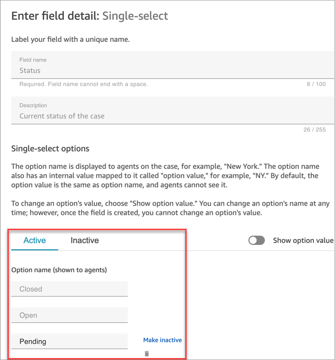
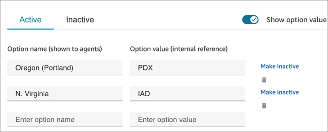

# Create case fields in Amazon Connect Cases

_Case fields_ are the building blocks for _case
templates_. You create all of the possible fields of information (for
example, VIN number, policy number, make/model of car) that you want agents to collect
for a given customer issue.

After you create case fields, you can create case templates.

There are two types of case fields:

- [System case fields](#system-case-fields "#system-case-fields"): Amazon Connect provides
  system fields. You cannot change the name or description.
- [Custom case fields](#custom-case-fields "#custom-case-fields"): You can create
  custom case fields that are specific for your business. You must name the case
  field, and optionally provide a description. Note that the description appears
  only in the Amazon Connect admin website. It doesn't appear to agents.

## How to create case fields

1. Log in to the Amazon Connect admin website with an **Admin** account, or an
   account assigned to a security profile that has permissions to create
   fields. For a list of required permissions, see [Security profile permissions for Amazon Connect
   Cases](assign-security-profile-cases.md "assign-security-profile-cases.md").
2. Verify the quota for case fields and request an increase if needed. For
   more information, see [Amazon Connect Cases service quotas](amazon-connect-service-limits.md#cases-quotas "amazon-connect-service-limits.md#cases-quotas").
3. On the left navigation menu, choose **Agent
   applications**, **Case fields**.
4. The first time you create new fields, you'll notice several [system fields](#system-case-fields "#system-case-fields") are already present.
   You cannot change the name of these fields, but in some cases you can edit
   them.

For example, **Case Id** is a system field. When a case
is created, Amazon Connect adds a case ID automatically, and you cannot change it.
**Case reason** is also a system field but you can edit
it and enter reasons that are specific to your contact center. 5. Choose **+ New field**. 6. Select the type of field you want to create. For example, you might choose
**Text** if you want agents to be able to enter free
form notes. 7. Assign a name to the field. It will appear to agents in the agent
application. 8. Optionally, provide a description. It appears only to admins on the Amazon Connect admin website.
It does not appear to agents in the agent application. 9. Choose **Save**. 10. When you're done adding fields, you're ready to [create a template](case-templates.md "case-templates.md").

## System case fields

Amazon Connect provides system fields. You cannot change the name or description of a
system field.

The following table lists the system case fields:

| Field name        | Field ID (how you call the field in the API) | Field type    | Description                                                                                                                                                                                                                                                          | Where the data comes from |
| ----------------- | -------------------------------------------- | ------------- | -------------------------------------------------------------------------------------------------------------------------------------------------------------------------------------------------------------------------------------------------------------------- | ------------------------- |
| Assigned queue    | assigned_queue                               | text          | The Amazon Connect queue that is assigned to a case                                                                                                                                                                                                                  | Agent                     |
| Assigned user     | assigned_user                                | text          | The Amazon Connect user who is assigned to a case                                                                                                                                                                                                                    | Agent                     |
| Case ID           | case_id                                      | text          | Unique Identifier of the case in UUID format (for example, 689b0bea-aa29-4340-896d-4ca3ce9b6226)                                                                                                                                                                  | Amazon Connect            |
| Case Reason       | case_reason                                  | single-select | The reason for opening the case                                                                                                                                                                                                                                      | Agent                     |
| Customer          | customer_id                                  | text          | The full ARN of the customer profile identified for the case is required when using the API. On the \*_Cases: Fields_ • page, the customer's name is displayed.                                                                                          | Amazon Connect            |
| Date/Time Closed  | last_closed_datetime                         | date-time     | The date and time the case was last closed. It does not guarantee that a case is closed. If a case is reopened, this field contains the date/time stamp of the last time the status was changed to closed.                                                  | Amazon Connect            |
| Date/Time Opened  | created_datetime                             | date-time     | The date and time the case was opened.                                                                                                                                                                                                                               | Amazon Connect            |
| Date/Time Updated | last_updated_datetime                        | date-time     | The date and time the case was last updated.                                                                                                                                                                                                                         | Amazon Connect            |
| Last Updated User | last_updated_user                            | user          | The identity of the user who performed the last update on the case.                                                                                                                                                                                               | Amazon Connect            |
| Reference number  | reference_number                             | text          | A friendly number for the case in 8-digit numeric format. Reference numbers (unlike the Case ID) are not guaranteed to be unique. We recommend that you identify the customer and then collect the reference number to correctly find the right case. | Amazon Connect            |
| Status            | status                                       | single-select | Current status of the case                                                                                                                                                                                                                                           | Agent                     |
| Summary           | summary                                      | text          | Summary of the case                                                                                                                                                                                                                                                  | Agent                     |
| Title             | title                                        | text          | Title of the case                                                                                                                                                                                                                                                    | Agent                     |

## Custom case fields

You can create custom case fields that are specific for your business. You must
name the case field, and optionally provide a description. Note that the description
appears only in the Amazon Connect admin website. It doesn't appear to agents.

You can create fields that are type: number, text, single-select, true/false,
datetime, and URL.

### Text fields

Text fields allow agents to capture and store textual information related to customer cases. These fields are flexible and can accommodate various types of text-based data, from brief notes to detailed descriptions.

When creating a text field in the Amazon Connect admin website, you can select from two input display options under the **Input display** section to best suit your data collection needs:

**Single line text fields:** Single line text fields display text in a single horizontal line and have a character limit of 500 characters. They are ideal for capturing concise information such as customer reference numbers, product names, brief case summaries, and contact names.

**Multi-line text fields:** Multi-line text fields expand vertically to accommodate multiple lines of text and have a character limit of 4,100 characters. They are suitable for capturing detailed information such as case descriptions, customer feedback, resolution steps, and agent observations.

### Single-select fields

For single-select case fields, whether system or custom, you can add value
options that the field can take. For example, you can add options to the
single-select system field Case reason such as **General
inquiry**, **Billing issue**, or **Product
defect**, that reflect the types of issues in your contact center.

#### About the Status field

You can add options to the single-select **Status**
field, such as **Investigating** or **Escalated to
manager**. The field comes with two options,
**Open** and **Closed**, which cannot
be changed.

#### Active/inactive field

options

Single-select case fields can be active or inactive.

- **Active**: If a field option is active, it means
  that the field can be given that option. For example, based on the
  following image, the Status field can be set to
  **Closed**, **Open**, or
  **Pending**, as these are the only active
  options.
- **Inactive**: If you make the
  **Pending** option inactive, then the field can
  no longer be given that option. Any existing cases remain unchanged
  and can still have the status as
  **Pending**.

Single-select options have two parts:

1. Option name (shown to agents): The label that is displayed to
   agents in the agent application.
2. Option value (internal reference): The data that's collected. For
   example, for AWS Region, you may want to display **US West
   (Oregon)** but collect the data as
   **PDX**.

Field options appear to the agent in alphabetical order.

