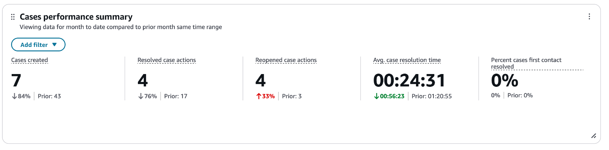
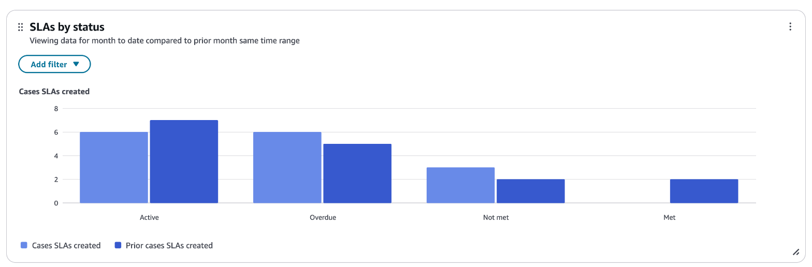
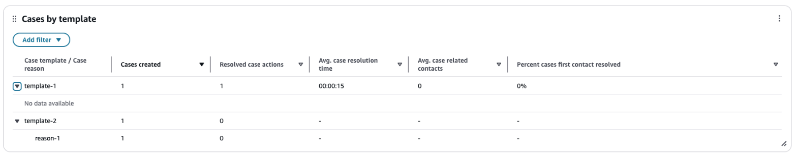
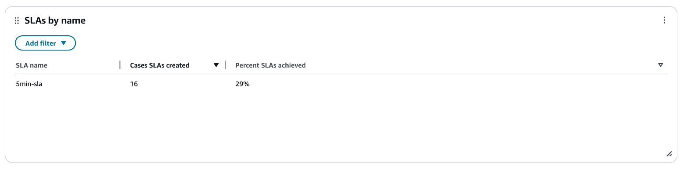
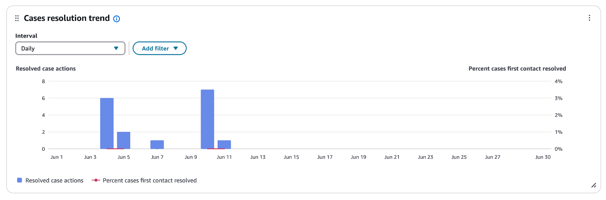
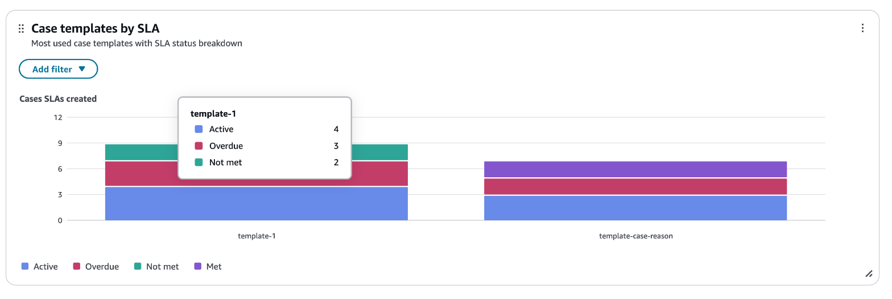

# Cases performance dashboard

Use the **Cases performance dashboard** to monitor case volume,
resolution rates, and SLA compliance in one place. The dashboard helps you identify
bottlenecks, track team performance over time, and prioritize process improvements
across case templates.

The dashboard provides a single place to view case operations metrics.
Use the dashboard to view metrics such as cases created, average resolution time, SLA
achievement rate, and first-contact resolution percentage. You can drill down by case
template, status, assigned queue, or agent to identify trends and areas for
improvement.

###### Contents

- [Enable access to the dashboard](#enable-cases-performance-dashboard "#enable-cases-performance-dashboard")
- [Access
  control](#cases-dashboard-access-control "#cases-dashboard-access-control")
- [Specify "Time range" and "Compare to" benchmark](#cases-dashboard-timerange "#cases-dashboard-timerange")
- [Examples of "Time range" and "Compare to" configurations](#cases-dashboard-timerange-examples "#cases-dashboard-timerange-examples")
- [Cases performance summary](#cases-performance-summary-chart "#cases-performance-summary-chart")
- [SLAs by status chart](#cases-dashboard-slas-by-status "#cases-dashboard-slas-by-status")
- [Cases by template table](#cases-dashboard-cases-by-template "#cases-dashboard-cases-by-template")
- [SLAs by name table](#cases-dashboard-slas-by-name "#cases-dashboard-slas-by-name")
- [Cases resolution trend chart](#cases-dashboard-resolution-trend "#cases-dashboard-resolution-trend")
- [Case templates by SLA chart](#cases-dashboard-templates-by-sla "#cases-dashboard-templates-by-sla")
- [Limitations](#cases-dashboard-limitations "#cases-dashboard-limitations")

## Enable access to the dashboard

Make sure that you assign the appropriate security profile permissions to users.
The following section describes the permissions required for manager access.

### Manager access

Managers can access the dashboard within **Analytics and Optimization >
Dashboards and Reports**. Grant managers the appropriate security
profile permissions:

- **Access metrics - Access permission** or the
  **Dashboard - Access permission**. For information
  about the difference in behavior, see [Assign permissions to view dashboards and reports in Connect Customer](dashboard-required-permissions.md "dashboard-required-permissions.md").
- **Cases - Case Fields - View**: With this permission, you can view case field values used in dashboard groupings and
  filters.
- **Cases - Case Templates - View**: With this permission, you can view case template names in dashboard widgets.
- (Optional) **Saved reports - Create, View, Publish**:
  Grants managers permissions to create custom saved dashboards and publish
  them to agents and other managers.

###### Note

Both **Case Fields - View** and **Case Templates -
View** permissions are required to access Cases metrics on the
dashboard. If either permission is missing, the dashboard doesn't display
Cases metrics.

## Access control for the Cases performance dashboard

###### Note

Tag-based access control (TBAC) is not supported for the Cases performance
dashboard. You can view metrics for all cases if you have the required
security profile permissions, regardless of access control tag configuration
on your security profile.

To restrict which case data users can view, use the security profile permissions
for **Case Fields** and **Case Templates**.
For more information about tag-based access controls in Connect Customer, see
[Apply tag-based access control in Connect Customer](tag-based-access-control.md "tag-based-access-control.md").

## Specify "Time range" and "Compare to" benchmark

Use the **Time range** and **Compare to**
settings to view case performance over a specific period and benchmark it against
a prior period. The following examples show typical configurations:

- **Time range**: Select from intraday (trailing 8 hours),
  daily, weekly, monthly performance. You can view data up to
  3 months in the past.
- **Compare to**: Compare performance with prior time
  period (for example, prior week, prior month, and more).

## Examples of "Time range" and "Compare to" configurations

- **Use case 1: Compare weekly case creation**

Configure the dashboard as follows:

    + **Time range**: Week
    + **Time**: This week
    + **Compare to**: Prior time period (Week, Prior week)

- **Use case 2: Compare month-over-month case performance**

Configure the dashboard as follows:

    + **Time range**: Month
    + **Time**: Last month
    + **Compare to**: Prior time period (Month, Prior month)

- **Use case 3: Compare today's resolution performance with yesterday**

Configure the dashboard as follows:

    + **Time range**: Trailing
    + **Time**: Today (since 12 am)
    + **Compare to**: Prior time period (Day, Prior day)

## Cases performance summary

Use the Cases performance summary widget to view key case metrics for the selected
time range, compared to the benchmark period.

The following metrics are displayed:

- **Cases created**: Total cases created during the time
  range.
- **Resolved case actions**: Total cases resolved during
  the time range.
- **Reopened case actions**: Total cases reopened during
  the time range.
- **Avg. case resolution time**: Average elapsed time from
  case creation to resolution.
- **Percent cases first contact resolved**: Percentage of
  cases resolved with only a single associated contact.

Each metric shows the current value and the prior period value for
comparison.

The following image shows an example **Cases performance
summary** widget.

## SLAs by status chart

Use this chart to view the number of SLAs created, grouped by SLA status (Active,
Overdue, Met, Not met). You can assess how many SLAs are active versus resolved.
You can also identify overdue SLAs that need attention.

You can add filters to narrow the view to specific case templates or SLA
names.

The following image shows an example **SLAs by status**
chart.

## Cases by template table

Use this table to view case metrics broken down by case template. You can compare
performance for each case template in your domain.

The following columns are displayed:

- **Case template**
- **Cases created**
- **Resolved case actions**
- **Avg. case resolution**
- **Avg. case related** (average contacts per
  case)
- **Percent cases first contact resolved**

You can sort by any column and add filters to narrow results. You can also set
custom thresholds to highlight values. For more information, see [Modify thresholds for summary widgets and tables](dashboard-customize-widgets.md#dashboard-thresholds "dashboard-customize-widgets.md#dashboard-thresholds").

The following image shows an example **Cases by template**
table.

## SLAs by name table

Use this table to view SLA metrics grouped by SLA rule name and assess
which SLA rules are meeting their targets and which need attention.

The following columns are displayed:

- **SLA name**
- **Cases SLAs created**
- **Percent SLAs achieved**

The following image shows an example **SLAs by name**
table.

## Cases resolution trend chart

On the **Cases resolution trend** chart, you can view trends at
15-minute, daily, weekly, or monthly intervals. The available intervals depend
on time range selections. For example, for a **Time range** of
monthly, you can view trends at weekly and monthly intervals.

The chart shows **Resolved case actions** (bar) and
**Percent cases first contact resolved** (line) over
time.

Use the **Interval** selector to change the granularity. You
can also add filters to focus on specific case templates or queues.

The following image shows an example **Cases resolution trend**
chart.

## Case templates by SLA chart

Use this stacked bar chart to view **Cases SLAs created** for each
case template, with a breakdown by SLA status (Active, Overdue, Met, Not
met). You can identify which case templates have the most SLA activity and the
highest rates of overdue SLAs. Use this information to prioritize process
improvements for specific case types.

The following image shows an example **Case templates by SLA**
chart.

## Limitations

The following limitations apply to the Cases performance dashboard:

- **Data retention**: You can view dashboard
  data for up to 3 months in the past.
- **Tag-based access control**: Tag-based
  access control (TBAC) is not supported for the Cases performance dashboard.
  If you have the required permissions, you can view metrics for all cases.
- **Hierarchy-based access control**:
  Hierarchy-based access control (HBAC) is not supported for the Cases
  performance dashboard.
