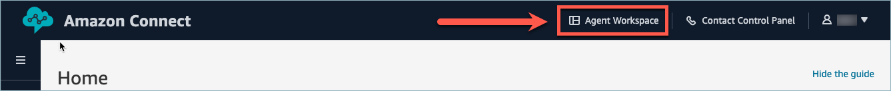
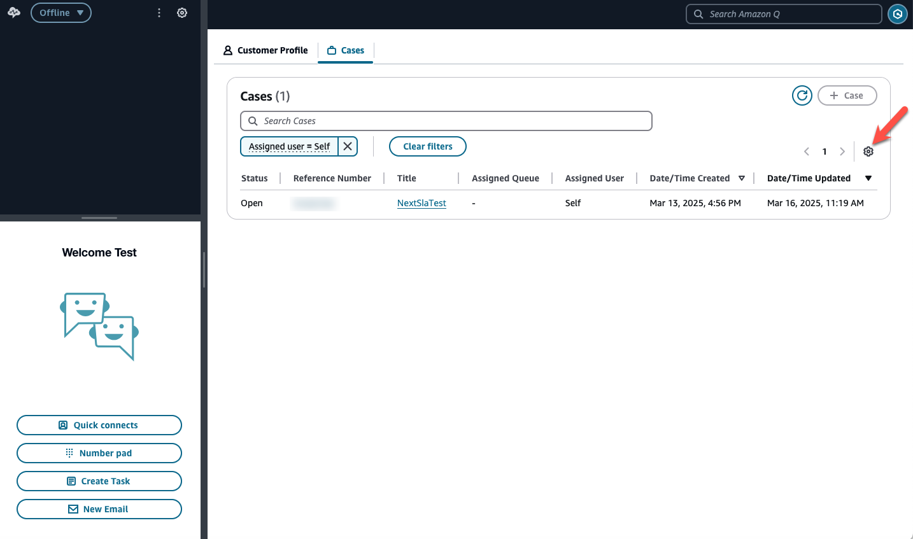
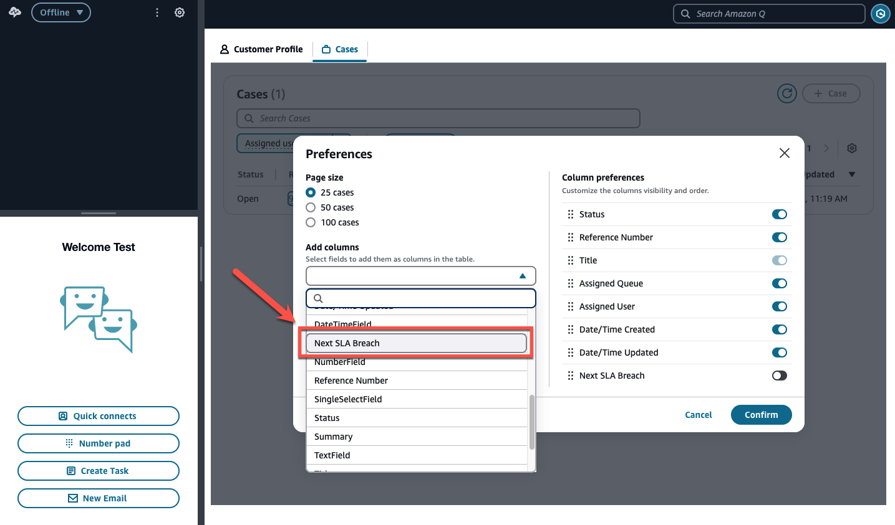
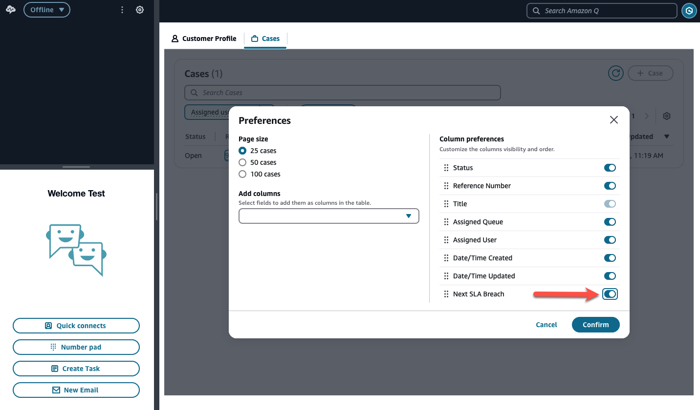

# How SLAs work in Amazon Connect Cases

Service Level Agreements (SLAs) in Amazon Connect Cases are a type of related item that
can be associated with a case. They allow you to track service goals for your contact
center, specifying that particular types of cases should reach certain milestones within set
timeframes.

## Understanding SLAs in Cases

Case SLAs in Amazon Connect consist of the following components:

- **SLA name**: The identifier for the SLA in the
  UI and API responses.
- **Target date and time**: The deadline by which
  the case needs to progress to the target status. This can be configured up to 90
  days.
- **Target value**: The field value that the case
  needs to be updated to for the SLA to be considered fulfilled.
- **SLA status**: The current fulfillment status of
  the SLA. Possible statuses include:
  - Active: SLA not yet fulfilled, but target time not reached
  - Met: SLA fulfilled before target time
  - Not met: SLA fulfilled after target time exceeded
  - Due soon: SLA not fulfilled, target time less than 24 hours away
  - Overdue: SLA not fulfilled, target time already exceeded

- **Time to breach**: For unfulfilled SLAs, the
  time remaining until the target date and time is exceeded. For overdue cases,
  this continues to run negative until the target value is achieved.

## Adding SLAs to Cases

You can associate SLAs with cases in two ways:

- **Automatically**: Use Contact Lens Rules to add
  SLAs to cases that meet specified conditions (case template and field values)
  for Case Creation and Update rules. For more information, see [Automatically monitor and update cases in
  Amazon Connect Cases](create-alerts-on-cases.md "create-alerts-on-cases.md").
- **Manually**: Use the CreateRelatedItem API to
  add an SLA related item to a case.

## Viewing SLAs on Cases

Managers and agents can view case SLAs in the agent application to prioritize cases
and identify those at risk of missing service goals.

**Case summary page**

###### To add SLA information to the case list view:

1. Log in to the Amazon Connect admin website at https://`instance name`.my.connect.aws/.
2. Open the **Agent Workspace**.

 3. Choose the gear icon in the top right of the table.

 4. Add the **Next SLA Breach** field to the active list.

 5. Toggle the field from inactive to active.

###### Note

These settings persist unless you clear your cookies.

**Case detail page**

###### For cases with active SLAs:

- A badge notification appears next to the case title, showing the time until
  the next active SLA will breach.
- An SLAs section below the case details lists all active and completed SLAs
  associated with the case, including:
  - SLA name
  - Status
  - Target date and time
  - Completion date and time (if applicable)
  - Time to breach (if applicable)

## Automating Actions for Breached

SLAs

You can use Contact Lens Rules to trigger automated actions when SLAs reach their
target completion time without being met:

1. In the Contact Lens Rules interface, add a new rule with the trigger based on
   **Case SLA Breach**.
2. Specify which SLA names the **Breach rule** should apply to.

For more information, see [Automatically monitor and update cases in
Amazon Connect Cases](create-alerts-on-cases.md "create-alerts-on-cases.md") in the Amazon Connect documentation.
