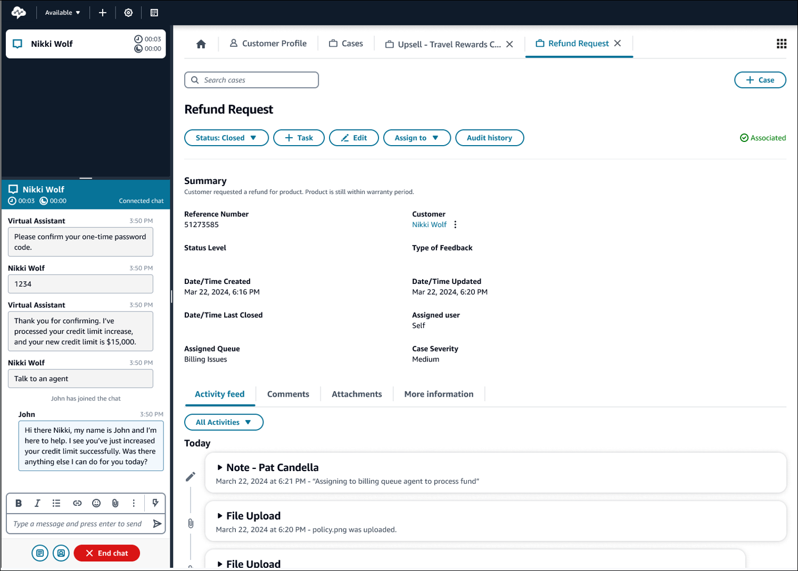

# Amazon Connect Cases

###### Tip

**New user?** Check out the [Amazon Connect
Cases Workshop](https://catalog.workshops.aws/amazon-connect-cases/en-US/1-introduction "https://catalog.workshops.aws/amazon-connect-cases/en-US/1-introduction"). This online course guides you through setting up and using
Amazon Connect Cases.

Amazon Connect Cases enables your customer service organization to track, collaborate, and
resolve customer cases.

A _case_ represents a customer's issue. It is created to record the
customer's issue, the steps and interactions taken to resolve the customer's issue, and the
outcome.

Without doing any integration work, you can enable Cases for your contact center. You
can set up cases to be created when contacts come in, and collect information from the
customer to display on the case. Alternatively, agents can manually create cases. When an
agent accepts a contact, they have context about an issue and can immediately start solving
it. You can create tasks to track and route follow up steps to resolve the case.

The following image shows an example case as it appears in the agent application.

## Getting started with Cases

We recommend reviewing these topics to help you get started.

**Contact center manager or Admin actions on the
Amazon Connect admin website**

- [Enable Cases](enable-cases.md "enable-cases.md")
- [Assign
  permissions](assign-security-profile-cases.md "assign-security-profile-cases.md")
- [Create case fields](case-fields.md "case-fields.md") and [case templates](case-templates.md "case-templates.md")
- [Set up a case assignment in Amazon Connect Cases](case-assignment.md "case-assignment.md")
- [Automatically monitor and update cases in
  Amazon Connect Cases](create-alerts-on-cases.md "create-alerts-on-cases.md")
- [Amazon Connect Cases metrics](case-management-metrics.md "case-management-metrics.md")
- [Cases block](cases-block.md "cases-block.md")
- [Case event streams](case-event-streams.md "case-event-streams.md")
- [Cases quotas](amazon-connect-service-limits.md#cases-quotas "amazon-connect-service-limits.md#cases-quotas")

**Agent actions in the agent workspace**

- [Search cases in Amazon Connect to view customer contact
  details](search-cases.md "search-cases.md")
- [Edit an existing case](cm-editcases.md "cm-editcases.md")
- [Add comments to a case](cm-comments.md "cm-comments.md")
- [Associate a contact with a
  case](associatecontactandcase.md "associatecontactandcase.md")
- [Create a task from a
  case](create-task-from-case.md "create-task-from-case.md")
