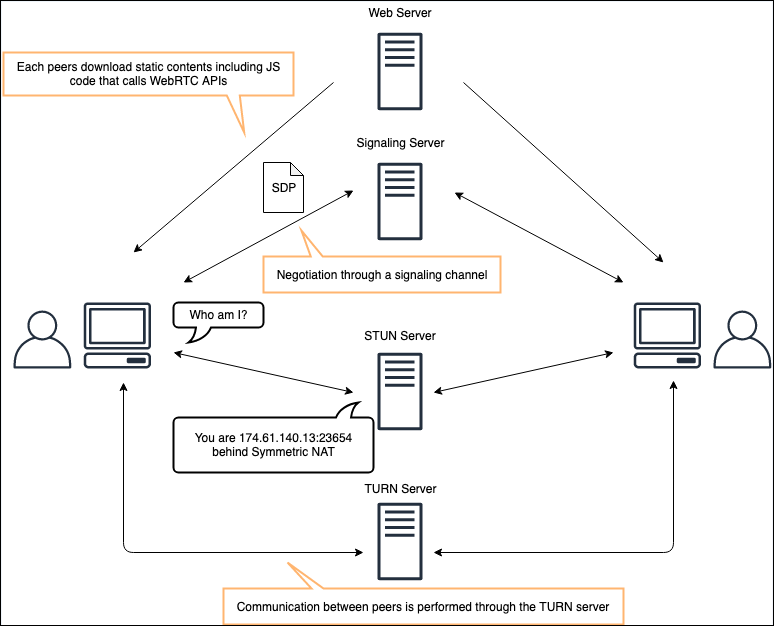

# How Contact Control Panel (CCP) leverages

WebRTC

This advanced topic is for IT admins who may be interested in how Contact Control
Panel (CCP) delivers voice calls. It also provides some networking details.

CCP uses WebRTC as the underlying technology for enabling real-time communication
between contact center agents and customers. It enables agents to manage inbound and
outbound calls and video conferences directly from their web browser.

###### Topics

- [What is WebRTC?](#whatis-webrtc "#whatis-webrtc")
- [Terminology](#ccp-leverages-webrtc-terminology "#ccp-leverages-webrtc-terminology")
- [How WebRTC works](#how-webrtc-works "#how-webrtc-works")
- [How STUN, TURN and ICE work
  together](#how-stun-turn-ice-works "#how-stun-turn-ice-works")
- [Best practices](#webrtc-ccp-bp "#webrtc-ccp-bp")

## What is WebRTC?

WebRTC is an open source technology specification for enabling real-time
communication (RTC) across browsers and mobile applications by using simple APIs.

WebRTC uses peering techniques for real-time data exchange between connected
peers. It provides low latency media streaming required for human-to-human
interaction.

The WebRTC specification includes a set of IETF protocols including [Interactive Connectivity
Establishment](https://www.ietf.org/rfc/rfc5245.txt "https://www.ietf.org/rfc/rfc5245.txt"), [Traversal Using Relay around
NAT (TURN)](https://datatracker.ietf.org/doc/html/rfc5766 "https://datatracker.ietf.org/doc/html/rfc5766"), and [Session Traversal Utilities for NAT (STUN)](https://www.ietf.org/rfc/rfc5389.txt "https://www.ietf.org/rfc/rfc5389.txt") for establishing
peer-to-peer connectivity. These are in addition to protocol specifications for
reliable and secure real-time media and data streaming.

Because Amazon Connect uses WebRTC, you don't need to build and maintain complex
infrastructure for real-time communication. It enables you to rapidly deploy
omnichannel customer engagement solutions through Amazon Connect, while benefiting from the
low latency, high-quality media streaming, and secure peer-to-peer connectivity that
WebRTC offers.

## Terminology

Session Traversal Utilities for NAT (STUN)

A protocol that is used to discover your public address and determine
any restrictions in your router that would prevent a direct connection
with a peer.

A component that manages STUN endpoints. The endpoints enable
applications to discover their public IP address when they are located
behind a NAT or a firewall.

Traversal Using Relays around NAT (TURN)

A server that is used to bypass the Symmetric NAT restriction by
opening a connection with a TURN server and relaying all information
through that server.

A component that manages TURN endpoints. The endpoints enable media
relay by using the cloud when applications can't stream media
peer-to-peer.

Session Description Protocol (SDP)

A standard for describing the multimedia content of the connection
such as resolution, formats, codecs, encryption, and more, so that both
peers can understand each other once the data is transferring.

SDP Offer

An SDP message sent by an agent which generates a session description
in order to create or modify a session. It describes the aspects of
desired media communication.

SDP Answer

An SDP message sent by an answerer in response to an offer received
from an offerer. The answer indicates the aspects that are accepted. For
example, if all the audio and video streams in the offer are
accepted.

Interactive Connectivity Establishment (ICE)

A framework that allows your web browser to connect with peers.

ICE Candidate

A method that the sending peer is able to use to communicate.

Peer

Any device or application (for example, a mobile or web application)
that is configured for real-time, two-way communications with WebRTC.

Signaling

The signaling component manages the WebRTC signaling endpoints that
allow applications to securely connect with each other for peer-to-peer
live media streaming.

## How WebRTC works

WebRTC uses signaling protocols, such as JavaScript Session Establishment Protocol
(JSEP) for browsers or custom protocols built on WebSockets/XMPP, to initiate and
manage communication sessions. It also employs codecs for encoding and decoding
audio and video data, Secure Real-time Transport Protocol (SRTP) for encrypting
media streams to ensure privacy, and uses ICE, STUN, and TURN protocols to navigate
and establish peer-to-peer connections across NAT gateways and firewalls.

## How STUN, TURN and ICE work

together

Let's consider the scenario where the agent CCP (Contact Control Panel) is peer A
and Amazon Connect is peer B, using WebRTC for a two-way media stream (for example, a voice
call).

Here's what happens when the agent CCP wants to establish a connection with
Amazon Connect:

1. The agent CCP generates an SDP offer containing information about the
   desired session, such as the codecs to use, whether it's an audio or video
   session, and more. It also includes a list of ICE candidates, which are the
   IP/port pairs that Amazon Connect can attempt to use to connect to the agent
   CCP.
2. To gather the ICE candidates, CCP makes a series of requests to a STUN
   server. The STUN server returns the public IP address and port pair that
   originated the request. The agent CCP also creates a TURN channel to Amazon Connect's
   TURN service to obtain a media relay address. This relay address is an
   IP/port pair that can forward packets between the agent CCP and other media
   services in Amazon Connect. The agent CCP adds each IP/port pair to the list of ICE
   candidates. Next, the agent CCP sends the SDP offer to Amazon Connect through a
   signaling channel over a WebSocket.
3. Amazon Connect generates an SDP answer following the same process: it gathers ICE
   candidates and sends them with the SDP answer to the agent CCP over the
   WebSocket. After exchanging SDPs, the agent CCP and Amazon Connect perform a series
   of connectivity checks. Each side takes a candidate IP/port pair from the
   other's SDP and sends a STUN request to it. If a response is received, that
   IP/port pair is marked as a valid ICE candidate pair.
4. After the connectivity checks are completed for all IP/port pairs, the
   agent CCP and Amazon Connect negotiate and decide on one of the valid pairs to use
   for the media stream.

The following diagram illustrates the communication between CCP and Amazon Connect using
WebRTC.

## Best practices

- For the most reliable and best audio experience, it is strongly
  recommended to ensure that media traffic between agent workstation and AWS
  is exchanged directly and does not traverse through VPNs or other network
  accelerator hops.
- To ensure your business is able to successfully facilitate WebRTC
  connections and mitigate error behaviors, ensure you have allow-listed
  incoming UDP traffic on port 3478 (SEND/RECEIVE). For more information, see
  [Option 1 (recommended): Replace Amazon EC2 and CloudFront IP range
  requirements with a domain allowlist](ccp-networking.md#option1 "ccp-networking.md#option1"). In the table, see the
  row for `TurnNlb-*.elb.region.amazonaws.com`.
- If you're using [Option 2 (not recommended): Allow IP address ranges](ccp-networking.md#option2 "ccp-networking.md#option2"), we
  recommend the following to mitigate error behaviors:
  - Monitor the IP ranges allow-listed by your business for
    Amazon Connect.
  - Ensure changes within the IP ranges are monitored.
  - Ensure any new additions to the list are accompanied by 3478 (UDP)
    port and protocol allow-listings for SEND/RECEIVE traffic.

- Before moving to production, do the following
  - Test WebRTC connectivity by using the [Amazon Connect Endpoint Connectivity
    testing tool](check-connectivity-tool.md "check-connectivity-tool.md"). This tool helps you ascertain whether the
    Amazon Connect WebRTC Media endpoints are accessible from the agent
    stations.
  - Test and track changes to [networking environments](network-ts.md#investigate-ndc "network-ts.md#investigate-ndc"), and on-premise networking
    architectures such as firewall updates, edge routers and
    VPNs.

- If you're using a stateless firewall, make sure you've added the ephemeral
  port range to the allow list as described in [Stateless firewalls](ccp-networking.md#stateless-firewalls "ccp-networking.md#stateless-firewalls").
