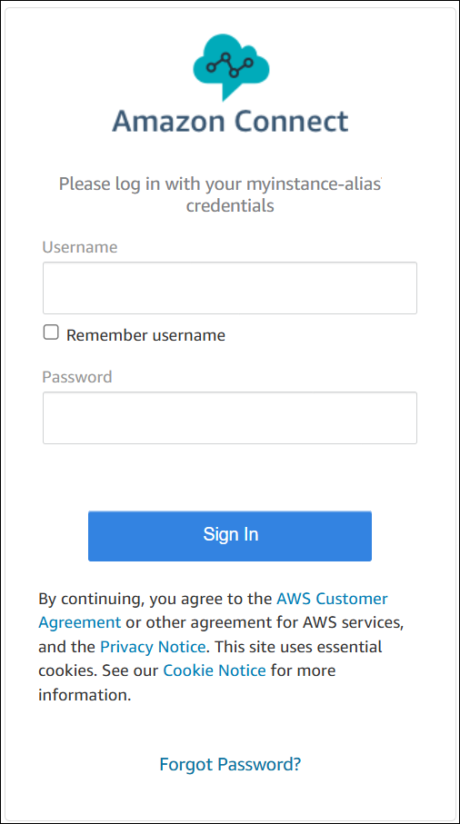
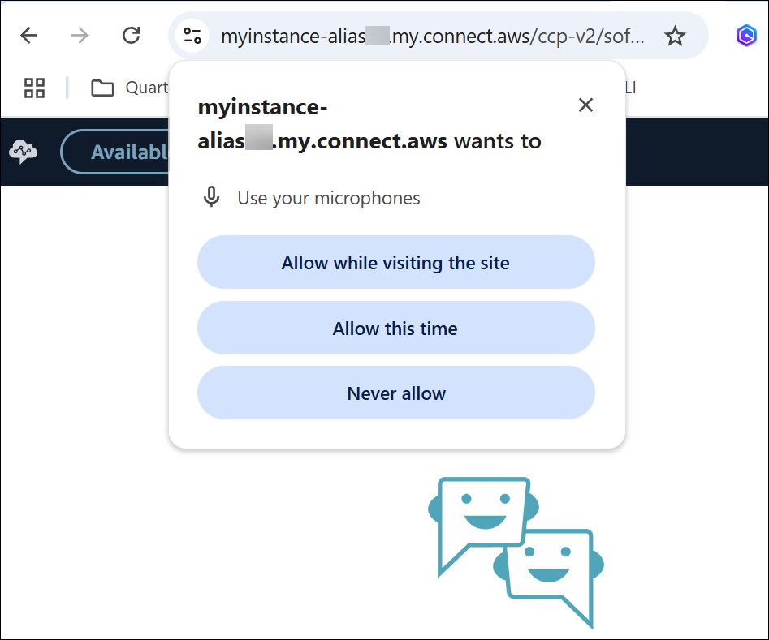
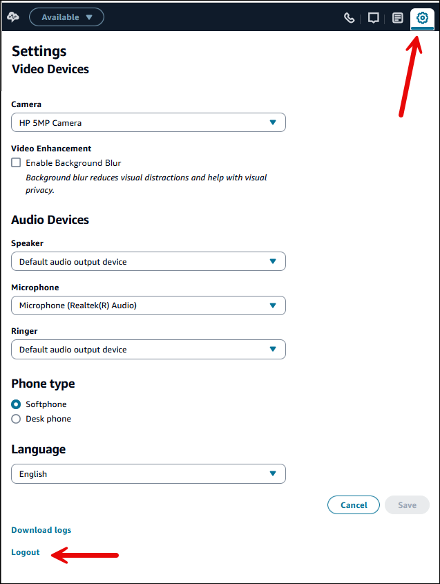

# Log in and log out of the Amazon Connect CCP

Before you can log in to the Contact Control Panel (CCP), your administrator must give
you the following information:

- The URL to launch the CCP:

      + https://`instance name`.my.connect.aws/ccp-v2/

  Where `instance name` is provided by your IT
  department or whoever set up Amazon Connect for your business.

- Your agent ID.
- Your agent password.

###### To log in

After you have that information, here's how to log in and get started.

1. Ensure that your USB headset is securely connected to your computer.
2. Using Chrome or Firefox, open the CCP by using the URL that you received from
   your administrator.
3. Enter your agent ID and password, and then choose **Sign
   In**.

 4. If you're prompted to **Allow access to cookies**, choose
**Grant access**, and then choose
**Allow**.

OR

Amazon Connect uses cookies for authentication. Google Chrome requires you to authorize
the use of Amazon Connect cookies.

###### Tip

**IT admins**: For more information, see
[Using Amazon Connect with third-party cookies](admin-3pcookies.md "admin-3pcookies.md"). 5. If you are prompted to allow access to your microphone and speaker, choose
**Allow**.

You're all set to go!

## Problems logging in?

If you have problems logging in to the CCP, contact your manager for help, or the
IT Department for your organization.

###### Note

If you see the **Session expired** message while logging in, you probably just need to
refresh the session token. Go to your identity provider and log in. Refresh the
Amazon Connect page. If you still get this message, contact your IT team.

## Log out of the Amazon Connect CCP

###### Important

Closing the CCP window or agent workspace doesn't automatically log out an
agent. Agents must choose **Log out**.

1. At the top of the CCP, choose **Settings**.
2. Choose **Log out**.

