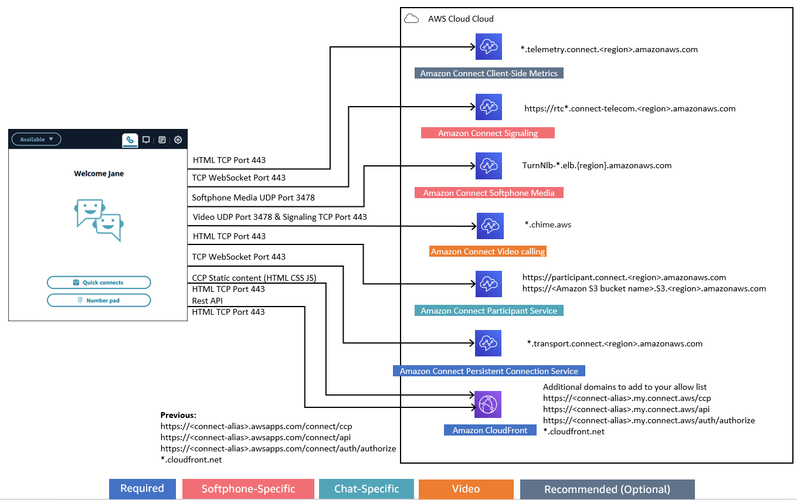

# Set up your network to use the Amazon Connect Contact Control Panel

(CCP)

Traditional VoIP solutions require you to allow both inbound and outbound for specific UDP
port ranges and IPs, such as 80 and 443. These solutions also apply to TCP. In comparison,
the network requirements for using the Contact Control Panel (CCP) with a softphone are less
intrusive. You can establish persistent outbound send/receive connections through your web
browser. As a result, you don't need to open a client-side port to listen for inbound
traffic.

The following diagram shows you what each port is used for.


If your contact center is using the email channel, see the Amazon SES Developer Guide for
information. If your business sends a large volume of email, you may want to lease dedicated
IP addresses. For more information, see [Dedicated IP addresses for Amazon SES](../../../ses/latest/dg/dedicated-ip.md "../../../ses/latest/dg/dedicated-ip.md").

The following sections describe the two primary connectivity options for using the CCP.

###### Contents

- [Option 1 (recommended): Replace Amazon EC2 and CloudFront IP range
  requirements with a domain allowlist](#option1 "#option1")
- [Option 2 (not recommended): Allow IP address ranges](#option2 "#option2")
- [About Amazon Connect IP address ranges](#about-connect-ip-address-range "#about-connect-ip-address-range")
- [Stateless firewalls](#stateless-firewalls "#stateless-firewalls")
- [Allow upload of time-off balances and allowances
  in Amazon Connect scheduling](#endpoints-scheduling "#endpoints-scheduling")
- [Allow DNS resolution for softphones](#allow-dns-resolution "#allow-dns-resolution")
- [Port and protocol considerations](#port-considerations "#port-considerations")
- [Region selection considerations](#ccp-region-selection "#ccp-region-selection")
- [Agents using Amazon Connect remotely](#remote-agents "#remote-agents")
- [Rerouting audio](#reroute-audio "#reroute-audio")
- [Using Direct Connect](#using-directconnect "#using-directconnect")
- [Agent workstation requirements
  for app, web, and video calling in Amazon Connect](videocalling-networking-requirements.md "videocalling-networking-requirements.md")
- [Detailed Network
  Paths](detailed-network-paths.md "detailed-network-paths.md")
- [Use Amazon Connect in a VDI environment](using-ccp-vdi.md "using-ccp-vdi.md")
- [How call center agents connect to the Contact Control
  Panel (CCP)](ccp-connectivity.md "ccp-connectivity.md")
- [How CCP leverages
  WebRTC](ccp-leverages-webrtc.md "ccp-leverages-webrtc.md")
- [Use an allowlist for integrated applications in
  Amazon Connect](app-integration.md "app-integration.md")
- [Update your
  domain](update-your-connect-domain.md "update-your-connect-domain.md")

## Option 1 (recommended): Replace Amazon EC2 and CloudFront IP range

requirements with a domain allowlist

This first option lets you significantly reduce your blast radius.

We recommend trying Option 1 and testing it with more than 200 calls. Test for
softphone errors, dropped calls, and conference/transfer functionality. If your error
rate is greater than 2 percent, there might be an issue with proxy resolution. If that's
the case, consider using Option 2.

To allow traffic for Amazon EC2 endpoints, allow access for the URL and port, as shown in
the first row of the following table. Do this instead of allowing all of the IP address
ranges listed in the ip-ranges.json file. You get the same benefit using a domain for
CloudFront, as shown in the second row of the following table.

| Domain/URL allowlist                                                                                                                                                                                                                                                                                                                                                                                                                                                                                                                                                                                                                                                                                                                 | AWS Region                                                                                                                                                                                                                                                                                                                                                        | Ports       | Direction | Traffic      |
| ------------------------------------------------------------------------------------------------------------------------------------------------------------------------------------------------------------------------------------------------------------------------------------------------------------------------------------------------------------------------------------------------------------------------------------------------------------------------------------------------------------------------------------------------------------------------------------------------------------------------------------------------------------------------------------------------------------------------------------ | ----------------------------------------------------------------------------------------------------------------------------------------------------------------------------------------------------------------------------------------------------------------------------------------------------------------------------------------------------------------- | ----------- | --------- | ------------ |
| rtc\*.connect-telecom.`region`.amazonaws.com<br>This is used by ccp# (v1).<br>Please see the note following this table.                                                                                                                                                                                                                                                                                                                                                                                                                                                                                                                                                                                                              | Replace `region` with the Region where your<br>Amazon Connect instance is located                                                                                                                                                                                                                                                                                 | 443 (TCP)   | OUTBOUND  | SEND/RECEIVE |
| Following is the minimum allowlist for **\*.my.connect.aws**:<br>• `myInstanceName`.my.connect.aws/ccp-v2<br>• `myInstanceName`.my.connect.aws/api<br>• `myInstanceName`.my.connect.aws/auth/authorize<br>• \*.cloudfront.net<br>Following is the minimum allowlist for **\*.awsapps.com**:<br>Important**.awsapps.com\*<br>• is an old domain<br>that is going away. For instructions about updating your domain<br>to **my.connect.aws\*\*, see [Update your Amazon Connect domain](update-your-connect-domain.md "update-your-connect-domain.md").<br>• `myInstanceName`.awsapps.com/connect/ccp-v2<br>• `myInstanceName`.awsapps.com/connect/api<br>• `myInstanceName`.awsapps.com/connect/auth/authorize<br>• \*.cloudfront.net | Replace `myInstanceName` with the<br>alias of your Amazon Connect instance                                                                                                                                                                                                                                                                                        | 443 (TCP)   | OUTBOUND  | SEND/RECEIVE |
| \*.telemetry.connect.`region`.amazonaws.com                                                                                                                                                                                                                                                                                                                                                                                                                                                                                                                                                                                                                                                                                          | Replace `region` with the location of<br>your Amazon Connect instance                                                                                                                                                                                                                                                                                             | 443 (TCP)   | OUTBOUND  | SEND/RECEIVE |
| participant.connect.`region`.amazonaws.com                                                                                                                                                                                                                                                                                                                                                                                                                                                                                                                                                                                                                                                                                           | Replace `region` with the location of<br>your Amazon Connect instance                                                                                                                                                                                                                                                                                             | 443 (TCP)   | OUTBOUND  | SEND/RECEIVE |
| \*.transport.connect.`region`.amazonaws.com<br>This is used by ccp-v2.                                                                                                                                                                                                                                                                                                                                                                                                                                                                                                                                                                                                                                                               | Replace `region` with the location of<br>your Amazon Connect instance                                                                                                                                                                                                                                                                                             | 443 (TCP)   | OUTBOUND  | SEND/RECEIVE |
| `Amazon S3 bucket<br>name`.s3.`region`.amazonaws.com                                                                                                                                                                                                                                                                                                                                                                                                                                                                                                                                                                                                                                                                                 | Replace `Amazon S3 bucket name` with the<br>name of the location where you store attachments. Replace<br>`region` with the location of your<br>Amazon Connect instance                                                                                                                                                                                            | 443 (TCP)   | OUTBOUND  | SEND/RECEIVE |
| TurnNlb-\*.elb.`region`.amazonaws.com<br>To instead add specific endpoints to your allowlist based on<br>Region, see [NLB endpoints](#nlb-endpoints "#nlb-endpoints").                                                                                                                                                                                                                                                                                                                                                                                                                                                                                                                                                               | Replace `region` with the location of<br>your Amazon Connect instance                                                                                                                                                                                                                                                                                             | 3478 (UDP)  | OUTBOUND  | SEND/RECEIVE |
| `instance-id.source-region`.sign-in.connect.aws<br>This is used only if you have onboarded to [Amazon Connect Global<br>Resiliency](setup-connect-global-resiliency.md "setup-connect-global-resiliency.md").                                                                                                                                                                                                                                                                                                                                                                                                                                                                                                                        | Replace `instance-id` with your<br>instance ID, and `source-region` with the<br>AWS Region of your source instance. For more information, see<br>[Integrate your identity provider (IdP) with an<br>Amazon Connect Global Resiliency SAML sign in endpoint](integrate-idp.md "integrate-idp.md").                                                                 | 443 (HTTPS) | OUTBOUND  | SEND/RECEIVE |
| \*.`source-region`.region-discovery.connect.aws<br>This is needed only if you have onboarded to [Amazon Connect Global<br>Resiliency](setup-connect-global-resiliency.md "setup-connect-global-resiliency.md").                                                                                                                                                                                                                                                                                                                                                                                                                                                                                                                      | Replace `source-region` with the AWS<br>Region of your source instance. For instructions about how to find<br>your source Region, see [How to find the source<br>Region of your Amazon Connect instances](create-replica-connect-instance.md#how-to-find-source-region-of-instances "create-replica-connect-instance.md#how-to-find-source-region-of-instances"). | 443 (HTTPS) | OUTBOUND  | SEND/RECEIVE |

Fully qualified domain names (FQDNs) cannot be changed or customized on a per-customer
basis. Instead, use [Option 2 - allow IP address
ranges](#option2 "#option2").

###### Tip

When using
`rtc*.connect-telecom.`region`.amazonaws.com`,
`*.transport.connect.`region`.amazonaws.com`, and
`https://myInstanceName.awsapps.com`, in certain proxy applications,
web socket handling may impact functionality. Be sure to test and validate before
deploying to a production environment.

The following table lists the CloudFront domains used for static assets if you want to add
domains to your allowlist instead of IP ranges:

| Region         | CloudFront Domain                                                                |
| -------------- | -------------------------------------------------------------------------------- |
| us-east-1      | https://dd401jc05x2yk.cloudfront.net/<br>https://d1f0uslncy85vb.cloudfront.net/  |
| us-west-2      | https://d38fzyjx9jg8fj.cloudfront.net/<br>https://d366s8lxuwna4d.cloudfront.net/ |
| ap-northeast-1 | https://d3h58onr8hrozw.cloudfront.net/<br>https://d13ljas036gz6c.cloudfront.net/ |
| ap-northeast-2 | https://d11ouwvqpq1ads.cloudfront.net/                                           |
| ap-southeast-1 | https://d2g7up6vqvaq2o.cloudfront.net/<br>https://d12o1dl1h4w0xc.cloudfront.net/ |
| ap-southeast-2 | https://d2190hliw27bb8.cloudfront.net/<br>https://d3mgrlqzmisce5.cloudfront.net/ |
| eu-central-1   | https://d1n9s7btyr4f0n.cloudfront.net/<br>https://d3tqoc05lsydd3.cloudfront.net/ |
| eu-west-2      | https://dl32tyuy2mmv6.cloudfront.net/<br>https://d2p8ibh10q5exz.cloudfront.net/  |

###### Note

ca-central isn't included in the table because we host static contents behind the
domain `*.my.connect.aws`.

If your business does not use SAML, and you have firewall restrictions, you can add
the following entries per Region:

| Region         | CloudFront Domain                                                                  |
| -------------- | ---------------------------------------------------------------------------------- |
| us-east-1      | https://d32i4gd7pg4909.cloudfront.net/                                             |
| us-west-2      | https://d18af777lco7lp.cloudfront.net/                                             |
| eu-west-2      | https://d16q6638mh01s7.cloudfront.net/                                             |
| ap-northeast-1 | https://d2c2t8mxjhq5z1.cloudfront.net/                                             |
| ap-northeast-2 | https://d9j3u8qaxidxi.cloudfront.net/                                              |
| ap-southeast-1 | https://d3qzmd7y07pz0i.cloudfront.net/                                             |
| ap-southeast-2 | https://dwcpoxuuza83q.cloudfront.net/                                              |
| eu-central-1   | https://d1whcm49570jjw.cloudfront.net/                                             |
| ca-central-1   | https://d2wfbsypmqjmog.cloudfront.net/                                             |
| us-gov-east-1: | https://s3-us-gov-east-1.amazonaws.com/warp-drive-console-static-content-prod-osu/ |
| us-gov-west-1: | https://s3-us-gov-west-1.amazonaws.com/warp-drive-console-static-content-prod-pdt/ |

### NLB endpoints

The following table lists the specific endpoints for the Region the Amazon Connect instance
is in. If you don't want to use the
TurnNlb-\*.elb.`region`.amazonaws.com wildcard, you can add
these endpoints to your allowlist instead.

| Region         | Turn Domain/URL                                                                                                                                                      |
| -------------- | -------------------------------------------------------------------------------------------------------------------------------------------------------------------- |
| us-west-2      | TurnNlb-8d79b4466d82ad0e.elb.us-west-2.amazonaws.com<br>TurnNlb-dbc4ebb71307fda2.elb.us-west-2.amazonaws.com<br>TurnNlb-13c884fe3673ed9f.elb.us-west-2.amazonaws.com |
| us-east-1      | TurnNlb-d76454ac48d20c1e.elb.us-east-1.amazonaws.com<br>TurnNlb-31a7fe8a79c27929.elb.us-east-1.amazonaws.com<br>TurnNlb-7a9b8e750cec315a.elb.us-east-1.amazonaws.com |
| af-south-1     | TurnNlb-29b8f2824c2958b8.elb.af-south-1.amazonaws.com                                                                                                                |
| ap-northeast-1 | TurnNlb-3c6ddabcbeb821d8.elb.ap-northeast-1.amazonaws.com                                                                                                            |
| ap-northeast-2 | TurnNlb-a2d59ac3f246f09a.elb.ap-northeast-2.amazonaws.com                                                                                                            |
| ap-southeast-1 | TurnNlb-261982506d86d300.elb.ap-southeast-1.amazonaws.com                                                                                                            |
| ap-southeast-2 | TurnNlb-93f2de0c97c4316b.elb.ap-southeast-2.amazonaws.com                                                                                                            |
| ca-central-1   | TurnNlb-b019de6142240b9f.elb.ca-central-1.amazonaws.com                                                                                                              |
| eu-central-1   | TurnNlb-ea5316ebe2759cbc.elb.eu-central-1.amazonaws.com                                                                                                              |
| eu-west-2      | TurnNlb-1dc64a459ead57ea.elb.eu-west-2.amazonaws.com                                                                                                                 |
| us-gov-west-1  | TurnNlb-d7c623c23f628042.elb.us-gov-west-1.amazonaws.com                                                                                                             |

## Option 2 (not recommended): Allow IP address ranges

The second option relies on using an allowlist to define the IP addresses and ports
that Amazon Connect can use. You create this allowlist using the IP addresses in the [AWS ip-ranges.json](https://ip-ranges.amazonaws.com/ip-ranges.json "https://ip-ranges.amazonaws.com/ip-ranges.json")
file.

If the Region you are using Amazon Connect in does not appear in the AWS ip-ranges.json file,
use just the Global values.

For more information about this file, see [About Amazon Connect IP address ranges](#about-connect-ip-address-range "#about-connect-ip-address-range").

| IP-Ranges entry | AWS Region                                                                                                                      | Ports/Protocols | Direction | Traffic      |
| --------------- | ------------------------------------------------------------------------------------------------------------------------------- | --------------- | --------- | ------------ |
| AMAZON_CONNECT  | GLOBAL and Region where your Amazon Connect instance is located (add<br>GLOBAL AND any region-specific entry to your allowlist) | 3478 (UDP)      | OUTBOUND  | SEND/RECEIVE |
| EC2             | GLOBAL and Region where your Amazon Connect instance is located (GLOBAL<br>only if a region-specific entry doesn't exist)       | 443 (TCP)       | OUTBOUND  | SEND/RECEIVE |
| CLOUDFRONT      | Global\*                                                                                                                        | 443 (TCP)       | OUTBOUND  | SEND/RECEIVE |

\*CloudFront serves static content such as images or javascript from an edge location that
has the lowest latency in relation to where your agents are located. IP range allow
lists for CloudFront are global and require all IP ranges associated with **"service":
"CLOUDFRONT"** in the ip-ranges.json file.

## About Amazon Connect IP address ranges

In the [AWS
ip-ranges.json](https://ip-ranges.amazonaws.com/ip-ranges.json "https://ip-ranges.amazonaws.com/ip-ranges.json") file, the whole /19 IP address range is owned by Amazon Connect. All
traffic to and from the /19 range comes to and from Amazon Connect.

The /19 IP address range isn't shared with other services. It's for the exclusive use
to Amazon Connect globally.

In the AWS ip-ranges.json file, you can see the same range listed twice. For
example:

```

                { "ip_prefix": "15.193.0.0/19",
                "region": "GLOBAL",
                "service": "AMAZON"
                },
                {
                "ip_prefix": "15.193.0.0/19",
                "region": "GLOBAL",
                "service": "AMAZON_CONNECT"
                },

```

AWS always publishes any IP range twice: one for the specific service, and one for
"AMAZON" service. There could even be a third listing for a more specific use case
within a service.

When there are new IP address ranges supported for Amazon Connect, they are added to the
publicly available ip-ranges.json file. They are kept for a minimum of 30 days before
they are used by the service. After 30 days, softphone traffic through the new IP
address ranges increases over the subsequent two weeks. After two weeks, traffic is
routed through the new ranges equivalent to all available ranges.

For more information about this file and IP address ranges in AWS, see [AWS IP Address Ranges](../../../general/latest/gr/aws-ip-ranges.md "../../../general/latest/gr/aws-ip-ranges.md").

## Stateless firewalls

If you're using a stateless firewall for both options, use the requirements described
in the previous sections. Then you must add to your allowlist the ephemeral port range
used by your browser, as shown in the following table.

| IP-Range entry | Port                                                                                      | Direction | Traffic      |
| -------------- | ----------------------------------------------------------------------------------------- | --------- | ------------ |
| AMAZON_CONNECT | For a Windows environment: 49152-65535 (UDP)<br>For a Linux environment: 32768<br>• 61000 | INBOUND   | SEND/RECEIVE |

## Allow upload of time-off balances and allowances

in Amazon Connect scheduling

To allow upload of time-off balances and allowances in Amazon Connect scheduling, add the
following upload endpoints to your proxy exception list:

- https://bm-prod-`region`-cell-1-uploadservice-staging.s3.`region`.amazonaws.com
- https://bm-prod-`region`-cell-2-uploadservice-staging.s3.`region`.amazonaws.com

For more information about the activities these endpoints support, see the following
topics:

- [Set group allowance for time off in
  Amazon Connect](config-group-allowance-to.md "config-group-allowance-to.md")
- [Import an agent's time off balance to
  Amazon Connect](upload-timeoff-balance.md "upload-timeoff-balance.md")

## Allow DNS resolution for softphones

If you already added Amazon Connect IP ranges to your allowlist, and you don’t have any
restriction on DNS name resolution, then you don't need to add **TurnNlb-\*.elb.`region`.amazonaws.com** to
your allowlist.

- To check whether there are restrictions on DNS name resolution, while on your
  network, use the `nslookup` command. For example:

`nslookup
 TurnNlb-d76454ac48d20c1e.elb.us-east-1.amazonaws.com`

If you can't resolve the DNS, you must add the TurnNLB endpoints [listed above](#nlb-endpoints "#nlb-endpoints") or
**TurnNlb-\*.elb.`region`.amazonaws.com**
to your allowlist.

If you don't allow this domain, your agents will get the following error in their
Contact Control Panel (CCP) when they try to answer a call:

- Failed to establish softphone connection. Try again or contact your
  administrator with the following: Browser unable to establish media channel with
  turn:TurnNlb-xxxxxxxxxxxxx.elb.`region`.amazonaws.com:3478?transport=udp

## Port and protocol considerations

Consider the following when implementing your network configuration changes for
Amazon Connect:

- You need to allow traffic for all addresses and ranges for the Region in which
  you created your Amazon Connect instance.
- If you are using a proxy or firewall between the CCP and Amazon Connect, increase the
  SSL certificate cache timeout to cover the duration of an entire shift for your
  agents, Do this to avoid connectivity issues with certificate renewals during
  their scheduled working time. For example, if your agents are scheduled to work
  8 hour shifts that include breaks, increase the interval to 8 hours plus time
  for breaks and lunch.
- When opening ports, Amazon EC2 and Amazon Connect require only the ports for endpoints in
  the same Region as your instance. Amazon CloudFront, however, serves static content from an
  edge location that has the lowest latency in relation to where your agents are
  located. IP range allowlists for CloudFront are global and require all IP ranges
  associated with "service": "CLOUDFRONT" in ip-ranges.json.
- Once ip-ranges.json is updated, the associated AWS service will begin using
  the updated IP ranges after 30 days. To avoid intermittent connectivity issues
  when the service begins routing traffic to the new IP ranges, be sure to add the
  new IP ranges to your allowlist, within 30 days from the time they were added to
  ip-ranges.json.
- If you are using a custom CCP with the Amazon Connect Streams API, you can create a
  media-less CCP that does not require opening ports for communication with Amazon Connect,
  but still requires ports opened for communication with Amazon EC2 and CloudFront.

## Region selection considerations

Amazon Connect Region selection is contingent upon data governance requirements, use case,
services available in each Region, and latency in relation to your agents, contacts, and
external transfer endpoint geography.

- **Agent location/network**—CCP
  connectivity traverses the public WAN, so it is important that the workstation
  has the lowest latency and fewest hops possible, specifically to the AWS
  Region where your resources and Amazon Connect instance are hosted. For example, hub and
  spoke networks that need to make several hops to reach an edge router can add
  latency and reduce the quality of experience.

When you set up your instance and agents, make sure to create your instance in
the Region that is geographically closest to the agents. If you need to set up
an instance in a specific Region to comply with company policies or other
regulations, choose the configuration that results in the fewest network hops
between your agents' computers and your Amazon Connect instance.

- **Location of your callers**—Because calls
  are anchored to your Amazon Connect Region endpoint, they are subject to PSTN latency.
  Ideally your callers and transfer endpoints are geographically located as
  closely as possible to the AWS Region where your Amazon Connect instance is hosted for
  lowest latency.

For optimal performance, and to limit the latency for your customers when they
call in to your contact center, create your Amazon Connect instance in the Region that is
geographically closest to where your customers call from. You might consider
creating multiple Amazon Connect instances, and providing contact information to
customers for the number that is closest to where they call from.

- **External transfers**—from Amazon Connect remain
  anchored to your Amazon Connect Region endpoint for the duration of the call. Per-minute
  usage continues to accrue until the call is disconnected by the recipient of the
  transferred call. The call is not recorded after the agent drops or the transfer
  completes. The contact record data and associated call recording of a
  transferred call are generated after the call is terminated. Whenever possible,
  don't transfer calls that could be transferred back into Amazon Connect, known as
  circular transfers, to avoid compounding PSTN latency.

## Agents using Amazon Connect remotely

###### Important

If your agents are using SAML 2.0 to login to Amazon Connect, you need to allowlist the AWS SSO
endpoints listed in [AWS
Sign-In endpoints and quotas](../../../general/latest/gr/signin-service.md "../../../general/latest/gr/signin-service.md").

Remote agents, those that use Amazon Connect from a location other than those connected to your
organization's main network, may experience issues relating to their local network if
they have an unstable connection, packet loss, or high latency. This is compounded if a
VPN is required to access resources. Ideally, the agents are located close to the AWS
Region where your AWS resources and Amazon Connect instance are hosted, and have a stable
connection to the public WAN.

## Rerouting audio

When rerouting audio to an existing device, consider the location of the device in
relation to your Amazon Connect Region. This is so you can account for potential additional
latency. If you reroute your audio, whenever there is a call intended for the agent, an
outbound call is placed to the configured device. When the agent answers the device,
that agent is connected with the caller. If the agent does not answer their device, they
are moved into a missed contact state until they or a supervisor changes their state
back to available.

## Using Direct Connect

Contact Control Panel (CCP) network connectivity issues are most often rooted in your
route to AWS using private WAN/LAN, ISP, or both. While Direct Connect does not solve issues
specific to private LAN/WAN traversal to your edge router, it can help solve for latency
and connectivity issues between your edge router and AWS resources. Direct Connect provides
a durable, consistent connection rather than relying on your ISP to dynamically route
requests to AWS resources. It also allows you to configure your edge router to
redirect AWS traffic across dedicated fiber rather than traversing the public
WAN.
