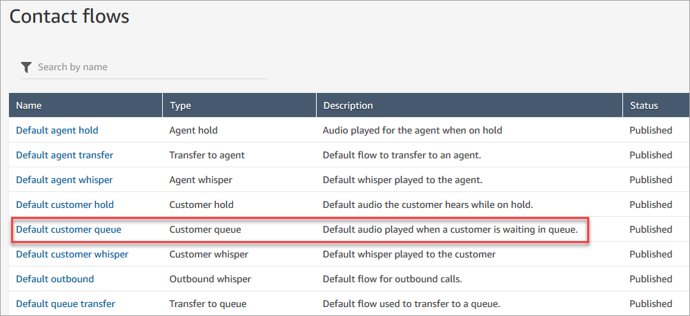
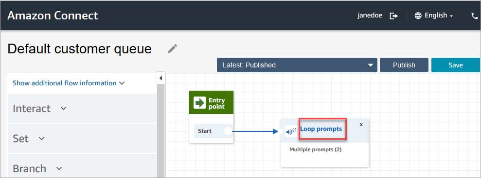
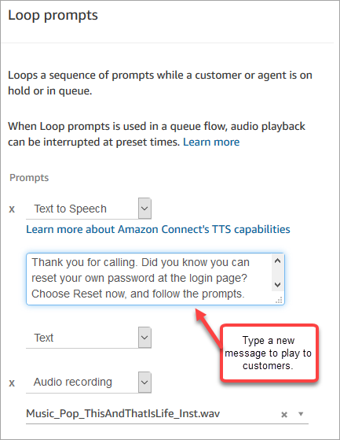
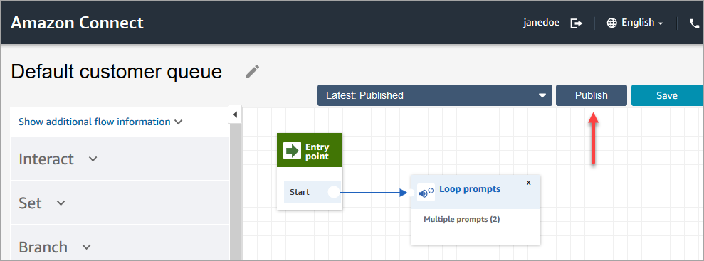
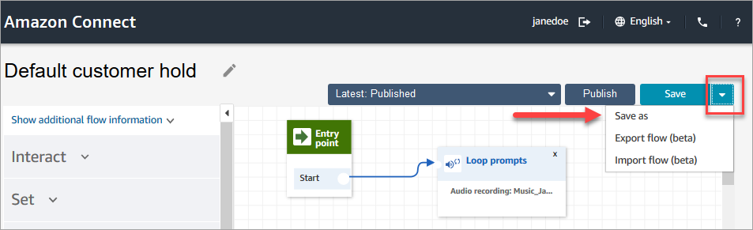
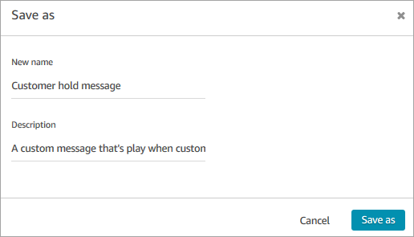

# Change a default flow in your Amazon Connect

contact center

You can override the way the default flows work by editing them directly.

Generally we recommend creating new flows based on the defaults, rather than editing
the default flow directly. You can make a copy of the default flow, assign a name that
indicates it's a custom version, and then edit that one. This gives you more control
over how your flows work.

## Change how a default flow works in

Amazon Connect

The following steps show how to change the default message customers hear when
they are put in a queue to wait for the next available agent.

1. On the navigation menu, choose **Routing**,
   **Flows**.
2. Choose the default flow you want to customize. For example, choose
   **Default customer queue** if you want to create your
   own message when a customer is put in queue instead of using the one we've
   provided. This is shown in the following image.

 3. To customize the message, choose the **Loop prompts**
block to open the properties page.

 4. On the **Properties** page of the **Loop
prompts** block, use the dropdown box to either choose
different music, or set to **Text to Speech**. Type a
message to be played.

For example, the following image shows the message "_Thank you
for calling. Did you know you can reset your own password at the login
page? Choose Reset now, and following the prompts._"

 5. Choose **Save** at the bottom of the properties page. 6. Choose **Publish**. Amazon Connect starts playing the new message
almost immediately (it may take a few moments for it to fully take
effect).

## Copy a default flow before customizing

it

Use the following steps to create a new flow based a current default.

1. On the navigation menu, choose **Routing**,
   **Flows**.
2. Choose the default flow you want to customize.
3. In the upper right corner of the page, choose the
   **Save** drop-down arrow. Choose **Save
   as**, as shown in the following image.

 4. Assign a new name for the flow, for example, **Customer hold
message**.

 5. Add the new flow (in this case, **Customer hold
message**) to the flows you create so it's run instead of the
default.
