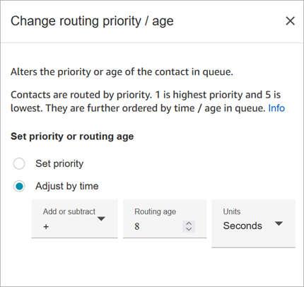
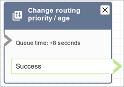

# Flow block in Amazon Connect: Change routing priority /

age

This topic describes setting up the Change routing priority / age flow block for
changing the priority or length of time of a customer in a queue.

## Description

- Change a customer's position in the queue. For example, move the contact
  to the front of the queue, or to the back of the queue.

## Supported channels

The following table lists how this block routes a contact who is using the
specified channel.

| Channel | Supported? |
| ------- | ---------- | --------------------------------------------------------------------------------------------------------------------------------------------------------------------------------------------------------------------------------------------------------------------------------------------------------------------------------------------------------------------------------------------------------------------------------------------------------------------------------------------------------------------------------------------------------------------------------------------------------------------------------------------------------------------------------------------------------------------------------------------------------------------------------------------------------------------------------------------------------------------------------------------------------------------------------------------------------------------------------------------------------------------------------------------------------------------------------------------------------------------------------------------------------------------------------------------------------------------------------------------------------------------------------------------------------------------------------------------------------------------------------------------------------------------------------------------------------------------------------------------------------------------------------------------------------------------------------------------------------------------------------------------------------------------------------------------------------------------------------------------------------------------------------------------------------------------------------------------------------------------------------------------------------------------------------------------------------------------------------------------------------------------------------------------------------------------------------------------------------------------------------------------------------------------------------------------------------------------------------------------------------------------------------------------------------------------------------------------------------------------------------------------------------------------------------------------------------------------------------------------------------------------------------------------------------------------------------------------------------------------------------------------------------------------------------------------------------------------------------------------------------------------------------------------------------------------------------------------------------------------------------------------------------------------------------------------------------------------------------------------------------------------------------------------------------------------------------------------------------------------------------------------------------------------------------------------------------------------------------------------------------------------------------------------------------------------------------------------------------------------------------------------------------------- |
| Voice   | Yes        |
| Chat    | Yes        |
| Task    | Yes        |
| Email   | Yes        | ## Flow types You can use this block in the following [flow types](create-contact-flow.md#contact-flow-types "create-contact-flow.md#contact-flow-types"):  • Inbound flow  • Customer queue flow  • Transfer to Agent flow  • Transfer to Queue flow ## Properties The following image shows the **Properties** page of the **Change routing priority / age** block. It is configured to add 8 seconds to the routing age of the contact.  This block gives you two options for changing a contact's position in queue:  • **Set priority**. The default priority for new contacts is 5. You can raise the priority of a contact - compared to other contacts in the queue - by assigning them a higher priority, such as 1 or 2. + Default priority: 5 + Range of valid values: 1 (highest) - 9223372036854775807 (lowest). If you enter a number larger than that, it will fail when the flow is published.  • **Adjust by time**. You can add or subtract seconds or minutes from the amount of time the current contact spends in queue. Contacts are routed to agents on a first-come, first-served basis. So changing their amount of time in queue compared to others also changes their position in queue. Here's how this block works: 1. Amazon Connect takes the actual "time in queue" for the contact (in this case, how long this specific contact has spent in queue so far), and adds the number of seconds you specified in the **Adjust by time** property. 2. The additional seconds makes this specific contact look artificially older than it is. 3. The routing system now perceives this contact's "time in queue" as longer than it actually is, which affects its position within the ranked list. ## Configuration tips  • When using this block, it takes at least 60 seconds for a change to take effect for contacts already in queue.  • If you need a change in a contact's priority to take effect immediately, set the priority before putting the contact in queue, that is, before using a [Transfer to queue](transfer-to-queue.md "transfer-to-queue.md") block. ## Configured block The following image shows an example of what this block looks like when it is configured. It shows the **Queue time** is set to +8 seconds, and it has a **Success** branch.  ## Sample flows Amazon Connect includes a set of sample flows. For instructions that explain how to access the sample flows in the flow designer, see [Sample flows in Amazon Connect](contact-flow-samples.md "contact-flow-samples.md"). Following are topics that describe the sample flows which include this block.  • [Sample customer queue priority flow in Amazon Connect](sample-customer-queue-priority.md "sample-customer-queue-priority.md")  • [Sample queue configurations flow in Amazon Connect](sample-queue-configurations.md "sample-queue-configurations.md") ## Scenarios See these topics for more information about how routing priority works:  • [How Amazon Connect uses routing profiles](concepts-routing.md "concepts-routing.md")  • [How routing works in Amazon Connect](about-routing.md "about-routing.md") |
