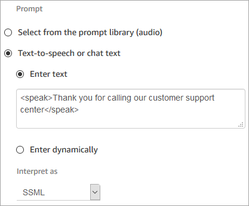

# SSML tags in an Amazon Connect chat conversation

If you create text-to-speech text and apply SSML tags, they won't be interpreted in a
chat conversation. For example, in the following image both the text **and tags** will be printed in the chat conversation.

