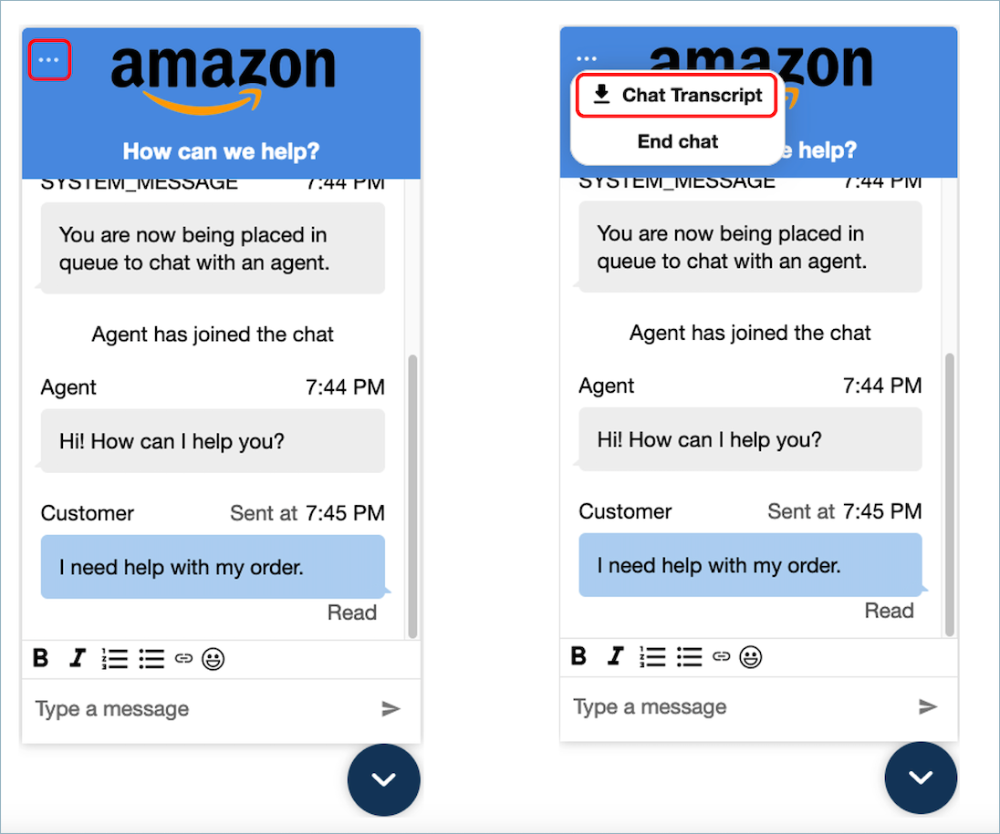
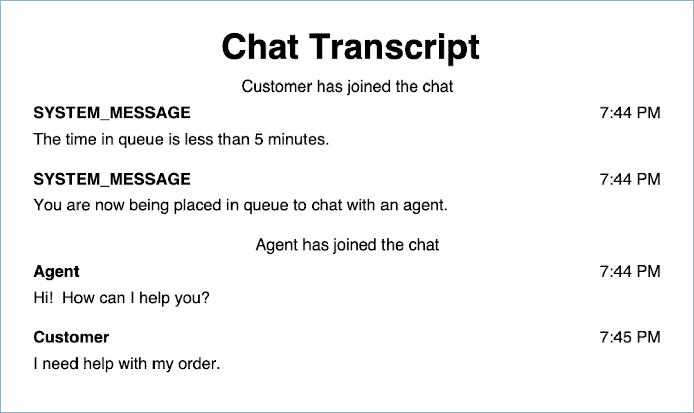

# Download the transcript for your chat

widget in Amazon Connect

You can download a PDF of the transcript in your chat widget.

###### Contents

- [Enable
  Header Dropdown](#chat-widget-download-transcript-enable-header-dropdown "#chat-widget-download-transcript-enable-header-dropdown")
- [Download PDF of Chat
  Transcript](#chat-widget-download-transcript-pdf "#chat-widget-download-transcript-pdf")

## Enable

Header Dropdown

The button to download the transcript is within a drop down menu in the header. To
enable the header’s drop down menu, we have to configure our chat widget’s [customizationObject](pass-customization-object.md "pass-customization-object.md") in the widget
script.

```

amazon_connect('customizationObject', {
        header: {
            dropdown: true,
        }
});

```

Note that enabling the drop down menu will automatically disable the footer since
the **End Chat** functionality is moved to the header drop down
menu. If you want to keep the footer, you can re-enable it by using the
following:

```

amazon_connect('customizationObject', {
        header: {
            dropdown: true,
        },
        footer: {
            disabled: false,
        }
});

```

## Download PDF of Chat

Transcript

After enabling the header drop down menu, you should be able to see a triple dot
menu on the top left of the chat widget. Within that drop down menu, you should see
a download **Chat Transcript** button.



Choosing download **Chat Transcript** will start a PDF download.
The PDF of the chat transcript will show all messages, display names, time stamps
and message events, such as participants leaving or joining.


