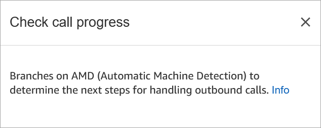
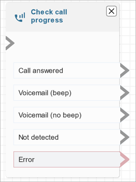

# Flow block in Amazon Connect: Check call progress

This topic defines the flow block for engaging with the output provided by an
answering machine, and providing the appropriate branches to route the contact.

## Description

- Engages with the output provided by an answering machine, and provides
  branches to route the contact accordingly.
- It supports the following branches:
  - **Call answered**: The call has been answered by
    a person.
  - **Voicemail (beep)**: Amazon Connect identifies that the
    call ended in a voicemail and it detects a beep.
  - **Voicemail (no beep)**:
    - Amazon Connect identifies that the call ended in a voicemail but it
      doesn't detect a beep.
    - Amazon Connect identifies that the call ended in a voicemail, but
      the beep is unknown.

  - **Not detected**: Could not detect whether there
    is voicemail. This happens when Amazon Connect is unable to make a positive
    determination of whether a call was answered by a live voice or an
    answering machine. Typical situations that land in this state
    include long silences or excessive background noise.
  - **Error**: If any errors are encountered due to
    Amazon Connect not running correctly after media has been established on the
    call, this is the path that will be taken by the flow. Media is
    established when the call is either answered by a live voice or by
    an answering machine. If the call is rejected by the network or
    encounters a system error while placing the outbound call, the flow
    is not run.

- This block is key in [customer first
  callback use cases](customer-first-cb.md "customer-first-cb.md").

## Supported channels

The following table lists how this block routes a contact who is using the
specified channel.

| Channel | Supported?        |
| ------- | ----------------- | -------------------------------------------------------------------------------------------------------------------------------------------------------------------------------------------------------------------------------------------------------------------------------------------------------------------------------------------------------------------------------------------------------------------------------------------------------------------------------------------------------------------------------------------------------------------------------------------------------------------------------------------------------------------------------------------------------------------- |
| Voice   | Yes               |
| Chat    | No - Error branch |
| Task    | No - Error branch |
| Email   | No - Error branch | ## Flow types You can use this block in the following [flow types](create-contact-flow.md#contact-flow-types "create-contact-flow.md#contact-flow-types"):  • All flow types ## Properties The following image shows the **Properties** page of the **Check call progress** block.  ## Configured block The following image shows an example of what this block looks like when it is configured. It has branches for **Call answered**, **Voicemail (beep)**, **Voicemail (no beep)**, **Not detected**, and **Error**.  |
