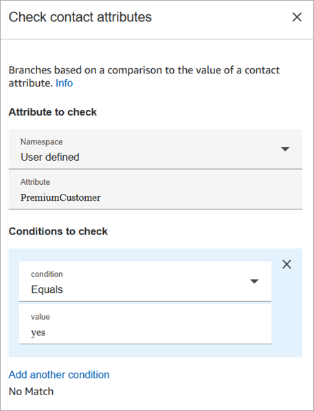
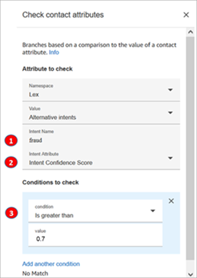
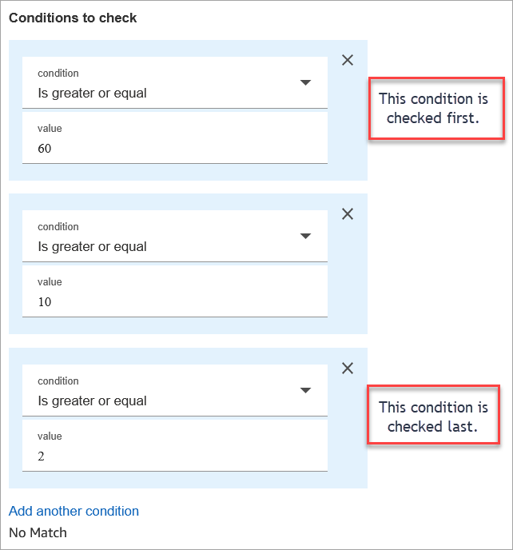
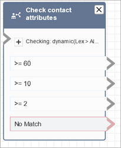

# Flow block in Amazon Connect: Check contact

attributes

This topic defines the flow block for branching based on a comparison to the value of
a contact attribute.

## Description

- Branches based on a comparison to the value of a contact attribute.
- Supported comparisons include: **Equals**, **Is
  Greater Than**, **Is Less Than**,
  **Starts With**, **Contains**.

## Supported channels

The following table lists how this block routes a contact who is using the
specified channel.

| Channel | Supported? |
| ------- | ---------- |
| Voice   | Yes        |
| Chat    | Yes        |
| Task    | Yes        |
| Email   | Yes        |

## Flow types

You can use this block in the following [flow
types](create-contact-flow.md#contact-flow-types "create-contact-flow.md#contact-flow-types"):

- All flows

## Properties

The following image shows the **Properties** page of the
**Check contact attributes** block. In this example, the block
is configured to check whether the contact is a
**PremiumCustomer**, which is a [user-defined attribute](connect-attrib-list.md#user-defined-attributes "connect-attrib-list.md#user-defined-attributes").

### Conditions to check can be

dynamic

You can check conditions like the following:

- $.Attributes.verificationCode

To check for a NULL value, you need to use a Lambda.

### Amazon Lex attributes

You can set attributes that are **Type** =
**Lex** as follows:

- **Alternative Intents**: Usually you configure flows
  to branch on the winning Lex intent. However, in some situations, you
  might want to branch on an alternate intent. That is, what the customer
  might have meant.

For example, in the following image of the **Check contact
attributes** properties page, it is configured so the
alternative intent indicates that if Amazon Lex is more than 70% confident
the customer meant _fraud_, the flow should branch
accordingly.

    1. **Intent name** is the name of an alternate
     intent in Lex. It's case sensitive and must match what's in Lex
     exactly.
    2. **Intent Attribute** is what Amazon Connect is going
     to check. In this example, it's going to check the
     **Intent Confidence Score**.
    3. **Conditions to check**: If Lex is 70%
     certain the customer meant the alternate intent instead of the
     winning intent, branch.

- **Intent Confidence Score**: How confident is the bot
  that it understands the customer's intent. For example, if the customer
  says "I want to update an appointment," _update_ can
  mean _reschedule_ or _cancel_.
  Amazon Lex provides the confidence score on a scale of 0 to 1:
  - 0 = not at all confident
  - .5 = 50% confident
  - 1 = 100% confident

- **Intent Name**: The user intent returned by
  Amazon Lex.
- **Sentiment Label**: What is the winning sentiment,
  the one with the highest score. You can branch on POSITIVE, NEGATIVE,
  MIXED, or NEUTRAL.
- **Sentiment Score**: Amazon Lex integrates with Amazon Comprehend to
  determine the sentiment expressed in an utterance:
  - Positive
  - Negative
  - Mixed: The utterance expresses both positive and negative
    sentiments.
  - Neutral: The utterance does not express either positive or
    negative sentiments.

- **Session Attributes**: Map of key-value pairs
  representing the session-specific context information.
- **Slots**: Map of intent slots (key/value pairs)
  Amazon Lex detected from the user input during the interaction.

## Configuration tips

- If you have multiple conditions to compare, Amazon Connect checks them in the order
  they are listed.

For example, in the following image of the **Check contact
attributes** properties page, it is configured so Amazon Connect
compares the **greater than 60** condition first and
compares **greater than 2** last.

- This block doesn't support case-insensitive pattern matching. For example,
  if you're trying to match against the word **green** and
  the customer types **Green**, it would fail. You would have
  to include every permutation of upper and lower-case letters.

## Configured

The following image shows an example of what this block looks like when it is
configured. It shows the block has four branches, one for each condition:
greater or equal to 60, greater to equal to 10, greater or equal to 2, or
**No match**.

## Sample flows

Amazon Connect includes a set of sample flows. For instructions that explain how to access the sample flows in the flow designer, see
[Sample flows in Amazon Connect](contact-flow-samples.md "contact-flow-samples.md"). Following are topics
that describe the sample flows which include this block.

- [Sample inbound flow in Amazon Connect for the first contact
  experience](sample-inbound-flow.md "sample-inbound-flow.md")
- [Sample interruptible queue flow with
  callback in Amazon Connect](sample-interruptible-queue.md "sample-interruptible-queue.md")

## Scenarios

See these topics for scenarios that use this block:

- [How to reference contact attributes in
  Amazon Connect](how-to-reference-attributes.md "how-to-reference-attributes.md")
- [Personalize a contact's experience based on
  how they contact your contact center](use-channel-contact-attribute.md "use-channel-contact-attribute.md")
