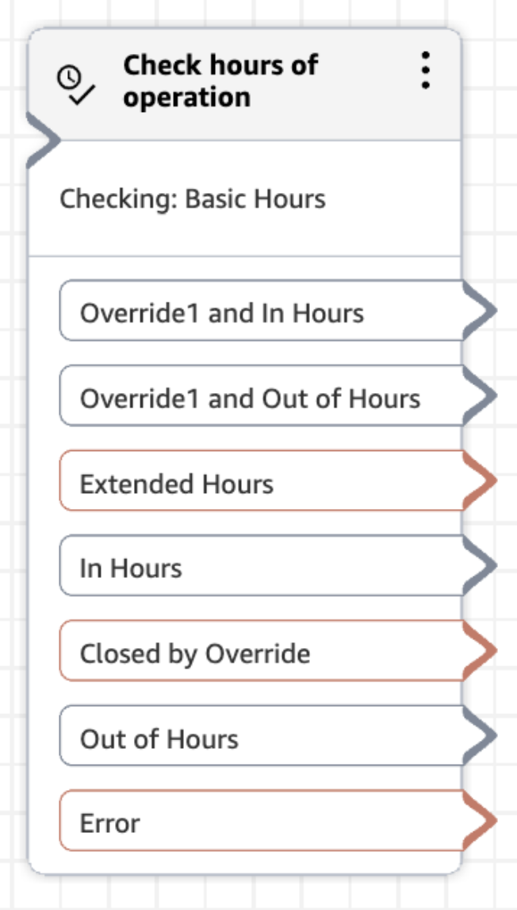

# Flow block in Amazon Connect: Check hours of

operation

This topic defines the flow block to checks whether a contact occurs within
or outside of the defined hours of operation.

## Description

Set up the **Check hours of operation** flow block to determine what path a contact should take at any given time.

- It checks for hours of operation defined directly on the block.
- If none are specified, it checks the hours for the current defined on the queue.
- It checks if the designed hours of operations are open (in hours) or closed (out of hours), and provides configuration for each branch.
- If optionally provides a way to create additional branches for overrides related to the hours of operation, for example to play a special greeting on a holiday before taking the standard out of hours path.

## Supported channels

The following table lists how this block routes a contact who is using the
specified channel.

| Channel | Supported? |
| ------- | ---------- |
| Voice   | Yes        |
| Chat    | Yes        |
| Task    | Yes        |
| Email   | Yes        |

## Flow types

You can use this block in the following [flow
types](create-contact-flow.md#contact-flow-types "create-contact-flow.md#contact-flow-types"):

- Inbound flow
- Customer queue flow
- Transfer to Agent flow
- Transfer to Queue flow

## Properties

Select the **Check hours of operation** flow block to view its properties and define what path a contact should take based on the current date and time.

1. Within Amazon Connect, navigate to the **Routing** menu.
2. Select the **Flows** page.
3. Open the desired resource.
4. Find its **Check hours of operation** block. It has default branches:
   1. **In hours**
   2. **Out of hours**
   3. **Error**

5. Click on the flow block to optionally specify an hours of operation for this flow.
   1. If not specified, Amazon Connect will use the hours associated with a contact's queue.

6. If you wish to set up special branching for certain dates, find the **Optional branches** section.

 7. Select **Check override**. 8. Specify the name of the override that should have its own path. 9. Select **Confirm** then save your change. 10. Repeat as needed.

 11. Build out the desired flow path for each new node.

For more information on standard day-of-the-week configurations, see [Set the hours of operation and time zone for a
queue using Amazon Connect](set-hours-operation.md "set-hours-operation.md").

To learn more about overrides, see [Set overrides for extended, reduced, and holiday hours](hours-of-operation-overrides.md "hours-of-operation-overrides.md").

## Agent queues

Agent queues that are automatically created for each agent in your instance do not include an hours of operation.

If you use this block to check the hours of operation for an agent queue, the check fails and the contact is routed down the **Error** branch.

## Sample flows

Amazon Connect includes a set of sample flows. For instructions that explain how to access the sample flows in the flow designer, see
[Sample flows in Amazon Connect](contact-flow-samples.md "contact-flow-samples.md"). Following are topics
that describe the sample flows which include this block.

[Sample inbound flow in Amazon Connect for the first contact
experience](sample-inbound-flow.md "sample-inbound-flow.md")
