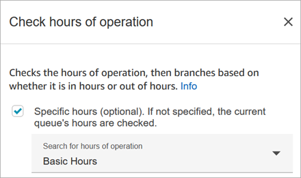
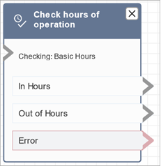

# Flow block in Amazon Connect: Check hours of

operation

This topic defines the flow block to checks whether a contact occurs within or outside
of the hours of operation defined for the customer queue.

## Description

- Checks whether the contact is occurring within or outside the hours of
  operation defined by the block. If specific hours are not specified, the
  hours for the current queue are checked.
- Branches based on specified hours of operation.

## Supported channels

The following table lists how this block routes a contact who is using the
specified channel.

| Channel | Supported? |
| ------- | ---------- | ------------------------------------------------------------------------------------------------------------------------------------------------------------------------------------------------------------------------------------------------------------------------------------------------------------------------------------------------------------------------------------------------------------------------------------------------------------------------------------------------------------------------------------------------------------------------------------------------------------------------------------------------------------------------------------------------------------------------------------------------------------------------------------------------------------------------------------------------------------------------------------------------------------------------------------------------------------------------------------------------------------------------------------------------------------------------------------------------------------------------------------------------------------------------------------------------------------------------------------------------------------------------------------------------------------------------------------------------------------------------------------------------------------------------------------------------------------------------------------------------------------------------------------------------------------------------------------------------------------------------------------------------------------------------------------------------------------------------------------------------------------------------------------------------------------------------------------------------------------------------------------------------------------------------------------------------------------------------------------------------------------------------------------------------------------------------------------------------------------------------------------------------------------------------------------------------------------------------------------------------------------------------------------------------------------------------------------------------------------------------------------------------------ |
| Voice   | Yes        |
| Chat    | Yes        |
| Task    | Yes        |
| Email   | Yes        | ## Flow types You can use this block in the following [flow types](create-contact-flow.md#contact-flow-types "create-contact-flow.md#contact-flow-types"):  • Inbound flow  • Customer queue flow  • Transfer to Agent flow  • Transfer to Queue flow ## Properties The following image shows the **Properties** page of the **Check hours of operation** block. The block is configured for specific hours of operation.  You can set up multiple hours of operation so you have one for various queues. For instructions, see [Set the hours of operation and time zone for a queue using Amazon Connect](set-hours-operation.md "set-hours-operation.md"). You can set up overrides to hours of operation to indicate dates where the standard hours do not apply. For instructions, see [Set overrides for extended, reduced, and holiday hours](set-hours-operation.md#set-holiday-hours "set-hours-operation.md#set-holiday-hours"). ## Configuration tips  • [Agent queues](concepts-queues-standard-and-agent.md "concepts-queues-standard-and-agent.md") that are automatically created for each agent in your instance do not include an hours of operation.  • If you use this block to check the hours of operation for an agent queue, the check fails and the contact is routed down the **Error** branch. ## Configured block The following image shows an example of what this block looks like when it is configured. It is configured for **Basic Hours** of operation. It has three branches: **In hours**, **Out of Hours**, and **Error**.  ## Related topics  • [Set the hours of operation and time zone for a queue using Amazon Connect](set-hours-operation.md "set-hours-operation.md") ## Sample flows Amazon Connect includes a set of sample flows. For instructions that explain how to access the sample flows in the flow designer, see [Sample flows in Amazon Connect](contact-flow-samples.md "contact-flow-samples.md"). Following are topics that describe the sample flows which include this block. [Sample inbound flow in Amazon Connect for the first contact experience](sample-inbound-flow.md "sample-inbound-flow.md") |
