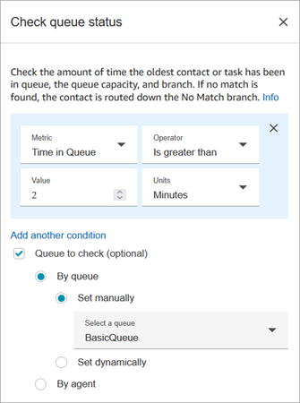
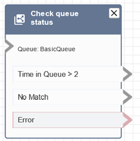

# Flow block in Amazon Connect: Check queue status

This topic defines the flow block for checking the status of a customer queue based on
conditions set for that queue.

## Description

- Checks the status of the queue based on specified conditions.
- Branches based on the comparison of **Time in Queue** or
  **Queue capacity**.
  - **Time in queue** is the amount of time the
    oldest contact spends in queue, before they are routed to an agent
    or removed from the queue.
  - **Queue capacity** is number of contacts waiting
    in a queue.

- If no match is found, the **No Match** branch is
  followed.

## Supported channels

The following table lists how this block routes a contact who is using the
specified channel.

| Channel | Supported? |
| ------- | ---------- | -------------------------------------------------------------------------------------------------------------------------------------------------------------------------------------------------------------------------------------------------------------------------------------------------------------------------------------------------------------------------------------------------------------------------------------------------------------------------------------------------------------------------------------------------------------------------------------------------------------------------------------------------------------------------------------------------------------------------------------------------------------------------------------------------------------------------------------------------------------------------------------------------------------------------------------------------------------------------------------------------------------------------------------------------------------------------------------------------------------------------------------------------------------------------------------------------------------------------------------------------------------------------------------------------------------------------------------------------------------------------------------------------------------------------------------------------------------------------------------------------------------------------------------------------------------------------------------------------------------------------------------------------------------------------------------------------------------------------------------------------------------------------------------------------------------------------------------------------------------------------------------------------------------------------------------------------------------------------------------------------------------------------------------------------------------------------------------------------------------------------------------------------------------------------------- |
| Voice   | Yes        |
| Chat    | Yes        |
| Task    | Yes        |
| Email   | Yes        | ## Flow types You can use this block in the following [flow types](create-contact-flow.md#contact-flow-types "create-contact-flow.md#contact-flow-types"):  • Inbound flow  • Customer queue flow  • Transfer to Agent flow  • Transfer to Queue flow ## Properties The following image shows the **Properties** page of the **Check queue status** block. In this example, it checks whether a contact has been in the BasicQueue longer than 2 minutes.  ## Configuration tips The order in which you add conditions matters at the runtime. Results are evaluated against conditions in the same order in which you add them to the block. Contacts are routed down the first condition to match. For example, in the following condition order, every value matches one of first two conditions. None of the other conditions are ever matched.  • Time in Queue <= 90  • Time in Queue >= 90  • Time in Queue >= 9  • Time in Queue >= 12  • Time in Queue >= 15  • Time in Queue >= 18  • Time in Queue > 20  • Time in Queue > 21 In this next example, all contacts with a wait time in queue of 90 or less (<=90) match first condition only. This means less than or equal to 9 (<=9), <=12, <=15, <=18, <=20, <=21 are never run. Any value greater than 90 is routed down the greater than or equal to 21 (>=21) condition branch.  • Time in Queue <= 90  • Time in Queue <= 9  • Time in Queue <= 12  • Time in Queue <= 15  • Time in Queue <= 18  • Time in Queue < 20  • Time in Queue < 21  • Time in Queue > 21 ## Configured block The following image shows an example of what this block looks like when it is configured. It has three branches: the **Time in Queue** condition, **No Match**, and **Error**.  ## Scenarios See these topics for scenarios that use this block:  • [Set up a flow to manage contacts in a queue in Amazon Connect](queue-to-queue-transfer.md "queue-to-queue-transfer.md") |
