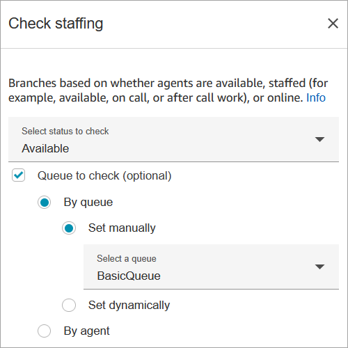
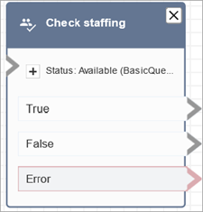

# Flow block in Amazon Connect: Check staffing

This topic defines the flow block for checking the current or specified customer queue
to gauge agent availability.

## Description

- Checks the current working queue, or queue you specify in the block, for
  whether agents are [available](metrics-definitions.md#available-real-time "metrics-definitions.md#available-real-time"),
  [staffed](metrics-definitions.md#staffed-agents "metrics-definitions.md#staffed-agents"), or [online](metrics-definitions.md#online-agents "metrics-definitions.md#online-agents").
- Before transferring a call to agent and putting that call in a queue, use
  the **Check hours of operation** and **Check
  staffing** blocks. They verify that the call is within working
  hours and that agents are staffed to service.

## Supported channels

The following table lists how this block routes a contact who is using the
specified channel.

| Channel | Supported? |
| ------- | ---------- |
| Voice   | Yes        |
| Chat    | Yes        |
| Task    | Yes        |
| Email   | Yes        |

## Flow types

You can use this block in the following [flow
types](create-contact-flow.md#contact-flow-types "create-contact-flow.md#contact-flow-types"):

- Inbound flow
- Customer queue flow
- Transfer to Agent flow
- Transfer to Queue flow

## Properties

The following image shows the **Properties** page of the
**Check staffing** block. It is configured to check whether
agents in the BasicQueue are available so they can be routed contacts.

In the **Status to check** dropdown box, choose one of the following
options:

- [Available](metrics-definitions.md#available-real-time "metrics-definitions.md#available-real-time") =
  Check whether at least one agent in the queue is
  **Available**.
- [Staffed agents](metrics-definitions.md#staffed-agents "metrics-definitions.md#staffed-agents") = Check
  whether at least one agent in the queue is **Available**,
  **On call**, or in **After Contact
  Work**.
- [Online agents](metrics-definitions.md#online-agents "metrics-definitions.md#online-agents") = Check whether
  at least one agent in the queue is **Available**, in the
  **Staffed** state, or in a custom state.

## Configuration tips

- You must set a queue before using a **Check staffing**
  block in your flow. You can use a [Set working queue](set-working-queue.md "set-working-queue.md") block to set the queue.
- If a queue is not set, the contact is routed down the
  **Error** branch.
- When a contact is transferred from one flow to another, the queue that is
  set in a flow is passed from that flow to the next flow.

## Configured block

The following image shows an example of what this block looks like when it is
configured. It has three branches: **True**,
**False**, and **Error**.

## Scenarios

See these topics for scenarios that use this block:

- [Transfer contacts to a specific agent in
  Amazon Connect](transfer-to-agent.md "transfer-to-agent.md")
