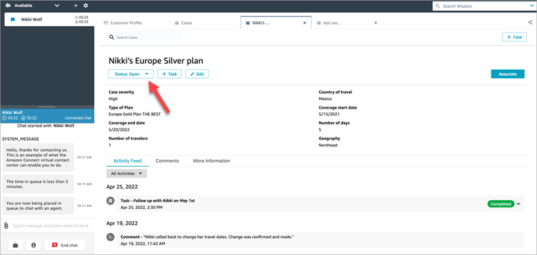
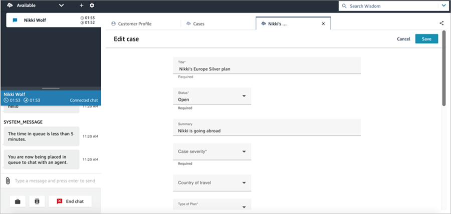

# Edit a case in Amazon Connect

To edit a case, the agent chooses **Edit** and
**Save** to save any changes.

You can edit a case only when it is not in a **Closed** status.
If the case is **Closed**, you must update the status, then choose
**Edit** to make your changes.

