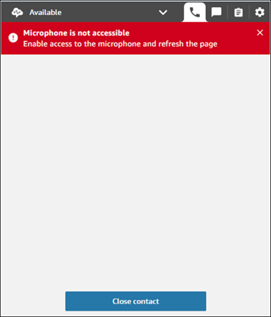
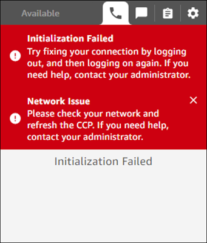
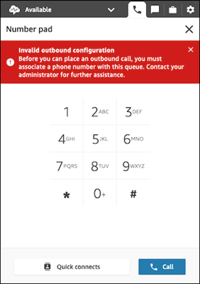
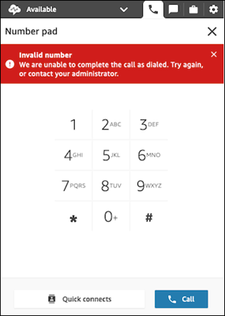

# Contact Control Panel (CCP) Issues

This topic is for IT administrators who are experienced with investigating issues with
their network. It discusses the most common issues agents may encounter when using the
Contact Control Panel (CCP).

For example, the most common issues are typically poor audio quality due to the
network, and hardware issues, such as microphone access.

This topic explains how to investigate, diagnose, and fix the most common CCP
issues.

###### Contents

- [CCP browser microphone access](#microphone-access-issues "#microphone-access-issues")
- [CCP initialization issues](#ccp-initialization-issues "#ccp-initialization-issues")
- [CCP WebRTC issues](#ccp-webrtc-issues "#ccp-webrtc-issues")
- [CCP audio issues on first
  call after system reboot when using Windows 11](#ccp-windows-11-audio-issues-after-reboot "#ccp-windows-11-audio-issues-after-reboot")
- [CCP outbound configuration issues](#ccp-outbound-issues "#ccp-outbound-issues")
- [CCP invalid number issues](#ccp-invalidnumber-issues "#ccp-invalidnumber-issues")
- [One-way audio from customers](#ccp-oneway-issues "#ccp-oneway-issues")

## CCP browser microphone access

The CCP conforms to microphone usage guidance that's specific to their browser.

- The CCP has access to connect to the agent's microphone only when the
  permission is granted for the current session. The permission is stored in
  the browser's memory.
- In addition, Firefox requires the CCP tab to be in focus in order for
  microphone and audio to be passed through.

Agents may encounter missed call scenarios when the CCP tab has no microphone
access. Missed calls can also happen when the CCP tab is not in focus, for example,
when the agent is focused on a different tab or application.

- Error message title: **Microphone is not
  accessible**
- Message: **Enable access to the microphone and refresh the
  page**

The following image shows an example of a missed call scenario due to the CCP tab
not having access to agent's microphone.

### How to fix

- If your agents are using Firefox, ensure they know to focus on the CCP
  tab when they accept and connect to a voice contact.
- Use the [End Point Connectivity
  Tool](check-connectivity-tool.md "check-connectivity-tool.md") to determine if the browser has appropriate access to
  media devices such as microphone, speakers, or headset.

## CCP initialization issues

Initialization issues are most commonly caused by missing domain or port/IP
allowlist entries in your agent environment. This results in missed calls.

The CCP initialization process depends on the API and signalling endpoints. These
are accessed by using the allow-listed domains, such as
`*`myInstanceName`.awsapps.com/connect/api`
and
`*.transport.connect.`region`.amazonaws.com`, or
subsequent IP addresses.

- Error message title: **Initialization Failed**
- Message: **Try fixing your connection by logging out, and then
  logging on again. If you need help, contact your
  administrator.**

The following image shows an example of a missed call scenario due to missing
allowlisted domains.

### How to fix

- Check that you have added all domains and IP addresses listed in [Option 1](ccp-networking.md#option1 "ccp-networking.md#option1") of [Set up your network](ccp-networking.md "ccp-networking.md").
- Use the [End Point Connectivity
  Tool](check-connectivity-tool.md "check-connectivity-tool.md") to determine if the browser has appropriate access to
  all required endpoints.
- Because errors can occur due to poor networking conditions, and then
  result in latency or outages, we recommend also checking your agent
  networking connections.

## CCP WebRTC issues

WebRTC issues occur when a request to Amazon Connect Soft-phone Media
(`TurnNlb-xxxxxxxxxxxxx.elb.`region`.amazonaws.com:3478?transport=udp`)
times out and the CCP is unable to collect ICE candidates to establish a connection.
The result is missed calls.

- Error message title: **ice_collection_timeout title, WebRTC
  issue**
- Messages: **ice_collection_timeout message, Call failed due to a
  browser-side WebRTC issue.**

### How to fix

- Check Firewall and/or NAT settings to see if UDP 3478 outbound traffic
  to Amazon Connect Softphone Media is allowed. See [Set up your network](ccp-networking.md "ccp-networking.md").
- Use the [End Point Connectivity
  Tool](check-connectivity-tool.md "check-connectivity-tool.md") to determine if agents are able to successfully connect
  to all the required endpoints.
- Because errors can occur due to poor networking conditions, and then
  result in latency or outages, we recommend also checking your agent
  networking connections.

## CCP audio issues on first

call after system reboot when using Windows 11

**Issue Description**

After performing a Windows 11 system reboot, your agents may experience complete
audio failure ("dead air") during your first call, where neither your
agent nor the customer can hear each other.

**Root Cause**

This issue occurs due to two Windows 11 system behaviors:

1. The network interface card (NIC) unexpectedly restarts when Chrome/Edge
   browsers request audio packet prioritization.
2. Volume control adjustments trigger network-related services, which can
   cause NIC restarts.

**Affected Systems**

- Windows 11 workstations
- Chrome and Edge browsers
- Contact Center softphone applications

**Resolution**

To prevent this issue, you must modify the startup type of several Windows
services from **Manual** to **Automatic**:

Required Service Changes:

- qWAVE (Quality Windows Audio/Video Experience)
- ndisuio.sys
- dmwAppushSvc (Device Management Wireless Application Protocol (WAP) Push
  message Routing Service)
- SstpSvc (Secure Socket Tunneling Protocol Service)
- RasMan (Remote Access Connection Manager)

Contact your IT support team to implement these changes, as they require
administrative privileges.

**Additional Notes**

- This solution ensures critical services which could restart the network
  interface controller (NIC) if launched at run time are launched before the
  the agent's first call.
- No further action is required after these changes are implemented.
- If you continue to experience issues after this fix, contact technical
  support.

## CCP outbound configuration issues

Outbound configuration issues often arise when the instance is not enabled for
outbound calling, or when there is no outbound caller ID specified for making
calls.

- Error message title: **Invalid outbound
  configuration**
- Message: **Before you can place an outbound call, you must
  associate a phone number with this queue. Contact your administrator for
  further assistance.**

The following image shows an example of a invalid outbound configuration message
on the CCP.

### How to fix

- Check that the instance-level setting is enabled for outbound calls.
  For instructions, see [Update telephony and chat options](update-instance-settings.md#update-telephony-options "update-instance-settings.md#update-telephony-options").
- Check that outbound caller ID name and number have been set for your
  default outbound queue. Set the outbound caller ID name and number if
  they are missing. For instructions, see [Set up outbound caller ID](queues-callerid.md "queues-callerid.md").
- Ensure agents have the **Contact Control Panel (CCP) - Make
  outbound calls** permission in their security profile. For
  instructions, see [Assign a security profile for Amazon Connect to a
  contact center user](assign-security-profile.md "assign-security-profile.md").

## CCP invalid number issues

Invalid number issues are primarily seen when an agent enters a phone number that
is not in [E.164](https://www.itu.int/rec/T-REC-E.164/en "https://www.itu.int/rec/T-REC-E.164/en") format.
Or, if the phone number destination has not been allow-listed for outbound calling
on the Amazon Connect instance.

- Error message title: **Invalid number**
- Message: **We are unable to complete the call as dialed. Try
  again, or contact your administrator.**

The following image shows an example of a invalid number message on the CCP.

### How to fix

- Check that the phone number dialed is in [E.164](https://www.itu.int/rec/T-REC-E.164/en "https://www.itu.int/rec/T-REC-E.164/en")
  format.
- Check whether the phone number country you are calling is an allowed
  destination for your Amazon Connect instance. See [Countries that call centers using Amazon Connect can
  call by default](country-code-allow-list.md "country-code-allow-list.md").
- If the issues persist, contact AWS Support.

## One-way audio from customers

If an agent can hear the customer, but the customer can't hear the agent, this may
be the result of an application taking exclusive control of agent's
mic/speaker.

### How to fix

- You can search the internet for articles that explain how to turn off
  exclusive-mode for a Windows audio playback device. For example, [Turning off Exclusive Mode in Windows 10 Home Edition](https://answers.microsoft.com/en-us/windows/forum/all/turning-off-exclusive-mode-in-windows-10-home/b724e917-aeec-4be4-b1aa-5ef655d85ded "https://answers.microsoft.com/en-us/windows/forum/all/turning-off-exclusive-mode-in-windows-10-home/b724e917-aeec-4be4-b1aa-5ef655d85ded").
- To fix sound problems on a Mac, see [Change the sound input settings on Mac](https://support.apple.com/guide/mac-help/change-the-sound-input-settings-mchlp2567/mac "https://support.apple.com/guide/mac-help/change-the-sound-input-settings-mchlp2567/mac").

To troubleshoot call quality issues, see [Troubleshoot audio quality issues by using
QualityMetrics in the contact record](sop-audio-qa.md "sop-audio-qa.md").
