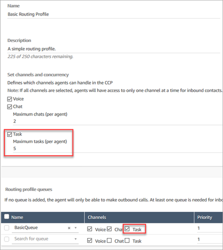

# Set up tasks in Amazon Connect

1. [Update your agent's routing profile](routing-profiles.md "routing-profiles.md") so
   they can manage and create tasks.

When you add tasks to their routing profile, you can specify that up to 10 tasks
be assigned to them at a time.

An agent can pause the same number of tasks as the **Maximum tasks per
agent** setting in their [routing
profile](routing-profiles.md "routing-profiles.md").

For example, an agent has a **Maximum tasks per agent** setting
to handle 5 active tasks simultaneously. This means they can pause up to 5 tasks,
which allows them to free up their active slots to take in new more critical tasks.
However, it also means that agents can have twice the number of tasks in their
workspace at any point in time. In our example, this agent can have 10 tasks in
their workspace: 5 paused and 5 active.

The following image shows the **Tasks** option on the
**Routing profile** page.

 2. [Create quick connects](quick-connects.md "quick-connects.md") so that agents can
create/assign tasks to themselves, or other agents or shared queues. 3. Update your flows to route tasks. 4. Optionally, [create task templates](task-templates.md "task-templates.md") to make it
easy for agents to create tasks. All the fields they need to create a task are
defined for them. 5. Optionally, [integrate with external
applications](integrate-external-apps-tasks.md "integrate-external-apps-tasks.md") and [set up rules to
automatically create tasks](add-rules-task-creation.md "add-rules-task-creation.md") based on pre-defined conditions. 6. By default all agents can create tasks. If you want to block [permissions](task-template-permissions.md "task-template-permissions.md") for some agents, assign
the **Contact Control Panel**, **Restrict task creation
permission** in their security profile.
