# Pause and resume tasks in Amazon Connect

Tasks

You can pause and resume all tasks that aren't expired, disconnected, or scheduled for
a later time. The benefit of pausing and resuming tasks is that it enables agents to
free up an active slot so they can receive more critical tasks when their current task
is stalled, for example, because of a missing approval or waiting on an external input.

You can also pause fully automated tasks to address force majeure events (natural
disasters, infrastructure failures, invasions) that may require you to halt all business
processes temporarily, and then resume them after the emergency has passed.

###### Contents

- [How paused and resumed tasks are
  queued](#pause-tasks-queue "#pause-tasks-queue")
- [How agents pause and
  resume tasks](#pause-tasks-agent-experience "#pause-tasks-agent-experience")
- [How many tasks an agent can
  pause](#pause-tasks-number "#pause-tasks-number")
- [When can a paused task be
  resumed?](#when-resume-tasks "#when-resume-tasks")
- [Programmatically pause and resume tasks](#programmatically-pause-and-resume-tasks "#programmatically-pause-and-resume-tasks")
- [Configure a flow to pause and
  resume tasks](#pause-and-resume-flow "#pause-and-resume-flow")
- [Contact event
  stream](#ces-pause-and-resume-tasks "#ces-pause-and-resume-tasks")
- [Pause and resume task
  events in contact records](#ctr-pause-and-resume-tasks "#ctr-pause-and-resume-tasks")
- [Metrics](#metrics-pause-and-resume-tasks "#metrics-pause-and-resume-tasks")

## How paused and resumed tasks are queued

- All paused tasks that are in queue and not yet assigned to an agent are
  dequeued. This way they don't consume the queue limits for your instance and
  instead allow other more critical contacts to be assigned to agents.
- After the task is resumed, it is re-queued and the flow continues running
  per your configuration.
- When you design a flow to resume unassigned, paused tasks that are
  dequeued, be sure to add a [Transfer to queue](transfer-to-queue.md "transfer-to-queue.md") block to the flow to queue the
  task after resuming. Otherwise, the task will stay in a de-queued state.

## How agents pause and resume

tasks

Agents can pause a task from their Contact Control Panel (CCP) or agent workspace
by using the **Pause** button. To update the task, the agent must
choose **Resume**. The only actions the agent can take on a task
that is in the Paused state are to end it or transfer it.

The following image shows the **Pause** button on the CCP.

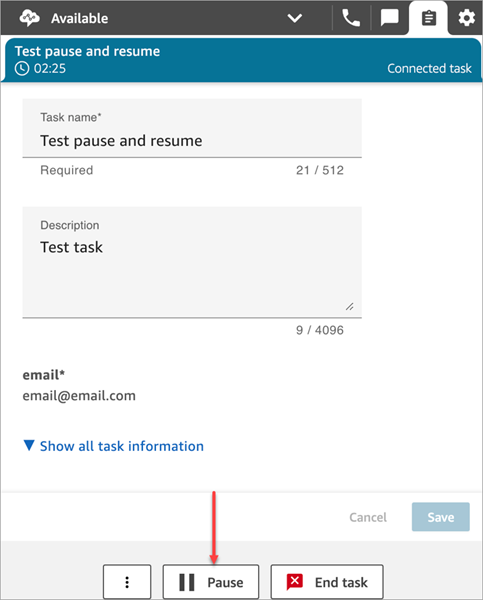

The following image shows the **Pause** button on the agent
workspace.

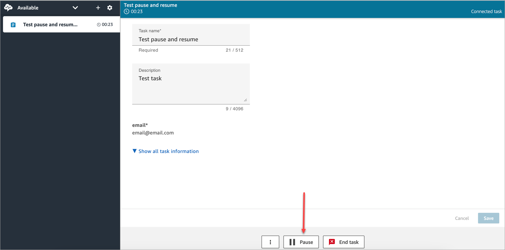

After an agent pauses or resumes a task, a banner is displayed that notifies them
of the current status of the task. The following image of the CCP shows the Pause
banner.

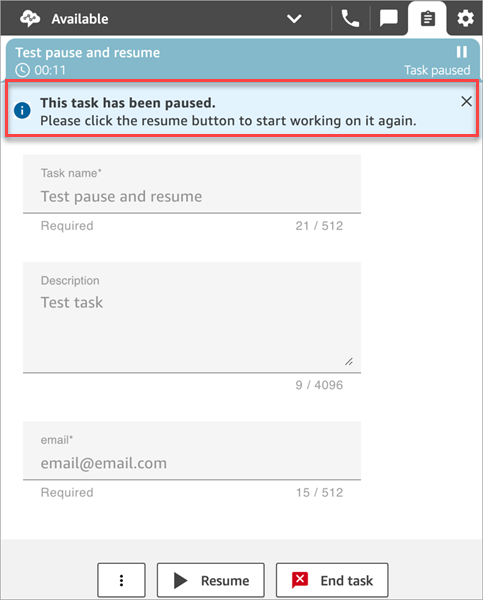

The following image of the agent workspace shows the Resume banner.

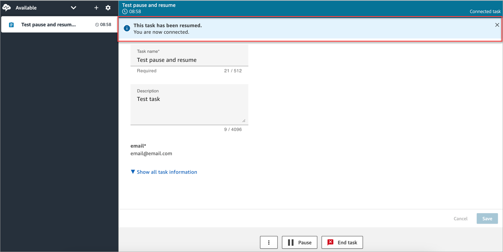

When an agent has multiple tasks open and they pause any one of them, the icon
updates in the task list to notify them of the state of the task. The following
image shows an example of a Paused icon.

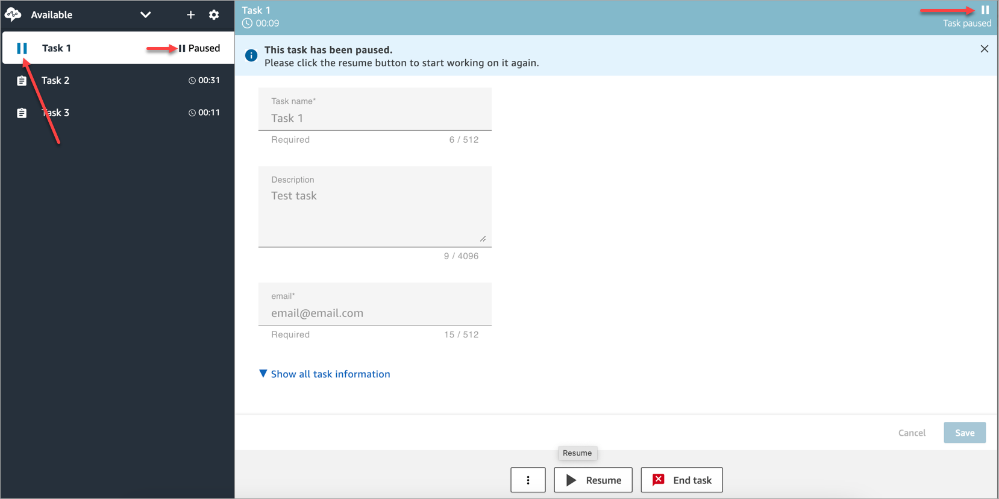

## How many tasks an agent can pause

An agent can pause the up to twice the number tasks as the **Maximum tasks
per agent** setting in their [routing
profile](routing-profiles.md "routing-profiles.md").

For example, an agent has a **Maximum tasks per agent** setting
to handle 5 active tasks simultaneously. This means they can pause up to 5 tasks,
which allows them to free up their active slots to take in new more critical tasks.
However, it also means that agents can have twice the number of tasks in their
workspace at any point in time. In our example, this agent can have 10 tasks in
their workspace: 5 paused and 5 active.

## When can a paused task be resumed?

A paused task can be resumed at any time. As a result, it's possible for an agent
to work temporarily on twice their concurrency limit of tasks.

For example, an agent has 10 tasks in their workspace: 5 paused and 5 active. They
resume all of their paused tasks simultaneously. Now they have 10 active tasks. No
new tasks are routed to them until the number of active tasks is lower than the
**Maximum tasks per agent** limit in their routing
profile.

## Programmatically pause and

resume tasks

You can pause and resume tasks programmatically by using the [PauseContact](../APIReference/API_PauseContact.md "../APIReference/API_PauseContact.md") and [ResumeContact](../APIReference/API_ResumeContact.md "../APIReference/API_ResumeContact.md")
APIs.

When pausing and resuming a task, a corresponding flow can be configured to run at
the pause and resume events. For example:

- You may want to design a flow to automatically resume Paused tasks after a
  set period of time for agent lunch breaks.
- You may want to create a resume flow to update attributes on the task that
  may have changed while the task was Paused.

## Configure a flow to pause and resume

tasks

Configure a [Set event flow](set-event-flow.md "set-event-flow.md")
block to pause and resume tasks. The following image shows the
**Properties** page of a **Set event flow**
block configured to pause a flow.

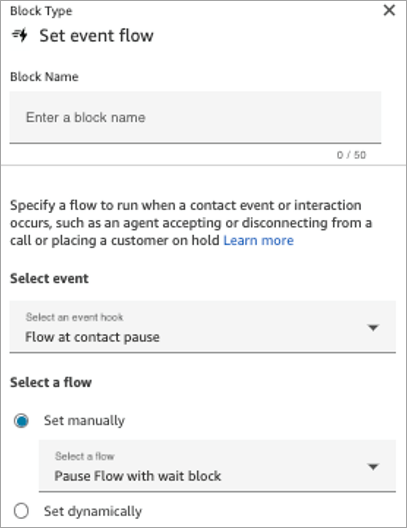

Following are a couple of scenarios you may want to configure in your
flows:

- For flows that run at contact pause, configure them to notify supervisors
  when a task has been paused.
- When resuming a paused contact, configure the flow to update contact
  attributes to make sure that agents are always working on the latest version
  of attributes.

## New events in the contact event stream

and agent event stream

When tasks are paused and resumed, new events are generated for PAUSED and RESUMED
in the contact event stream and agent event stream.

The following image shows an example of a PAUSED event in the contact event
stream.

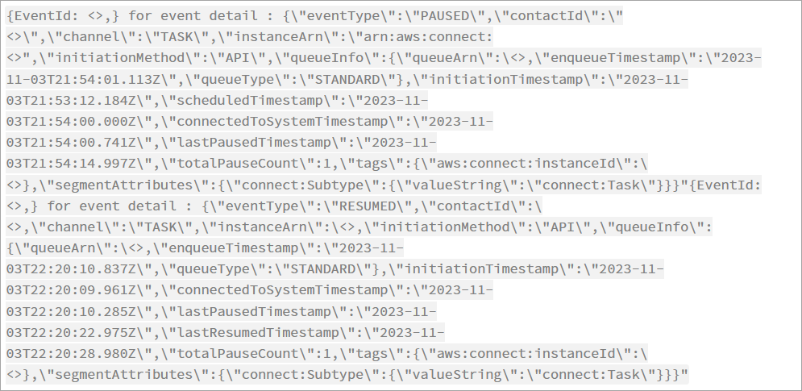

The following image shows an example of a RESUMED event in the contact event
stream.

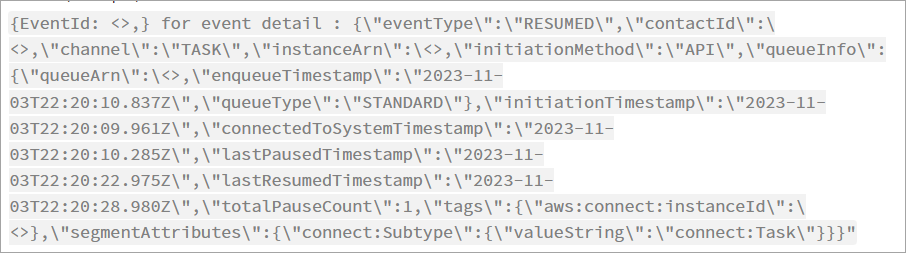

The following image shows an example of PAUSED tasks in the agent event stream.

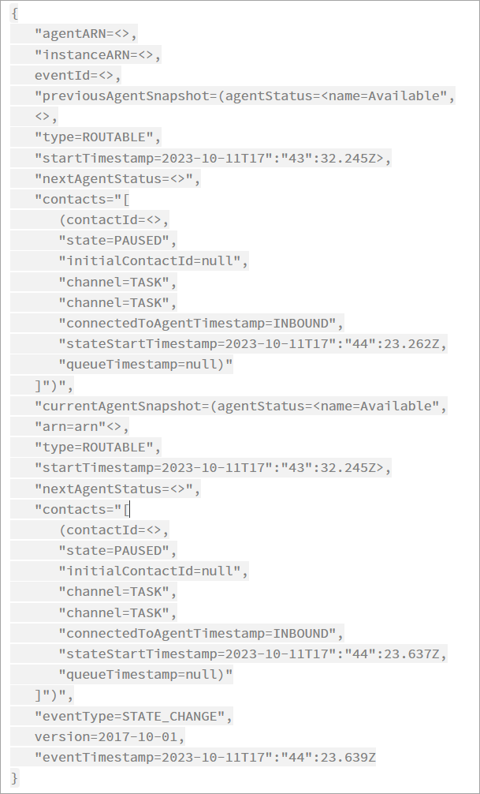

## Pause and resume task events in contact

records

The following events are captured in the [ContactTraceRecord](ctr-data-model.md#ctr-ContactTraceRecord "ctr-data-model.md#ctr-ContactTraceRecord") section of the contact records data model. You can
use the [DescribeContact](../APIReference/API_DescribeContact.md "../APIReference/API_DescribeContact.md") API to return task events.

| Name in contact record      | Name returned by DescribeContact API |
| --------------------------- | ------------------------------------ |
| TotalPauseDurationInSeconds | TOTAL_PAUSED_TIME                    |
| TotalPauseCount             | TOTAL_NUMBER_OF_PAUSES               |
| LastPausedTimestamp         | LAST_PAUSED_TIMESTAMP                |
| LastResumedTimestamp        | LAST_RESUMED_TIMESTAMP               |

The following values are available in near real time when you use the [DescribeContact](../APIReference/API_DescribeContact.md "../APIReference/API_DescribeContact.md") API or view the **Contact details**
page for an in progress contact.

- TotalPauseCount
- LastPausedTimestamp
- LastResumedTimestamp

A completed contact has TotalPauseDurationInSeconds.

## Metrics

The following metrics display active, paused, and resumed time.

| Real-time metrics                                                                               | Description                                                  |
| ----------------------------------------------------------------------------------------------- | ------------------------------------------------------------ |
| **[UI]\* • Agent/Routing Profiles/Queue → Performance → **Average Active Time\*\*      | SUM(active_time)/Number of contacts                          |
| **[UI]\* • Agent/Routing Profiles/Queue → Performance → **Average Agent Pause Time\*\* | SUM(agent_pause_time)/Number of contacts that were paused |
| **[UI]\* • Agent → Contacts → **Contact State\*\*                                         | Paused state of a task contact                               |

| Historical Metrics                                                                                                                                                                  | Description                                                                                                                                                                                                                     |
| ----------------------------------------------------------------------------------------------------------------------------------------------------------------------------------- | ------------------------------------------------------------------------------------------------------------------------------------------------------------------------------------------------------------------------------- |
| \*_[UI]_ • Agent → Agent activity audit → Support "PAUSED" state                                                                                                              | Display paused state when the contact for an agent is in Paused state                                                                                                                                                        |
| \*_[[GetMetricDataV2](../APIReference/API_GetMetricDataV2.md "../APIReference/API_GetMetricDataV2.md")]_ • Query Average of AGENT_PAUSE_TIME for a queue/routing profile/task | SUM(total_agent_pause_time) for all contacts that were paused from queue/routing profile/TaskAVG = SUM(total_agent_pause_time)/number of paused contacts for queue/RP/Tasks                                            |
| \*_[[GetMetricDataV2](../APIReference/API_GetMetricDataV2.md "../APIReference/API_GetMetricDataV2.md")]_ • Query Average of ACTIVE_TIME for a queue/routing profile           | SUM(total_handle_time • total_agent_pause_time) for all contacts of queue/routing profile/tasks AVG = SUM(total_handle_time • total_agent_pause_time) / total number of contacts for queue/routing profile/tasks |

| Contact details page                                                                       | Description                                                                |
| ------------------------------------------------------------------------------------------ | -------------------------------------------------------------------------- |
| \*_[UI]_ • Contact Search → Contact Details → Contact Summary → Last Paused Time     | Last Paused Time                                                           |
| \*_[UI]_ • Contact Search → Contact Details → Contact Summary → Last Resumed Time    | Last Resumed Time                                                          |
| \*_[UI]_ • Contact Search → Contact Details → Contact Summary → Number of Pauses     | Total number of Pauses including when the contact was not connected.    |
| \*_[UI]_ • Contact Search → Contact Details → Contact Summary → Total Pause Duration | Total Pause duration includes before and after the agent was connected. |

### Real-time Metrics page

The following image of the **Real-time Metrics** page shows
the task contact state as **Paused**.

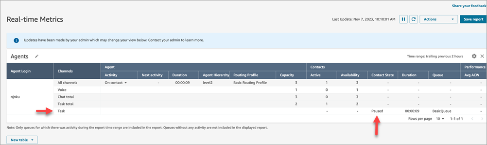

The following image of the **Real-time Metrics** page shows
**Avg Active Time**, **AHT** and
**Avg Agent Pause Time**.

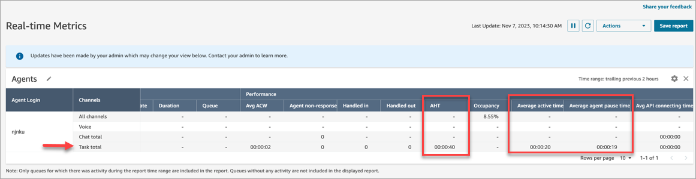

### Agent Activity Audit report

The following image of the **Agent Activity Audit report**
shows the Paused status when a contact is paused by the agent.

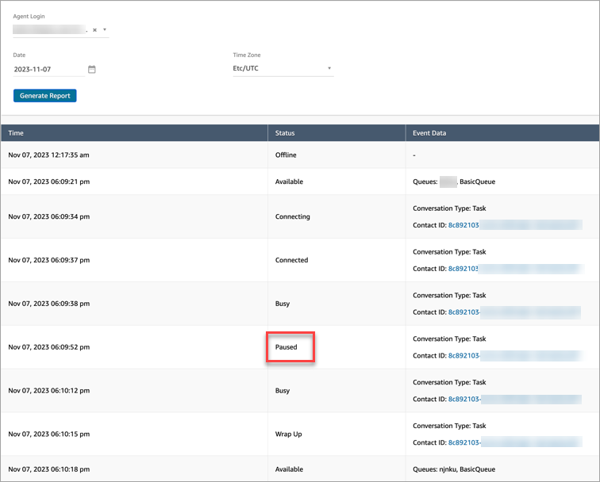
