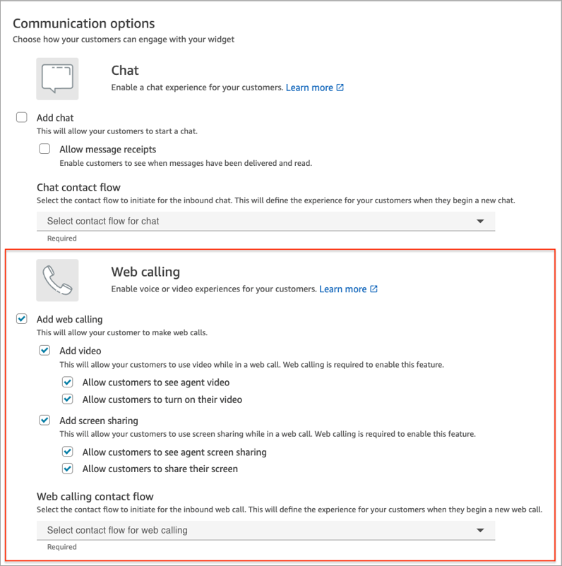
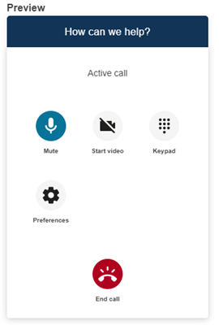
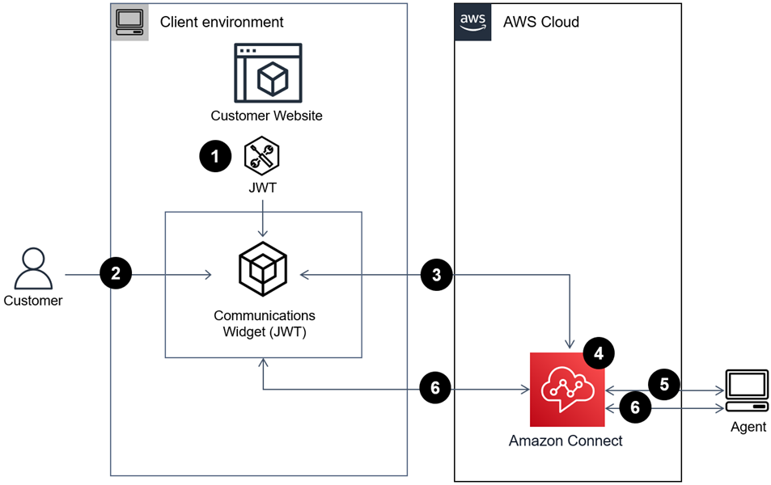

# Configure an out-of-the-box communication widget in

Amazon Connect

Use this option to create communication widgets for desktop and mobile [browsers](connect-supported-browsers.md#browsers-inapp "connect-supported-browsers.md#browsers-inapp"). At the end of this procedure, Amazon Connect
generates a custom HTML code snippet that you copy into your website's source
code.

1. Log in to Amazon Connect admin website using an Admin account or a user account that has
   **Channels and flows**, **Communication widget -
   Create** permission in its security profile.
2. In Amazon Connect, on the left navigation menu, choose
   **Channels**, **Communication widgets**.
3. The wizard guides you through the next three steps.

## Step 1: Select communication channels

1. On the **Communication widgets** page, enter a
   **Name** and **Description** for the
   communications widget.

###### Note

The Name must be unique for each communications widget created in an Amazon Connect
instance. 2. In the **Communications options** section, choose how
your customers can engage with your widget. The following image shows
options to allow web calling, video, and screen sharing for customers.

 3. In the **Web calling** section, choose whether to enable
video and screen sharing experiences for your customers. The previous image
shows options that customers can see agent video, turn on their video, and
allow agents and customers to share their screens. For information about
setting restrictions on screen sharing, see [Enable URL restriction for screen
sharing](screen-sharing-url-restriction.md "screen-sharing-url-restriction.md"). 4. Choose **Save and continue**.

## Step 2: Customize widget

As you choose these options, the widget preview updates automatically so that you
can see what the experience will look like for your customers.

###### Define widget access button styles

1. Choose the colors for the button background by entering hex values ([HTML color codes](https://htmlcolorcodes.com/ "https://htmlcolorcodes.com/")).
2. Choose **White** or **Black** for the
   icon color. The icon color can't be customized.

###### Customize display names and styles

1. Provide values for header message and color, and widget background color.
2. **Logo URL**: Insert a URL to your logo banner from an
   Amazon S3 bucket or another online source.

###### Note

The communications widget preview in the customization page will not display
the logo if it's from an online source other than an Amazon S3 bucket.
However, the logo will be displayed when the customized communications widget is
implemented to your page.

The banner must be in .svg, .jpg or .png format. The image can be 280px
(width) by 60px (height). Any image larger than those dimensions will be
scaled to fit the 280x60 logo component space.

    1. For instructions about how to upload a file such as your logo
     banner to S3, see [Uploading
     objects](../../../AmazonS3/latest/userguide/upload-objects.md "../../../AmazonS3/latest/userguide/upload-objects.md") in the *Amazon Simple Storage Service User
     Guide*.
    2. Make sure that the image permissions are properly set so that the
     communications widget has permissions to access the image. For information
     about how to make a S3 object publicly accessible, see [Step 2: Add a bucket policy](../../../AmazonS3/latest/userguide/WebsiteAccessPermissionsReqd.md#bucket-policy-static-site "../../../AmazonS3/latest/userguide/WebsiteAccessPermissionsReqd.md#bucket-policy-static-site") in the *Setting
     permissions for website access* topic.

## Step 3: Add your domain for the widget

This step enables you to secure the communications widget so that it can be
launched only from your website.

1. Enter the website domains where you want to place the communications widget. The
   communications widget loads only on websites that you select in this step.

Choose **Add domain** to add up to 50 domains.

###### Important

    * Double-check that your website URLs are valid and does not
     contain errors. Include the full URL starting with
     https://.
    * We recommend using https:// for your production websites and
     applications.

2. Under **Add security for your communications widget requests**,
   for the fastest setup experience choose **No - I will
   skip**.

We recommend choosing **Yes** for the ability to verify
the user is authenticated. For more information, see [Personalize the customer experience for in-app,
web, and video calling in Amazon Connect](optional-widget-steps.md "optional-widget-steps.md"). 3. Choose **Save and continue**.

Success! Your widget has been created. Copy the generated code and paste
it on each page of your website where you want the communications widget to
appear.

## Enable your agents for in-app, web, and video-calling,

and screen sharing

To enable agents to use video calling and screen sharing, assign the **Contact Control Panel (CCP)**, **Video calls -
Access** permissions to their security profile.

The Amazon Connect agent workspace supports Amazon Connect in-app, web,
and video calling, and screen sharing. You can use the same configuration, routing,
analytics, and agent application as with telephone calls and chats. To get started,
the only step is to enable your agent's security profiles with the permissions to
have video calls and screen sharing.

For custom agent desktops, there are no changes required for the Amazon Connect in-app and web calling. Enable your agent's security profiles with the
permissions to have video calls and screen sharing, and follow the guide below on
how to integrate video calling into your agent desktop.

## How a client device initiates an in-app or web

call

The following diagram shows the sequence of events for a client device (mobile
application or browser) to initiate an in-app or web call.

1. (Optional) You can pass attributes captured in the website and validate
   them with JSON web token (JWT).
2. The customer clicks on the communications widget in your website or mobile app.
3. The communications widget starts the web call to Amazon Connect by passing
   attributes contained in the JWT.
4. The contact reaches the flow, is routed, and placed in queue.
5. The agent accepts the contact.
6. (Optional) If video is enabled for customer and the agent, they are able
   to start their video.

## More information

For additional information about requirements for in-app, web, and video calling
capabilities, see the following topics:

- [Agent workstation requirements
  for app, web, and video calling in Amazon Connect](videocalling-networking-requirements.md "videocalling-networking-requirements.md")
- [Supported browsers and mobile OS for in-app, web,
  and video calling capabilities](connect-supported-browsers.md#browsers-inapp "connect-supported-browsers.md#browsers-inapp")
