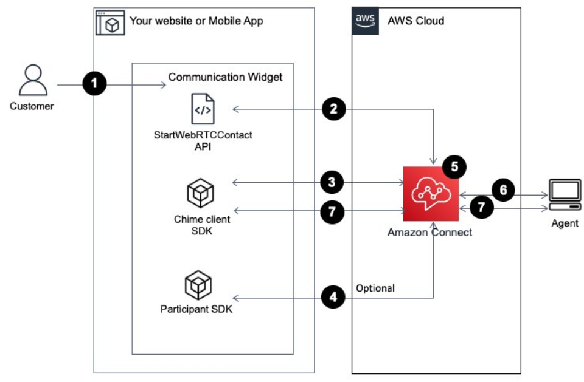

# Integrate in-app, web, video calling, and screen

sharing natively into your application

To integrate Amazon Connect in-app, web, video calling, and screen sharing with your
application:

1. Use the Amazon Connect [StartWebRTCContact](../APIReference/API_StartWebRTCContact.md "../APIReference/API_StartWebRTCContact.md") API to create the contact.
2. Then use the details returned by the API call to join the call using the
   Amazon Chime client library for [iOS](https://github.com/aws/amazon-chime-sdk-ios "https://github.com/aws/amazon-chime-sdk-ios"), [Android](https://github.com/aws/amazon-chime-sdk-android "https://github.com/aws/amazon-chime-sdk-android"), or
   [JavaScript](https://github.com/aws/amazon-chime-sdk-js "https://github.com/aws/amazon-chime-sdk-js").
   For information about creating additional participants, see [Enable multi-user in-app, web, and video
   calling](enable-multiuser-inapp.md "enable-multiuser-inapp.md").

See the following Github repository for sample applications: [amazon-connect-in-app-calling-examples](https://github.com/amazon-connect/amazon-connect-in-app-calling-examples "https://github.com/amazon-connect/amazon-connect-in-app-calling-examples").

###### Contents

- [How a client device initiates an in-app or web
  call](#diagram-option2 "#diagram-option2")
- [Get started](#diagram-option2-gs "#diagram-option2-gs")
- [Optional steps](#optional-steps "#optional-steps")

## How a client device initiates an in-app or web

call

The following diagram shows the sequence of events for a client device (mobile
application or browser) to initiate an in-app or web call.



1. Your customer uses the client application (website or application) to
   start an in-app or web call.
2. The client application (website or mobile application) or web server uses
   the Amazon Connect
   [StartWebRTCContact](../APIReference/API_StartWebRTCContact.md "../APIReference/API_StartWebRTCContact.md") API to start the contact passing any
   attributes or context to Amazon Connect.
3. The client application joins the call using the details returned from the
   [StartWebRTCContact](../APIReference/API_StartWebRTCContact.md "../APIReference/API_StartWebRTCContact.md") in step 2.
4. (Optional) Client uses the [CreateParticipantConnection](../../../connect-participant/latest/APIReference/API_CreateParticipantConnection.md "../../../connect-participant/latest/APIReference/API_CreateParticipantConnection.md") API to receive a
   `ConnectionToken` that is used to send DTMF through the
   [SendMessage](../../../connect-participant/latest/APIReference/API_SendMessage.md "../../../connect-participant/latest/APIReference/API_SendMessage.md") API.
5. The contact reaches the flow and is routed based on the flow and placed in
   queue.
6. The agent accepts the contact.
7. (Optional) If video is enabled for customer and the agent, they are able
   to start their video.
8. (Optional - not shown in diagram) Additional participants can be added
   using the [CreateParticipant](../../../connect-participant/latest/APIReference/API_CreateParticipant.md "../../../connect-participant/latest/APIReference/API_CreateParticipant.md") and [CreateParticipantConnection](../../../connect-participant/latest/APIReference/API_CreateParticipantConnection.md "../../../connect-participant/latest/APIReference/API_CreateParticipantConnection.md") APIs.

## Get started

Following are the high level steps to get started:

1. Use the [StartWebRTCContact](../APIReference/API_StartWebRTCContact.md "../APIReference/API_StartWebRTCContact.md") API to create the contact. The API returns
   the details needed for the Amazon Chime SDK client to join the call.
2. Instantiate the Amazon Chime SDK client `MeetingSessionConfiguration`
   object using the configurations returned by [StartWebRTCContact](../APIReference/API_StartWebRTCContact.md "../APIReference/API_StartWebRTCContact.md").
3. Instantiate Amazon Chime SDK client `DefaultMeetingSession` with
   `MeetingSessionConfiguration`, which was created in step 2 to
   create a client meeting session.
   - iOS

   ```
   let logger = ConsoleLogger(name: "logger")
   let meetingSession = DefaultMeetingSession(
       configuration: meetingSessionConfig,
       logger: logger
   )
   ```

   - Android

   ```
   val logger = ConsoleLogger()
   val meetingSession = DefaultMeetingSession(
       configuration = meetingSessionConfig,
       logger = logger,
       context = applicationContext
   )
   ```

   - JavaScript

   ```
   const logger = new ConsoleLogger('MeetingLogs', LogLevel.INFO);
   const deviceController = new DefaultDeviceController(logger);
   const configuration = new MeetingSessionConfiguration(
       meetingResponse,
       attendeeResponse
   );
   const meetingSession = new DefaultMeetingSession(
       configuration,
       logger,
       deviceController
   );
   ```

4. Use the `meetingSession.audioVideo.start()` method to join the
   WebRTC contact with audio.
   - iOS/Android

   ```
   meetingSession.audioVideo.start()
   ```

   - JavaScript

   ```
   await meetingSession.audioVideo.start();
   ```

5. Use the `meetingSession.audioVideo.stop()` method to hangup the
   WebRTC contact.
   - iOS/Android

   ```
   meetingSession.audioVideo.stop()
   ```

   - JavaScript

   ```
   meetingSession.audioVideo.stop();
   ```

## Optional steps

For additional operations and comprehensive API documentation, refer to the
platform-specific API overview guides:

- **iOS**: [API Overview](https://aws.github.io/amazon-chime-sdk-ios/guides/api_overview.html "https://aws.github.io/amazon-chime-sdk-ios/guides/api_overview.html")
- **Android**: [API Overview](https://aws.github.io/amazon-chime-sdk-android/guides/api_overview.html "https://aws.github.io/amazon-chime-sdk-android/guides/api_overview.html")
- **JavaScript**: [API Overview](https://github.com/aws/amazon-chime-sdk-js/blob/main/guides/03_API_Overview.md "https://github.com/aws/amazon-chime-sdk-js/blob/main/guides/03_API_Overview.md")

### Send DTMF tones

To send DTMF to the call, two Amazon Connect Participant Service APIs are needed:
[CreateParticipantConnection](../../../connect-participant/latest/APIReference/API_CreateParticipantConnection.md "../../../connect-participant/latest/APIReference/API_CreateParticipantConnection.md") and [SendMessage](../../../connect-participant/latest/APIReference/API_SendMessage.md "../../../connect-participant/latest/APIReference/API_SendMessage.md") respectively.

###### Note

`contentType` for the SendMessage API must be
`audio/dtmf`.

1. Invoke [CreateParticipantConnection](../../../connect-participant/latest/APIReference/API_CreateParticipantConnection.md "../../../connect-participant/latest/APIReference/API_CreateParticipantConnection.md") to retrieve
   `ConnectionToken`. (`ParticipantToken` is
   needed for calling this API. You can find it in the [StartWebRTCContact](../APIReference/API_StartWebRTCContact.md "../APIReference/API_StartWebRTCContact.md") response.)
2. With the `ConnectionToken`, call [SendMessage](../../../connect-participant/latest/APIReference/API_SendMessage.md "../../../connect-participant/latest/APIReference/API_SendMessage.md") for sending DTMF digits.

### Select audio devices

To select the audio input/output device, you can use the methods from the
Amazon Chime SDK client for Android and iOS or the [native iOS capabilities](https://developer.apple.com/documentation/avkit/avroutepickerview "https://developer.apple.com/documentation/avkit/avroutepickerview") for iOS.

**iOS/Android**

```
meetingSession.audioVideo.listAudioDevices()
meetingSession.audioVideo.chooseAudioDevice(mediaDevice)
```

**JavaScript**

```
await meetingSession.audioVideo.listAudioInputDevices();
await meetingSession.audioVideo.listAudioOutputDevices();
await meetingSession.audioVideo.startAudioInput(device);
await meetingSession.audioVideo.chooseAudioOutput(deviceId);
```

### Mute and unmute audio

For mute and unmute, use
`meetingSession.audioVideo.realtimeLocalMute()` and
`meetingSession.audioVideo.realtimeLocalUnmute()`.

**iOS/Android**

```
meetingSession.audioVideo.realtimeLocalMute()
meetingSession.audioVideo.realtimeLocalUnmute()
```

**JavaScript**

```
meetingSession.audioVideo.realtimeMuteLocalAudio();
meetingSession.audioVideo.realtimeUnmuteLocalAudio();
```

### Start self video

To start self video, use the
`meetingSession.audioVideo.startLocalVideo()`. See the client
library API guides for more information on how to enumerate and choose specific
devices.

**iOS/Android**

```
meetingSession.audioVideo.startLocalVideo()
```

**JavaScript**

```
meetingSession.audioVideo.startLocalVideoTile();
```

### Stop self video

To stop self video, use the
`meetingSession.audioVideo.stopLocalVideo()`.

**iOS/Android**

```
meetingSession.audioVideo.stopLocalVideo()
```

**JavaScript**

```
meetingSession.audioVideo.stopLocalVideoTile();
```

### Enable agent video

To allow receiving and loading video of the agent inside application, use the
`meetingSession.audioVideo.startRemoteVideo()`. You will also
need to implement video tile observers and bind video tiles to display
views.

**iOS/Android**

```
meetingSession.audioVideo.startRemoteVideo()
// Implement VideoTileObserver to handle video tiles
meetingSession.audioVideo.addVideoTileObserver(observer)
// In videoTileDidAdd callback:
meetingSession.audioVideo.bindVideoView(videoView, tileId: tileState.tileId)
```

**JavaScript**

```
// Remote video is received automatically when available
// Implement AudioVideoObserver to handle video tiles
meetingSession.audioVideo.addObserver(observer);
// In videoTileDidUpdate callback:
meetingSession.audioVideo.bindVideoElement(tileId, videoElement);
```

Reference the platform-specific SDK guides for complete video tile
implementation details.

### Disable agent video

To disallow receiving and loading video of the agent inside application, use
the `meetingSession.audioVideo.stopRemoteVideo()`.

**iOS/Android**

```
meetingSession.audioVideo.stopRemoteVideo()
meetingSession.audioVideo.unbindVideoView(tileId)
```

**JavaScript**

```
meetingSession.audioVideo.unbindVideoElement(tileId);
```

### Use data messages

You can use [data messages](https://github.com/aws/amazon-chime-sdk-js/blob/main/guides/03_API_Overview.md#9-send-and-receive-data-messages-optional "https://github.com/aws/amazon-chime-sdk-js/blob/main/guides/03_API_Overview.md#9-send-and-receive-data-messages-optional") if you need to send any status from the agent side to
the end user. For example, when customers are on hold, you can send a data
message to the customer's application to display a message letting them know
they are on hold and their video/screen sharing is still being sent, or you can
turn off the video/screen share.

**iOS/Android**

```
meetingSession.audioVideo.realtimeSendDataMessage(topic, data, lifetimeMs)
meetingSession.audioVideo.addRealtimeDataMessageObserver(topic, observer)
```

**JavaScript**

```
meetingSession.audioVideo.realtimeSendDataMessage(topic, data, lifetimeMs);
meetingSession.audioVideo.realtimeSubscribeToReceiveDataMessage(topic, callback);
```

### Listen for stop events

You can listen for events when a Contact's participation ends through the
`audioVideoDidStop` observer. Specific status codes may vary by
platform.

#### Call reaches capacity

When more than 6 people attempt to join the call, additional participants
will receive the following error and cannot join until others leave.

- **iOS:**
  `MeetingSessionStatusCode.audioCallAtCapacity` or
  `MeetingSessionStatusCode.audioAuthenticationRejected`
- **Android:**
  `MeetingSessionStatusCode.AudioCallAtCapacity` or
  `MeetingSessionStatusCode.AudioAuthenticationRejected`
- **JavaScript:**
  `MeetingSessionStatusCode.AudioCallAtCapacity` or
  `MeetingSessionStatusCode.AudioAuthenticationRejected`

#### Participant removed from

call

When a participant is removed from the call by the agent but the contact
continues for other participants they will receive the following status
code. Note that if the participant removal leads to the contact ending, they
will receive either of this status or the contact end status.

- **iOS:**
  `MeetingSessionStatusCode.audioServerHungup` or
  `MeetingSessionStatusCode.audioAuthenticationRejected`
- **Android:**
  `MeetingSessionStatusCode.AudioServerHungup` or
  `MeetingSessionStatusCode.AudioAuthenticationRejected`
- **JavaScript:**
  `MeetingSessionStatusCode.AudioAttendeeRemoved` or
  `MeetingSessionStatusCode.AudioAuthenticationRejected`

#### Contact ends

When the actual contact ends completely for all participants they will
receive the following status code.

- **iOS:**
  `MeetingSessionStatusCode.audioCallEnded`
- **Android:**
  `MeetingSessionStatusCode.AudioCallEnded`
- **JavaScript:**
  `MeetingSessionStatusCode.AudioCallEnded`
