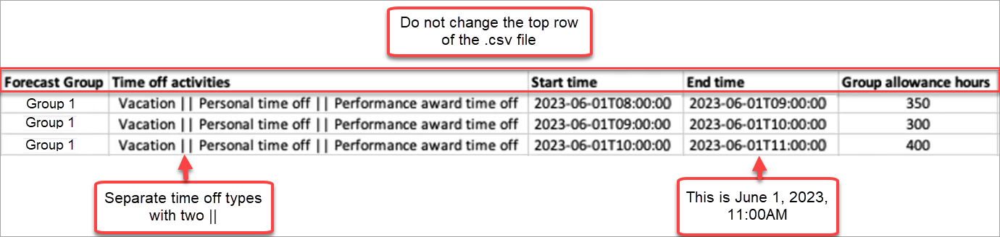
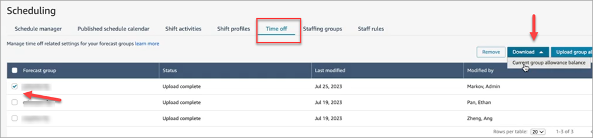
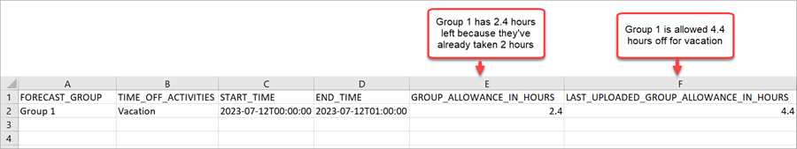

# Set group allowance for time off in

Amazon Connect

Managers can set the maximum time off hours that agents combined can take within
the Forecast Group: by hour, for each calendar day, for specific time off
activities.

You use a .cvs file to quickly specify time off allowances at a hourly level, for
up to 27 months. For example, you might specify Vacation, Personal time off, Casual,
and other time off types that you specified when you [created shift activities](scheduling-create-shift-activities.md "scheduling-create-shift-activities.md").

###### Tip

**IT admins**: For the endpoints to add to your
proxy exception list for this feature, see [Allow upload of time-off balances and allowances
in Amazon Connect scheduling](ccp-networking.md#endpoints-scheduling "ccp-networking.md#endpoints-scheduling").

###### Contents

- [Download the time off csv
  template](#timeoff-csv-template "#timeoff-csv-template")
- [Download time off for a
  forecast group](#download-timeoff-csv "#download-timeoff-csv")
- [Import group allowance .csv
  file](#upload-timeoff-csv "#upload-timeoff-csv")
- [Example of using the time off
  allowances feature](#example-to-feature "#example-to-feature")

## Download the time off .csv

template

1. On the **Scheduling** page, choose the **Time
   off** tab.
2. On the **Download** dropdown menu, choose
   **Download template**.

The following image shows an example .csv template that contains valid
data.

 3. When you add your time off data to the template, note the
following:

    * Do not change the top row of the .csv file template.
    * In the **Time off activities** column,
     separate multiple activities with two pipes
     **||**.
    * The **Start time** and **End
     time** must have a one-hour duration and set as
     multiples of 15 minutes. If they do not meet these criteria, the
     validation will fail when you attempt to upload your .csv file.
     The example below shows the error message that you might
     encounter:

    `Column START_TIME value [2023-08-15T05:01:00] is not a
     multiple of 15 minutes from top of the hour, such as HH:00,
     HH:15, HH:30 and HH:45`

## Download time off for a forecast

group

1. On the **Scheduling** page, choose the **Time
   off** tab.
2. Choose one or more forecast groups that you want in the download csv
   file.
3. On the **Download** dropdown menu, choose
   **Current group allowance balance**, as shown in
   the following image.

The .csv file includes the data that was last uploaded to Amazon Connect. For
example, the following image shows the download time off allowance .csv
file.

    * **LAST\_UPLOADED\_GROUP\_ALLOWANCE\_IN\_HOURS**:
     The last upload for Group 1 was 4.4 hours of vacation.
    * **GROUP\_ALLOWANCE\_IN\_HOURS** shows they have
     2.4 hours remaining in their allowance, they've already used 2
     hours.

## Import group allowance .csv file

When you upload a .csv file that contains the time off allowance for a
forecast group, it overwrites data already in Amazon Connect. For example, if you have
100 agents, and a supervisor uploads data for 20 agents, the data for those 20
agents is overwritten.

For the maximum file size that you can upload, see _File size per
upload of time off group allowance data_ in [Forecasting, capacity
planning, and scheduling feature specifications](feature-limits.md#forecasting-cap-planning-scheduling-specs "feature-limits.md#forecasting-cap-planning-scheduling-specs").

1. On the **Scheduling** page, choose the **Time
   off** tab.
2. Choose the Forecast group the group allowance applies to, and then
   choose **Upload group allowance**. Amazon Connect does the
   following:
   - Validates the data and provides details if there are
     errors.
   - Prompts you for confirmation that you want to upload the
     data.
   - Uploads the file and displays a confirmation message when
     complete.

## Example of using the time off allowances

feature

For example, your business provides time off in December. Here's how you might
use the time off allowances feature:

- Managers can allow a group of agents to take _casual
  leave_ and _regular P.T.O_ that add up
  to a maximum of 12 hours on December 20th, from 9AM to 9PM.
- They can automatically decline those types of time off requests on
  December 22nd by giving a value of `0` - Zero hours.
- Adding value `0` allows them to specify blocked days. Amazon Connect
  ignores a group allowance check if no value is specified.

This allows the workforce managers to balance an agent's personal time off
needs with business headcount needs.
