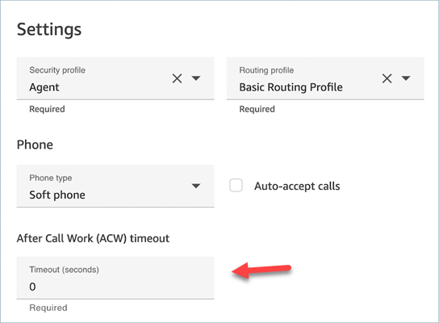
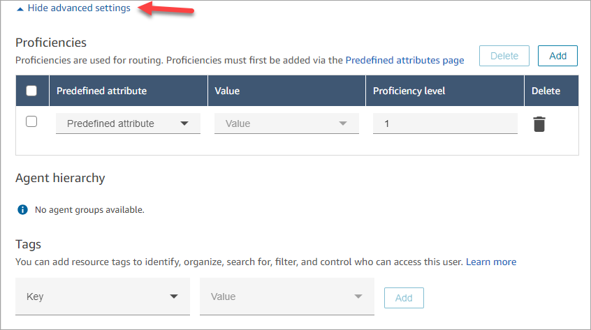

# Configure the agent's profiles and task settings in

Amazon Connect

Before you configure your agent settings, here is some info to have on hand. Of
course, you can always change this information later.

- What is their routing profile? They can only be assigned one.
- Will they have the **Agent** security profile or a custom
  profile you created?
- Are they going to use a soft phone? If so, will they be connected to contacts
  automatically, or will they need to press the **Accept** button
  in their Contact Control Panel (CCP)?
- Or, are they going to use a desk phone? If so, what is their number?
- How many seconds do they have for After contact work (ACW)? There's no way you
  can turn off ACW time altogether so agents never go to ACW. (A value of
  **0** means an indefinite amount of time.)
- Are they going to be assigned to an agent hierarchy?

###### Note

You can't configure how long an available agent has to connect with a contact
before it's missed. Agents have 20 seconds to accept or reject a voice or chat
contact, and 30 seconds for a task contact If no action is taken, the current
agent's status will be **Missed** and the contact is routed to the
next available agent.

###### To configure agent settings

1.  On the left navigation menu, go to **Users, User
    management**.
2.  Choose the user you want to configure, then choose
    **Edit**.
3.  Assign a [routing profile](routing-profiles.md "routing-profiles.md") to them. You
    can only assign one.
4.  Assign the **Agent** security profile, unless you've created
    custom security profiles.
5.  Under **Phone Type** choose whether the agent is using a desk
    phone or soft phone.
    - If you select **Desk phone**, enter their phone
      number.

    ###### Important

    Outbound telephony charges occur when using a desk phone to answer
    inbound calls.
    - If you select **Soft phone**, we recommend choosing
      the following options:

    

        + **Auto-Accept Call**: This enables agents to
         be connected to calls automatically. This doesn't apply to chats
         or tasks. For more information, see [Enable auto-accept call](enable-auto-accept.md "enable-auto-accept.md")
        + **Enable persistent connection**: This
         maintains agent connection after a call ends. It enables
         subsequent calls to connect faster. This doesn't apply to chats
         or tasks. For more information, see [Enable persistent
         connection](enable-persistent-connection.md "enable-persistent-connection.md").

6.  In **After call work (ACW) timeout**, type how many seconds
    agents have for after contact work, such as entering notes about the contact.

        * Minimum setting is 1 second.
        * Maximum setting is 2,000,000 seconds (24 days).
        * Enter **0** if you don't want to allocate a specific
         amount of ACW time. It essentially means an indefinite amount of time.
         When the conversation ends, ACW starts; the agent must choose
         **Close contact** to end ACW.

    The following image shows the **Settings** section of the
    **Edit routing profile** page. **After call work
    (ACW) timeout** set to 0.

 7. If desired, choose **Hide advanced settings** to access the
following additional properties.

 8. See the following topics:

    * [Assign proficiencies to agents in your
     Amazon Connect instance](assign-proficiencies-to-agents.md "assign-proficiencies-to-agents.md")
    * [Organize agents into teams and groups for reporting
     and access by creating hierarchies](agent-hierarchy.md "agent-hierarchy.md")

9. Under **Tags**, optionally add resource [tags](tagging.md "tagging.md") to identify, organize, search for, filter and
   control who can access this user.
