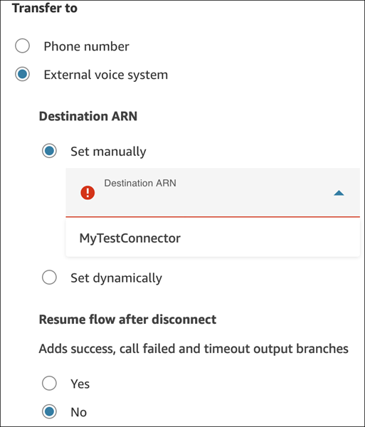
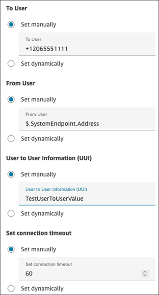
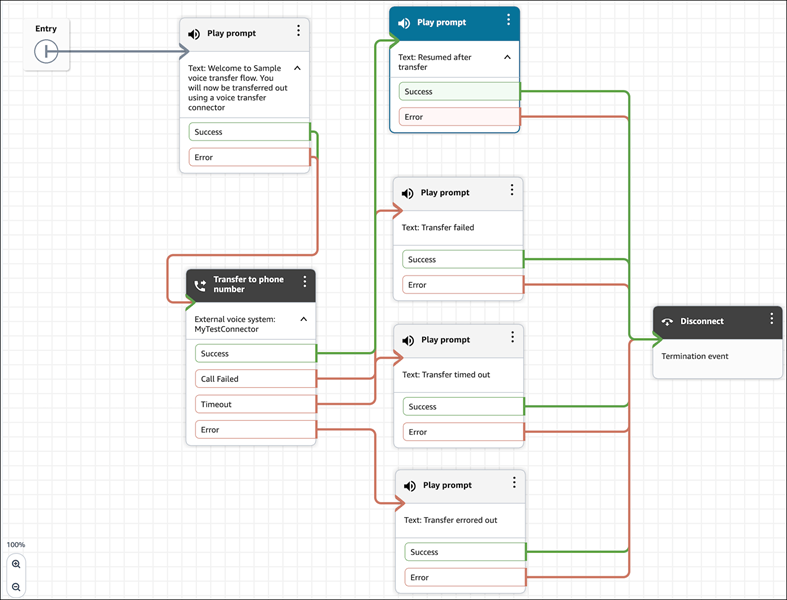
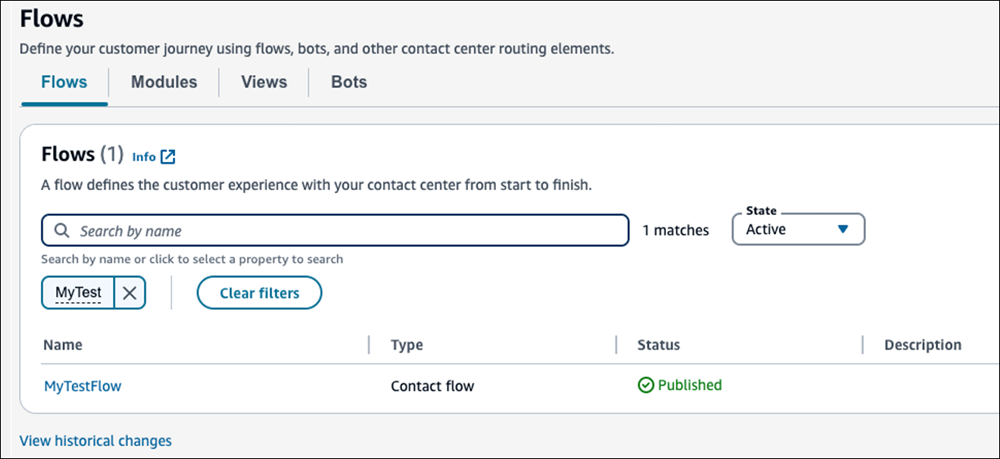

# Configure a flow to route calls

from Amazon Connect to your external enterprise voice system

###### Note

Before you do this step, you need to [claim](get-connect-number.md "get-connect-number.md") a phone number in Amazon Connect or [port](port-phone-number.md "port-phone-number.md") an existing number. For testing purposes, we recommend that you
claim a number.

Complete the following steps to create a flow that processes and routes a call from
your Amazon Connect instance to your enterprise voice system. Then you'll associate the flow with
a phone number.

1. Log in to the Amazon Connect admin website at https://`instance name`.my.connect.aws/.
2. On the navigation menu, choose **Routing**,
   **Flows**, **Create flow**, and then type
   a name for the flow.
3. Drag and drop the [Transfer to phone
   number](transfer-to-phone-number.md "transfer-to-phone-number.md") block to the flow
   designer.
4. Double-click the title of the block to open its properties page. On the
   properties page, configure the following settings, and then choose
   **Save** to close the pane.

**Transfer To** - **External voice
system**

    * **Destination ARN**: Use the dropdown list to select
     the voice transfer integration connector you created earlier. This
     connector can be set statically or dynamically.

    
    * **Resume flow after disconnect**: Choose
     **Yes** to configure steps post call disconnect.
     Choose **No** to end the flow after call
     disconnect.
    * **To User**: The user who receives the call. This can
     be a phone number, extension, name, etc., that is communicated in the
     SIP INVITE as the user portion of Request-URI / To address. The user can
     be set statically or dynamically.

    
    * **From User**: The user who makes the call. The user
     can be set statically or dynamically. For example, you can use the
     number the customer dialed to call your contact center by using the
     `$.SystemEndpoint.Address` attribute.
    * **User to User Information (UUI)**: SIP UUI as
     specified in RFC 7433. Provides the ability to relay information between
     systems. For example, you can authenticate a caller in Amazon Connect and send
     their customer identifier by using UUI to your external voice system.
     This preserves contextual information. UUI is a string value that is
     encoded using hex. It can be set statically or dynamically.
    * **Set connection timeout**: An integer between 1 and
     600 (inclusive). It represents the number of seconds to wait for the
     answer before canceling the call.

5. Tailor the flow to your specific requirements and then publish it. The
   following image shows an example flow that includes a [Transfer to phone
   number](transfer-to-phone-number.md "transfer-to-phone-number.md") configured for external
   voice transfer.

 6. After the flow is successfully published, it appears on the
**Flows** page, as shown in the following image.

 7. On the navigation menu, choose **Channels**, **Phone
numbers**. 8. On the **Edit Phone number** page, do the following:

    1. (Optional) Edit the description for the phone number.
    2. For **Flow / IVR**, select the flow. Note that only
     published flows are included in this list.
    3. Choose **Save**.

9. Verify the flow steps and subsequent call transfer to the enterprise voice
   system by making a test call to the provided phone number.
