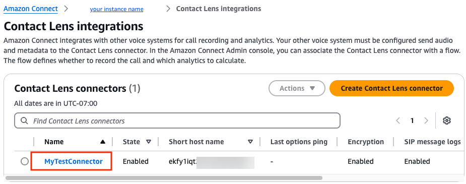
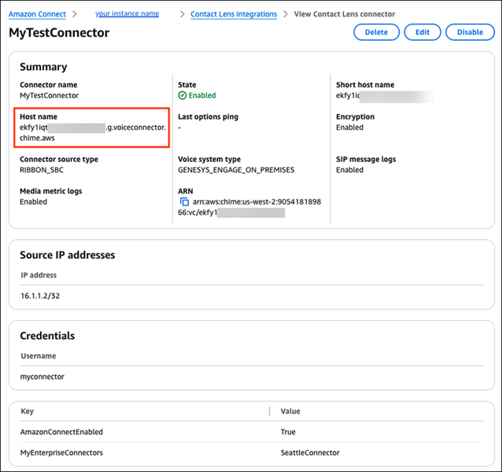
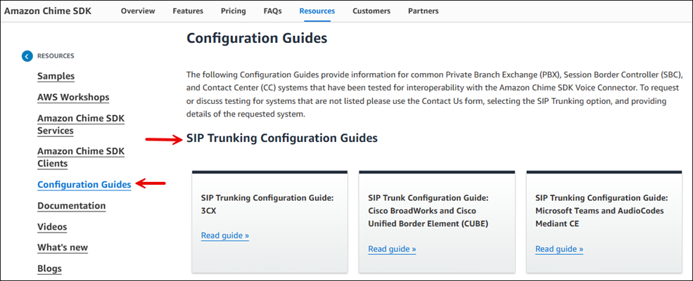

# Configure your external voice system

for integration with Contact Lens

After you [create a Contact Lens
connector](create-contact-lens-connector.md "create-contact-lens-connector.md") you need to configure your external voice system to point to the
connector. Complete the following steps.

1. In the Amazon Connect console navigation pane, choose **External voice
   systems**, **Contact Lens integrations**.
   You'll see the name of available Contact Lens connectors. Select the one
   you want to use. The following image shows an example Contact Lens
   connector named **MyTestConnector**.

 2. On the connector details page, note the fully qualified host name. This is the
name of the host in Amazon Connect that will receive the SIPREC audio. The following
image shows an example fully qualified host name.

 3. For information about how to configure your external source system, go to the
[Amazon Chime SDK resources](https://aws.amazon.com/chime/chime-sdk/resources/?whats-new-chime-sdk.sort-by=item.additionalFields.postDateTime&whats-new-chime-sdk.sort-order=desc "https://aws.amazon.com/chime/chime-sdk/resources/?whats-new-chime-sdk.sort-by=item.additionalFields.postDateTime&whats-new-chime-sdk.sort-order=desc") page, and choose **Configuration
Guides**. Scroll down the page to **SIPREC/NBR
Configuration Guides**, as shown in the following image.

###### Note

If you created credentials for the connector, you need to use the same
credentials for your external system. 4. After you configure your external source system, continue to the next step:
[enable Contact Lens
integration](enable-contactlens-integration.md "enable-contactlens-integration.md").
