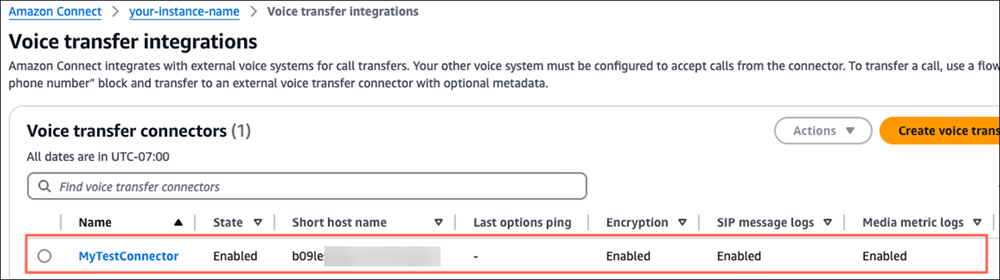
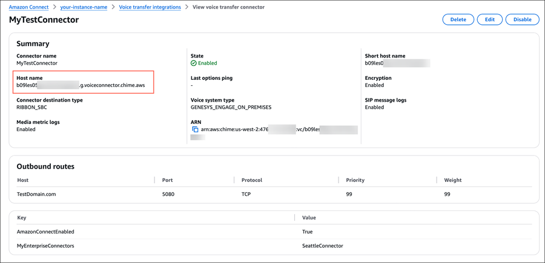

# Configure your external on-premise

voice system

After you have created a voice transfer connector, you need to configure your
on-premise voice system so the voice transfer connector can communicate with it. To
configure your on-premise voice system you will need to provide the following
information:

- Voice transfer connector hostname.

To get the voice transfer connector host name, in the Amazon Connect console navigation
pane, choose **External voice systems**, **Voice
transfer integrations**. Select the one you want to use. The
following image shows an example connector named
**MyTestConnector**.

- On the connector details page, note the fully qualified host name. This is the
  name of the host that is transferring voice to your enterprise voice system.
  When you configured your enterprise voice system, you'll need to provide this
  host name.

- To configure your enterprise voice system, go to the [Amazon Chime SDK resources](https://aws.amazon.com/chime/chime-sdk/resources/?whats-new-chime-sdk.sort-by=item.additionalFields.postDateTime&whats-new-chime-sdk.sort-order=desc "https://aws.amazon.com/chime/chime-sdk/resources/?whats-new-chime-sdk.sort-by=item.additionalFields.postDateTime&whats-new-chime-sdk.sort-order=desc") page, and choose **Configuration
  Guides**. Scroll down the page to **SIP Trunking
  Configuration Guides**, as shown in the following image.

- After you configure your enterprise voice system, continue to the next step:
  [Configure a flow to route calls
  from Amazon Connect to your external enterprise voice system](configure-external-voice-system-flow1.md "configure-external-voice-system-flow1.md").
