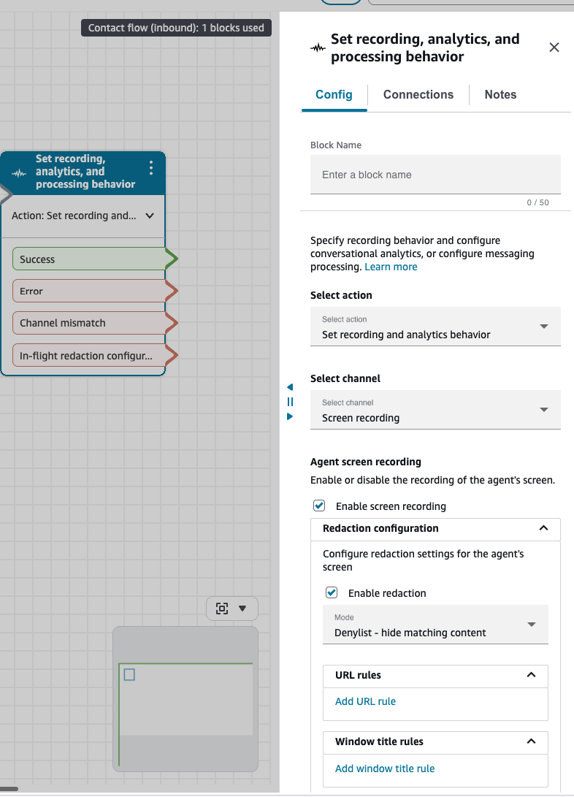

# Configure rule-based redaction in a contact flow

You configure rule-based redaction directly in the **Set recording, analytics,
and processing behavior** flow block. The block contains the redaction mode
(allowlist or denylist), the URL rules, and the window title rules that apply to contacts
routed through the flow. Because the configuration lives in the flow, you can apply
different redaction behavior to different contacts based on queue, contact attributes, or
any other flow logic.

For an overview of how rule-based redaction works, see [Rule-based redaction
for screen recordings](rule-based-redaction-screen-recording.md "rule-based-redaction-screen-recording.md").

###### Contents

- [Prerequisites](#configure-redaction-prerequisites "#configure-redaction-prerequisites")
- [Configure rule-based redaction in a flow block](#configure-redaction-flow-block "#configure-redaction-flow-block")
- [Rule syntax](#redaction-rule-syntax "#redaction-rule-syntax")
- [Example configurations](#redaction-example-configurations "#redaction-example-configurations")
- [Reuse a configuration across multiple flows](#reuse-redaction-configuration "#reuse-redaction-configuration")
- [Update or remove rule-based redaction](#update-remove-redaction "#update-remove-redaction")

## Prerequisites

Before you configure rule-based redaction, complete the following.

- Enable agent screen recording on your Connect Customer instance. See [Enable screen recording](enable-sr.md "enable-sr.md").
- Confirm that agent workstations meet the requirements for rule-based
  redaction. See [System and network
  requirements](sr-system-req.md "sr-system-req.md").
- Install or update the Connect Customer Client Application to version 3.0.2 or later. See [Connect Customer Client Application](amazon-connect-client-app.md "amazon-connect-client-app.md").
- Deploy the Connect Customer browser extension to every browser that agents use during
  recorded contacts. See [Deploy the browser
  extension](deploy-browser-extension.md "deploy-browser-extension.md").

## Configure rule-based redaction in a flow block

1. Open the Connect Customer admin website. On the navigation menu, choose
   **Routing**, then **Flows**.
2. Open the contact flow in which you want to apply redaction. The flow must
   run before the contact is routed to an agent.
3. Add a **Set recording, analytics, and processing behavior**
   block to the flow. For general information about this block, see [Set recording and analytics
   behavior](set-recording-behavior.md "set-recording-behavior.md").
4. Open the block. On the **Config** tab:

   - For **Select action**, choose **Set
     recording and analytics behavior**.
   - For **Select channel**, choose **Screen
     recording**.

5. Under **Agent screen recording**, select **Enable
   screen recording**.
6. Expand **Redaction configuration** and select
   **Enable redaction**.
7. For **Mode**, choose one of the following.

   - **Allowlist - show matching content**
     – Only content that matches a rule remains visible in the final
     recording; all other browser and application windows are
     masked.
   - **Denylist - hide matching content**
     – Only content that matches a rule is masked in the final
     recording; all other content remains visible.

8. (Optional) Under **URL rules**, add rules to match browser
   pages. For each rule:

   - For **Comparison type**, choose a comparison
     type.
   - For **URL rule**, enter the pattern to match
     against.
   - To add another URL rule, choose **Add URL
     rule**.

9. (Optional) Under **Window title rules**, add rules to match
   native application windows. For each rule:

   - For **Comparison type**, choose a comparison
     type.
   - For **Window title rule**, enter the pattern to
     match against.
   - To add another window title rule, choose **Add window title
     rule**.

10. Save and publish the flow.

###### Important

Rule-based redaction supports configurations with no URL or window title
rules.

- An empty **Denylist** masks no browser or application
  windows.
- An empty **Allowlist** masks all browser and application
  windows.
  To preserve screen content and use redacted call audio, select
  **Denylist** and leave both rule lists empty. Enable conversational analytics
  call recording redaction for the contact. The resulting redacted screen
  recording preserves screen content and uses redacted audio. Without conversational analytics call
  recording redaction, the redacted screen recording has no audio.

You can add rules of either type, or both types, in the same block. The
configuration applies to every contact that is routed through the flow until you
change it.

## Rule syntax

A flow block supports two types of rules.

| Rule type         | Matches against                                                                                                                                                                   |
| ----------------- | --------------------------------------------------------------------------------------------------------------------------------------------------------------------------------- |
| URL rule          | The URL displayed in the address bar of a browser window. Requires the Connect Customer browser extension. Supported on Google Chrome, Microsoft Edge, and Mozilla Firefox. |
| Window title rule | The window title of a native application on the agent's workstation, such as a desktop application or a browser that is not otherwise supported for URL matching.           |

Each rule has a comparison type and a pattern value.

| Condition   | Matches when                                                     |
| ----------- | ---------------------------------------------------------------- |
| Begins with | The URL or window title starts with the pattern.                 |
| Contains    | The URL or window title contains the pattern at any position. |
| Exact       | The URL or window title is identical to the pattern.             |

A flow block supports up to 100 URL and window title rules. Each pattern is 1 to 128
characters.

###### Note

URL rules match on the scheme, host, and path of the address. Query parameters
(the part after `?`) and fragments (the part after `#`) are
ignored during matching, so define rules using only the domain and path. This
keeps redaction tied to the page itself, since those values can vary while the
page stays the same.

For example, both of the following addresses resolve to the same page:

- Recommended:
  `https://aws.amazon.com/events/reinvent/`
- Avoid:
  `https://aws.amazon.com/events/reinvent/?nc2=h_dsc_ex_s1&trk=dc9b9d60-cc82-4cd5-8a61-0b33d6a79fab&sc_channel=ps`
  Use the shorter form, since any query parameters or fragments in a rule are
  ignored when it is evaluated.

## Example configurations

### Example 1: Redact a payment page and a legacy desktop application

To redact the payment entry page on an internal CRM and the window of a legacy
billing application:

- Mode: **Denylist - hide matching content**
- URL rules:

  - Comparison type: **Begins with**, URL rule:
    `https://crm.example.com/contacts/`
  - Comparison type: **Contains**, URL rule:
    `/payment`

- Window title rules:

  - Comparison type: **Contains**, Window title
    rule: `Legacy Billing App`

### Example 2: Allow only approved work applications

To hide everything except a small set of approved applications and
websites:

- Mode: **Allowlist - show matching content**
- URL rules:

  - Comparison type: **Begins with**, URL rule:
    `https://connect.example.com/`
  - Comparison type: **Begins with**, URL rule:
    `https://crm.example.com/`
  - Comparison type: **Begins with**, URL rule:
    `https://knowledge.example.com/`

- Window title rules:

  - Comparison type: **Contains**, Window title
    rule: `Amazon Connect Client`
  - Comparison type: **Contains**, Window title
    rule: `Company CRM`

### Example 3: Apply different redaction behavior based on queue

To apply different rule sets to contacts based on the queue they are routed to,
branch your flow before each **Set recording, analytics, and processing
behavior** block. Each branch can configure the block with a
different mode and rule set. For information about branching in flows, see [Connect Customer
flows](concepts-contact-flows.md "concepts-contact-flows.md").

## Reuse a configuration across multiple flows

If you want the same redaction rules to apply across several flows, put the
configured **Set recording, analytics, and processing behavior**
block inside a flow module and invoke the module from each parent flow. Flow modules
let you share a reusable piece of flow logic, including block configurations, across
multiple flows without manually copying the rules into each one. When you update the
rules in the flow module, every parent flow that invokes it picks up the
change.

For information about creating and invoking flow modules, see [Create reusable flow modules](contact-flow-modules.md "contact-flow-modules.md").

## Update or remove rule-based redaction

To change the redaction rules, mode, or behavior for a flow, edit the **Set
recording, analytics, and processing behavior** block in the flow and
save the flow. To stop applying redaction in the flow, clear **Enable
redaction** in the **Redaction configuration**
panel.

Changes take effect for contacts that start running through the flow after you save
it. Contacts that are already in progress continue to use the configuration that was
in effect when they started.
