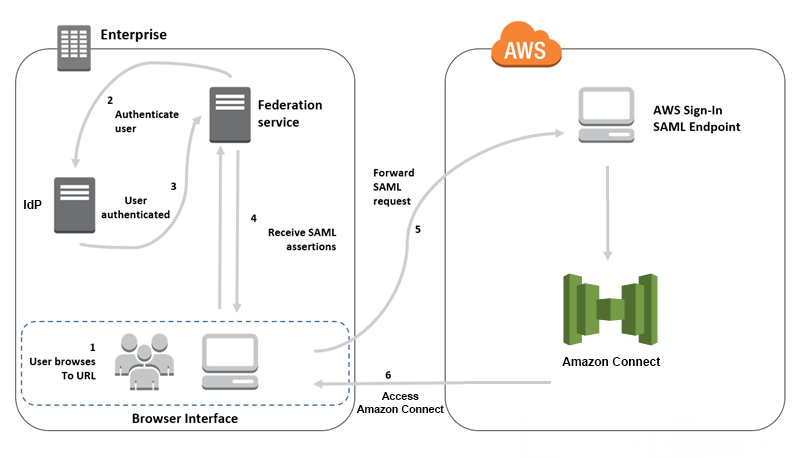
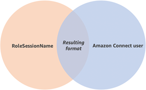
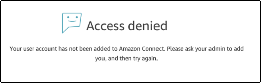

# Configure SAML with IAM for Amazon Connect

Amazon Connect supports identity federation by configuring Security Assertion Markup Language
(SAML) 2.0 with AWS IAM to enable web-based single sign-on (SSO) from your organization to
your Amazon Connect instance. This allows your users to sign in to a portal in your organization
hosted by a SAML 2.0 compatible identity provider (IdP) and log in to an Amazon Connect instance with
a single sign-on experience without having to provide separate credentials for Amazon Connect.

## Important notes

Before you begin, note the following:

- These instructions do not apply to Amazon Connect Global Resiliency deployments. For
  information that applies to Amazon Connect Global Resiliency, see [Integrate your identity provider (IdP) with an
  Amazon Connect Global Resiliency SAML sign in endpoint](integrate-idp.md "integrate-idp.md").
- Choosing SAML 2.0-based authentication as the identity management method for
  your Amazon Connect instance requires the configuration of [AWS Identity and Access Management
  federation](../../../IAM/latest/UserGuide/id_roles_providers_enable-console-saml.md "../../../IAM/latest/UserGuide/id_roles_providers_enable-console-saml.md").
- The user name in Amazon Connect must match the RoleSessionName SAML attribute specified
  in the SAML response returned by the identity provider.
- Amazon Connect does not support reverse federation. That is, you can't
  login directly into Amazon Connect. If you tried, you'd get a
  _Session Expired_ message. The authentication should be
  done from the Identity Provider (IdP) and not the Service Provider (SP) (Amazon Connect).
- Most identity providers by default use the global AWS sign-in endpoint as
  the Application Consumer Service (ACS), which is hosted in US East (N. Virginia).
  We recommend overriding this value to use the regional endpoint that matches the
  AWS Region where your instance was created.
- All Amazon Connect usernames are case sensitive, even when using
  SAML.
- If you have old Amazon Connect instances that were set up with SAML and you need to
  update your Amazon Connect domain, see [Personal settings](update-your-connect-domain.md#new-domain-settings "update-your-connect-domain.md#new-domain-settings").

## Overview of using SAML with Amazon Connect

The following diagram shows the order in which steps take place for SAML requests to
authenticate users and federate with Amazon Connect. It is not a flow diagram for a threat model.



SAML requests go through the following
steps:

1. The user browses to an internal portal that includes a link to log in to
   Amazon Connect. The link is defined in the identity provider.
2. The federation service requests authentication from the organization's
   identity store.
3. The identity store authenticates the user and returns the authentication
   response to the federation service.
4. When authentication is successful, the federation service posts the SAML
   assertion to the user's browser.
5. The user's browser posts the SAML assertion to the AWS sign in SAML endpoint
   (https://signin.aws.amazon.com/saml). AWS sign in receives the SAML request,
   processes the request, authenticates the user, and initiates a browser redirect
   to the Amazon Connect endpoint with the authentication token.
6. Using the authentication token from AWS, Amazon Connect authorizes the user and opens
   Amazon Connect in their browser.

## Enabling SAML-based authentication for Amazon Connect

The following steps are required to enable and configure SAML authentication for use
with your Amazon Connect instance:

1. Create an Amazon Connect instance and select SAML 2.0-based authentication for identity
   management.
2. Enable SAML federation between your identity provider and AWS.
3. Add Amazon Connect users to your Amazon Connect instance. Log in to your instance using the
   administrator account created when you created your instance. Go to the
   **User Management** page and add users.

###### Important

    * **For a list of allowed characters in user
     names**, see the documentation for the
     `Username` property in the [CreateUser](../APIReference/API_CreateUser.md "../APIReference/API_CreateUser.md") action.
    * Due to the association of an Amazon Connect user and an AWS IAM Role,
     the user name must match exactly the RoleSessionName as configured
     with your AWS IAM federation integration, which typically ends up
     being the user name in your directory. The format of the username
     should match the intersection of the format conditions of the [RoleSessionName](../../../STS/latest/APIReference/API_AssumeRole.md "../../../STS/latest/APIReference/API_AssumeRole.md")
     and an [Amazon Connect user](../APIReference/API_CreateUser.md#connect-CreateUser-request-DirectoryUserId "../APIReference/API_CreateUser.md#connect-CreateUser-request-DirectoryUserId"), as shown in the following diagram:


    

4. Configure your identity provider for the SAML assertions, authentication
   response, and relay state. Users log in to your identity provider. When
   successful, they are redirected to your Amazon Connect instance. The IAM role is used to
   federate with AWS, which allows access to Amazon Connect.

## Select SAML 2.0-based authentication during

instance creation

When you are creating your Amazon Connect instance, select the SAML 2.0-based authentication
option for identity management. On the second step, when you create the administrator
for the instance, the user name that you specify must exactly match a user name in your
existing network directory. There is no option to specify a password for the
administrator because passwords are managed through your existing directory. The
administrator is created in Amazon Connect and assigned the **Admin** security
profile.

You can log in to your Amazon Connect instance, through your IdP, using the administrator
account to add additional users.

## Enable SAML federation between your identity

provider and AWS

To enable SAML-based authentication for Amazon Connect, you must create an identity provider in
the IAM console. For more information, see [Enabling SAML 2.0
Federated Users to Access the AWS Management Console](../../../IAM/latest/UserGuide/id_roles_providers_enable-console-saml.md "../../../IAM/latest/UserGuide/id_roles_providers_enable-console-saml.md").

The process to create an identity provider for AWS is the same for Amazon Connect. Step 6 in
the above flow diagram shows the client is sent to your Amazon Connect instance instead of the
AWS Management Console.

The steps necessary to enable SAML federation with AWS include:

1. Create a SAML provider in AWS. For more information, see [Creating SAML
   Identity Providers](../../../IAM/latest/UserGuide/id_roles_providers_create_saml.md "../../../IAM/latest/UserGuide/id_roles_providers_create_saml.md").
2. Create an IAM role for SAML 2.0 federation with the AWS Management Console. Create only
   one role for federation (only one role is needed and used for federation). The
   IAM role determines which permissions the users that log in through your
   identity provider have in AWS. In this case, the permissions are for accessing
   Amazon Connect. You can control the permissions to features of Amazon Connect by using security
   profiles in Amazon Connect. For more information, see [Creating a Role for
   SAML 2.0 Federation (Console)](../../../IAM/latest/UserGuide/id_roles_create_for-idp_saml.md "../../../IAM/latest/UserGuide/id_roles_create_for-idp_saml.md").

In step 5, choose **Allow programmatic and AWS Management Console
access**. Create the trust policy described in the topic in the
procedure _To prepare to create a role for SAML 2.0
federation_. Then create a policy to assign permissions to your
Amazon Connect instance. Permissions start on step 9 of the _To create a role
for SAML-based federation_ procedure.

###### To create a policy for assigning permissions to the IAM role for SAML

federation

    1. On
     the **Attach permissions policy**
     page, choose **Create policy**.
    2. On the **Create policy** page, choose
     **JSON**.
    3. Copy one of the following example policies and paste it into the JSON
     policy editor, replacing any existing text. You can use either policy to
     enable SAML federation, or customize them for your specific
     requirements.


    Use this policy to enable federation for all users in a specific Amazon Connect
     instance. For SAML-based authentication, replace the value for the
     `Resource` to the ARN for the instance that you
     created:


    JSON


    ```
    `{
     "Version":"2012-10-17",
     "Statement": [
     {
     "Sid": "Statement1",
     "Effect": "Allow",
     "Action": "connect:GetFederationToken",
     "Resource": [
     "arn:aws:connect:us-east-1:361814831152:instance/2fb42df9-78a2-2e74-d572-c8af67ed289b/user/${aws:userid}"
     ]
     }
     ]
    }`

    ```


    Use this policy to enable federation to a specific Amazon Connect instances.
     Replace the value for the `connect:InstanceId` to the
     instance ID for your instance.


    JSON


    ```
    `{
     "Version":"2012-10-17",
     "Statement": [
     {
     "Sid": "Statement2",
     "Effect": "Allow",
     "Action": "connect:GetFederationToken",
     "Resource": "*",
     "Condition": {
     "StringEquals": {
     "connect:InstanceId": "2fb42df9-78a2-2e74-d572-c8af67ed289b"
     }
     }
     }
     ]
    }`

    ```


    Use this policy to enable federation for multiple instances. Note the
     brackets around the listed instance IDs.


    JSON


    ```
    `{
     "Version":"2012-10-17",
     "Statement": [
     {
     "Sid": "Statement2",
     "Effect": "Allow",
     "Action": "connect:GetFederationToken",
     "Resource": "*",
     "Condition": {
     "StringEquals": {
     "connect:InstanceId": [
     "2fb42df9-78a2-2e74-d572-c8af67ed289b",
     "1234567-78a2-2e74-d572-c8af67ed289b"]
     }
     }
     }
     ]
    }`

    ```
    4. After you create the policy, choose **Next: Review**.
     Then return to step 10 in the *To create a role for SAML-based
     federation* procedure in the [Creating a
     Role for SAML 2.0 Federation (Console)](../../../IAM/latest/UserGuide/id_roles_create_for-idp_saml.md "../../../IAM/latest/UserGuide/id_roles_create_for-idp_saml.md") topic.

3. Configure your network as a SAML provider for AWS. For more information, see
   [Enabling SAML 2.0 Federated Users to Access the AWS Management
   Console](../../../IAM/latest/UserGuide/id_roles_providers_enable-console-saml.md "../../../IAM/latest/UserGuide/id_roles_providers_enable-console-saml.md").
4. Configure SAML Assertions for the Authentication Response. For more
   information, [Configuring SAML Assertions for the Authentication Response](../../../IAM/latest/UserGuide/id_roles_providers_create_saml_assertions.md "../../../IAM/latest/UserGuide/id_roles_providers_create_saml_assertions.md").
5. For Amazon Connect, leave the **Application Start URL** blank.
6. Override the Application Consumer Service (ACS) URL in your identity provider
   to use the regional endpoint that coincides with the AWS Region of your Amazon Connect
   instance. For more information, see [Configure the identity provider to use
   regional SAML endpoints](#regionally-isolated-saml "#regionally-isolated-saml").
7. Configure the relay state of your identity provider to point to your Amazon Connect
   instance. The URL to use for the relay state is comprised as follows:

`https://`region-id`.console.aws.amazon.com/connect/federate/`instance-id``

Replace the `region-id` with the Region name where
you created your Amazon Connect instance, such as us-east-1 for US East (N. Virginia).
Replace the `instance-id` with the instance ID for your
instance.

For a GovCloud instance, the URL is
**https://console.amazonaws-us-gov.com/**:

    * https://console.amazonaws-us-gov.com/connect/federate/instance-id

###### Note

You can find the instance ID for your instance by choosing the instance
alias in the Amazon Connect console. The instance ID is the set of numbers and
letters after '/instance' in the **Instance ARN** displayed
on the **Overview** page. For example, the instance ID in
the following Instance ARN is
_178c75e4-b3de-4839-a6aa-e321ab3f3770_.

arn:aws:connect:us-east-1:450725743157:instance/_178c75e4-b3de-4839-a6aa-e321ab3f3770_

## Configure the identity provider to use

regional SAML endpoints

To provide the best availability we recommend using the regional SAML endpoint that
coincides with your Amazon Connect instance instead of the default global endpoint.

The following steps are IdP agnostic; they work for any SAML IdP (for example, Okta,
Ping, OneLogin, Shibboleth, ADFS, AzureAD, and more).

1. Update (or override) the Assertion Consumer Service (ACS) URL. There are two
   ways you can do this:
   - **Option 1**: Download the AWS SAML
     metadata and update the `Location` attribute to the Region of
     your choice. Load this new version of the AWS SAML metadata into your
     IdP.

   Following is an example of a revision:

   `<AssertionConsumerService index="1" isDefault="true"
 Binding="urn:oasis:names:tc:SAML:2.0:bindings:HTTP-POST"
 Location="https://`region-id`.signin.aws.amazon.com/saml"/>`
   - **Option 2**: Override the
     AssertionConsumerService (ACS) URL in your IdP. For IdPs like Okta that
     provide prebaked AWS integrations, you can override the ACS URL in the
     AWS admin console. Use the same format to override to a Region of your
     choice (for example,
     https://`region-id`.signin.aws.amazon.com/saml).

2. Update the associated role trust policy:
   1. This step needs to be done for every role in every account that trusts
      the given identity provider.
   2. Edit the trust relationship, and replace the singular
      `SAML:aud` condition with a multivalued condition. For
      example:
      - Default: "`SAML:aud`":
        "https://signin.aws.amazon.com/saml".
      - With modifications: "`SAML:aud`": [
        "https://signin.aws.amazon.com/saml",
        "https://`region-id`.signin.aws.amazon.com/saml"
        ]

   3. Make these changes to the trust relationships in advance. They should
      not be done as part of a plan during an incident.

3. Configure a relay state for the Region-specific console page.
   1. If you don't do this final step, there's no guarantee that the
      Region-specific SAML sign in process will forward the user to the
      console sign in page within the same Region. This step is most varied
      per identity provider, but there are a blogs (for example, [How to Use SAML to Automatically Direct Federated Users to a
      Specific AWS Management Console Page](https://aws.amazon.com/blogs//security/how-to-use-saml-to-automatically-direct-federated-users-to-a-specific-aws-management-console-page/ "https://aws.amazon.com/blogs//security/how-to-use-saml-to-automatically-direct-federated-users-to-a-specific-aws-management-console-page/")) that show the use of
      relay state to achieve deep linking.
   2. Using the technique/parameters appropriate for your IdP, set the relay
      state to the console endpoint that matches (for example,
      https://`region-id`.console.aws.amazon.com/connect/federate/`instance-id`).

###### Note

- Ensure that STS is not disabled in your additional Regions.
- Ensure no SCPs are preventing STS actions in your additional
  Regions.

## Use a destination in your relay state URL

When you configure the relay state for your identity provider, you can use the
destination argument in the URL to navigate users to a specific page in your Amazon Connect
instance. For example, use a link to open the CCP directly when an agent logs in. The
user must be assigned a security profile that grants access to that page in the
instance. For example, to send agents to the CCP, use a URL similar to the following for
the relay state. You must use [URL encoding](https://en.wikipedia.org/wiki/Percent-encoding "https://en.wikipedia.org/wiki/Percent-encoding") for the
destination value used in the URL:

- `https://us-east-1.console.aws.amazon.com/connect/federate/instance-id?destination=%2Fccp-v2%2Fchat&new_domain=true`

Another example of a valid URL is:

- `https://us-east-1.console.aws.amazon.com/connect/federate/instance-id?destination=%2Fagent-app-v2`

For a GovCloud instance, the URL is
**https://console.amazonaws-us-gov.com/**. So the address would be:

- `https://console.amazonaws-us-gov.com/connect/federate/instance-id?destination=%2Fccp-v2%2Fchat&new_domain=true`

If you want to configure the destination argument to a URL outside of the Amazon Connect
instance, such as your own custom website, first add that external domain to the
account's approved origins. For example, perform the steps in the following order:

1. In the Amazon Connect console add
   https://`your-custom-website`.com to your approved
   origins. For instructions, see [Use an allowlist for integrated applications in
   Amazon Connect](app-integration.md "app-integration.md").
2. In your identity provider configure your relay state to `https://`your-region`.console.aws.amazon.com/connect/federate/instance-id?destination=https%3A%2F%2F`your-custom-website.com``
3. When your agents log in they are taken directly to
   https://`your-custom-website`.com.

## Add users to your Amazon Connect instance

Add users to your connect instance, making sure that the user names exactly match the
users names in your existing directory. If the names do not match, users can log in to
the identity provider, but not to Amazon Connect because no user account with that user name
exists in Amazon Connect. You can add users manually on the **User management**
page, or you can bulk upload users with the CSV template. After you add the users to
Amazon Connect, you can assign security profiles and other user settings.

When a user logs in to the identity provider, but no account with the same user name
is found in Amazon Connect, the following **Access denied** message is
displayed.



###### Bulk upload users with the template

You can import your users by adding them to a CSV file. You can then import the
CSV file to your instance, which adds all users in the file. If you add users by
uploading a CSV file, make sure that you use the template for SAML users. You can
find on the **User management** page in Amazon Connect. A different template
is used for SAML-based authentication. If you previously downloaded the template,
you should download the version available on the **User
management** page after you set up your instance with SAML-based
authentication. The template should not include a column for email or
password.

## SAML user logging in and session duration

When you use SAML in Amazon Connect, users must log in to Amazon Connect through your identity provider
(IdP). Your IdP is configured to integrate with AWS. After authentication, a token for
their session is created. The user is then redirected to your Amazon Connect instance and
automatically logged in to Amazon Connect using single sign-on.

As a best practice, you should also define a process for your Amazon Connect users to log out
when they are finished using Amazon Connect. They should log out from both Amazon Connect and your
identity provider. If they do not, the next person that logs in to the same computer can
log in to Amazon Connect without a password since the token for the previous sessions is still
valid for the duration of the session. It's valid for 12
hours.

###### About session expiration

Amazon Connect sessions expire 12 hours after a user logs in. After 12 hours, users are
automatically logged out, even if they are currently on a call. If your agents stay
logged in for more than 12 hours, they need to refresh the session token before it
expires. To create a new session, agents need to log out of Amazon Connect and your IdP and
then log in again. This resets the session timer set on the token so that agents are
not logged out during an active contact with a customer. When a session expires
while a user is logged in, the following message is displayed. To use Amazon Connect again,
the user needs to log in to your identity provider.


###### Note

If you see the **Session expired** message while logging in, you probably just need to
refresh the session token. Go to your identity provider and log in. Refresh the
Amazon Connect page. If you still get this message, contact your IT team.
