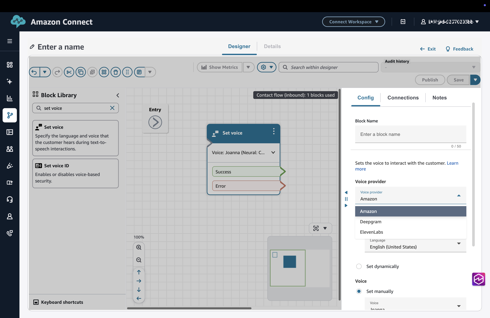
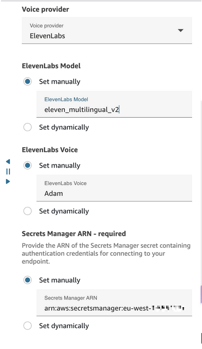

# Configure third‑party text‑to‑speech (TTS)

providers

Use the following instructions to configure a third-party text-to-speech (TTS)
provider.

## Prerequisites

- A contact flow exists (or you have permission to create one).
- A third‑party TTS provider API key stored in AWS Secrets Manager. For more information
  about storing API keys as secrets in Secrets Manager, see [Create an AWS Secrets Manager
  secret](../../../secretsmanager/latest/userguide/create_secret.md "../../../secretsmanager/latest/userguide/create_secret.md").
- An Secrets Manager resource policy allowing Amazon Connect to retrieve the key. For more
  information, see [Managing secrets and resource
  policies](managing-secrets-resource-policies.md "managing-secrets-resource-policies.md").
- AWS KMS key permissions allowing decryption. For more information, see [Managing secrets and resource
  policies](managing-secrets-resource-policies.md "managing-secrets-resource-policies.md").
- Provider‑specific model and voice values.

## Step 1: Open the contact flow

1. Sign in to the Amazon Connect admin website.
2. Choose **Flows**.
3. Choose an existing flow or create a new one.

## Step 2: Add or choose a Set voice block

1. In the Flow designer, search for **Set voice**.
2. Drag the block onto the canvas or choose an existing one.
3. Choose the block to open its configuration panel.

## Step 3: Choose a third‑party TTS provider

In the **Voice provider** dropdown, choose the third‑party
text‑to‑speech provider you want to use.

## Step 4: Specify model, voice, Secrets Manager ARN, and language

1. Under **Model**, choose **Set manually** and
   enter the provider model.
2. Under **Voice**, choose **Set manually** and
   enter the provider voice.
3. Under **Secrets Manager ARN**, choose **Set manually**
   and enter the ARN of the provider secret.
   - The secret must be in the same AWS Region.
   - AWS Secrets Manager and KMS policies must permit retrieval and decryption. For
     more information, see [Managing secrets and resource
     policies](managing-secrets-resource-policies.md "managing-secrets-resource-policies.md").

4. Under **Language**, choose **Set manually**
   and choose a language that is supported by the provider voice.

## Step 5: Save and publish the flow

1. Choose **Save** in the Flow designer.
2. Choose **Publish** to activate the updated flow
   settings.

## Runtime behavior (TTS)

- Amazon Connect sends text to the TTS provider for synthesis.
- Returned audio is played to the customer.
- Execution logs include provider errors such as invalid credentials or model
  values.

## Troubleshooting (TTS)

- **No audio output**: Validate model and voice
  values.
- **Authentication errors**: Verify Secrets Manager and KMS
  permissions.
- **Dynamic attributes**: Ensure runtime values
  resolve to valid provider parameters.
- **High latency**: Validate provider region
  alignment.
