# Amazon Connect feature overview

Amazon Connect is an omnichannel contact center, built in the cloud from the ground-up. It
empowers businesses of all sizes to connect their customers with the same world-class
customer experience Amazon uses to orchestrate their customer care.

###### Tip

For an online workshop that leverages a case study and includes hands-on labs, see
[Introduction to Amazon Connect](https://catalog.workshops.aws/amazon-connect-introduction/en-US/introduction "https://catalog.workshops.aws/amazon-connect-introduction/en-US/introduction") by AWS Workshop Studio.

## Customers: Omnichannel customer

experience

Amazon Connect provides you with the following channels for interacting with your
customers:

- Voice (phone)
- Chat/SMS
- Web calling/video
- Tasks
- Email

Customers can interact with your agents on voice, chat, SMS, web calling/video,
and email channels based on factors such as personal preferences and wait times.
Customers can keep working with the same agent across channels, but if it's a
different agent their interaction history is preserved, so they don't have to repeat
themselves. The omnichannel contact center improves customer experiences while
reducing resolution time.

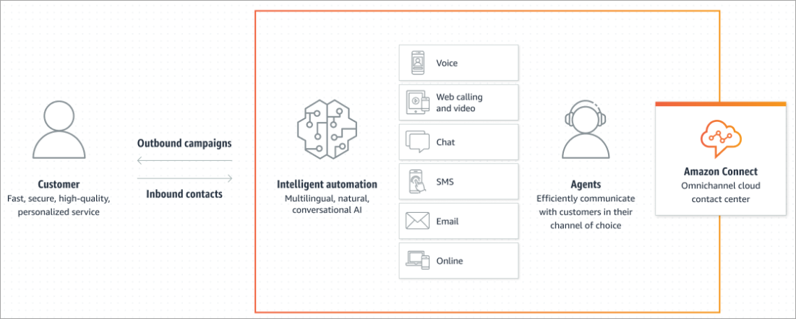

###### Contents

- [High quality voice](#connect-intro1 "#connect-intro1")
- [Conversational IVR and chatbots](#connect-intro2 "#connect-intro2")
- [Chat, SMS, and messaging](#connect-intro3 "#connect-intro3")
- [In-app, web, and video calling](#connect-intro4 "#connect-intro4")
- [Outbound campaigns](#connect-intro-campaigns "#connect-intro-campaigns")
- [Task management](#connect-intro-5 "#connect-intro-5")
- [Email](#connect-intro-email "#connect-intro-email")

### High quality voice

The sound quality of a call impacts customer experience and agent
productivity. When your customers can't hear you clearly, it can lead to wasted
time and frustration. With Amazon Connect, calls are connected to the agent over the
internet from a computing device like a PC, using the Amazon Connect softphone. The Amazon Connect
softphone delivers high-quality 16kHz audio and is resistant to packet loss to
ensure a high-quality call experience.

### Conversational IVR and chatbots

You can deliver personalized, natural-sounding, conversational interactions
using our proven AI-powered speech recognition and natural language
understanding technology (the same technology that powers Alexa). These same AI
capabilities can be used across all channels.

With Amazon Lex natively integrated within Amazon Connect, no coding is required to add
chatbots that have natural language understanding (NLU). Self-service chatbots
use high-quality, neural text-to-speech (TTS) in more than 30 languages,
automated speech recognition (ASR) in over 25 languages/locales, natural
language understanding (NLU), and passive voice authentication. Amazon Connect IVR and
chatbots also take advantage of generative AI features to greatly streamline the
building and testing of powerful, conversational self-service experiences (for
example, LLM-assisted slot resolution, conversational FAQs, sample utterance
generation, and bot creation using natural language description).

### Chat, SMS, and messaging

You can help customers through text-based communication channels, such as web
chat, mobile chat, SMS, and third-party messaging apps, such as WhatsApp or
Facebook Messenger. By using the [Amazon Connect chat
and messaging](web-and-mobile-chat.md "web-and-mobile-chat.md") features, you can set up AI-powered chatbots and
step-by-step guides so customers can self-serve. If customers need assistance,
agents get all of the prior context from the self-service interactions to ensure
a seamless transition.

- **Chat**. Amazon Connect makes it easy to [set up your customer's chat
  experience](enable-chat-in-app.md "enable-chat-in-app.md"). You can add a communications widget to your
  website that is hosted by Amazon Connect. You configure the communications widget
  in the Amazon Connect admin website. You can customize the font and colors, and
  secure the widget so that it can be launched only from your website.
  When finished, you will have a short code snippet that you add to your
  website.

Because Amazon Connect hosts the widget, it ensures that the latest version is
always live on your website.

- **SMS**. You can [set up two-way SMS messaging](setup-sms-messaging.md "setup-sms-messaging.md")
  capabilities so your customers can text you from their mobile device,
  and your agents can respond using the same tools they already use for
  calls and chats. With Amazon Lex, you can detect the intent of the
  customer message and automate responses to their questions, saving
  agents valuable time and effort.
- **Third-party messaging apps**. To
  integrate with third-party messaging apps, use the [Amazon Connect APIs](../APIReference/Welcome.md "../APIReference/Welcome.md") that enable you to subscribe to a real-time
  stream of chat messages. Using these APIs, you can:

      + Stream chat messages in real time when a new chat contact is
       created.
      + Extend the current Amazon Connect chat functionality to support use
       cases like building integrations with SMS solutions and
       third-party messaging applications, enabling mobile push
       notifications, and creating analytics dashboards to monitor and
       track chat message activity.

  For more information, see [Enable real-time chat message
  streaming in
  Amazon Connect](chat-message-streaming.md "chat-message-streaming.md").

### In-app, web, and video calling

You can [set up the Amazon Connect in-app, web, and video
calling](inapp-calling.md "inapp-calling.md") capabilities to enable your customers to contact you without
ever leaving your web or mobile application. You can use these capabilities to
pass contextual information to Amazon Connect. For example, if your customer is already
logged into your app, they do not need to identify or authenticate themselves
when they request a call or video conversation with an agent. This enables you
to personalize the customer experience based on attributes such as the
customer's profile or other information, like actions previously taken within
the app.

### Outbound campaigns

You can create high volume ML-powered [outbound campaigns](enable-outbound-campaigns.md "enable-outbound-campaigns.md") to contact up
to millions of customers daily for handling appointment reminders, marketing
promotions, deliveries, and billing reminders. You can specify the contact list,
channel, message, and even pre-recorded audio to play before connecting
customers to agents for live service.

Outbound campaigns includes a predictive dialer and machine learning
(ML)–powered answering machine detection. These features can help you optimize
agent productivity and increase live-party connections by not wasting agent time
with unanswered calls.

### Task management

Task management streamlines the process of tracking and routing other types of
agent work, like customer follow up messages, training, and research. Tasks are
delivered to agents using the same routing and agent experience used with voice,
chat, and other channels.

To ensure customer issues are quickly resolved, use [tasks](tasks.md "tasks.md") to prioritize, track, route, and automate agent follow-up
work. Your agents can create and complete tasks in the same user interface where
they take calls and chats. Managers can also use workflows to automate tasks
that don't require agent interaction. This results in improved agent
productivity leading to increased customer satisfaction.

### Email

You can use Amazon Connect email capabilities to receive and respond to emails sent by
customers to your business email addresses, or submitted by using web forms on
your website or mobile app. You can configure auto-responses, prioritize emails,
create or update cases, and route emails to the best available agent when agent
assistance is required. Amazon Connect email capabilities also work seamlessly with [outbound campaigns](#connect-intro-campaigns "#connect-intro-campaigns").

Agents have access to a rich text editor to respond to emails and to create
personalized email templates and signatures. They can also create quick
responses to answer frequently asked questions. The following image shows an
example of where you can create a basic agent signature template in the Amazon Connect admin website.
When agents use this template, it will automatically populate their name and add
the logo to their emails.

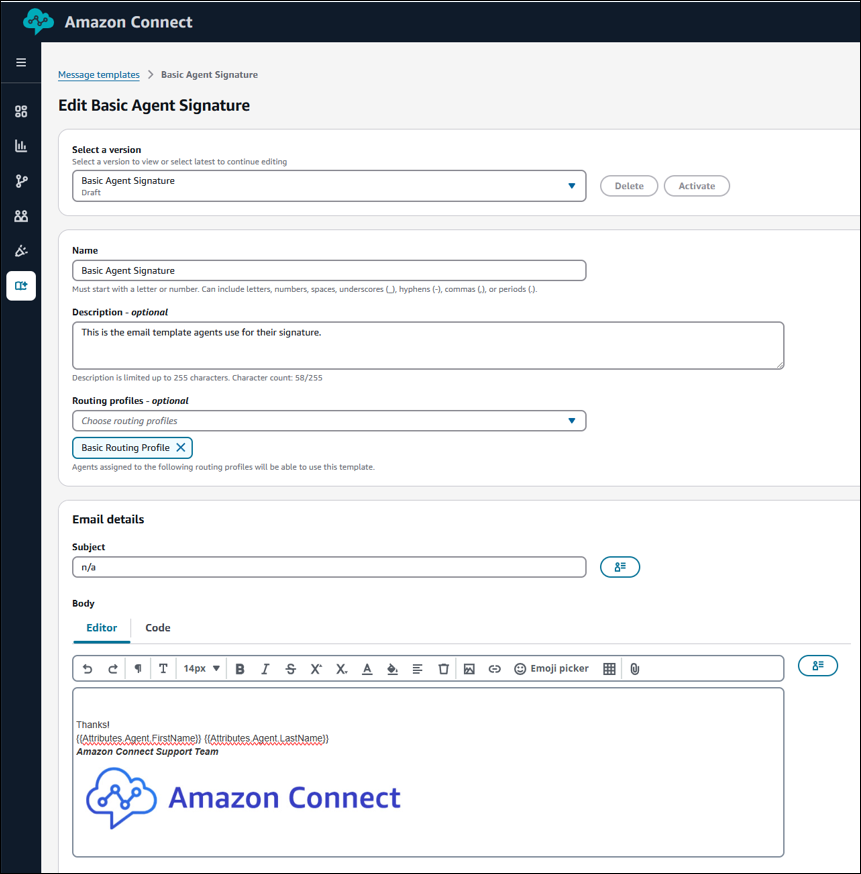

Both agents and contact center managers can easily view an entire email
thread. Email threading ensures that outgoing emails and incoming responses
related to a customer inquiry are associated with each other in a [chronological and organized
fashion](email-capabilities.md#email-capabilities-howthreadsmanaged "email-capabilities.md#email-capabilities-howthreadsmanaged"). Agents can view an email thread in the agent workspace and
CCP, and for added security, when they reply to an email, they can't manipulate
what the customer wrote as part of their email.

The following image shows an example of an email contact being handled by an
agent within the CCP in the agent workspace. In this example they have
associated the email contact to a case and are using the rich text editor and
quick responses to respond.

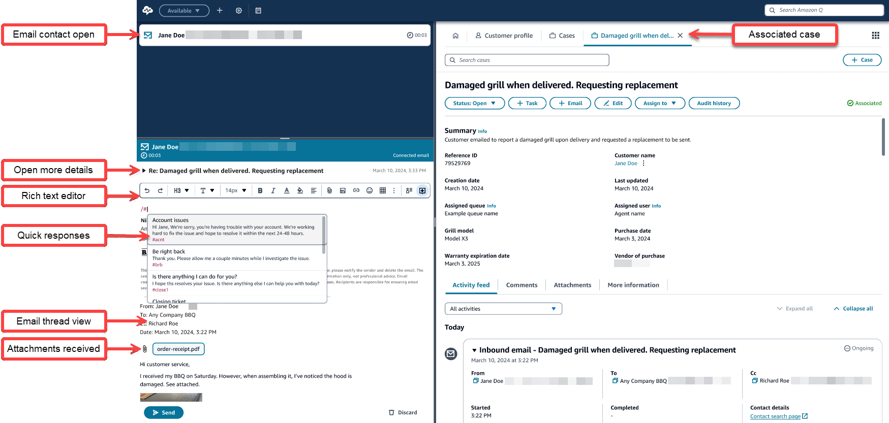

To get started, [set up the email
channel](setup-email-channel.md "setup-email-channel.md") in your instance right alongside your voice, chat, and task
channels. Amazon Connect email integrates with Amazon Simple Email Service (SES) for the sending,
receiving, and monitoring (such as for spam and virus detection) of emails.
Amazon Connect provides you with an email domain that you can use to create your email
addresses, or you can easily associate up to five of your own custom domains
using Amazon SES. After you have domains associated with your instance, you can [create](create-email-address1.md "create-email-address1.md") up to 100 email addresses that
can be used to send and receive emails (for example, support@example.com,
sales@example.com, and reservations@example.com).

Contact center managers can view email threads on the [Contact search](contact-search.md "contact-search.md") and details pages to find
email contacts based on email address, subject, queue, or other filters. This
enables them to get a better understanding of what their agents and customers
are saying and to evaluate agent performance.

To learn how their email channel is performing, contact center managers can
access the [analytics dashboard](contact-lens-conversational-analytics-dashboard.md "contact-lens-conversational-analytics-dashboard.md") to see real-time and historical metrics such as
average agent handle time, queue time, contacts answered, and more.

## Agents: Empowerment and productivity

With Amazon Connect, you can enhance your agents' productivity by providing them with quick
access to information and automatic recommendations. You can enable your agents to
capture relevant details for fast and efficient follow-up. And best of all, they can
work in one application, for a seamless experience. This results in shorter training
time for new agents, fewer errors, accelerated resolution times, and improved
customer satisfaction.

###### Contents

- [Agent workspace](#connect-intro-aw "#connect-intro-aw")
- [Step-by-step guides](#connect-intro-sg "#connect-intro-sg")
- [Generative AI-powered agent assist](#connect-intro-ka "#connect-intro-ka")
- [Generative AI-powered post-contact
  summaries](#connect-intro-gen-acw "#connect-intro-gen-acw")
- [Unified customer view](#connect-intro-uc "#connect-intro-uc")
- [Case management](#connect-intro-cm "#connect-intro-cm")
- [Efficient contact routing](#connect-intro-routing "#connect-intro-routing")

### Agent workspace

Out-of-the-box, the [agent workspace](agent-workspace.md "agent-workspace.md")
integrates all of your agent facing capabilities on one page. It is a single,
intuitive application that provides your agents with all the tools and
step-by-step guidance needed to onboard quickly, resolve issues efficiently, and
improve customer experiences.

From one application your agents can view detailed customer information, work
on tasks, view workforce schedules, get generative AI-powered agent assist, and
track and manage customer issues that require multiple interactions.

You can also easily integrate other applications directly into the agent
workspace, thus further increasing agent efficiency. For more information, see
[Integrate third-party applications (3p apps) in the Amazon Connect
agent workspace](3p-apps.md "3p-apps.md")

The following image shows the agent workspace with callouts indicating the
features on the page.

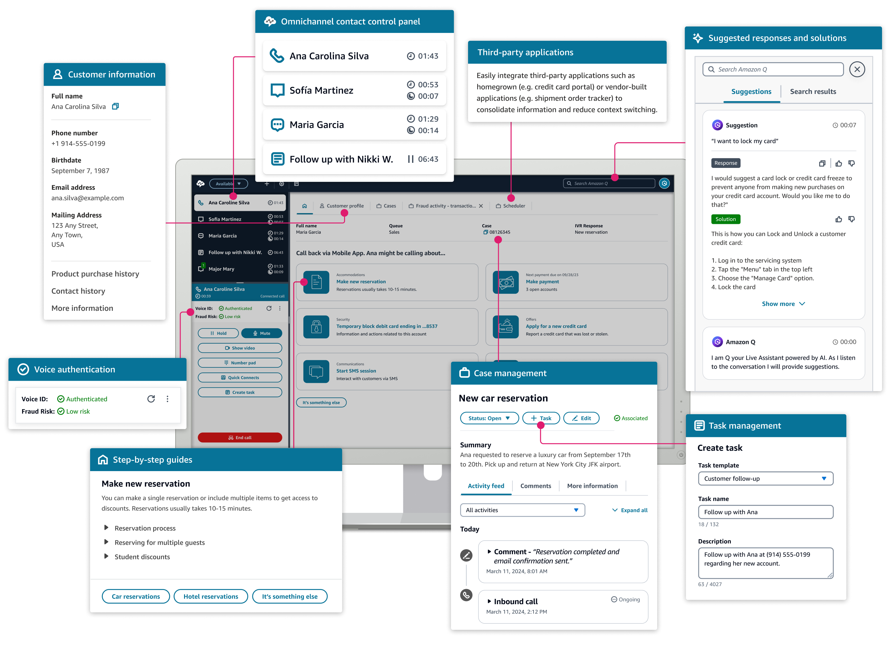

### Step-by-step guides

You can customize the agent workspace by creating [step-by-step guides](step-by-step-guided-experiences.md "step-by-step-guided-experiences.md") that
suggest to agents what to do at a given moment during a customer interaction.
Using a no-code editor, you can create tailored guides that walk agents through
the optimal steps to resolve a customer issue accurately the first time.

Guides can be used for various types of customer interactions. They are
presented to the agent in the agent workspace based on context like call queue,
customer information, or customer self-service responses. For example, there are
six step-by-step guides on the agent workspace in the following image.

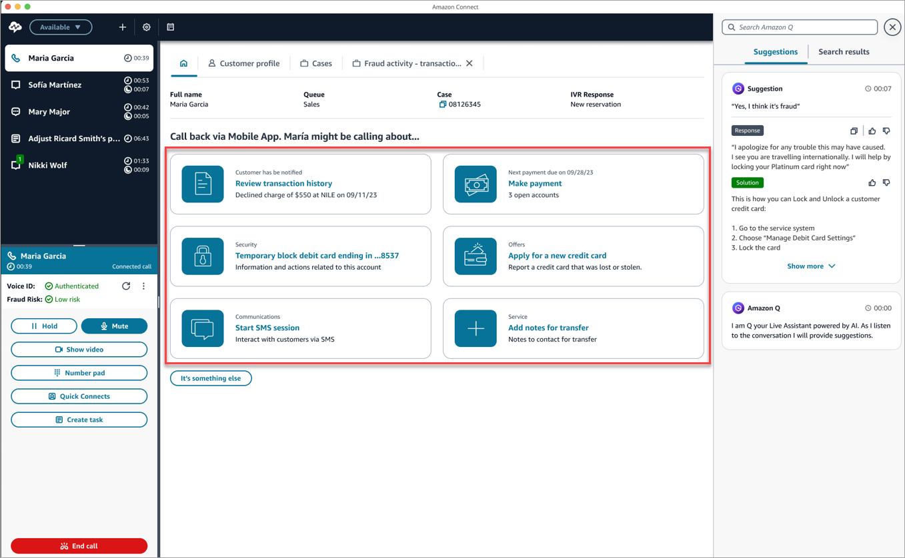

In the following image the **Review transaction history**
guide is open, and the first step is displayed for the agent to choose
**View transaction details** or **Choose a
different account**.

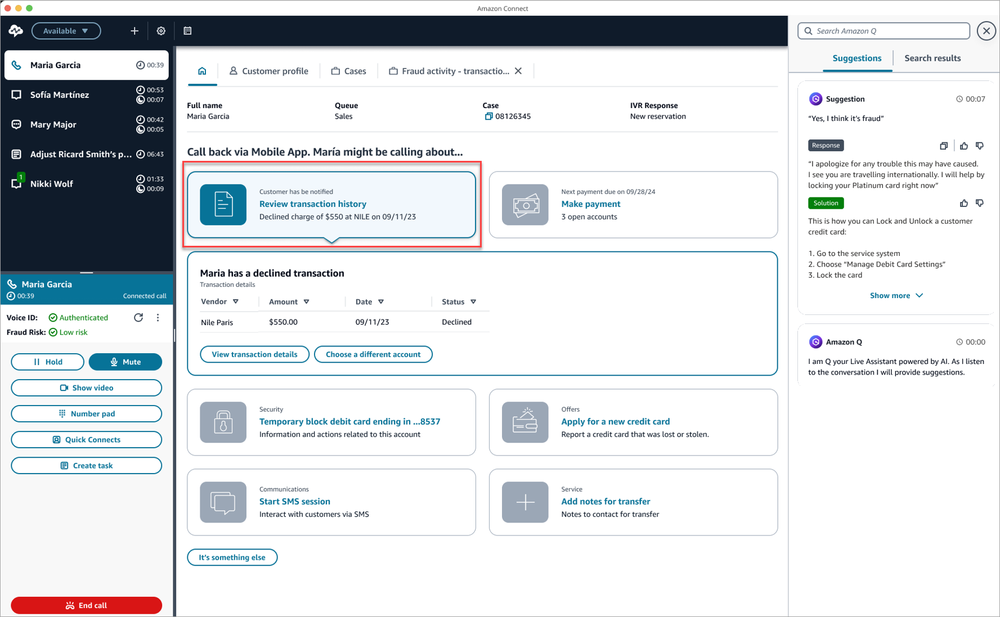

In the following image of the agent workspace, the agent is on a chat with
Nikki. At the bottom of the chat pane, the agent can search for [quick responses](create-quick-responses.md "create-quick-responses.md") that they can type
in the chat. For example, they can type **brb** to respond in
the chat with _Give me a couple of minutes while I investigate the
issue_.

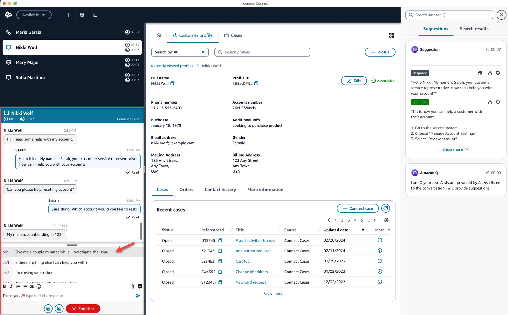

### Generative AI-powered agent assist

You can use [Connect AI agents](connect-ai-agent.md "connect-ai-agent.md") to
automatically detect customer intent during calls and chats. Connect AI agents uses the
real-time conversation with the customer, along with relevant company content,
to automatically recommend what to say or what actions an agent should take to
better assist the customer. This improves both agent productivity and customer
satisfaction. Agents can also use natural language to search across connected
knowledge sources to receive generated responses, recommended actions, and links
to more information.

The following image shows how an article may appear in the agent application
when the agent is on a call.

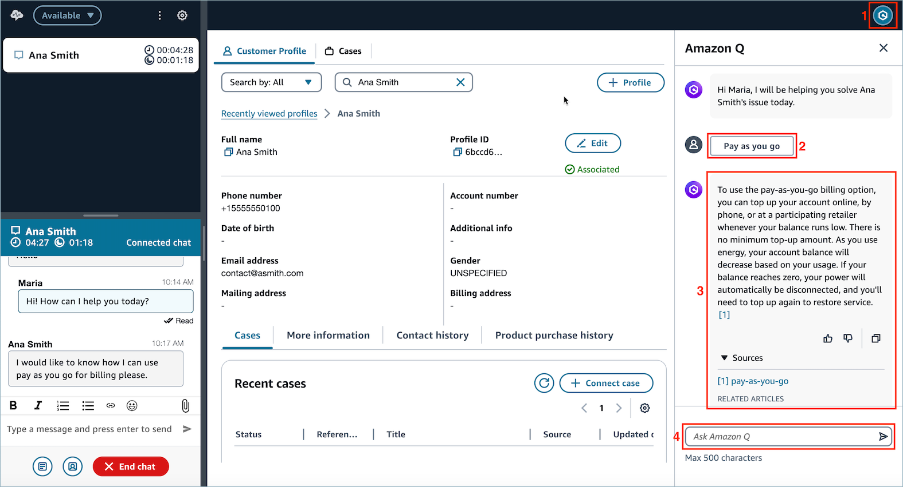

### Generative AI-powered post-contact

summaries

To help agents perform their After contact work (ACW), Amazon Connect displays a [generative AI-powered
post-contact summary](view-generative-ai-contact-summaries.md "view-generative-ai-contact-summaries.md") on their CCP for voice contacts. The summary
provides essential information from customer conversations in a structured,
concise, and easy to read format. The following image shows an example summary
for a voice contact.

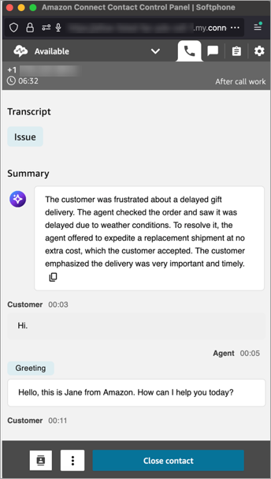

### Unified customer view

You use [Amazon Connect Customer Profiles](customer-profiles.md "customer-profiles.md") to combine
information from external applications with the contact history from Amazon Connect. For
example, you can combined contacts with information from Salesforce, Zendesk,
ServiceNow, or other customer relationship management (CRM) products (including
your own, internal data sources) to create customer profiles that have all the
information that agents need in a single place.

With a single view of customer information, including their product, case, and
contact history, agents can quickly confirm the customer's identity and
determine the reason for the call or chat.

The following image shows the **Customer profile** tab in the
agent workspace. It shows all of the recent cases associated with customer that
the agent is currently talking to.

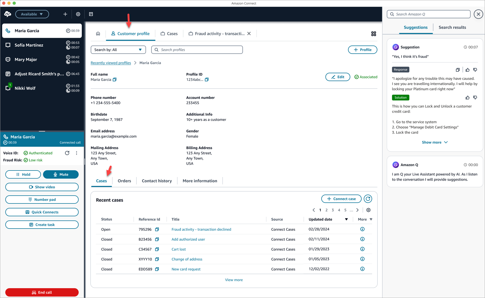

You can use Customer Profiles to access information during a self-service experience (for
example, IVR or bot), or in other agent applications, or you can use it as a
standalone service separate from Amazon Connect.

### Case management

Agents use [Amazon Connect Cases](cases.md "cases.md") to efficiently manage
customer issues that require multiple interactions, track follow-up tasks, and
access subject matter experts across a business. Agents can document customer
issues in a single, unified view with relevant case details, such as date/time
opened, issue summary, customer information, status, and custom values you want
to track. You can configure new cases to be automatically created or have agents
manually create cases.

The following image shows the agent workspace. The agent is talking to the
contact on the phone and viewing a closed case for windshield damage. The case
is associated with the customer's profile.

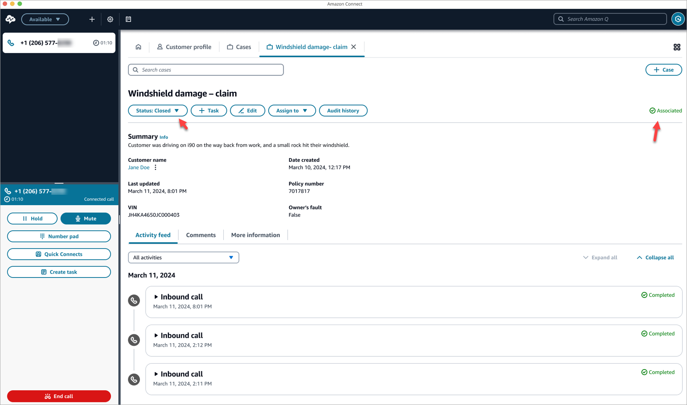

### Efficient contact routing

Agents are set up for success when the right contacts are routed to them. You
can efficiently route customers to appropriately skilled agents by using [routing profiles](connect-queues.md "connect-queues.md"). You can configure contact
priority and routing to agents based on [agent skills](concepts-queue-based-routing.md "concepts-queue-based-routing.md"), [queue priorities](concepts-routing-profiles-priority.md "concepts-routing-profiles-priority.md"),
contact attributes, and real-time metrics.

## Supervisors: Analytics, insights, and

optimization

Give your managers the actionable insights and capabilities they need to optimize
operations and outcomes.

###### Contents

- [Real-time and historical reports and
  dashboards](#connect-intro-reporting "#connect-intro-reporting")
- [Real-time conversational analytics](#connect-intro-rtc "#connect-intro-rtc")
- [Quality and performance management](#connect-intro-qa "#connect-intro-qa")
- [Forecasting, capacity planning, and scheduling](#connect-intro-wfm "#connect-intro-wfm")

### Real-time and historical reports and

dashboards

Understanding your contact center at the most granular level is key to
improving performance and lowering costs. Amazon Connect provides powerful analytics
tools, including visual [dashboards](dashboards.md "dashboards.md") with
customizable real-time and historical metrics.

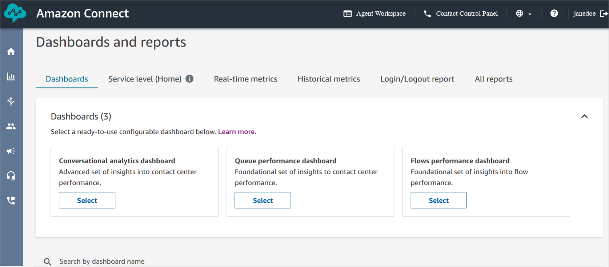

The following image shows an example of the [Contact Lens Conversational analytics dashboard](contact-lens-conversational-analytics-dashboard.md "contact-lens-conversational-analytics-dashboard.md"). This
dashboard helps you understand why customers are contacting you, the trends of
contact drivers over time, and the performance of each of those call drivers.

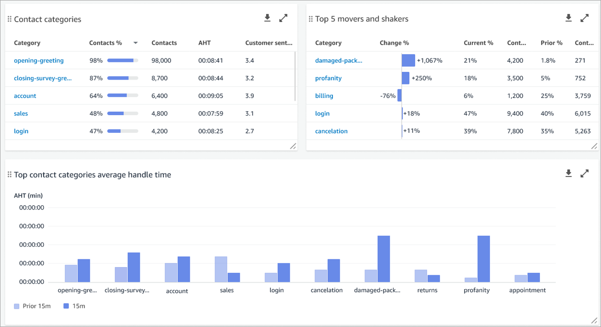

You can use Amazon Connect data lake as a central location to query various
types of data from Amazon Connect. This data includes contact records,
Contact Lens conversational analytics, Contact Lens
performance evaluations, and more. You can use data lake to create
custom reports, run SQL queries, or leverage the BI tools of your choice to
analyze the information that matters most to improving customer experience and
operational efficiency.

For example, managers can use QuickSight to visualize which agents have the
highest customer satisfaction for calls about lost orders and then adjust
routing profiles to staff their queues with the ideal agents to achieve their
desired business outcomes.

You can review the following out-of-the-box reports, and customize them to add
more real-time and historical metrics:

- [Real-time metrics
  reports](real-time-metrics-reports.md "real-time-metrics-reports.md")
- [Historical metrics
  reports](historical-metrics.md "historical-metrics.md")
- [Login/logout
  reports](login-logout-reports.md "login-logout-reports.md")
- [Agent activity audit
  report](agent-activity-audit-report.md "agent-activity-audit-report.md")

The following image shows an example of a section of the Real-time metrics
page for Queues.

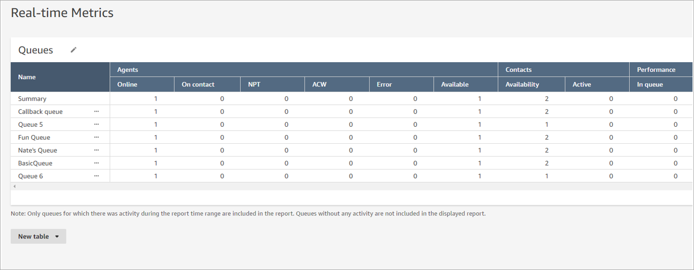

This next image shows a drill down into the real-time activity for Queue 4.

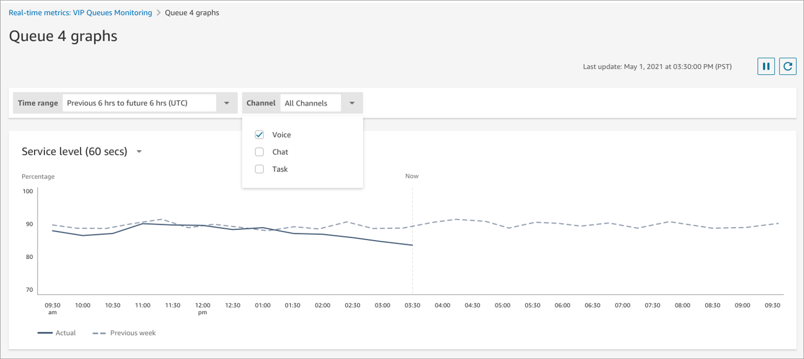

### Real-time conversational analytics

With [real-time speech and chat
analytics](analyze-conversations.md "analyze-conversations.md"), you can uncover trends and improve customer service by
understanding sentiment, conversation characteristics, emerging contact themes,
and agent compliance risks while the call or chat is in progress. You can
receive an alert, for example, when a customer is getting frustrated because the
agent is unable to resolve a complicated problem. This allows you to provide
more immediate assistance.

The following image shows post-contact conversational analytics on the
**Contact details** page. It includes a [generative AI-powered contact
summary](view-generative-ai-contact-summaries.md "view-generative-ai-contact-summaries.md") to help you quickly understand essential information about
the contact, how customer sentiment changes as the contact progresses, and the
distribution of talk time between the agent and customer.

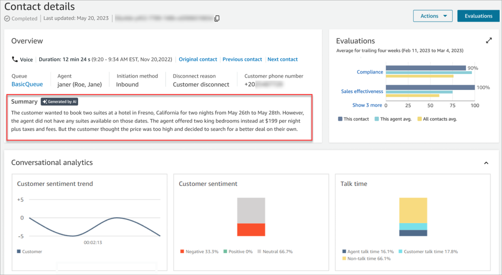

You can [search for contacts](contact-search.md "contact-search.md") as far back
as two years ago. Choose from an extensive list of filters to quickly find the
contacts you need. For example, you can search by custom attributes specific to
your business, such as MVP, and search for in-progress contacts, as shown in the
following image.

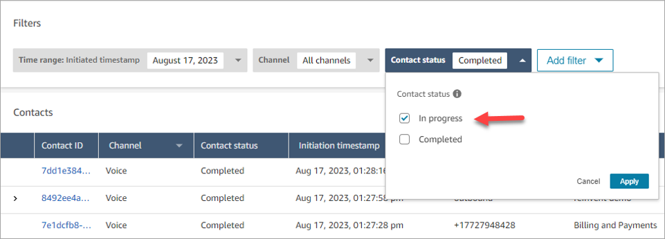

Managers can view the **Contact details** page for an
in-progress contact, and the real-time transcript. In addition, they can [transfer](transfer-contacts-admin.md "transfer-contacts-admin.md"), [reschedule](reschedule-contacts-admin.md "reschedule-contacts-admin.md"), or [end](end-contacts-admin.md "end-contacts-admin.md") in-progress contacts.

### Quality and performance management

To [evaluate agent performance](evaluations.md "evaluations.md") you can
review conversations alongside contact details, audio and screen recordings,
audio and chat transcripts, and conversation summaries, without switching
applications. You can define and assess agent performance criteria (for example,
script adherence, sensitive data collection, and customer greetings) and
automatically pre-populate evaluation forms. You can use tasks to automatically
queue follow-up coaching and training based on completed evaluations.

Managers can perform evaluations faster and more accurately with [generative AI-powered
recommendations](generative-ai-performance-evaluations.md "generative-ai-performance-evaluations.md") for answers to questions in agent evaluation forms.
For example, the following image shows the **Recording and
transcript** section of the **Contact details**
page. On the right side of the page is the evaluation, which includes generative
AI-powered evaluation recommendations.

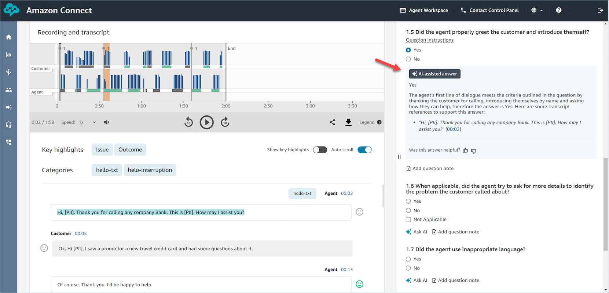

To assess a very large number of agent conversations, or all of them, your
contact center can use [automated evaluations](generative-ai-performance-evaluations.md "generative-ai-performance-evaluations.md").

You can review the actions agents took while they were handling customer
contacts by [reviewing screen
recordings](agent-screen-recording.md "agent-screen-recording.md"). This helps you ensure adherence to quality standards,
compliance requirements, and best practices. It also helps you identify coaching
opportunities and bottlenecks so you can streamline workflows.

Managers use the **Recording** section of the
**Contact details** page to view the screen recording, as
shown in the following image.

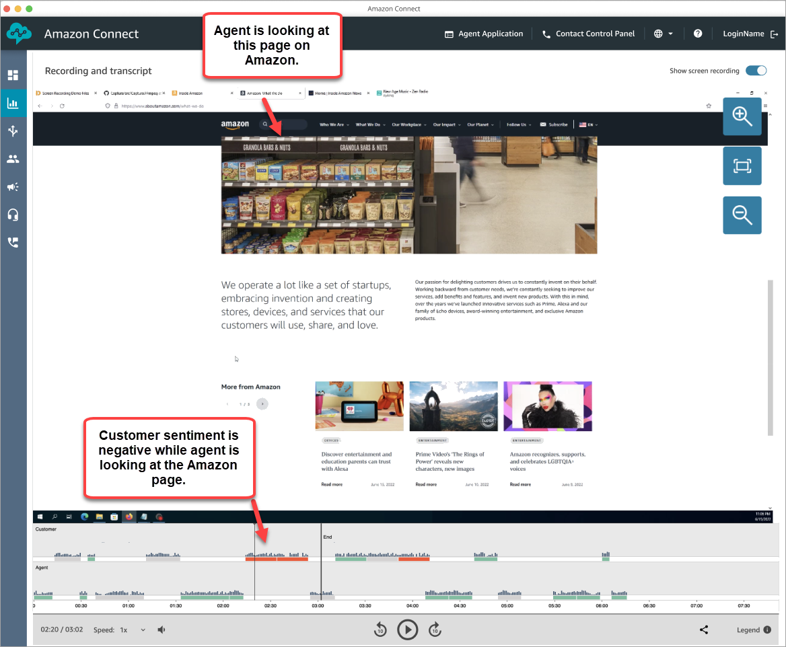

You can [monitor live voice and chat
conversations](monitoring-amazon-connect.md "monitoring-amazon-connect.md") to listen in, coach the agent, and barge into live
voice conversations. This is especially helpful for agents in training.

Managers use the **Real-time metrics** page to choose the
contacts they want to monitor. For example, in the following image the manager
can choose the eye icon to start monitoring a specific voice
conversation.

Selecting the eye icon takes the manager to CCP section of the agent
workspace, as shown in the following image. They can monitor the call and toggle
between the **Monitor** and **Barge** states.
The following image shows the **Monitor** state.

### Forecasting, capacity planning, and scheduling

Forecasting, capacity planning, and scheduling are machine learning (ML)–powered features that help your workforce
management team predict, allocate, and verify that the right number of agents
are scheduled at the right time. Highly accurate forecasting helps you meet your
operational goals with minimal overstaffing. You can anticipate contact volume
and arrival rates, convert forecasts into projected staffing needs, and assign
daily shifts to the right number of agents.

- [Forecasting](forecasting.md "forecasting.md"): A forecast is the
  starting point for any scheduling and capacity planning activities.
  Before you can generate a schedule or capacity plan, you must create a
  corresponding forecast. A forecast attempts to predict future contact
  volume and average handle time by using historical metrics.

Forecast data is displayed in graphs, as shown in the following
image.

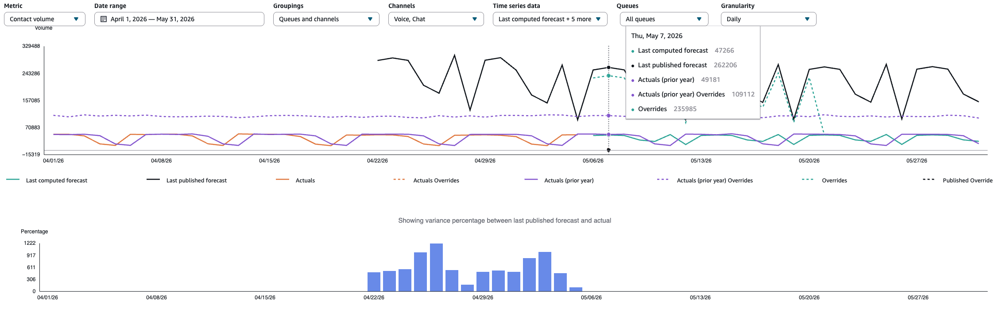

- [Capacity planning](capacity-planning.md "capacity-planning.md"): A capacity
  plan helps you estimate the long-term FTE (full-time equivalent)
  requirements for your contact center, up to 18 months. It specifies how
  many FTE agents are required to meet the service level target for a
  certain period of time.

The following image shows the plan output. It shows a week-by-week or
month-by-month calculation. To switch from weekly to monthly view,
select **Monthly** from the dropdown.

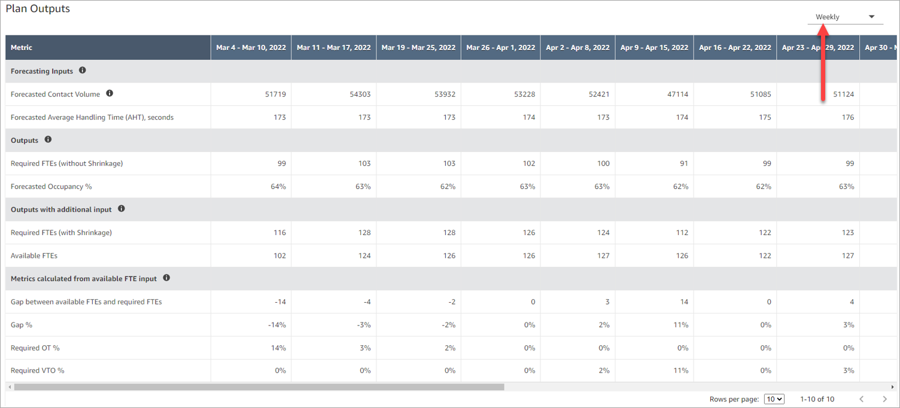

- [Scheduling](scheduling.md "scheduling.md"): Contact center schedulers
  or managers need to create agent schedules for day-to-day workloads that
  are flexible and meet business and compliance requirements. Amazon Connect helps
  you create efficient schedules that are optimized for per-channel
  Service Level or Average speed of answer targets. You can generate and
  manage agent schedules based on the following:

      + A short-term published forecast
      + Shift profiles (templates for weekly shifts)
      + Staffing groups (agents that can handle specific types of
       contacts from a specific forecast group)
      + Human resources and business rules

  The following image shows a sample schedule in the Amazon Connect admin website for a
  supervisor's team.

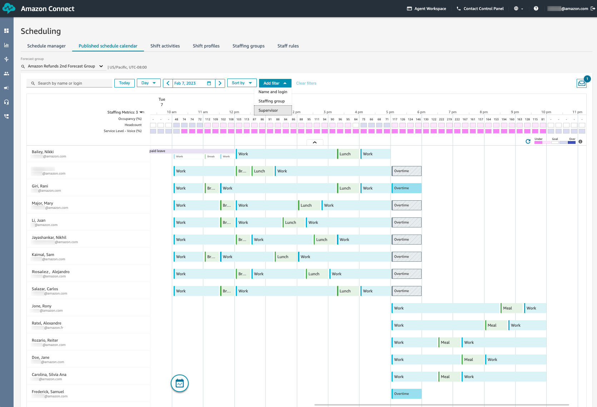

The following image shows a sample schedule that agents see in the
agent workspace.

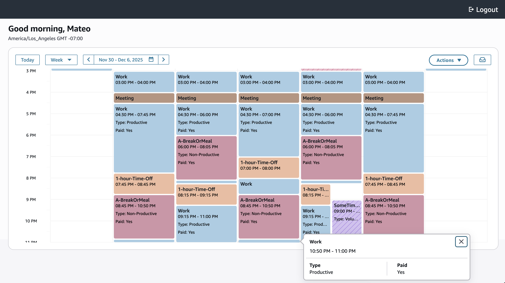

## Administrators: Configuration and

flexibility

Amazon Connect provides a simple, self-service UI that enables you to make changes in
minutes, not months.

Anyone, from non-technical business leaders to experienced contact center
administrators, can immediately start innovating on behalf of their customers using
an intuitive, graphical UI. All channels – voice, chat, SMS, web and video-calling,
messaging, email, tasks, and others – are configured, managed, personalized,
automated, recorded, and analyzed using a single _omnichannel_
solution, which means you can use the same business logic and routing rules across
channels, making it easy to innovate and fine-tune the experience.

###### Contents

- [Telephony
  management](#connect-intro-telephony "#connect-intro-telephony")
- [Drag-and-drop workflow
  designer](#connect-intro-flowdesigner "#connect-intro-flowdesigner")
- [Security](#connect-intro-security "#connect-intro-security")
- [Scalability](#connect-intro-scalable "#connect-intro-scalable")
- [Resiliency](#connect-intro-gr "#connect-intro-gr")

### Telephony management

Amazon Connect takes the heavy lifting of managing telephony off your hands. We manage
a network of telephony providers from around the world, removing the need for
you to manage multiple vendors, negotiate complex multi-year contracts, or
commit to peak call volumes.

The telephony service allows you to claim and then use direct inward dial
(DID) and toll-free phone numbers for more than 110 countries worldwide. There
are also more than 200 available outbound calling destinations. For a list of
destinations, see the [Amazon Connect
pricing](https://aws.amazon.com/connect/pricing/ "https://aws.amazon.com/connect/pricing/") page.

For a list of the telephony capabilities that Amazon Connect provides, see the [Amazon Connect Telecoms Country Coverage Guide](https://d1v2gagwb6hfe1.cloudfront.net/Amazon_Connect_Telecoms_Coverage.pdf "https://d1v2gagwb6hfe1.cloudfront.net/Amazon_Connect_Telecoms_Coverage.pdf").

The telephony-as-a service model can scale up and down at a moment's notice
and is proactively and continuously monitored by telephony experts.

### Drag-and-drop workflow

designer

Amazon Connect flows provides a single drag-and-drop workflow designer you can use to
create, personalize, and automate end-to-end customer and agent experiences
across channels. With flows, you can design your interactive voice response
(IVR) or chatbot experiences to help your customers self-serve, build
step-by-step guides for your agents to resolve issues faster and accurately, and
create and manage how tasks are automated for your agents.

Flows also has native integration with AWS Lambda, allowing you to build even
more custom experiences that automate processes across other AWS services
(such as Amazon DynamoDB, Amazon Redshift, or Amazon Aurora) or third-party systems (such as your CRM
or analytics solutions).

### Security

Cloud security at AWS is the highest priority. As an AWS customer, you
benefit from a data center and network architecture that is built to meet the
requirements of the most security-sensitive organizations.

To learn more about security and data protection, see [Security in Amazon Connect](security.md "security.md").

### Scalability

You can bring on tens, or tens of thousands of agents at will, in response to
business cycles or unplanned events, and cycle agents out just as easily. Amazon Connect
provides seamless scalability based on demand, and you only pay for what you
use.

With routing profiles, flows, and real-time metrics, you can scale your
business operations based on current volumes. You establish contact experience
and business workflows, and Amazon Connect scales up during peak demand without
additional application or hardware management. Contacts experience consistent
service outcomes during busy periods. Administrators can focus on agent
performance and contact feedback instead of monitoring available application or
hardware capacity.

### Resiliency

Amazon Connect provides all our customers with active-active resilience within an AWS
Region. This resilience ensures high availability for all channels and
applications.

If your organization requires even higher levels of resilience, you can use
[Amazon Connect Global
Resiliency](setup-connect-global-resiliency.md "setup-connect-global-resiliency.md") to provide resilience across multiple AWS Regions.
