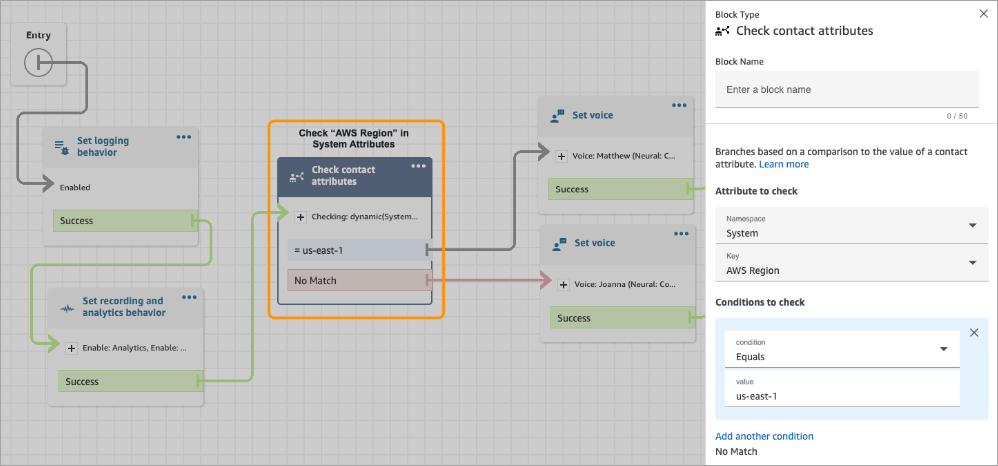

# Amazon Connect Global Resiliency

requirements

If you have decided that Amazon Connect Global Resiliency is the appropriate deployment for
you, ensure you adhere to the following pre-requisites before onboarding:

- [Port](about-porting.md "about-porting.md") all phone numbers you want to enable
  to be multi-region to Amazon Connect.
- AWS Enterprise Support or AWS Unified Operations is required to onboard to Amazon Connect Global Resiliency.
  For more information about AWS Support plans, see
  [AWS Support Plans](https://aws.amazon.com/premiumsupport/plans/ "https://aws.amazon.com/premiumsupport/plans/") .
- You must have an existing production [SAML 2.0-enabled](connect-identity-management.md "connect-identity-management.md") Amazon Connect instance
  in a Region where Amazon Connect Global Resiliency is available. To confirm, see [Global Resiliency availability by Region](regions.md#gr_region "regions.md#gr_region").
- It is recommended to onboard and test Amazon Connect Global Resiliency services in a
  test environment before onboarding production traffic.
- Request that ALL service quotas in the replica instance match the service
  quotas in the source instance: [Create a service quota
  increase case](../../../general/latest/gr/aws_service_limits.md "../../../general/latest/gr/aws_service_limits.md") in the AWS Management Console > Support.
- Ensure your Lambda functions across AWS Regions have the same name.
- Update your flows to replace any hardcoded Regions with a
  `$.AwsRegion` or `$['AwsRegion']` parameter.

###### Note

In the [AWS Lambda
function](invoke-lambda-function-block.md "invoke-lambda-function-block.md") block,
`$.AwsRegion` is not allowed in the flowArn.

To use `$.AwsRegion`, you need to use a [Set contact
attributes](set-contact-attributes.md "set-contact-attributes.md") block to set the flow,
for example:

`flowIdKey` :
`arn:aws:connect:$.AwsRegion:123456789012:instance/12345678-1234-1234-1234-123456789012/contact-flow/12345678-1234-1234-1234-123456789012`

Then later use that attribute key in the [AWS Lambda
function](invoke-lambda-function-block.md "invoke-lambda-function-block.md") block as
`${flowIdKey}`.

`$.AwsRegion` is supported only for Lambda ARN and Lex
ARN.

- For Amazon Lex bots, you can do one of the following:
  - Use Amazon Lex Global Resiliency to replicate bots across AWS Regions and
    retain the bot ID.
  - Change your flows to branch based on the AWS Region where the flow
    is running. At flow runtime, these parameters are replaced with the
    Region where the flow is run, as shown in the following example.

  
