# Grant Amazon Connect access to your AWS Lambda

functions

Amazon Connect can interact with your own systems and take different paths in flows dynamically. To
achieve this, invoke AWS Lambda functions in a flow, fetch the results, and call your own
services or interact with other AWS data stores or services. For more information, see the
[AWS Lambda Developer Guide](../../../lambda/latest/dg.md "../../../lambda/latest/dg.md").

To invoke a Lambda function from a flow, complete the following tasks.

###### Tasks

- [Create a Lambda function](#create-lambda-function "#create-lambda-function")
- [Add a Lambda function to your Amazon Connect
  instance](#add-lambda-function "#add-lambda-function")
- [Invoke a Lambda function from a flow](#function-contact-flow "#function-contact-flow")
- [Best practice for invoking multiple Lambda functions](#invoke-multiple-functions "#invoke-multiple-functions")
- [Configure your Lambda function to parse the
  event](#function-parsing "#function-parsing")
- [Verify the function response](#verify-function "#verify-function")
- [Consume the Lambda function response](#process-function-response "#process-function-response")
- [Tutorial: Create a Lambda function and invoke in
  a flow](#tutorial-invokelambda "#tutorial-invokelambda")

## Create a Lambda function

Create a Lambda function, using any runtime, and configure it. For more information,
see [Get started with
Lambda](../../../lambda/latest/dg/get-started.md "../../../lambda/latest/dg/get-started.md") in the _AWS Lambda Developer Guide_.

If you create the Lambda function in the same Region as your contact center, you can
use the Amazon Connect console to add the Lambda function to your instance as described in the
next task, [Add a Lambda function to your Amazon Connect
instance](#add-lambda-function "#add-lambda-function").
This automatically adds resource permissions that allow Amazon Connect to invoke the Lambda
function. Otherwise, if the Lambda function is in a different Region, you can add it to
your flow using the flow designer and add the resource permissions using the [add-permission](../../../cli/latest/reference/lambda/add-permission.md "../../../cli/latest/reference/lambda/add-permission.md") command, with a principal of
`connect.amazonaws.com` and the ARN of your Amazon Connect instance. For more
information, see [Using
Resource-Based Policies for AWS Lambda](../../../lambda/latest/dg/access-control-resource-based.md "../../../lambda/latest/dg/access-control-resource-based.md") in the
_AWS Lambda Developer Guide_.

## Add a Lambda function to your Amazon Connect

instance

Before you can use an Lambda function in a flow, you need to add it to your Amazon Connect
instance.

###### Add a Lambda function to your instance

1. Open the Amazon Connect console at
   [https://console.aws.amazon.com/connect/](https://console.aws.amazon.com/connect/ "https://console.aws.amazon.com/connect/").
2. On the instances page, choose your instance name in the **Instance
   Alias** column. This instance name appears in the URL you use to
   access Amazon Connect.

 3. In the navigation pane, choose **Flows**. 4. In the **AWS Lambda** section, use the
**Function** drop-down box to select the function to add to
your instance.

###### Tip

The drop-down lists only those functions in the same Region as your
instance. If no functions are listed, choose **Create a new Lambda
function**, which opens the AWS Lambda console.

To use a Lambda in a different Region
or account, in the [AWS Lambda
function](invoke-lambda-function-block.md "invoke-lambda-function-block.md"), under
**Select a function**, you can enter the ARN of a
Lambda. Then set up the corresponding resource-based policy on that Lambda to
allow the flow to call it.

To call `lambda:AddPermission`, you need to:

    * Set the principal to
     **connect.amazonaws.com**
    * Set the source account to be the account your instance is
     in.
    * Set the source ARN to the ARN of your instance.For more information, see [Granting function access to other accounts](../../../lambda/latest/dg/access-control-resource-based.md#permissions-resource-xaccountinvoke "../../../lambda/latest/dg/access-control-resource-based.md#permissions-resource-xaccountinvoke").

5. Choose **Add Lambda Function**. Confirm that the ARN of the
   function is added under **Lambda Functions**.

Now you can refer to that Lambda function in your flows.

## Invoke a Lambda function from a flow

1. Open or create a flow.
2. Add an [AWS Lambda
   function](invoke-lambda-function-block.md "invoke-lambda-function-block.md") block (in the
   **Integrate** group) to the grid. Connect the branches to
   and from the block.
3. Choose the title of the [AWS Lambda
   function](invoke-lambda-function-block.md "invoke-lambda-function-block.md") block to open its
   properties page.
4. Under **Select a function**, choose from the list of
   functions you've added to your instance.
5. (Optional) Under **Function input parameters**, choose
   **Add a parameter**. You can specify key-value pairs that
   are sent to the Lambda function when it is invoked. You can also specify a
   **Timeout** value for the function.
6. In **Timeout (max 8 seconds)**, specify how long to wait for
   Lambda to time out. After this time, the contact routes down the Error
   branch.

For every Lambda function invocation from a flow, you pass a default set of information
related to ongoing contact, as well as any additional attributes defined in the
**Function input parameters** section for the **Invoke
AWS Lambda function** block added.

The following is an example JSON request to a Lambda function:

```
{
    "Details": {
        "ContactData": {
            "Attributes": {
               "exampleAttributeKey1": "exampleAttributeValue1"
              },
            "Channel": "VOICE",
            "ContactId": "4a573372-1f28-4e26-b97b-XXXXXXXXXXX",
            "CustomerEndpoint": {
                "Address": "+1234567890",
                "Type": "TELEPHONE_NUMBER"
            },
            "CustomerId": "someCustomerId",
            "Description": "someDescription",
            "InitialContactId": "4a573372-1f28-4e26-b97b-XXXXXXXXXXX",
            "InitiationMethod": "INBOUND | OUTBOUND | TRANSFER | CALLBACK",
            "InstanceARN": "arn:aws:connect:aws-region:1234567890:instance/c8c0e68d-2200-4265-82c0-XXXXXXXXXX",
            "LanguageCode": "en-US",
            "MediaStreams": {
                "Customer": {
                    "Audio": {
                        "StreamARN": "arn:aws:kinesisvideo::eu-west-2:111111111111:stream/instance-alias-contact-ddddddd-bbbb-dddd-eeee-ffffffffffff/9999999999999",
                        "StartTimestamp": "1571360125131", // Epoch time value
                        "StopTimestamp": "1571360126131",
                        "StartFragmentNumber": "100" // Numberic value for fragment number
                    }
                }
            },
            "Name": "ContactFlowEvent",
            "PreviousContactId": "4a573372-1f28-4e26-b97b-XXXXXXXXXXX",
            "Queue": {
                   "ARN": "arn:aws:connect:eu-west-2:111111111111:instance/cccccccc-bbbb-dddd-eeee-ffffffffffff/queue/aaaaaaaa-bbbb-cccc-dddd-eeeeeeeeeeee",
                 "Name": "PasswordReset"
                "OutboundCallerId": {
                    "Address": "+12345678903",
                    "Type": "TELEPHONE_NUMBER"
                }
            },
            "References": {
                "key1": {
                    "Type": "url",
                    "Value": "urlvalue"
                }
            },
            "SystemEndpoint": {
                "Address": "+1234567890",
                "Type": "TELEPHONE_NUMBER"
            }
        },
        "Parameters": {"exampleParameterKey1": "exampleParameterValue1",
               "exampleParameterKey2": "exampleParameterValue2"
        }
    },
    "Name": "ContactFlowEvent"
}
```

The request is divided into two parts:

- Contact data—This is always passed by Amazon Connect for every contact. Some
  parameters are optional.

This section may include attributes that have been previously associated with
a contact, such as when using a **Set contact attributes**
block in a flow. This map may be empty if there aren't any saved
attributes.

The following image shows where these attributes would appear in the
properties page of a **Set contact attributes**.

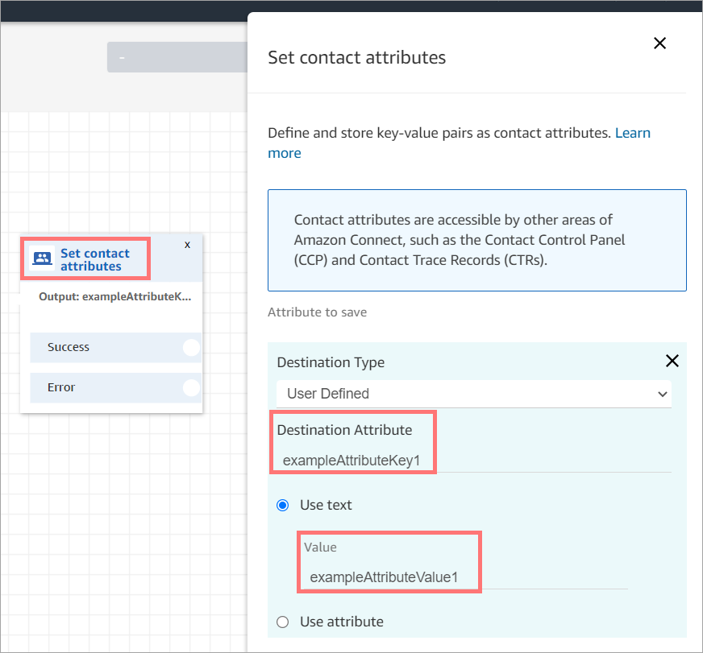

- Parameters—These are parameters specific to this call that were defined
  when you created the Lambda function. The following image shows where these
  parameters would appear in the properties page of the **Invoke AWS Lambda
  function** block.

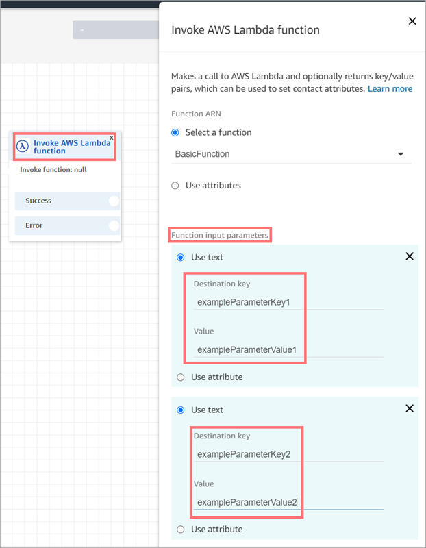

The [AWS Lambda
function](invoke-lambda-function-block.md "invoke-lambda-function-block.md") block can receive input parameters in JSON format, accommodating both
primitive data types and nested JSON. The following is an example of a JSON input that
can be used in the [AWS Lambda
function](invoke-lambda-function-block.md "invoke-lambda-function-block.md") block.

```

{
  "Name": "Jane",
  "Age":10,
  "isEnrolledInSchool": true,
  "hobbies": {
    "books":["book1", "book2"],
    "art":["art1", "art2"]
  }
}

```

### Invocation retry policy

If your Lambda invocation in a flow gets throttled, the request will be retried. It
will also be retried if a general service failure (500 error) happens.

When a synchronous invocation returns an error, Amazon Connect retries up to 3 times, for a
maximum of 8 seconds. At that point, the flow will progress down the Error branch.

To learn more about how Lambda retries, see [Error Handling and Automatic
Retries in AWS Lambda](../../../lambda/latest/dg/retries-on-errors.md "../../../lambda/latest/dg/retries-on-errors.md").

## Best practice for invoking multiple Lambda functions

Amazon Connect limits the duration of a sequence of Lambda functions to 20 seconds. It times
out with an error message when the total execution time exceeds this threshold.
Because customers hear silence while a Lambda function runs, we recommend adding a
**Play prompt** block between functions to keep them engaged
during the long interaction.

By breaking up a chain of Lambda functions with the **Play
prompt** block, you can invoke multiple functions that last longer than
the 20 second threshold.

## Configure your Lambda function to parse the

event

To successfully pass attributes and parameters between your Lambda function and Amazon Connect,
configure your function to correctly parse the JSON request sent from the
**Invoke AWS Lambda function** block or **Set contact
attributes**, and define any business logic that should be applied. How the
JSON is parsed depends on the runtime you use for your function.

For example, the following code shows how to access `exampleParameterKey1`
from **Invoke AWS Lambda function** block and
`exampleAttributeKey1` from **Set contact attributes**
block using Node.JS:

```
exports.handler = function(event, context, callback) {
// Example: access value from parameter (Invoke AWS Lambda function)
let parameter1 = event['Details']['Parameters']['exampleParameterKey1'];

// Example: access value from attribute (Set contact attributes block)
let attribute1 = event['Details']['ContactData']['Attributes']['exampleAttributeKey1'];

// Example: access customer's phone number from default data
let phone = event['Details']['ContactData']['CustomerEndpoint']['Address'];

// Apply your business logic with the values
// ...
}

```

## Verify the function response

###### Tip

Referencing an array is not supported in a flow. Arrays can be used only in
another Lambda function.

The Lambda function response could be either a STRING_MAP or JSON and has to be set
while configuring the **Invoke AWS Lambda function** block in the
flow. If response validation is set to STRING_MAP, then the Lambda function should return
a flat object of key/value pairs of the string type. Otherwise, if response validation
is set to JSON, the Lambda function can return any valid JSON including nested
JSON.

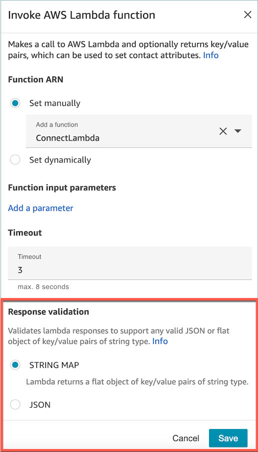

The Lambda response can be up to 32kb. If you fail to reach Lambda, the function throws
an exception, the response is not understood, or the Lambda function takes more time than
the limit, the flow jumps to the `Error` label.

Test the output returned from your Lambda function to confirm that it will be correctly
consumed when returned to Amazon Connect. The following example shows a sample response in
Node.JS:

```
exports.handler = function(event, context, callback) {
// Extract data from the event object
let phone = event['Details']['ContactData']['CustomerEndpoint']['Address'];

// Get information from your APIs

let customerAccountId = getAccountIdByPhone(phone);
let customerBalance = getBalanceByAccountId(customerAccountId);

    let resultMap = {
        AccountId: customerAccountId,
        Balance: '$' + customerBalance,
}

callback(null, resultMap);
}
```

This example shows an example response using Python:

```
def lambda_handler(event, context):
// Extract data from the event object
  phone = event['Details']['ContactData']['CustomerEndpoint']['Address']

// Get information from your APIs
  customerAccountId = getAccountIdByPhone(phone)
  customerBalance = getBalanceByAccountId(customerAccountId)

  	resultMap = {
  		"AccountId": customerAccountId,
  		"Balance": '$%s' % customerBalance
  		}

 return resultMap
```

The output returned from the function must be a flat object of key/value pairs, with
values that include only alphanumeric, dash, and underscore characters. The size of the
returned data must be less than 32 KB of UTF-8 data.

The following example shows the JSON output from these Lambda functions:

```
{
"AccountId": "a12345689",
"Balance": "$1000"
}
```

If response validation is set to JSON, then Lambda function can return even a nested
JSON, for example:

```
{
  "Name": {
      "First": "John",
      "Last": "Doe"
  },
  "AccountId": "a12345689",
  "OrderIds": ["x123", "y123"]
}
```

You may return any result as long as they are simple key-value pairs.

## Consume the Lambda function response

There are two ways to use the function response in your flow. You can either directly
reference the variables returned from Lambda, or store the values returned from the
function as contact attributes and then reference the stored attributes. When you use an
external reference to a response from a Lambda function, the reference will always
receive the response from the most recently invoked function. To use the response from a
function before a subsequent function is invoked, the response must be saved as a
contact attribute, or passed as a parameter to the next function.

### 1. Access variables directly

If you access the
variables directly, you can use them in flow blocks, but they are not included in
contact records. To access these variables directly in a flow block, add the block
after the **Invoke AWS Lambda function** block, and then reference
the attributes as shown in the following example:

```
Name - $.External.Name
Address - $.External.Address
CallerType - $.External.CallerType
```

The following image shows the properties page of the **Play
prompt** block. The variables are specified in the text-to-speech
block.

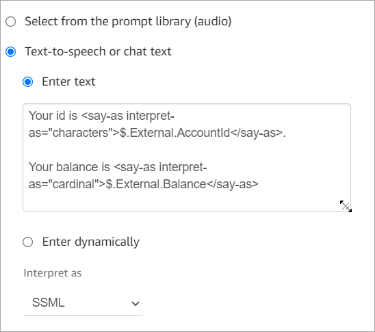

Make sure that the name specified for the source attribute matches the key name
returned from Lambda.

### 2. Store variables as contact attributes

If you store the variables as contact attributes, you can use them throughout your
flow, and they are included in contact records.

To store the values returned as contact attributes and then reference them, use a
**Set contact attributes** block in your flow after the
**Invoke AWS Lambda function** block. Choose **Use
attribute**, **External** for the
**Type**. Following the example we're using, set
**Destination Attribute** to `MyAccountId`, and set
the **attribute** to `AccountId`, and do the same for
`MyBalance` and **Balance**. This configuration is
shown in the following image.

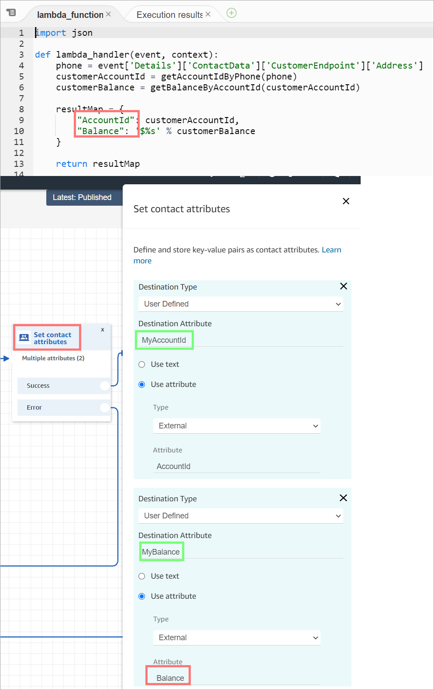

Add Address as a **Source attribute** and use
`returnedContactAddress` as the **Destination key**.
Then add `CallerType` as a **Source attribute** and use
`returnedContactType` for the **Destination key**,
as shown in the following image.

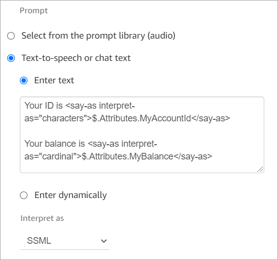

Make sure that the name specified for the source external attribute matches the
key name returned from Lambda.

## Tutorial: Create a Lambda function and invoke in

a flow

### Step 1: Create the Lambda

example

1. Sign in to the AWS Management Console and open the AWS Lambda console at
   [https://console.aws.amazon.com/lambda/](https://console.aws.amazon.com/lambda/ "https://console.aws.amazon.com/lambda/").
2. In AWS Lambda, choose **Create function**.
3. Choose **Author from scratch**, if it's not selected
   already. Under **Basic information**, for
   **Function name**, enter
   **MyFirstConnectLambda**. For all other options, accept
   the defaults. These options are shown in the following image of the AWS
   Lambda console.

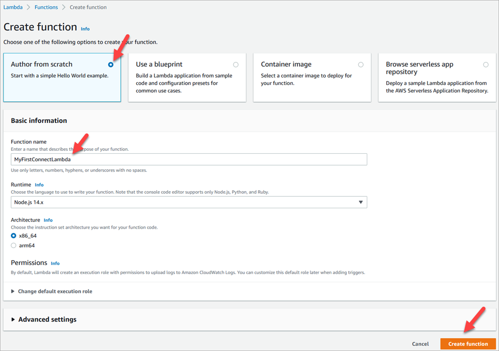 4. Choose **Create function**. 5. In the **Code source** box, in the
**index.js** tab, delete the template code from the
code editor. 6. Copy and paste the following code into the code editor as shown in the
following image:

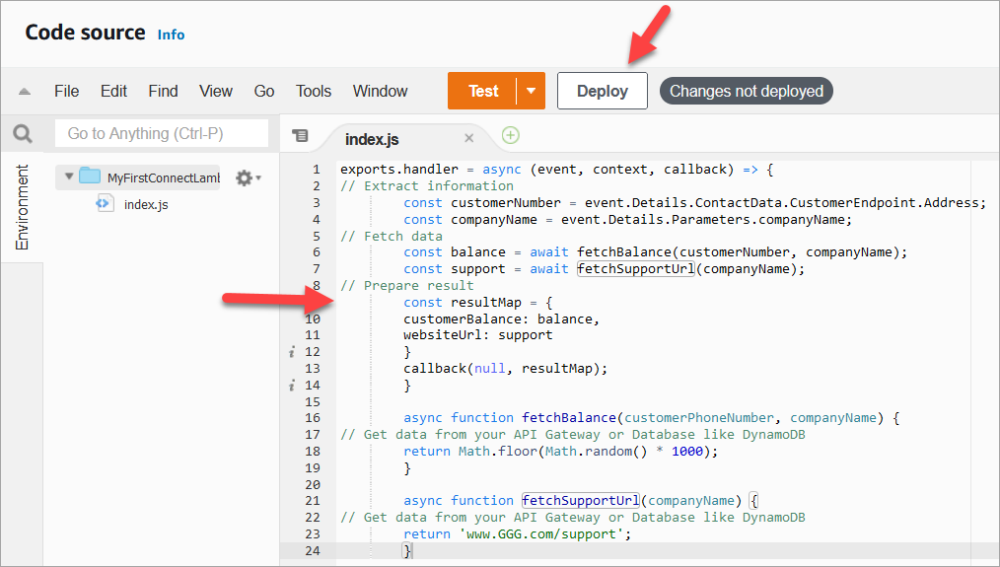

```
exports.handler = async (event, context, callback) => {
// Extract information
        const customerNumber = event.Details.ContactData.CustomerEndpoint.Address;
        const companyName = event.Details.Parameters.companyName;
// Fetch data
        const balance = await fetchBalance(customerNumber, companyName);
        const support = await fetchSupportUrl(companyName);
// Prepare result
        const resultMap = {
        customerBalance: balance,
        websiteUrl: support
        }
        callback(null, resultMap);
        }

        async function fetchBalance(customerPhoneNumber, companyName) {
// Get data from your API Gateway or Database like DynamoDB
        return Math.floor(Math.random() * 1000);
        }

        async function fetchSupportUrl(companyName) {
// Get data from your API Gateway or Database like DynamoDB
        return 'www.GGG.com/support';
        }
```

This code is going to generate a random result for the
customerBalance. 7. Choose **Deploy**. 8. After you choose **Deploy**, choose
**Test** to launch the test editor. 9. In the **Configure test event** dialog box, select
**Create new event**. For **Event
name**, enter **ConnectMock** as the test
name. 10. In the **Event JSON** box, delete the sample code and
enter the following code instead.

```
{
"Details": {
"ContactData": {
    "Attributes": {},
    "Channel": "VOICE",
    "ContactId": "4a573372-1f28-4e26-b97b-XXXXXXXXXXX",
    "CustomerEndpoint": {
    "Address": "+1234567890",
    "Type": "TELEPHONE_NUMBER"
    },
"InitialContactId": "4a573372-1f28-4e26-b97b-XXXXXXXXXXX",
"InitiationMethod": "INBOUND | OUTBOUND | TRANSFER | CALLBACK",
"InstanceARN": "arn:aws:connect:aws-region:1234567890:instance/c8c0e68d-2200-4265-82c0-XXXXXXXXXX",
"PreviousContactId": "4a573372-1f28-4e26-b97b-XXXXXXXXXXX",
"Queue": {
    "ARN": "arn:aws:connect:eu-west-2:111111111111:instance/cccccccc-bbbb-dddd-eeee-ffffffffffff/queue/aaaaaaaa-bbbb-cccc-dddd-eeeeeeeeeeee",
    "Name": "PasswordReset"
  },
"SystemEndpoint": {
    "Address": "+1234567890",
    "Type": "TELEPHONE_NUMBER"
    }
},
"Parameters": {
    "companyName": "GGG"
    }
},
"Name": "ContactFlowEvent"
}
```

11. Choose **Save**.
12. Choose **Test**. You should see the following something
    similar to the following image:

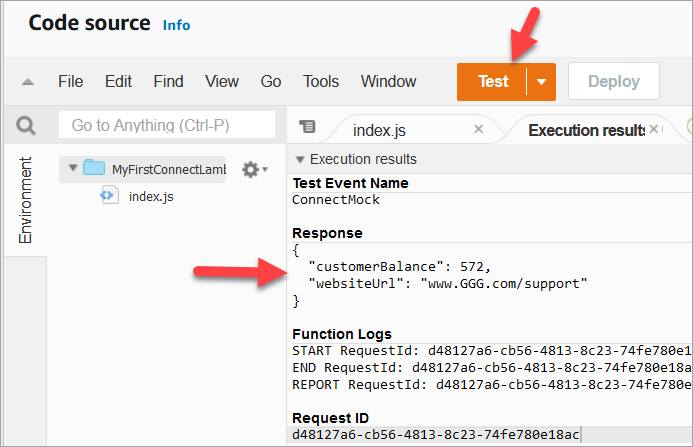

Your balance will be different. The code generates a random number.

### Step 2: Add your Lambda to

Amazon Connect

1. Go to the Amazon Connect console, at [https://console.aws.amazon.com/connect/](https://console.aws.amazon.com/connect/ "https://console.aws.amazon.com/connect/").
2. Choose your Amazon Connect instance alias.

 3. On the navigation menu, choose **Flows**. 4. In the AWS Lambda section, use the **Lambda Functions**
dropdown box to select **MyFirstConnectLambda**.

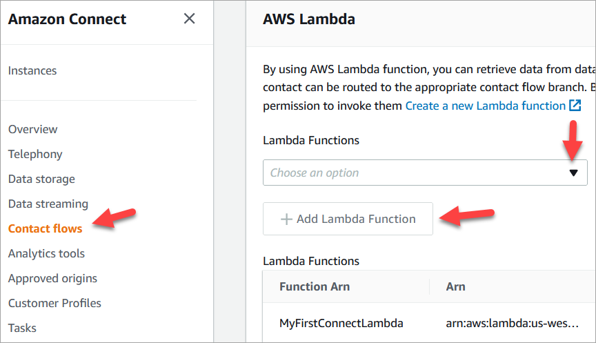 5. Choose **Add Lambda Function**.

### Step 3: Create the contact

flow

The following image is an example of the flow you are going to build using the
steps in this procedure. It contains the following blocks: **Set contact
attributes**, **Play prompt**, **Invoke AWS
Lambda function**, another **Set contact attributes**
block, another **Play prompt** block, and finally a
**Disconnect** block.

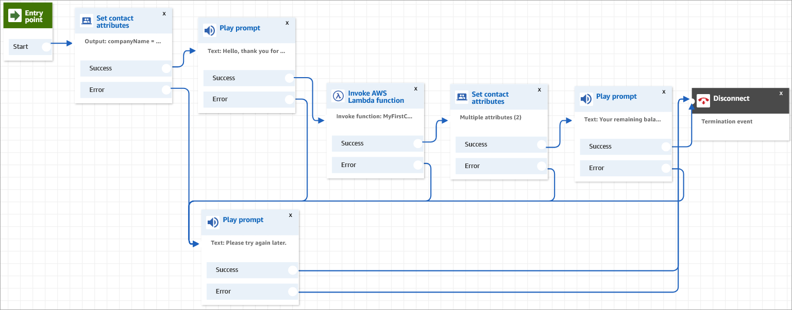

1. Log in to the Amazon Connect admin website at https://`instance name`.my.connect.aws/.
2. On the navigation menu, go to **Routing**,
   **Flows**, **Create a contact
   flow**.
3. Drag a [Set contact
   attributes](set-contact-attributes.md "set-contact-attributes.md") block onto the grid, and
   configure its properties page shown in the following image:

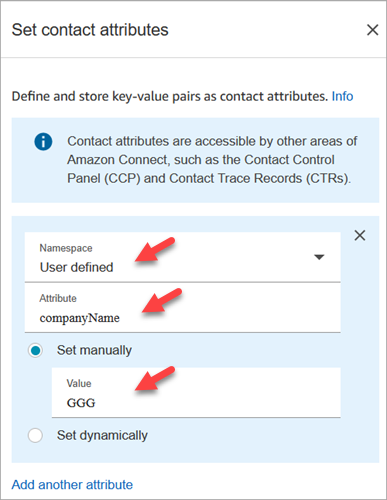

    1. **Namespace** = **User
     defined**.
    2. **Attribute** =
     **companyName**.
    3. Choose **Set manually**.
     **Value** = **GGG**.
    4. Choose **Save**.

4. Drag a [Play prompt](play.md "play.md") block onto the
   grid, and configure its properties page as shown in the following image:

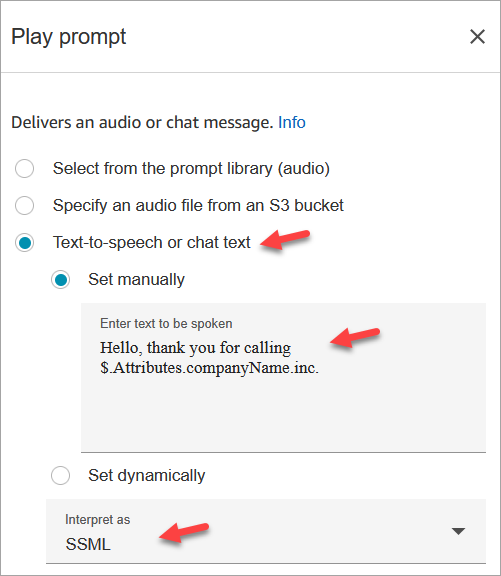

    1. Choose **Text-to-speech or chat text**,
     **Set manually**, and set **Interpret
     as** to **SSML**. Enter the following
     text in the box for the text to be spoken:


    `Hello, thank you for calling $.Attributes.companyName
     inc.`
    2. Choose **Save**.

5. Drag another [Play prompt](play.md "play.md") block onto
   the grid, and configure its properties page as shown in the following image:

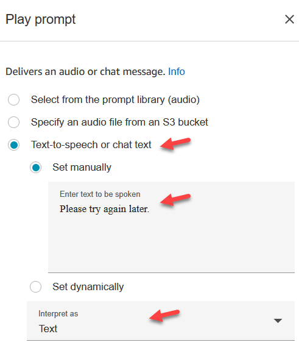

    1. Choose **Text-to-speech or chat text**,
     **Set manually**, and set **Interpret
     as** to **Text**. Enter the following
     text in the box for the text to be spoken:


    `Please try again later.`
    2. Choose **Save**.

6. Drag a [AWS Lambda
   function](invoke-lambda-function-block.md "invoke-lambda-function-block.md") block onto the
   grid, and configure its properties page as shown in the following image:

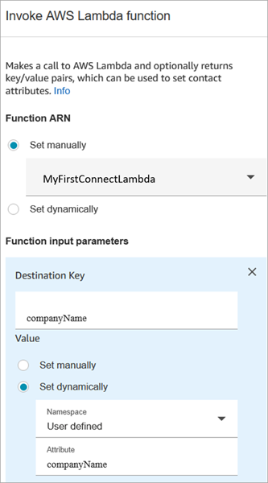

    1. Choose **Select manually**, and then choose
     **MyFirstConnectLambda** from the
     dropdown.
    2. In the **Destination Key** box, enter
     **companyName**. (This is sent to
     Lambda.)
    3. Choose **Set dynamically** box
    4. For **Namespace**, select **User
     Defined**.
    5. For **Attribute**, enter
     **companyName**.
    6. Choose **Save**.

7. Drag a [Set contact
   attributes](set-contact-attributes.md "set-contact-attributes.md") block onto the grid,
   choose **Add another attribute**, and configure its
   properties page as shown in the following image:

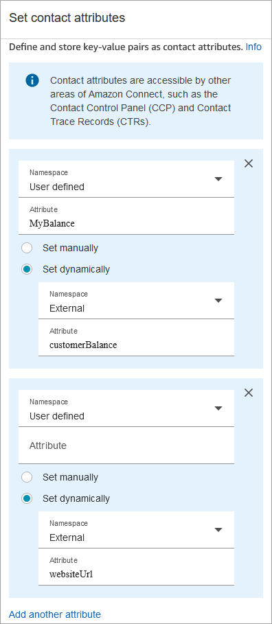

    1. **Namespace** = **User
     Defined**. **Attribute** =
     **MyBalance**.
    2. Choose **Set dynamically**.
    3. **Namespace** =
     **External**.
    4. **Attribute** =
     **customerBalance**. This is the result from
     Lambda.
    5. Choose **Add another attribute**.
    6. **Namespace** =
     **User-defined**.
    7. **Attribute** =
     **MyURL**.
    8. Select **Set dynamically**.
     **Namespace** =**External**.
    9. **Attribute** = **websiteUrl**.
     This is the result from Lambda.
    10. Choose **Save**.

8. Drag a [Play prompt](play.md "play.md") block onto the
   grid, and configure its properties page as shown in the following image:

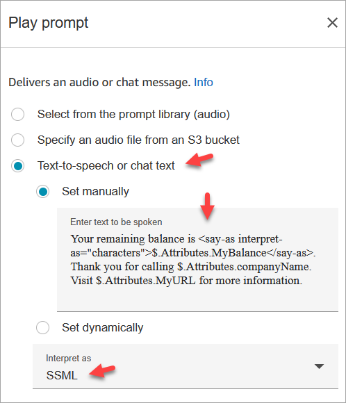

    1. Choose **Text-to-speech or chat text**, and set
     **Interpret as** to **SSML**.
     Enter the following text in the box:


    `Your remaining balance is <say-as
     interpret-as="characters">$.Attributes.MyBalance</say-as>.`


    `Thank you for calling
     $.Attributes.companyName.`


    `Visit $.Attributes.MyURL for more information.`
    2. Choose **Save**.

9. Drag a [Disconnect / hang up](disconnect-hang-up.md "disconnect-hang-up.md") block onto the grid.
10. Connect the all blocks so your flow looks like the image shown at the top
    of this procedure.
11. Enter **MyFirstConnectFlow** as the name, and then choose
    **Publish**.
12. On the navigation menu, go to **Channels**,
    **Phone numbers**.
13. Select your phone number.
14. Select **MyFirstConnectFlow** and choose
    **Save**.

Now try it out. Call the number. You should hear a greeting message, your balance,
and the website to visit.
