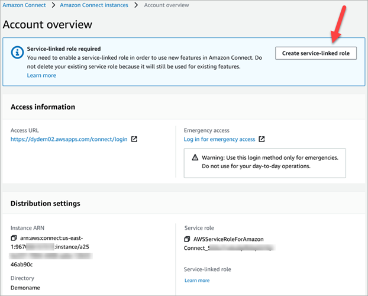
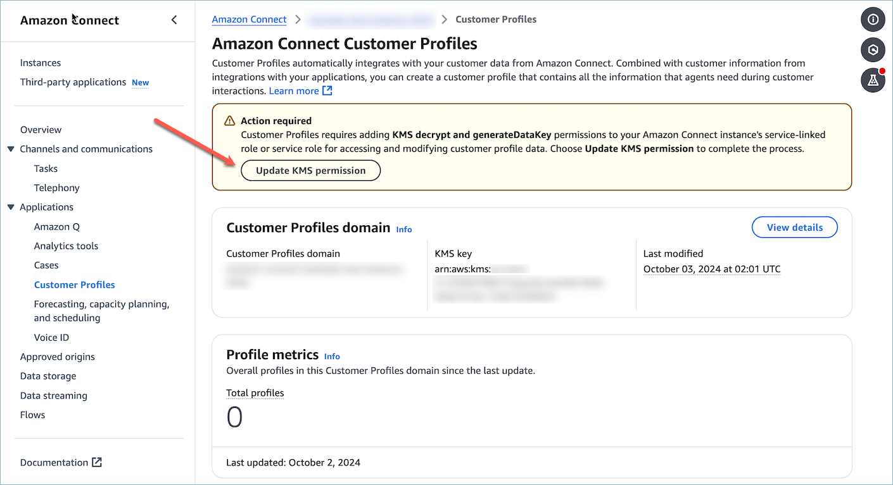

# Use service-linked roles and role permissions for Amazon Connect

## What are service-linked roles (SLR) and why are they

important?

Amazon Connect uses AWS Identity and Access Management (IAM) [service-linked roles](../../../IAM/latest/UserGuide/id_roles_terms-and-concepts.md#iam-term-service-linked-role "../../../IAM/latest/UserGuide/id_roles_terms-and-concepts.md#iam-term-service-linked-role"). A service-linked role is a unique type of IAM role that is
linked directly to an Amazon Connect instance.

Service-linked roles are predefined by Amazon Connect and include [all the permissions](#slr-permissions "#slr-permissions") that Amazon Connect requires to call other AWS services on your
behalf.

You need to enable service-linked roles so you can use new features in Amazon Connect, such as
tagging support, the new user interface in **User management** and
**Routing profiles**, and queues with CloudTrail support.

For information about other services that support service-linked roles, see [AWS services that work
with IAM](../../../IAM/latest/UserGuide/reference_aws-services-that-work-with-iam.md "../../../IAM/latest/UserGuide/reference_aws-services-that-work-with-iam.md") and look for the services that have **Yes** in
the **Service-Linked Role** column. Choose a **Yes** with a link to view the service-linked role documentation for
that service.

## Service-linked role permissions for Amazon Connect

Amazon Connect uses the service-linked role with the prefix
**AWSServiceRoleForAmazonConnect**\_`unique-id` –
Grants Amazon Connect permission to access AWS resources on your behalf.

The AWSServiceRoleForAmazonConnect prefixed service-linked role trusts the following services to assume the
role:

- `connect.amazonaws.com`

The [AmazonConnectServiceLinkedRolePolicy](security_iam_awsmanpol.md#amazonconnectservicelinkedrolepolicy "security_iam_awsmanpol.md#amazonconnectservicelinkedrolepolicy") role permissions policy allows Amazon Connect to
complete the following actions on the specified resources:

- Action: all Amazon Connect actions, `connect:*`, on all Amazon Connect resources.
- Action: IAM `iam:DeleteRole` to allow deletion of the service-linked
  role.
- Action: Amazon S3 `s3:GetObject`, `s3:DeleteObject`,
  `s3:GetBucketLocation`, and `GetBucketAcl` for the S3 bucket
  specified for recorded conversations.

It also grants `s3:PutObject`, `s3:PutObjectAcl`, and
`s3:GetObjectAcl` to the bucket specified for exported reports.

- Action: Amazon CloudWatch Logs `logs:CreateLogStream`,
  `logs:DescribeLogStreams`, and `logs:PutLogEvents` to the CloudWatch Logs
  group specified for flow logging.
- Action: Amazon Lex `lex:ListBots`, `lex:ListBotAliases` for all bots
  created in the account across all Regions.
- Action: Amazon Connect Customer Profiles

      + `profile:SearchProfiles`
      + `profile:CreateProfile`
      + `profile:UpdateProfile`
      + `profile:AddProfileKey`
      + `profile:ListProfileObjects`
      + `profile:ListAccountIntegrations`
      + `profile:ListProfileObjectTypeTemplates`
      + `profile:GetProfileObjectTypeTemplate`
      + `profile:ListProfileObjectTypes`
      + `profile:GetProfileObjectType`
      + `profile:ListCalculatedAttributeDefinitions`
      + `profile:GetCalculatedAttributeForProfile`
      + `profile:ListCalculatedAttributesForProfile`
      + `profile:GetDomain`
      + `profile:ListIntegrations`
      + `profile:GetIntegration`
      + `profile:PutIntegration`
      + `profile:DeleteIntegration`
      + `profile:CreateEventTrigger`
      + `profile:GetEventTrigger`
      + `profile:ListEventTriggers`
      + `profile:UpdateEventTrigger`
      + `profile:DeleteEventTrigger`
      + `profile:CreateCalculatedAttributeDefinition`
      + `profile:DeleteCalculatedAttributeDefinition`
      + `profile:GetCalculatedAttributeDefinition`
      + `profile:UpdateCalculatedAttributeDefinition`
      + `profile:PutProfileObject`
      + `profile:ListObjectTypeAttributes`
      + `profile:ListProfileAttributeValues`
      + `profile:BatchGetProfile`
      + `profile:BatchGetCalculatedAttributeForProfile`
      + `profile:ListSegmentDefinitions`
      + `profile:CreateSegmentDefinition`
      + `profile:GetSegmentDefinition`
      + `profile:DeleteSegmentDefinition`
      + `profile:CreateSegmentEstimate`
      + `profile:GetSegmentEstimate`
      + `profile:CreateSegmentSnapshot`
      + `profile:GetSegmentSnapshot`
      + `profile:GetSegmentMembership`
      + `profile:CreateDomainLayout`
      + `profile:UpdateDomainLayout`
      + `profile:DeleteDomainLayout`
      + `profile:GetDomainLayout`
      + `profile:ListDomainLayouts`
      + `profile:GetSimilarProfiles`
      + `profile:GetUploadJob`
      + `profile:GetUploadJobPath`
      + `profile:StartUploadJob`
      + `profile:StopUploadJob`
      + `profile:CreateUploadJob`
      + `profile:ListUploadJobs`
      + `profile:DetectProfileObjectType`

  to use your default Customer Profiles domain (including profiles and all object-types in domain)
  with the Amazon Connect flows and agent experience applications.

###### Note

Each Amazon Connect instance can be associated with only one domain at a time. However, you
can link any domain to an Amazon Connect instance. Cross-domain access within the same AWS
account and region is automatically enabled for all domains that start with the prefix
`amazon-connect-`. To restrict cross-domain access, you can either use
separate Amazon Connect instances to logically partition your data or use Customer Profiles
domain names within the same instance that do not start with the
`amazon-connect-` prefix, thereby preventing cross-domain access.

- Action: Amazon Q in Connect

      + `wisdom:CreateContent`
      + `wisdom:DeleteContent`
      + `wisdom:CreateKnowledgeBase`
      + `wisdom:GetAssistant`
      + `wisdom:GetKnowledgeBase`
      + `wisdom:GetContent`
      + `wisdom:GetRecommendations`
      + `wisdom:GetSession`
      + `wisdom:NotifyRecommendationsReceived`
      + `wisdom:QueryAssistant`
      + `wisdom:StartContentUpload`
      + `wisdom:UntagResource`
      + `wisdom:TagResource`
      + `wisdom:CreateSession`
      + `wisdom:CreateQuickResponse`
      + `wisdom:GetQuickResponse`
      + `wisdom:SearchQuickResponses`
      + `wisdom:StartImportJob`
      + `wisdom:GetImportJob`
      + `wisdom:ListImportJobs`
      + `wisdom:ListQuickResponses`
      + `wisdom:UpdateQuickResponse`
      + `wisdom:DeleteQuickResponse`
      + `wisdom:PutFeedback`
      + `wisdom:ListContentAssociations`
      + `wisdom:CreateMessageTemplate`
      + `wisdom:UpdateMessageTemplate`
      + `wisdom:UpdateMessageTemplateMetadata`
      + `wisdom:GetMessageTemplate`
      + `wisdom:DeleteMessageTemplate`
      + `wisdom:ListMessageTemplates`
      + `wisdom:SearchMessageTemplates`
      + `wisdom:ActivateMessageTemplate`
      + `wisdom:DeactivateMessageTemplate`
      + `wisdom:CreateMessageTemplateVersion`
      + `wisdom:ListMessageTemplateVersions`
      + `wisdom:CreateMessageTemplateAttachment`
      + `wisdom:DeleteMessageTemplateAttachment`
      + `wisdom:RenderMessageTemplate`
      + `wisdom:CreateAIAgent`
      + `wisdom:CreateAIAgentVersion`
      + `wisdom:DeleteAIAgent`
      + `wisdom:DeleteAIAgentVersion`
      + `wisdom:UpdateAIAgent`
      + `wisdom:UpdateAssistantAIAgent`
      + `wisdom:RemoveAssistantAIAgent`
      + `wisdom:GetAIAgent`
      + `wisdom:ListAIAgents`
      + `wisdom:ListAIAgentVersions`
      + `wisdom:CreateAIPrompt`
      + `wisdom:CreateAIPromptVersion`
      + `wisdom:DeleteAIPrompt`
      + `wisdom:DeleteAIPromptVersion`
      + `wisdom:UpdateAIPrompt`
      + `wisdom:GetAIPrompt`
      + `wisdom:ListAIPrompts`
      + `wisdom:ListAIPromptVersions`
      + `wisdom:CreateAIGuardrail`
      + `wisdom:CreateAIGuardrailVersion`
      + `wisdom:DeleteAIGuardrail`
      + `wisdom:DeleteAIGuardrailVersion`
      + `wisdom:UpdateAIGuardrail`
      + `wisdom:GetAIGuardrail`
      + `wisdom:ListAIGuardrails`
      + `wisdom:ListAIGuardrailVersions`
      + `wisdom:CreateAssistant`
      + `wisdom:ListTagsForResource`
      + `wisdom:SendMessage`
      + `wisdom:GetNextMessage`
      + `wisdom:ListMessages`

  with resource tag `'AmazonConnectEnabled':'True'` on all Amazon Connect Amazon Q in Connect
  resources associated with your Amazon Connect instance.

      + `wisdom:ListAssistants`
      + `wisdom:KnowledgeBases`

  on all Amazon Q in Connect resources.

- Action: Amazon CloudWatch Metrics `cloudwatch:PutMetricData` to publish Amazon Connect usage
  metrics for an instance to your account.
- Action: Amazon Pinpoint SMS and Voice `sms-voice:DescribePhoneNumbers` and
  `sms-voice:SendTextMessage` to allow Amazon Connect to send SMS.
- Action: Amazon Pinpoint `mobiletargeting:SendMessages` to allow Amazon Connect to send push
  notifications.
- Action: Amazon Cognito user pools `cognito-idp:DescribeUserPool` and
  `cognito-idp:ListUserPoolClients` to allow Amazon Connect access to select read
  operations on Amazon Cognito user pools resources that have an `AmazonConnectEnabled` resource
  tag.
- Action: Amazon Chime SDK Voice Connector `chime:GetVoiceConnector` to allow read
  access for Amazon Connect on all Amazon Chime SDK Voice Connector resources that have an
  `'AmazonConnectEnabled':'True'` resource tag.
- Action: Amazon Chime SDK Voice Connector `chime:ListVoiceConnectors` for all Amazon Chime
  SDK Voice Connectors created in the account across all Regions.
- Action: Amazon Connect Messaging WhatsApp integration. Grants Amazon Connect permissions to the
  following AWS End User Messaging Social APIs:

      + `social-messaging:SendWhatsAppMessage`
      + `social-messaging:PostWhatsAppMessageMedia`
      + `social-messaging:GetWhatsAppMessageMedia`
      + `social-messaging:GetLinkedWhatsAppBusinessAccountPhoneNumber`

  The Social APIs are restricted to your phone number resources that are enabled for
  Amazon Connect. A phone number is tagged with `AmazonConnectEnabled : True` when it is
  imported into an Amazon Connect instance.

- Action: Amazon Connect Messaging WhatsApp message template integration. Grants Amazon Connect
  permission to call AWS End User Messaging Social APIs. An AWS account's WhatsApp business
  accounts may be listed. Additionally, the templates of a WhatsApp business account may be
  listed and a template's details may be retrieved as long as the WhatsApp business account
  is tagged `AmazonConnectEnabled: True`.
  - `social-messaging:ListLinkedWhatsAppBusinessAccounts`
  - `social-messaging:GetWhatsAppMessageTemplate`
  - `social-messaging:ListWhatsAppMessageTemplates`

- Action: Amazon SES

      + `ses:DescribeReceiptRule`
      + `ses:UpdateReceiptRule`

  on all Amazon SES receipt rules. Used to send and receive emails.

      + `ses:DeleteEmailIdentity` for
       {`instance-alias`}.email.connect.aws SES domain identity.
       Used for email domain management that is provided by Amazon Connect.

      + `ses:SendRawEmail` for sending emails with an SES configuration set
       that is provided by Amazon Connect (configuration-set-for-connect-DO-NOT-DELETE).

      + `iam:PassRole` for `AmazonConnectEmailSESAccessRole` service
       role which is used by Amazon SES. For Amazon SES Receipt rule management, Amazon SES requires a role
       to be passed, which it assumes.

- Action: Amazon Polly
  - `polly:ListLexicons`
  - `polly:DescribeVoices`
  - `polly:SynthesizeSpeech`

As you enable additional features in Amazon Connect, the following permissions are added for the
service-linked role to access the resources associated with those features by using in-line
policies:

- Action: Amazon Data Firehose `firehose:DescribeDeliveryStream` and
  `firehose:PutRecord`, and `firehose:PutRecordBatch` for the
  delivery stream defined for agent event streams and contact records.
- Action: Amazon Kinesis Data Streams `kinesis:PutRecord`, `kinesis:PutRecords`, and
  `kinesis:DescribeStream` for the stream specified for agent event streams and
  contact records.
- Action: Amazon Lex `lex:PostContent` for the bots added to your instance.
- Action: Amazon Connect Voice-ID `voiceid:*` for the Voice ID domains associated with
  your instance.
- Action: EventBridge `events:PutRule` and `events:PutTargets` for the
  Amazon Connect managed EventBridge rule for publishing CTR records for your associated Voice ID
  domains.
- Action: outbound campaigns

      + `connect-campaigns:CreateCampaign`
      + `connect-campaigns:DeleteCampaign`
      + `connect-campaigns:DescribeCampaign`
      + `connect-campaigns:UpdateCampaignName`
      + `connect-campaigns:GetCampaignState`
      + `connect-campaigns:GetCampaignStateBatch`
      + `connect-campaigns:ListCampaigns`
      + `connect-campaigns:UpdateOutboundCallConfig`
      + `connect-campaigns:UpdateDialerConfig`
      + `connect-campaigns:PauseCampaign`
      + `connect-campaigns:ResumeCampaign`
      + `connect-campaigns:StopCampaign`

  for all operations related to outbound campaigns.

You must configure permissions to allow an IAM entity (such as a user, group, or role)
to create, edit, or delete a service-linked role. For more information, see [Service-linked role permissions](../../../IAM/latest/UserGuide/using-service-linked-roles.md#service-linked-role-permissions "../../../IAM/latest/UserGuide/using-service-linked-roles.md#service-linked-role-permissions") in the
_IAM User Guide_.

## Create a service-linked role for Amazon Connect

You don't need to manually create a service-linked role. When you
create a new instance in Amazon Connect in the AWS Management Console, Amazon Connect creates the service-linked role for
you.

If you delete this service-linked role, and then need to create it again, you can use the
same process to recreate the role in your account. When you create a new instance in Amazon Connect, Amazon Connect
creates the service-linked role for you again.

You can also use the IAM console to create a service-linked role with the
**Amazon Connect - Full access** use case. In the IAM CLI or the IAM API, create
a service-linked role with the `connect.amazonaws.com` service name. For more
information, see [Creating a
service-linked role](../../../IAM/latest/UserGuide/using-service-linked-roles.md#create-service-linked-role "../../../IAM/latest/UserGuide/using-service-linked-roles.md#create-service-linked-role") in the _IAM User Guide_. If you delete this
service-linked role, you can use this same process to create the role again.

## For instances created before October 2018

###### Tip

Having trouble signing in to manage your AWS account? Don't know who manages your
AWS account? For help, see [Troubleshooting AWS
account sign-in issues](../../../signin/latest/userguide/troubleshooting-sign-in-issues.md "../../../signin/latest/userguide/troubleshooting-sign-in-issues.md").

If your Amazon Connect instance was created before October 2018, you don't have service-linked
roles set up. To create a service-linked role, on the **Account overview**
page, choose **Create service-linked role**, as shown in the following
image.

For a list of the IAM permissions required to create the service-linked role, see [Overview page](security-iam-amazon-connect-permissions.md#overview-page "security-iam-amazon-connect-permissions.md#overview-page") in the [Required permissions for using
custom IAM policies to manage access to the Amazon Connect console](security-iam-amazon-connect-permissions.md "security-iam-amazon-connect-permissions.md") topic.

## For Customer Profile domains created before Jan 31, 2025

and configured with a customer KMS key to encrypt data, you need to grant additional KMS
permissions to your Amazon Connect Instance.

If your associated Customer Profile domain was created before Jan 31, 2025 and the domain
uses a Customer-Managed KMS key (CMK) for encryption, to enable CMK enforcement by the Connect
Instance, take the following actions:

1. Provide an Amazon Connect instance's Service-Linked Role (SLR) permission to use
   your Customer Profiles domain's AWS KMS keys by navigating to the Customer Profiles’s page in Amazon Connect’s AWS
   Management Console and choose **Update KMS permission**.

 2. Create a [support ticket](https://support.console.aws.amazon.com/support "https://support.console.aws.amazon.com/support") with the Amazon Connect Customer Profiles team to request CMK permission enforcement for
your account.

For a list of IAM permission to update your Amazon Connect instance, see the required
permission for custom IAM policies for the [Customer Profiles page](security-iam-amazon-connect-permissions.md#customer-profiles-page "security-iam-amazon-connect-permissions.md#customer-profiles-page") .

## Edit a service-linked role for Amazon Connect

Amazon Connect does not allow you to edit the AWSServiceRoleForAmazonConnect prefixed service-linked role. After you
create a service-linked role, you cannot change the name of the role because various entities
might reference the role. However, you can edit the description of the role using IAM. For
more information, see [Editing a
service-linked role](../../../IAM/latest/UserGuide/using-service-linked-roles.md#edit-service-linked-role "../../../IAM/latest/UserGuide/using-service-linked-roles.md#edit-service-linked-role") in the _IAM User Guide_.

## Checking a service-linked role has permissions for Amazon Lex

1. On the navigation pane of the IAM console, choose **Roles**.
2. Choose the name of the role to modify.

## Delete a service-linked role for Amazon Connect

You don't need to manually delete the AWSServiceRoleForAmazonConnect prefixed role. When you
delete your Amazon Connect instance in the AWS Management Console, Amazon Connect
cleans up the resources and deletes the service-linked role for you.

## Supported Regions for Amazon Connect service-linked roles

Amazon Connect supports using service-linked roles in all of the regions where the service is
available. For more information, see [AWS Regions and Endpoints](../../../general/latest/gr/rande.md#connect_region "../../../general/latest/gr/rande.md#connect_region").
