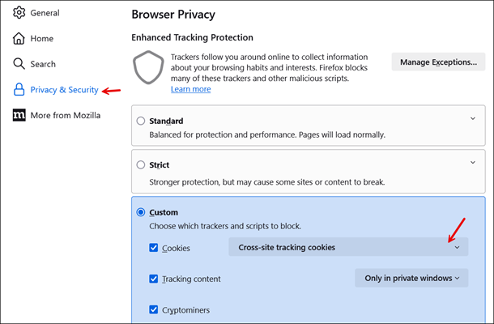
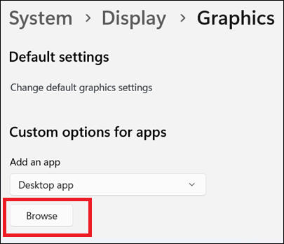
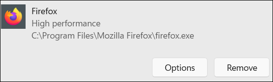
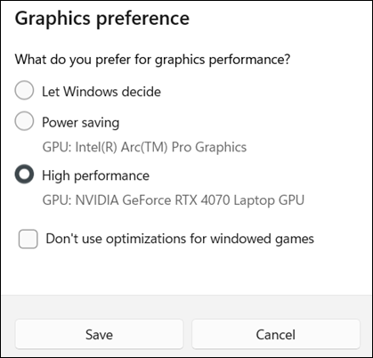

# Browsers supported by Amazon Connect

###### Important

**Trying to contact Amazon support?** See [Amazon Customer Service](https://www.amazon.com/gp/help/customer/display.html?icmpid=docs_connect_browsers_customerservice "https://www.amazon.com/gp/help/customer/display.html?icmpid=docs_connect_browsers_customerservice") (Amazon orders and deliveries) or [AWS
Support](https://aws.amazon.com/premiumsupport/?icmpid=docs_connect_browsers_premiumsupport "https://aws.amazon.com/premiumsupport/?icmpid=docs_connect_browsers_premiumsupport") (Amazon Web Services).

Before you work with Amazon Connect, verify that your browser is supported using the following
table.

| Browser                 | Version                                                                                                                                                                                                                                                                                                                                                           | How to check your version                                                                                                                                                                                                                             |
| ----------------------- | ----------------------------------------------------------------------------------------------------------------------------------------------------------------------------------------------------------------------------------------------------------------------------------------------------------------------------------------------------------------- | ----------------------------------------------------------------------------------------------------------------------------------------------------------------------------------------------------------------------------------------------------- | -------------------------------------------------------------------------------------------------------------------------------------------------------------------------------------------------------------------------------------------------------------------------------------------------------------------------------------------------------------------------------------------------------------------------------------------------------------------------------------------------------------------------------------------------------------------------------------------------------------------------------------------------------------------------------------------------------------------------------------------------------------------------------------------------------------------------------------------------------------------------------------------------------------------------------------------------------------------------------------------------------------------------------------------------------------------------------------------------------------------------------------------------------------------------------------------------------------------------------------------------------------------------------------------------------------------------------------------------------------------------------------------------------------------------------------------------------------------------------------------------------------------------------------------------------------------------------------------------------------------------------------------------------------------------------------------------------------------------------------------------------------------------------------------------------------------------------------------------------------------------------------------------------------------------------------------------------------------------------------------------------------------------------------------------------------------------------------------------------------------------------------------------------------------------------------------------------------------------------------------------------------------------------------------------------------------------------------------------------------------------------------------------------------------------------------------------------------------------------------------------------------------------------------------------------------------------------------------------------------------------------------------------------------------------------------------------------------------------------------------------------------------------------------------------------------------------------------------------------------------------------------------------------------------------------------------------------------------------------------------------------------------------------------------------------------------------------------------------------------------------------------------------------------------------------------------------------------------------------------------------------------------------------------------------------------------------------------------------------------------------------------------------------------------------------------------------------------------------------------------------------------------------------------------------------------------------------------------------------------------------------------------------------------------------------------------------------------------------------------------------------------------------------------------------------------------------------------------------------------------------------------------------------------------------------------------------------------------------------------------------------------------------------------------------------------------------------------------------------------------------------------------------------------------------------------------------------------------------------------------------------------------------------------------------------------------------------------------------------------------------------------------------------------------------------------------------------------------------------------------------------------------------------------------------------------------------------------------------------------------------------------------------------------------------------------------------------------------------------------------------------------------------------------------------------------------------------------------------------------------------------------------------------------------------------------------------------------------------------------------------------------------------------------------------------------------------------------------------------------------------------------------------------------------------------------------------------------------------------------------------------------------------------------------------------------------------------------------------------------------------------------------------------------------------------------------------------------------------------------------------------------------------------------------------------------------------------------------------------------------------------------------------------------------------------------------------------------------------------------------------------------------------------------------------------------------------------------------------------------------------------------------------------------------------------------------------------------------------------------------------------------------------------------------------------------------------------------------------------------------------------------------------------------------------------------------------------------------------------------------------------------------------------------------------------------------------------------------------------------------------------------------------------------------------------------------------------------------------------------------------------------------------------------------------------------------------------------------------------------------------------------------------------------------------------------------------------------------------------------------------------------------------------------------------------------------------------------------------------------------------------------------------------------------------------------------------------------------------------------------------------------------------------------------------------------------------------------------------------------------------------------------------------------------------- |
| Google Chrome           | Latest three versions                                                                                                                                                                                                                                                                                                                                             | Open Chrome and type chrome://version in your address bar. The version is in the Google Chrome field at the top of the results. Please see [Google Chrome update on third-party cookies](#chrome-issue "#chrome-issue").                              |
| Microsoft Edge Chromium | Latest three versions                                                                                                                                                                                                                                                                                                                                             | Open Edge. On the menu, choose **Help and feedback** and then choose **About Microsoft Edge**. The version number is listed in the **About** section.                                                                                                 |
| Mozilla Firefox         | Latest three versions                                                                                                                                                                                                                                                                                                                                             | Open Firefox. On the menu, choose the Help icon and then choose **About Firefox**. The version number is listed under the Firefox name. Please see [Firefox Enhanced Tracking Protection updates](#browsers-firefox-issue "#browsers-firefox-issue"). |
| Mozilla Firefox ESR     | Versions are supported until their Firefox [end-of-life date](https://support.mozilla.org/en-US/kb/firefox-esr-release-cycle "https://support.mozilla.org/en-US/kb/firefox-esr-release-cycle"). For details, see the [Firefox ESR release calendar](https://wiki.mozilla.org/Release_Management/Calendar "https://wiki.mozilla.org/Release_Management/Calendar"). | Open Firefox. On the menu, choose the Help icon and then choose **About Firefox**. The version number is listed under the Firefox name.                                                                                                               | Safari is not supported. For more requirements, see [Agent headset and workstation requirements for using the Contact Control Panel (CCP)](ccp-agent-hardware.md "ccp-agent-hardware.md"). ## Browsers on mobile devices The Amazon Connect console, Contact Control Panel (CCP), and agent workspace do not support mobile browsers. However, your agents can forward the audio portion of the call to their mobile device. For instructions, see [Forward calls in the Amazon Connect CCP to a mobile device (iPhone, Android)](forward-calls-to-mobile-device.md "forward-calls-to-mobile-device.md"). ## Supported browsers and mobile OS for in-app, web, and video calling capabilities  • Amazon Chime SDK for iOS and Android: + iOS version 13 and later + Android OS version 8.1 and later, ARM and ARM64 architecture  • Web browsers for out-of-the-box communications widget and JS SDK + Latest three versions of Google Chrome, Firefox, Safari, and Microsoft Edge Chromium on MacOS, Windows, iOS, and Android.  • Voice Focus (VF) and Echo Reduction (ER) feature support in out-of-the-box communications widgets The out-of-the-box communications widget's Voice Focus (VF) and Echo Reduction (ER) features are not universally supported across all devices. Lower specification devices may not support Amazon Voice Focus irrespective to laptop, desktop or iOS and Android devices. Check Amazon Chime SDK for JavaScript documentation [here](https://aws.github.io/amazon-chime-sdk-js/modules/amazonvoice_focus.html#can-i-use-amazon-voice-focus-and-echo-reduction-in-my-application "https://aws.github.io/amazon-chime-sdk-js/modules/amazonvoice_focus.html#can-i-use-amazon-voice-focus-and-echo-reduction-in-my-application") for more information. On devices where Voice Focus is not supported, the browser's built-in noise suppression is relied upon. If you are building custom communication widget, you can follow [Integrating Amazon Voice Focus and Echo Reduction into your Amazon Chime SDK for JavaScript application](https://aws.github.io/amazon-chime-sdk-js/modules/amazonvoice_focus.html#integrating-amazon-voice-focus-and-echo-reduction-into-your-amazon-chime-sdk-for-javascript-application "https://aws.github.io/amazon-chime-sdk-js/modules/amazonvoice_focus.html#integrating-amazon-voice-focus-and-echo-reduction-into-your-amazon-chime-sdk-for-javascript-application") or Amazon Chime SDK React component library documentation on [Voice Focus and WebAudio Best Practice](https://aws.github.io/amazon-chime-sdk-component-library-react/?path=/docs/sdk-providers-voicefocusprovider--page#voice-focus-and-webaudio-best-practice "https://aws.github.io/amazon-chime-sdk-component-library-react/?path=/docs/sdk-providers-voicefocusprovider--page#voice-focus-and-webaudio-best-practice") to implement Voice Focus and Echo Reduction. For more information, see [Set up in-app, web, video calling, and screen sharing capabilities](inapp-calling.md "inapp-calling.md"). The communications widget supports browser notifications for desktop devices. For more information, see [Send browser notifications to customers when chat messages arrive](browser-notifications-chat.md "browser-notifications-chat.md"). ## Google Chrome update on third-party cookies On July 22, 2024, Google announced a change in its plans regarding third-party cookies. Rather than deprecating third-party cookies by default, Google offers an opt-in mechanism for users to disable them. ###### Note **For businesses that embed the Contact Control Panel (CCP) into a custom workspace**: If your agents use Google's opt-in mechanism to disable third-party cookies, it will cause authentication issues when they use the CCP. Amazon Connect relies on third-party cookies to facilitate authentication. Ensure that third-party cookies are enabled in your agents' browser settings to avoid any authentication issues while using the CCP. ## Firefox Enhanced Tracking Protection updates As of February 2024, Firefox prevents the Amazon Connect CCP from being embedded in another application. As a result, agents are prevents from handling contacts. This is because Firefox enabled Total Cookie Protection by default for all users, including users who have set their [Enhanced Tracking Protection setting as Standard](https://support.mozilla.org/en-US/kb/introducing-total-cookie-protection-standard-mode "https://support.mozilla.org/en-US/kb/introducing-total-cookie-protection-standard-mode") . To prevent impacts to your users (agents), we recommend that your users complete the following steps: 1. In your Firefox browser, choose **Settings**, **Privacy & Security** 2. In the **Custom** box, for **Cookies** choose **Cross-site tracking cookies**, as shown in the following image.  ## Firefox browser guidance for Microphone Access The Amazon Connect CCP conforms to Firefox microphone usage guidance, and only has access to connect to the user's microphone when the CCP tab is in focus. This may lead to missed call scenarios when the CCP tab is not in focus, for example, if the agent focused on a different tab or application.  • Agents must focus on the CCP or Agent Workspace Firefox browser tab when they accept and connect to a voice contact. ## Optimize performance for Flow Designer for a multiple GPU system on Windows If you're using Flow Designer on a Windows system with dual GPUs, you might notice that animations in Firefox feel less smooth compared to Chrome. This happens because, by default, browsers use the power-saving GPU. For Chrome, the default output is 60 FPS. However, Firefox may cap at 30 FPS, leading to less fluid animations. If your system has a dedicated GPU, you can improve performance by changing its GPU preferences in Window settings. ###### To ensure the best animation performance in a supported browser: 1. On your computer, open **Windows Settings**. 2. Navigate to **Display**, **Graphics**, **Browse**. The following image shows the **Browse** button.  3. Navigate to the installation folder:  • For **Firefox**, it is typically located at path: `C:\Program Files\Mozilla Firefox`  • For **Chrome**, it is typically located at path: `C:\Program Files\Google\Chrome\Application` 4. Select `firefox.exe` or `chrome.exe`. 5. Choose **Options** under Firefox or Chrome. The following image shows an example of the Firefox High performance **Options** button.  6. Choose **High Performance** to use the dedicated GPU. The following image shows an example **Graphics preference** page with the **High performance** option.  7. Save your changes and restart your browser. |
