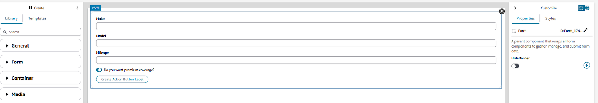

# Add the Amazon Connect widget to your website to accept

chat, task, email, and web calling contacts

The topics in this section explain how to create and customize a communications widget for
your website. You'll create a contact form that determines the behavior for contacts created
through your widget, and then customize the widget's appearance and functionality.

###### Contents

- [Step 1: Create a contact form for your widget](#create-web-form "#create-web-form")
- [Step 2: Customize your communications
  widget](#customize-communications-widget "#customize-communications-widget")
- [Step 3: Specify the website domains
  where you expect to display the communications widget](#communications-widget-domains "#communications-widget-domains")
- [Step 4: Confirm and copy
  communications widget code and security keys](#confirm-and-copy-communications-widget-script "#confirm-and-copy-communications-widget-script")

## Step 1: Create a contact form for your widget

In this step, you create and customize a View that determines the behavior
for contacts created through your widget.

1.  Log in to the Amazon Connect admin website at [https://instance name.my.connect.aws/](https://instance name.my.connect.aws/ "https://instance name.my.connect.aws/"). Under the
    **Routing** tab, select **Flows**.
2.  At the top left, click **Views**.
3.  Select **Create View**.
4.  Here you can configure a contact form for your customers using the [no-code builder](no-code-ui-builder.md "no-code-ui-builder.md"). Some important
    tips:
    - Using the Form component will allow you to link Form Inputs to your
      contact on creation. Form linking will allow you to take input directly
      from anyone interacting with your widget and use the information they
      include in the form during contact creation.
    - The Connect Action component is the most important element in the form
      for creating a contact. This component should be used without any other
      button type components in the form.
    - Exactly one Connect Action component must be present to use the View
      with a Contact Form widget.
    - There are three options supported for ConnectActionType for the
      Connect Action component:

          + StartEmailContact
          + StartTaskContact
          + StartChatContact

      Both Email and Task can be used in a contact form. To create a pre-chat
      form for chat contacts, see [Add a chat user interface to your website hosted by
      Amazon Connect](add-chat-to-website.md "add-chat-to-website.md").

    - There are many style options for the View components, allowing you to
      customize the form to fit your environment.

5.  Once you’ve added a **Connect Action button** to your form,
    you can set values for the contacts created by the form by linking them to the
    options in the Connect Action button. Components that you would like to link
    must be in the same Form in the View as the **Connect Action
    button**.



The following components are supported for form linking:

    * Form Input
    * Dropdown (turn off multi-select)
    * Date Picker
    * Text Area
    * Time Picker

6. Once your View is ready, select **Publish**.

## Step 2: Customize your communications

widget

In this step, you customize the experience of the communications widget for your
customers.

1. Log in to the Amazon Connect admin website at [https://instance name.my.connect.aws/](https://instance name.my.connect.aws/ "https://instance name.my.connect.aws/"). Choose **Customize
   communications widget**.
2. On the Communications widgets page, choose **Add communications
   widget** to begin customizing a new communications widget
   experience. To edit, delete, or duplicate an existing communications widget,
   choose from the options under the **Actions** column.
3. Enter a **Name** and **Description** for the
   communications widget.

###### Note

The Name must be unique for each communications widget created in an
Amazon Connect instance. 4. In the **Communications options** section, select
**Add Contact Form**. 5. Select the View you configured in the previous step. If the Connect Action
component in the View does not have a contact flow set, you will need to set one
here. 6. Click **Save and Continue**.

On the **Create communication widget** page, choose the widget button styles, and display
names and styles. As you choose these options, the widget preview updates automatically
so that you can see what the experience will look like for your customers.

###### Note

The preview does not display the View contact form that you've created. Only the
header styling is displayed.

### Display type

You may choose between two display types for Contact Form widgets:

- _Floating action button_ allows you to pin your widget
  as an interactable button on the bottom right corner of the web page
- _Embedded inline_ allows you to embed your widget
  directly in the web page without requiring a button push to load it

### Button styles

1. Choose the colors for the button background by entering hex values (HTML
   color codes).
2. Choose White or Black for the icon color. The icon color can't be
   customized.

### Widget header

1. Provide values for header message and color, and widget background
   color.
2. _Logo URL:_ Insert a URL to your logo banner from an
   Amazon S3 bucket or another online source.

###### Important

The communications widget preview in the customization page will not display
the logo if it's from an online source other than an Amazon S3 bucket. However,
the logo will be displayed when the customized communications widget is
implemented to your page.

The banner must be in .svg, .jpg or .png format. The image can be 280px (width) by
60px (height). Any image larger than those dimensions will be scaled to fit the
280x60 logo component space.

- For instructions about how to upload a file such as your logo banner to
  S3, see [Uploading objects](# "#") in the _Amazon
  Simple Storage Service User Guide_.
- Make sure that the image permissions are properly set so that the
  communications widget has permissions to access the image. For information
  about how to make a S3 object publicly accessible, see [Step
  2: Add a bucket policy](# "#") in the Setting permissions for website
  access topic.

## Step 3: Specify the website domains

where you expect to display the communications widget

1. Enter the website domains where you want to place the communications widget.
   The widget loads only on websites that you select in this step.

Choose **Add domain** to add up to 50 domains.


Domain allowlist behavior:

    * Subdomains are automatically included. For example, if you allow example.com, all
     its subdomains (like sub.example.com) are also allowed.
    * Protocol http:// or https:// must exactly match your configuration. Specify the exact protocol when setting up allowed domains.
    * All URL paths are automatically allowed. For example, if example.com is allowed,
     all pages under it (such as example.com/cart or example.com/checkout) are
     accessible. You cannot allow or block specific subdirectories.

###### Important

    * Double-check that your website URLs are valid and does not contain
     errors. Include the full URL starting with https://.
    * We recommend using https:// for your production websites and
     applications.

2. Under **Add security for your communications widget**, we
   recommend choosing **Yes**, and working with your website
   administrator to set up your web servers to issue JSON Web Tokens (JWTs) for new
   contact requests. This provides you more control when initiating new contacts,
   including the ability to verify that requests sent to Amazon Connect are from
   authenticated users.


Choosing **Yes** results in the following:

    * Amazon Connect provides a 44-character security key on the next page that you
     can use to create JSON Web Tokens (JWTs).
    * Amazon Connect adds a callback function within the communications widget embed
     script that checks for a JSON Web Token (JWT) when a contact is
     initiated.


    You must implement the callback function in the embedded snippet, as
     shown in the following example.


    ```
    amazon_connect('authenticate', function(callback) {
      window.fetch('/token').then(res => {
        res.json().then(data => {
          callback(data.data);
        });
      });
    });
    ```

If you choose this option, in the next step you'll get a security key for all
contact requests initiated on your websites. Ask your website administrator to
set up your web servers to issue JWTs using this security key. 3. Choose **Save**.

## Step 4: Confirm and copy

communications widget code and security keys

In this step, you confirm your selections and copy the code for the communications
widget and embed it in your website. If you chose to use JWTs in [Step 3](#communications-widget-domains "#communications-widget-domains"), you can also copy the secret
keys for creating them.

### Security key

Use this 44-character security key to generate JSON web tokens from your web
server. You can also update, or rotate, keys if you need to change them. When you do
this, Amazon Connect provides you with a new key and maintains the previous key until you
have a chance to replace it. After you have the new key deployed, you can come back
to Amazon Connect and delete the previous key.


When your customers interact with the communications widget on your website, the
widget requests your web server for a JWT. When this JWT is provided, the widget
will then include it as part of the end customer's contact request to Amazon Connect. Amazon Connect
then uses the secret key to decrypt the token. If successful, this confirms that the
JWT was issued by your web server and Amazon Connect routes the contact request to your
contact center agents.

#### JSON Web Token specifics

- Algorithm: **HS256**
- Claims:

      + **sub**:
       `widgetId`


      Replace `widgetId` with your own widgetId. To find
       your widgetId, see the example at [Communications widget script](#communications-widget-script "#communications-widget-script").
      + **iat**: \*Issued At Time.
      + **exp**: \*Expiration (10 minute
       maximum).
      + **segmentAttributes (optional)**: A set of
       system defined key-value pairs stored on individual contact
       segments using an attribute map. For more information check
       SegmentAttributes in the [StartChatContact](../APIReference/API_StartChatContact.md#connect-StartChatContact-request-SegmentAttributes "../APIReference/API_StartChatContact.md#connect-StartChatContact-request-SegmentAttributes") API.
      + **attributes (optional)**: Object with
       string-to-string key-value pairs. The contact attributes must
       follow the limitations set by the [StartChatContact](../APIReference/API_StartChatContact.md#connect-StartChatContact-request-Attributes "../APIReference/API_StartChatContact.md#connect-StartChatContact-request-Attributes") API.
      + **relatedContactId (optional)**: String with
       valid contact id. The relatedContactId must follow limitations
       set by the [StartChatContact](../APIReference/API_StartChatContact.md "../APIReference/API_StartChatContact.md") API.
      + **customerId (optional)**: This can be either
       an Amazon Connect Customer Profiles ID or a custom identifier from an external system,
       such as a CRM.

  \* For information about the date format, see the following Internet
  Engineering Task Force (IETF) document: [JSON Web Token
  (JWT)](https://tools.ietf.org/html/rfc7519 "https://tools.ietf.org/html/rfc7519"), page 5.

The following code snippet shows an example of how to generate a JWT in
Python:

```
import jwt
import datetime
CONNECT_SECRET = "`your-securely-stored-jwt-secret`"
WIDGET_ID = "`widget-id`"
JWT_EXP_DELTA_SECONDS = 500

payload = {
'sub': WIDGET_ID,
'iat': datetime.datetime.utcnow(),
'exp': datetime.datetime.utcnow() + datetime.timedelta(seconds=JWT_EXP_DELTA_SECONDS),
'customerId': "`your-customer-id`",
'relatedContactId':'your-relatedContactId',
'segmentAttributes': {"connect:Subtype": {"ValueString" : "connect:Guide"}}, 'attributes': {"name": "Jane", "memberID": "123456789", "email": "Jane@example.com", "isPremiumUser": "true", "age": "45"} }
header = { 'typ': "JWT", 'alg': 'HS256' }
encoded_token = jwt.encode((payload), CONNECT_SECRET, algorithm="HS256", headers=header) // CONNECT_SECRET is the security key provided by Amazon Connect

```

### Communications widget script

The following image shows an example of the JavaScript that you embed on the
websites where you want customers to interact with your contact center. This script
displays the widget in the bottom-right corner of your website.

###### Note

Include the widget script in the HTML element that needs to render the widget when using the Embedded inline style.


When your website loads, customers first see the widget icon. When they choose
this icon, the communications widget opens and customers are able to initiate
contact with your agents.

To make changes to the communications widget at any time, choose
**Edit**.

###### Note

Saved changes update the customer experience in a few minutes. Confirm your
widget configuration before saving it.


To make changes to widget icons on the website, you will receive a new code
snippet to update your website directly.
