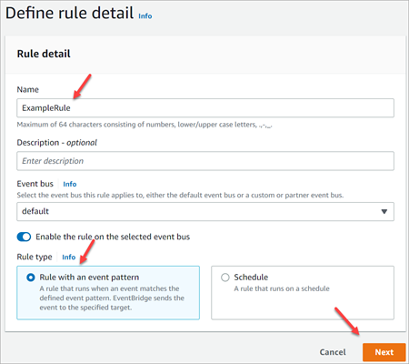
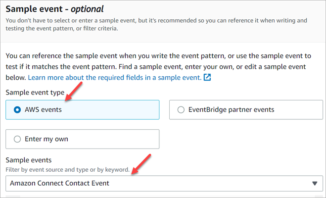
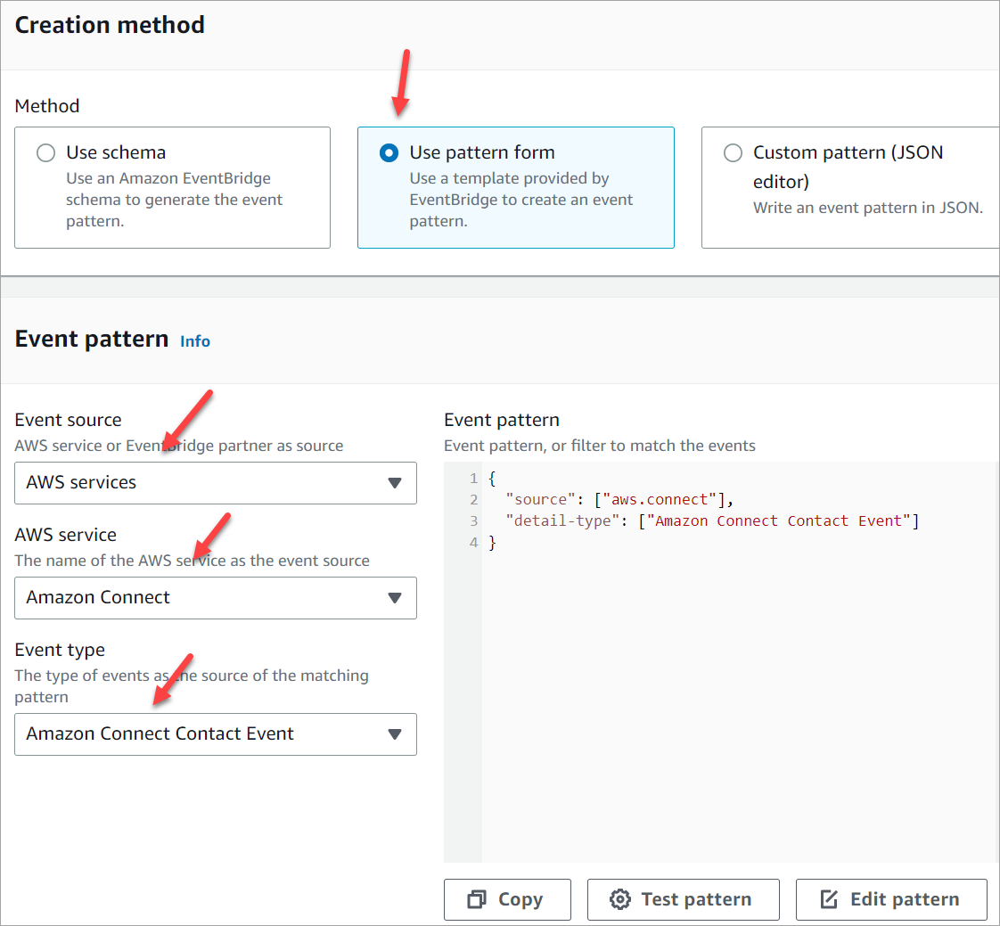

# Amazon Connect contact events

Amazon Connect allows you to subscribe to a near real-time stream of contact (voice calls, chat,
task, and email) events (for example, call is queued) in your Amazon Connect contact center.

You can use contact events to create analytics dashboards to monitor and track contact
activity, integrate into workforce management (WFM) solutions to better understand contact
center performance, or to integrate applications that react to events (for example, call
disconnected) in real-time.

###### Note

As we add new features and event types, we update the contact events data model with
new fields. All data model changes maintain backward compatibility.

When developing applications, design them to handle new fields and event types
gracefully. Your applications should:

- Ignore newly added fields they weren't designed to process.
- Continue functioning when new event types are introduced.
  This approach helps ensure your applications remain stable as the service
  evolves.

###### Contents

- [Contact events data model](#contact-events-data-model "#contact-events-data-model")
- [Contact timestamps](#contact-timestamps "#contact-timestamps")
- [Subscribe to Amazon Connect contact events](#subscribe-contact-events "#subscribe-contact-events")
- [Sample to stop streaming an event type](#stop-streaming-event "#stop-streaming-event")
- [Sample contact event for when a voice call is
  connected to an agent](#sample-contact-event "#sample-contact-event")
- [Sample contact event for when a
  voice call is disconnected](#sample-contact-event-call-disconnected "#sample-contact-event-call-disconnected")
- [Sample event for when contact properties are
  updated](#sample-updated-event "#sample-updated-event")
- [Sample contact event for when
  a voice call is connected to an agent using routing criteria](#sample-routing-criteria-event-connected "#sample-routing-criteria-event-connected")
- [Sample event for when routing step expires
  on a contact](#sample-routing-step-expires "#sample-routing-step-expires")
- [Sample contact event
  for when a voice call is connected to an agent provided by the customer using
  routing criteria](#sample-contact-event-voice-call-routing-criteria "#sample-contact-event-voice-call-routing-criteria")

## Contact events data model

Contact events are generated in JSON. For each event type, a JSON blob is sent to the
target of your choice, as configured in the rule. The following contact events are
available:

- AMD_DISABLED - Answering machine detection is disabled.
- INITIATED - A voice call, chat, task, or email is initiated or transferred.
- CONNECTED_TO_SYSTEM - The contact has established media (for example, it was
  answered by a person or by voicemail). This event is generated for any of the
  [AnsweringMachineDetectionStatus](#AnsweringMachineDetectionStatus "#AnsweringMachineDetectionStatus")
  codes.

###### Note

This event is generated for outbound calls (including [Amazon Connect outbound campaigns](how-to-create-campaigns.md "how-to-create-campaigns.md"))
tasks, and chats.

- CONTACT_DATA_UPDATED - One or more of the following contact properties were
  updated on a voice call, chat, task, or email: scheduled timestamp (task only),
  accepted by agent timestamp (outbound campaign voice contact in preview dialing
  mode only), user-defined attributes and tags, routing criteria is updated or
  step is expired, and if Contact Lens is enabled for a given
  contact.
- QUEUED - A voice call, chat, task, or email is queued to be assigned to an
  agent.
- CONNECTED_TO_AGENT - A voice call, chat, task, or email is connected to an
  agent.
- COMPLETED - The COMPLETED event indicates when a contact has fully ended,
  including After Contact Work (ACW) if applicable.
  - For contacts with ACW:

  When an agent completes ACW for a voice call, chat, task, or email, the
  following fields are populated:

      - AgentInfo.afterContactWorkStartTimestamp
      - agentInfo.afterContactWorkEndTimestamp
      - agentInfo.afterContactWorkDuration

  - For contacts without ACW:

  These fields are not populated when:

      - No agent was present on the contact.
      - The agent did not enter ACW.

  In these cases, the COMPLETED event is published immediately after the
  DISCONNECT event with the same data.

###### Note

For chat contacts, if an agent switches their status to offline without
properly clearing the contact in Contact Control Panel (CCP), the following
issues may occur:

    + The COMPLETED event might not be delivered.
    + The AfterContactWorkEndTimestamp may show discrepancies.

- DISCONNECTED - A voice call, chat, task, or email is disconnected. For outbound
  calls, the dial attempt is not successful, the attempt is connected but the call
  is not picked up, or the attempt results in a [SIT
  tone](https://en.wikipedia.org/wiki/Special_information_tone "https://en.wikipedia.org/wiki/Special_information_tone").

A disconnect event is when:

    + A chat, or task is disconnected.
    + A task is disconnected as a result of a flow action.
    + A task expires. The task is automatically disconnected when it completes its expiry timer.
     The default is 7 days and task expiry is configurable up to 90 days.

- PAUSED - An active task contact was paused.
- RESUMED - A paused task contact was resumed.
- WEBRTC_API - The contact used the communication widget to make an in-app
  voice/video call to an agent.

###### Event objects

- [AgentInfo](#AgentInfo "#AgentInfo")
- [AttributeCondition](#AttributeCondition "#AttributeCondition")
- [Campaign](#Campaign-ces "#Campaign-ces")
- [Contact event](#ContactEvent "#ContactEvent")
- [CustomerVoiceActivity](#CustomerVoiceActivity "#CustomerVoiceActivity")
- [Expiry](#Expiry "#Expiry")
- [Expression](#Expression "#Expression")
- [QueueInfo](#QueueInfo "#QueueInfo")
- [RoutingCriteria](#RoutingCriteria "#RoutingCriteria")
- [Steps](#Steps "#Steps")
- [SystemEndpoint](#SystemEndpoint "#SystemEndpoint")
- [Endpoint](#Endpoint "#Endpoint")
- [Recordings](#Recordings "#Recordings")
- [RecordingsInfo](#RecordingsInfo "#RecordingsInfo")
- [ContactDetails](#ContactDetails "#ContactDetails")
- [ContactEvaluations](#ContactEvaluations "#ContactEvaluations")
- [ContactEvaluation](#ContactEvaluation "#ContactEvaluation")
- [StateTransitions](#StateTransitions "#StateTransitions")
- [StateTransition](#StateTransition "#StateTransition")
- [OutboundStrategy](#OutboundStrategy "#OutboundStrategy")

### AgentInfo

The `AgentInfo` object includes the following properties:

**AgentArn**

The Amazon Resource Name (ARN) for the agent account.

Type: ARN

**AgentInitiatedHoldDuration**

The total hold duration in seconds initiated by the agent.

Type: Integer

**AfterContactWorkStartTimestamp**

The date and time when the agent started doing After Contact Work for
the contact, in UTC time.

Type: String (yyyy-MM-dd'T'HH:mm:ss.SSS'Z')

**AfterContactWorkEndTimestamp**

The date and time when the agent ended After Contact Work for the
contact, in UTC time. In cases when agent finishes doing
AfterContactWork for chat contacts and switches their activity status to
offline or equivalent without clearing the contact in CCP, discrepancies
may be noticed for `AfterContactWorkEndTimestamp`.

Type: String (yyyy-MM-dd'T'HH:mm:ss.SSS'Z')

**AfterContactWorkDuration**

The difference in time, in whole seconds, between
`AfterContactWorkStartTimestamp` and
`AfterContactWorkEndTimestamp`.

Type: Integer

**AcceptedByAgentTimestamp**

The date and time the outbound campaigns voice contact in preview
dialing mode was accepted by the agent, in UTC time.

Type: String (yyyy-mm-ddThh:mm:ssZ)

**PreviewEndTimestamp**

The date and time the agent finished previewing outbound campaigns
voice contact in preview dialing mode, in UTC time.

Type: String (yyyy-mm-ddThh:mm:ssZ)

**HierarchyGroups**

The agent hierarchy group for the agent.

Type: ARN

### AttributeCondition

An object to specify the predefined attribute condition.

**Name**

The name of predefined attribute.

Type: String

Length: 1-64

**Value**

The value of predefined attribute.

Type: String

Length: 1-64

**ComparisonOperator**

The comparison operator of the condition.

Type: String

Valid values: NumberGreaterOrEqualTo, Match, Range

**ProficiencyLevel**

The proficiency level of the condition.

Type: Float

Valid values: 1.0, 2.0, 3.0, 4.0 and 5.0

**Range**

An Object to define the minimum and maximum proficiency levels.

Type: Range object

**MatchCriteria**

An object to define AgentsCriteria.

Type: MatchCriteria object

**AgentsCriteria**

An Object to define agentIds.

Type: AgentsCriteria object

**AgentIds**

An object to specify a list of agents, by Agent ID.

Type: Array of strings

Length Constraints: Maximum length of 256

### Campaign

Information associated with a campaign.

Type: [Campaign](../APIReference/API_Campaign.md "../APIReference/API_Campaign.md")
object

### Contact event

The `Contact` object includes the following properties:

**ContactId**

The identifier for the contact.

Type: String

Length: 1-256

**InitialContactId**

The identifier of the initial contact.

Type: String

Length: 1-256

**RelatedContactId**

The contactId that is [related](../../../connect-participant/latest/APIReference/API_Item.md "../../../connect-participant/latest/APIReference/API_Item.md") to this contact.

Type: String

Length: Minimum of 1. Maximum of 256.

**PreviousContactId**

The original identifier of the contact that was transferred.

Type: String

Length: 1-256

**Channel**

The type of channel.

Type: `VOICE`, `CHAT`, `TASK`, or
`EMAIL`

**InstanceArn**

Amazon Resource Name (ARN) for the Amazon Connect instance in which the agent's
user account is created.

Type: ARN

**InitiationMethod**

Indicates how the contact was initiated.

Valid values:

- INBOUND: The customer initiated voice (phone) or email contact with
  your contact center.
- OUTBOUND: Represents an agent-initiated outbound voice call
  or email from the Contact Control Panel (CCP).
- TRANSFER: The contact was transferred by an agent to another
  agent or to a queue, using quick connects in the CCP. This
  results in a new contact record being created.
- CALLBACK: The customer was contacted as part of a callback
  flow. For more information about the InitiationMethod in this
  scenario, see [Queued callbacks in real-time metrics in
  Amazon Connect](about-queued-callbacks.md "about-queued-callbacks.md").
- API: The contact was initiated with Amazon Connect by API. This could
  be an outbound contact you created and queued to an agent, using
  the [StartOutboundVoiceContact](../APIReference/API_StartOutboundVoiceContact.md "../APIReference/API_StartOutboundVoiceContact.md") API, or it could be a
  live chat that was initiated by the customer with your contact
  center, where you called the [StartChatContact](../APIReference/API_StartChatContact.md "../APIReference/API_StartChatContact.md") API, or it could be a tasks
  initiated by the customer by calling the [StartTaskContact](../APIReference/API_StartTaskContact.md "../APIReference/API_StartTaskContact.md") API, or it could be an email
  initiated by the customer by calling the [StartEmailContact](../APIReference/API_StartEmailContact.md "../APIReference/API_StartEmailContact.md") API.
- QUEUE_TRANSFER: While the contact is one queue, and was then
  transferred into another queue using a flow block.
- EXTERNAL_OUTBOUND: An agent initiated voice (phone) contact
  with an external participant to your contact center using either
  quick connect in the CCP or a flow block.
- MONITOR: A supervisor initiated monitor on an agent. The
  supervisor can silently monitor the agent and customer, or barge
  the conversation.
- DISCONNECT: When a [Set disconnect flow](set-disconnect-flow.md "set-disconnect-flow.md") block is
  triggered, it specifies which flow to run after a disconnect
  event.

A disconnect event is when:

    + A chat, or task is disconnected.
    + A task is disconnected as a result of a flow action.
    + A task expires. The task is automatically disconnected when it completes its expiry timer.
     The default is 7 days and task expiry is configurable up to 90 days.

When the disconnect event occurs, the corresponding content
flow runs. If a new contact is created while running a
disconnect flow, then the initiation method for that new contact
is DISCONNECT.

- AGENT_REPLY: Represents an agent reply email contact
  corresponding to the inbound email contact accepted by an
  agent.
- FLOW: Represents an automated (flow-initiated) email
  contact.

**DisconnectReason code**

Indicates how the contact was terminated. This is available for the
contacts of outbound campaigns in which the media connection
failed.

Valid values:

- OUTBOUND_DESTINATION_ENDPOINT_ERROR: Current configurations do
  not allow this destination to be dialed (for example, calling an
  endpoint destination from an ineligible instance).
- OUTBOUND_RESOURCE_ERROR: Instance has insufficient permissions
  to make outbound calls or necessary resources were not
  found.
- OUTBOUND_ATTEMPT_FAILED: There was an unknown error, invalid
  parameter, or insufficient permissions to call the API.
- OUTBUND_PREVIEW_DISCARDED: No contact made; recipient removed
  from list; no further attempts will be made.
- EXPIRED: Not enough agents available, or not enough telecom
  capacity for such calls.
- DISCARDED: Represents that an agent discarded an email
  contact.

**AnsweringMachineDetectionStatus**

Indicates how an [outbound
campaign](how-to-create-campaigns.md "how-to-create-campaigns.md") call is actually disposed if the contact is
connected to Amazon Connect.

Type: String

Valid values:

- `HUMAN_ANSWERED`: The number dialed was answered by
  a person.
- `VOICEMAIL_BEEP`: The number dialed was answered by
  voicemail with a beep.
- `VOICEMAIL_NO_BEEP`: The number dialed was answered
  by a voicemail with no beep.
- `AMD_UNANSWERED`: The number dialed kept ringing,
  but the call was not picked up.
- `AMD_UNRESOLVED`: The number dialed was connected
  but the answering machine detection could not determine whether
  the call was picked up by a person or voicemail.
- `AMD_UNRESOLVED_SILENCE`: The number dialed was
  connected but the answering machine detection observed
  silence.
- `AMD_NOT_APPLICABLE`: The call disconnected before
  ringing, and there was no media to detect.
- `SIT_TONE_BUSY`: The number dialed was busy.
- `SIT_TONE_INVALID_NUMBER`: The number dialed was
  not a valid number.
- `SIT_TONE_DETECTED`: A special information tone
  (SIT) was detected.
- `FAX_MACHINE_DETECTED`: A fax machine was
  detected.
- `AMD_ERROR`: The number dialed was connected, but
  there was an error in answering machine detection.

**EventType**

The type of event published.

Type: String

Valid values: INITIATED, CONNECTED_TO_SYSTEM, CONTACT_DATA_UPDATED,
QUEUED, CONNECTED_TO_AGENT, DISCONNECTED, PAUSED, RESUMED,
COMPLETED

**UpdatedProperties**

The type of property updated.

Type: String

Valid values: ScheduledTimestamp, UserDefinedAttributes,
ContactLens.ConversationalAnalytics.Configuration, Segment Attributes,
Tags

**AgentInfo**

The agent the contact was assigned to.

Type: `AgentInfo` object

**QueueInfo**

The queue the contact was placed in.

Type: `QueueInfo` object

**ContactLens**

Contact Lens information if Contact Lens is enabled on
the flow.

Type: For more information about the `ContactLens` object,
see [ContactLens](ctr-data-model.md#ctr-ContactLens "ctr-data-model.md#ctr-ContactLens").

**SegmentAttributes**

A set of system defined key-value pairs stored on individual contact
segments using an attribute map. The attributes are standard Amazon Connect attributes and can be accessed in flows. Attribute keys
can include only alphanumeric, -, and \_ characters.

This field can be used to show channel subtype. For example,
`connect:Guide` or `connect:SMS`.

Type: SegmentAttributes

Members: SegmentAttributeName,
SegmentAttributeValue

**Tags**

[Tags](granular-billing.md "granular-billing.md") associated with the
contact. This contains both AWS generated and user-defined tags.

Type: String to string map

**CustomerId**

The customer's identification number. For example, the CustomerId may
be a customer number from your CRM. You can create a Lambda function to
pull the unique customer ID of the caller from your CRM system. If you
enable Amazon Connect Voice ID capability, this attribute is populated with the
CustomerSpeakerId of the caller.

Type: String

**ChatMetrics**

Information about how agent, bot and customer interact in a chat
contact.

**ChatContactMetrics**

Information about the overall participant interactions at
the contact level.

Type: [ChatContactMetrics](#chat-contact-metrics "#chat-contact-metrics") object

**CustomerMetrics**

Information about customer interactions in a
contact.

Type: [ParticipantMetrics](#participantmetrics "#participantmetrics") object

**AgentMetrics**

Information about agent interactions in a contact.

Type: [ParticipantMetrics](#participantmetrics "#participantmetrics") object

### CustomerVoiceActivity

The `CustomerVoiceActivity` object includes the following
properties:

**GreetingStartTimestamp**

The date and time that measures the beginning of the customer greeting
from an outbound voice call, in UTC time.

Type: String (yyyy-MM-dd'T'HH:mm:ss.SSS'Z')

**GreetingEndTimestamp**

The date and time that measures the end of the customer greeting from
an outbound voice call, in UTC time.

Type: String (yyyy-MM-dd'T'HH:mm:ss.SSS'Z')

### Expiry

An object to specify the expiration of a routing step.

**DurationInSeconds**

The number of seconds to wait before expiring the routing step.

Type: Integer

Min value: 0

**ExpiryTimestamp**

The timestamp indicating when the routing step expires.

Type: String (yyyy-mm-ddThh:mm:ssZ)

### Expression

A tagged union to specify expression for a routing step.

**AndExpression**

List of routing expressions which will be AND-ed together.

Type: Expression

Min value: 0

**OrExpression**

List of routing expressions which will be OR-ed together.

Type: Expression

**AttributeCondition**

An object to specify the predefined attribute condition.

Type: AttributeCondition

**NotAttributeCondition**

An object to specify the predefined attribute condition to exclude
agents with certain proficiencies.

Type: AttributeCondition

### QueueInfo

The `QueueInfo` object includes the following properties:

**QueueArn**

The Amazon Resource Name (ARN) for the queue.

Type: String

**QueueType**

The type of queue.

Type: String

### RoutingCriteria

List of routing criteria. Each time the routing criteria is updated on a contact,
it will be added to this list.

**ActivationTimestamp**

The timestamp indicating when the routing criteria is set to active. A
routing criteria is activated when contact is transferred to a
queue.

ActivationTimestamp will be set on routing criteria for contacts in
agent queue even though Routing criteria is never activated for contacts
in agent queue.

Type: String (yyyy-mm-ddThh:mm:ssZ)

**Index**

Information about the index of the routing criteria.

Type: Integer

Min value: 0

**Steps**

List of routing steps.

Type: List of Step objects

Length: 1-5

### Steps

When Amazon Connect does not find an available agent meeting the requirements in a
step for a given step duration, the routing criteria will move on to the next step
sequentially until a join is completed with an agent. When all steps are exhausted,
the contact will be offered to any agent in the queue.

**Status**

Represents status of the Routing step.

Type: String

Valid Values: EXPIRED, ACTIVE, JOINED, INACTIVE, DEACTIVATED,
INTERRUPTED

**Expression**

An object to specify the expression of a routing step..

Type: Expression

**Expiry**

An object to specify the expiration of a routing step.

Type: Expiry

### SystemEndpoint

The system endpoint. For example, for INBOUND, this is the phone number that the
customer dialed or the email address where the customer reached out. For OUTBOUND
and EXTERNAL_OUTBOUND, this is the outbound caller ID number assigned to the
outbound queue that is used to dial the customer or the outbound email address
that is assigned to the outbound queue that is used to reach out to the
customer.

###### Note

This field is currently not populated for contacts with initiation method of
CALLBACK, MONITOR, QUEUE_TRANSFER contacts.

**Type**

Endpoint

### Endpoint

Information about an endpoint. In Amazon Connect, an endpoint is the destination
for a contact, such as a customer phone number, or a phone number for your contact
center.

**Address**

The value for the type of endpoint. For TELEPHONE_NUMBER, the value is
a phone number in E.164 format.

Type: String

Length: 1-256

**Type**

The endpoint type. Currently, an endpoint can only be a telephone
number.

Valid Values: TELEPHONE_NUMBER | VOIP | CONTACT_FLOW |
CONNECT_PHONENUMBER_ARN | EMAIL_ADDRESS

**DisplayName**

Display name of the endpoint.

Type: String

Length: 0-256

### Recordings

If recording was enabled, this is information about the recordings.

**Type**

Array of RecordingsInfo

### RecordingsInfo

Information about a voice recording, chat transcript, or screen recording.

**DeletionReason**

If the recording/transcript was deleted, this is the reason entered
for the deletion.

Type: String

**FragmentStartNumber**

The number that identifies the Kinesis Video Streams fragment where
the customer audio stream started.

Type: String

**FragmentStopNumber**

The number that identifies the Kinesis Video Streams fragment where
the customer audio stream stopped.

Type: String

**Location**

The location, in Amazon S3, for the recording/transcript.

Type: String

Length: 0-256

**MediaStreamType**

Information about the media stream used during the
conversation.

Type: String

Valid Values: AUDIO, VIDEO, CHAT

**ParticipantType**

Information about the conversation participant: whether they are an
agent or contact. Following are the participant types:

- All
- Manager
- Agent
- Customer
- Thirdparty
- Supervisor

Type: String

**StartTimestamp**

When the conversation of the last leg of the recording started in UTC
time.

Type: String (yyyy-MM-dd'T'HH:mm:ss.SSS'Z')

**Status**

The status of the recording/transcript.

Valid Values: AVAILABLE | DELETED | NULL

**StopTimestamp**

When the conversation of the last leg of recording stopped in UTC
time.

Type: String (yyyy-MM-dd'T'HH:mm:ss.SSS'Z')

**StorageType**

Where the recording/transcript is stored.

Type: String

Valid Values: Amazon S3 | KINESIS_VIDEO_STREAM

### ContactDetails

Is a Map of string key, value pairs that contains user-defined attributes which
are lightly typed within the contact. This object is used only for task
contacts.

**Key**

Type: String

Length: 1-128

**Value**

Type: String

Length: 0-1024

### ContactEvaluations

Information about the contact evaluations where key is the FormId - a unique
identifier for the form.

**Type**

Map of String, ContactEvaluation

### ContactEvaluation

**EvaluationArn**

The Amazon Resource Name for the evaluation form. It is always
present.

Type: String

**Status**

The status of the evaluation.

Type: String

Valid Values: COMPLETE, IN_PROGRESS, DELETED

**StartTimestamp**

The date and time when the evaluation was started, in UTC time.

Type: String (yyyy-MM-dd'T'HH:mm:ss.SSS'Z')

**EndTimestamp**

The date and time when the evaluation was submitted, in UTC
time.

Type: String (yyyy-MM-dd'T'HH:mm:ss.SSS'Z')

**DeleteTimestamp**

The date and time when the evaluation was deleted, in UTC time.

Type: String (yyyy-MM-dd'T'HH:mm:ss.SSS'Z')

**ExportLocation**

The path where evaluation was exported.

Type: String

Length: 0-256

### StateTransitions

List of StateTransition for a supervisor.

**Type**

StateTransition

### StateTransition

Information about the state transition of a supervisor.

**StateStartTimestamp**

The date and time when the state started in UTC time.

Type: String (yyyy-MM-dd'T'HH:mm:ss.SSS'Z')

**StateEndTimestamp**

The date and time when the state ended in UTC time.

Type: String (yyyy-MM-dd'T'HH:mm:ss.SSS'Z')

**State**

Valid Values: SILENT_MONITOR | BARGE

### OutboundStrategy

Information about the outbound strategy.

Type: [OutboundStrategy](../APIReference/API_OutboundStrategy.md "../APIReference/API_OutboundStrategy.md") object

## Contact timestamps

**InitiationTimestamp**

The date and time this contact was initiated, in UTC time. In the case
that a voice contact was initiated as part of an outbound campaign, the
`InitiationTimestamp` will show when the contact is initiated
for the Initiated event, and will be updated to when the call is started in
subsequent events.

Type: String (yyyy-MM-dd'T'HH:mm:ss.SSS'Z')

**ConnectedToSystemTimestamp**

The date and time the customer endpoint connected to Amazon Connect, in UTC time.
For INBOUND, this matches InitiationTimestamp. For OUTBOUND, CALLBACK, and
API, this is when the customer endpoint answers.

**EnqueueTimestamp**

The date and time the contact was added to the queue, in UTC time.

Type: String (yyyy-MM-dd'T'HH:mm:ss.SSS'Z')

**ConnectedToAgentTimestamp**

The date and time the contact was connected to the agent, in UTC
time.

Type: String (yyyy-MM-dd'T'HH:mm:ss.SSS'Z')

**DisconnectTimestamp**

The date and time that the customer endpoint disconnected from the current
contact, in UTC time. In transfer scenarios, the DisconnectTimestamp of the
previous contact indicates the date and time when that
contact ended.

Type: String (yyyy-MM-dd'T'HH:mm:ss.SSS'Z')

**ScheduledTimestamp**

The date and time when this contact was scheduled to trigger the flow to
run, in UTC time. This is supported only for the task channel.

Type: String (yyyy-MM-dd'T'HH:mm:ss.SSS'Z')

**GreetingStartTimestamp**

The date and time that measures the beginning of the customer greeting
from an outbound voice call, in UTC time.

Type: String (yyyy-MM-dd'T'HH:mm:ss.SSS'Z')

**GreetingEndTimestamp**

The date and time that measures the end of the customer greeting from an
outbound voice call, in UTC time.

Type: String (yyyy-MM-dd'T'HH:mm:ss.SSS'Z')

### ChatContactMetrics

Information about the overall participant interactions at the contact
level.

**MultiParty**

A Boolean flag indicating whether multiparty chat or supervisor barge
were enabled on this contact.

Type: Boolean

**TotalMessages**

The number of chat messages on the contact.

Type: Integer

Min value: 0

**TotalBotMessages**

The total number of bot and automated messages on a chat
contact.

Type: Integer

Min value: 0

**TotalBotMessageLengthInChars**

The total number of characters from bot and automated messages on a
chat contact.

Type: Integer

Min value: 0

**ConversationCloseTimeInMillis**

The time it took for a contact to end after the last customer
message.

Type: Long

Min value: 0

**ConversationTurnCount**

The number of conversation turns in a chat contact, which represents
the back-and-forth exchanges between customer and other
participants

Type: Integer

Min value: 0

**AgentFirstResponseTimestamp**

The agent first response timestamp for a chat contact.

Type: String (yyyy-MM-dd'T'HH:mm:ss.SSS'Z')

**AgentFirstResponseTimeInMillis**

The time for an agent to respond after obtaining a chat
contact.

Type: Long

Min value: 0

### ParticipantMetrics

Information about a participant's interactions in a contact.

**ParticipantId**

The Participant's id.

Type: String

Length: 1-256

**ParticipantType**

Information about the conversation participant. Following are the
participant types: [Agent, Customer, Supervisor].

Type: String

**ConversationAbandon**

A Boolean flag indicating whether the chat conversation was abandoned
by an Participant.

Type: Boolean

**MessagesSent**

Number of chat messages sent by Participant.

Type: Integer

Min value: 0

**NumResponses**

Number of chat messages sent by Participant.

Type: Integer

Min value: 0

**MessageLengthInChars**

Number of chat characters sent by Participant.

Type: Integer

Min value: 0

**TotalResponseTimeInMillis**

Total chat response time by Participant.

Type: Long

Min value: 0

**MaxResponseTimeInMillis**

Maximum chat response time by Participant.

Type: Long

Min value: 0

**LastMessageTimestamp**

Timestamp of last chat message by Participant.

Type: String (yyyy-MM-dd'T'HH:mm:ss.SSS'Z')

## Subscribe to Amazon Connect contact events

Amazon Connect contact events are published using [Amazon EventBridge](https://aws.amazon.com/eventbridge/ "https://aws.amazon.com/eventbridge/"), and can be enabled in a couple of steps for your Amazon Connect instance
in the Amazon EventBridge console by creating a new rule. Although events are not ordered, they
have a timestamp which enables you to consume the data.

Events are emitted on a
[best effort](../../../eventbridge/latest/userguide/eb-service-event.md "../../../eventbridge/latest/userguide/eb-service-event.md")
basis.

To subscribe to Amazon Connect contact events:

1. In the Amazon EventBridge console, choose **Create rule**.
2. On the **Default rule detail** page, assign a name to the
   rule, choose **Rule with an event pattern**, and then choose
   **Next**, as shown in the following image.

 3. On the **Build event pattern** page, under **Event
source**, verify that **AWS events or EventBridge
partner events** is selected. 4. Under **Sample event type**, choose **AWS events**, and then choose **Amazon Connect Contact Event** from the dropdown box, as shown
in the following image.

 5. For Creation method choose Use pattern form. In the **Event
pattern** section, choose **AWS
services**, **Amazon Connect**,
**Amazon Connect Contact Event**, and then choose
**Next**, as shown in the following image.

 6. On the Select target(s) page, you can then select a target of your choice,
which includes a Lambda function, SQS queue, or SNS topic. For information about
configuring targets, [Amazon EventBridge
targets](../../../eventbridge/latest/userguide/eb-targets.md "../../../eventbridge/latest/userguide/eb-targets.md"). 7. Optionally configure tags. On the **Review and create** page,
choose **Create rule**.

For more information about configuring rules, see [Amazon EventBridge rules](../../../eventbridge/latest/userguide/eb-rules.md "../../../eventbridge/latest/userguide/eb-rules.md") in the
_Amazon EventBridge User Guide_.

## Sample to stop streaming an event type

The following sample shows how to stop streaming a `CONTACT_DATA_UPDATED`
event from Amazon Connect to EventBridge.

```
{
  "source": [
    "aws.connect"
  ],
  "detail-type": [
    "Amazon Connect Contact Event"
  ],
  "detail": {
    "eventType": [
      {
        "anything-but": [
          "CONTACT_DATA_UPDATED"
        ]
      }
    ]
  }
}
```

## Sample contact event for when a voice call is

connected to an agent

```
{
    "version": "0",
    "id": "abcabcab-abca-abca-abca-abcabcabcabc",
    "detail-type": "Amazon Connect Contact Event",
    "source": "aws.connect",
    "account": "111122223333",
    "time": "2021-08-04T17:43:48Z",
    "region": "`your-region`",
    "resources": [
        "arn:aws:...",
        "contactArn",
        "instanceArn"
    ],
    "detail": {
        "initiationTimestamp":"2021-08-04T17:17:53.000Z",
        "contactId":"11111111-1111-1111-1111-111111111111",
        "channel":"VOICE",
        "instanceArn":"arn:aws::connect:`your-region`:123456789012:instance/12345678-1234-1234-1234-123456789012",
        "initiationMethod":"INBOUND",
        "eventType":"CONNECTED_TO_AGENT",
        "agentInfo":{
          "agentArn":"arn:aws::connect:`your-region`:123456789012:instance/12345678-1234-1234-1234-123456789012/agent/12345678-1234-1234-1234-123456789012",
          "connectedToAgentTimestamp":"2021-08-04T17:29:09.000Z",
          "hierarchyGroups": {
                         "level1": {
                            "arn": "arn:aws:connect:`your-region`:012345678901:instance/12345678-1234-1234-1234-123456789012/agent-group/abcdefgh-1234-1234-1234-12345678901a",
                        },
                        "level2": {
                            "arn": "arn:aws:connect:`your-region`:012345678901:instance/12345678-1234-1234-1234-123456789012/agent-group/abcdefgh-1234-1234-1234-12345678901b",
                        },
                        "level3": {
                            "arn": "arn:aws:connect:`your-region`:012345678901:instance/12345678-1234-1234-1234-123456789012/agent-group/abcdefgh-1234-1234-1234-12345678901c",
                        },
                        "level4": {
                            "arn": "arn:aws:connect:`your-region`:012345678901:instance/12345678-1234-1234-1234-123456789012/agent-group/abcdefgh-1234-1234-1234-12345678901d",
                        },
                        "level5": {
                            "arn": "arn:aws:connect:`your-region`:012345678901:instance/12345678-1234-1234-1234-123456789012/agent-group/abcdefgh-1234-1234-1234-12345678901e",
                        }
                 }
            }
        },
         "queueInfo": {
            "queueType":"type",
            "queueArn":"arn:aws::connect:`your-region`:123456789012:instance/12345678-1234-1234-1234-123456789012/queue/12345678-1234-1234-1234-123456789012",
            "enqueueTimestamp":"2021-08-04T17:29:04.000Z"
          },
         "tags": {
            "aws:connect:instanceId":"12345678-1234-1234-1234-123456789012",
            "aws:connect:systemEndpoint":"+11234567890"
         }
    }
}
```

## Sample contact event for when a

voice call is disconnected

The following sample event shows a contact that has a user-defined tag with
**Dept** as the key. Note that `queueInfo` is not
included in events received by EventBridge when `initiationMethod` is
`OUTBOUND`.

```
{
    "version": "0",
    "id": "`the event ID`",
    "detail-type": "Amazon Connect Contact Event",
    "source": "aws.connect",
    "account": "111122223333",
    "time": "2021-08-04T17:43:48Z",
    "region": "`your-region`",
    "resources": [
        "arn:aws:...",
        "`contactArn`",
        "`instanceArn`"
    ],
    "detail": {
        "eventType": "DISCONNECTED",
        "contactId": "11111111-1111-1111-1111-111111111111",
        "initialContactId": "11111111-2222-3333-4444-555555555555",
        "previousContactId": "11111111-2222-3333-4444-555555555555",
        "channel": "Voice",
        "instanceArn": "arn:aws::connect:`your-region`:123456789012:instance/12345678-1234-1234-1234-123456789012",
        "initiationMethod": "OUTBOUND",
        "initiationTimestamp":"2021-08-04T17:17:53.000Z",
        "connectedToSystemTimestamp":"2021-08-04T17:17:55.000Z",
        "disconnectTimestamp":"2021-08-04T17:18:37.000Z",
        "agentInfo": {
            "agentArn": "arn",
            "connectedToAgentTimestamp":"2021-08-04T17:29:09.000Z",
            "hierarchyGroups": {
                 "level1": {
                    "arn": "arn:aws:connect:`your-region`:012345678901:instance/12345678-1234-1234-1234-123456789012/agent-group/abcdefgh-1234-1234-1234-12345678901a",
                },
                "level2": {
                    "arn": "arn:aws:connect:`your-region`:012345678901:instance/12345678-1234-1234-1234-123456789012/agent-group/abcdefgh-1234-1234-1234-12345678901b",
                },
                "level3": {
                    "arn": "arn:aws:connect:`your-region`:012345678901:instance/12345678-1234-1234-1234-123456789012/agent-group/abcdefgh-1234-1234-1234-12345678901c",
                },
                "level4": {
                    "arn": "arn:aws:connect:`your-region`:012345678901:instance/12345678-1234-1234-1234-123456789012/agent-group/abcdefgh-1234-1234-1234-12345678901d",
                },
                "level5": {
                    "arn": "arn:aws:connect:`your-region`:012345678901:instance/12345678-1234-1234-1234-123456789012/agent-group/abcdefgh-1234-1234-1234-12345678901e",
                }
            }
        },

        "CustomerVoiceActivity": {
           "greetingStartTimestamp":"2021-08-04T17:29:20.000Z",
           "greetingEndTimestamp":"2021-08-04T17:29:22.000Z",
        },
        "tags": {
            "aws:connect:instanceId":"12345678-1234-1234-1234-123456789012",
            "aws:connect:systemEndpoint":"+11234567890",
            "Dept":"Finance"
        }
    }
}
```

## Sample event for when contact properties are

updated

```
{
"version": "0",
    "id": "the event ID",
    "detail-type": "Amazon Connect Contact Event",
    "source": "aws.connect",
    "account": "`the account ID`",
    "time": "2021-08-04T17:43:48Z",
    "region": "your-region",
    "resources": [
        "arn:aws:...",
        "contactArn",
        "instanceArn"
    ],
"detail": {
    "eventType": "CONTACT_DATA_UPDATED",
    "contactId": "`the contact ID`",
    "channel": "CHAT",
    "instanceArn": "arn:aws:connect:us-west-2:`the account ID`:instance/`the instance ID`",
    "initiationMethod": "API",
    "queueInfo": {
        "queueArn": "arn:aws:connect:us-west-2:`the account ID`:instance/`the instance ID`/queue/`the queue ID`",
        "enqueueTimestamp": "2023-10-24T02:39:15.240Z",
        "queueType": "STANDARD"
    },
    "agentInfo": {
        "agentArn": "arn:aws:connect:us-west-2:`the account ID`:instance/`the instance ID`/agent/`the agent ID`",
        "connectedToAgentTimestamp": "1970-01-01T00:00:00.001Z",
        "hierarchyGroups": {
            "level1": {
                "arn": "arn:aws:connect:us-west-2:`the account ID`:instance/`the instance ID`/agent-group/`the agent group ID`"
            },
            "level2": {
                "arn": "arn:aws:connect:us-west-2:`the account ID`:instance/`the instance ID`/agent-group/`the agent group ID`"
            },
            "level3": {
                "arn": "arn:aws:connect:us-west-2:`the account ID`:instance/`the instance ID`/agent-group/`the agent group ID`"
            },
            "level4": {
                "arn": "arn:aws:connect:us-west-2:`the account ID`:instance/`the instance ID`/agent-group/`the agent group ID`"
            }
        }
    },
    "updatedProperties": ["ContactLens.ConversationalAnalytics.Configuration"],
    "initiationTimestamp": "2023-10-24T02:39:15.154Z",
    "connectedToSystemTimestamp": "1970-01-01T00:00:00.001Z",
    "tags": {
        "aws:connect:instanceId": "`the instance ID`"
       },
    "contactLens": {
        "conversationalAnalytics": {
            "configuration": {
                "enabled": true,
                "channelConfiguration": {
                    "analyticsModes": ["PostContact"]
                },
                "languageLocale": "en-US",
                "redactionConfiguration": {
                    "behavior": "Enable",
                    "policy": "RedactedAndOriginal",
                    "entities": ["EMAIL"],
                    "maskMode": "EntityType"
                }
            }
        }
    }
}
}
```

## Sample contact event for when

a voice call is connected to an agent using routing criteria

```
{
    "version": "0",
    "id": "abcabcab-abca-abca-abca-abcabcabcabc",
    "detail-type": "Amazon Connect Contact Event",
    "source": "aws.connect",
    "account": "111122223333",
    "time": "2021-08-04T17:43:48Z",
    "region": "your-region",
    "resources": [
        "arn:aws:...",
        "contactArn",
        "instanceArn"
    ],
    "detail": {
        "ContactId": "12345678-1234-1234-1234-123456789012",
        "Channel": "VOICE",
        "InstanceArn": "arn:aws::connect:us-west-2:123456789012:instance/12345678-1234-1234-1234-123456789012",
        "InitiationMethod": "INBOUND",
        "EventType": "CONNECTED_TO_AGENT",
        "AgentInfo": {
            "AgentArn": "arn:aws::connect:us-west-2:123456789012:instance/12345678-1234-1234-1234-123456789012/agent/12345678-1234-1234-1234-123456789012",
            "ConnectedToAgentTimestamp": "2021-08-04T17:29:09.000Z"
        },
        "QueueInfo": {
            "QueueType": "type",
            "QueueArn": "arn:aws::connect:us-west-2:123456789012:instance/12345678-1234-1234-1234-123456789012/queue/12345678-1234-1234-1234-123456789012",
            "EnqueueTimestamp": "2021-08-04T17:29:04.000Z"
        },
        "tags": {
            "aws:connect:instanceId":"12345678-1234-1234-1234-123456789012",
            "aws:connect:systemEndpoint":"+11234567890"
        },
        "RoutingCriteria": [{
            "ActivationTimestamp": "2021-08-04T17:29:04.000Z",
            "Index": 0,
            "Steps": [{
                "Status": "JOINED",
                "Expiry": {
                    "DurationInSeconds": 60,
                },
                "Expression": {
                    "OrExpression": [{
                       "AttributeCondition": {
                           "Name": "Technology",
                           "ComparisonOperator": "NumberGreaterOrEqualTo",
                           "ProficiencyLevel": 2.0,
                           "Value": "AWS Kinesis"
                       }
                    },
                    {
                       "AttributeCondition": {
                           "Name": "Language",
                           "ComparisonOperator": "NumberGreaterOrEqualTo",
                           "ProficiencyLevel": 4.0,
                           "Value": "English"
                        }
                    }],
                    "AndExpression": [{
                        "AttributeCondition": {
                            "Name": "Language",
                            "ComparisonOperator": "NumberGreaterOrEqualTo",
                            "ProficiencyLevel": 2.0,
                            "Value": "Spanish"
                        }
                    }]
                }
            }]
        }]
    }
}

```

## Sample event for when routing step expires

on a contact

```
{
    "version": "0",
    "id": "the event ID",
    "detail-type": "Amazon Connect Contact Event",
    "source": "aws.connect",
    "account": "the account ID",
    "time": "2021-08-04T17:43:48Z",
    "region": "your-region",
    "resources": [
        "arn:aws:...",
        "contactArn",
        "instanceArn"
    ],
    "detail": {
        "eventType":"CONTACT_DATA_UPDATED",
        "contactId":"12345678-1234-1234-1234-123456789012",
        "channel":"CHAT",
        "instanceArn":"arn:aws::connect:us-west-2:123456789012:instance/12345678-1234-1234-1234-123456789012",
        "initiationMethod":"API",
        "queueInfo":{
            "queueArn":"arn:aws:connect:us-west-2:123456789012:instance/12345678-1234-1234-1234-123456789012/queue/12345678-1234-1234-1234-123456789012",
            "enqueueTimestamp":"2023-11-01T18:33:03.062Z",
            "queueType":"STANDARD"
        },
        "updatedProperties":["RoutingCriteria.Step.Status"],
        "initiationTimestamp":"2023-11-01T18:33:00.716Z",
        "connectedToSystemTimestamp":"2023-11-01T18:33:01.736Z",
        "tags":{
            "aws:connect:instanceId":"12345678-1234-1234-1234-123456789012"
        },
        "routingCriteria":{
            "steps":[{
                "expiry":{
                    "durationInSeconds":50,
                    "expiryTimestamp":"2023-11-01T18:34:54.275Z"
                },
                "expression":{
                    "attributeCondition":{
                        "name":"Location",
                        "value":"AZ",
                        "proficiencyLevel":3.0,
                        "comparisonOperator":"NumberGreaterOrEqualTo"
                    }
                },
                "status":"EXPIRED"
            },
            {
                "expiry":{
                    "durationInSeconds":10
                },
                "expression":{
                    "attributeCondition":{
                        "name":"Language",
                        "value":"Spanish",
                        "proficiencyLevel":4.0,
                        "comparisonOperator":"NumberGreaterOrEqualTo"
                    }
                },
                "status":"ACTIVE"
            },
            {
                "expression":{
                    "attributeCondition":{
                        "name":"Language",
                        "value":"Spanish",
                        "proficiencyLevel":1.0,
                        "comparisonOperator":"NumberGreaterOrEqualTo"
                    }
                },
                "status":"INACTIVE"
            }],
            "activationTimestamp":"2023-11-01T18:34:04.275Z",
            "index":1
        }
    }
}

```

## Sample contact event

for when a voice call is connected to an agent provided by the customer using
routing criteria

```
{
    "version": "0",
    "id": "abcabcab-abca-abca-abca-abcabcabcabc",
    "detail-type": "Amazon Connect Contact Event",
    "source": "aws.connect",
    "account": "111122223333",
    "time": "2021-08-04T17:43:48Z",
    "region": "`your-region`",
    "resources": [
        "arn:aws:...",
        "contactArn",
        "instanceArn"
    ],
    "detail": {
        "ContactId": "12345678-1234-1234-1234-123456789012",
        "Channel": "VOICE",
        "InstanceArn": "arn:aws::connect:us-west-2:123456789012:instance/12345678-1234-1234-1234-123456789012",
        "InitiationMethod": "INBOUND",
        "EventType": "CONNECTED_TO_AGENT",
        "AgentInfo": {
            "AgentArn": "arn:aws::connect:us-west-2:123456789012:instance/12345678-1234-1234-1234-123456789012/agent/12345678-1234-1234-1234-123456789012",
            "ConnectedToAgentTimestamp": "2021-08-04T17:29:09.000Z"
        },
        "QueueInfo": {
            "QueueType": "type",
            "QueueArn": "arn:aws::connect:us-west-2:123456789012:instance/12345678-1234-1234-1234-123456789012/queue/12345678-1234-1234-1234-123456789012",
            "EnqueueTimestamp": "2021-08-04T17:29:04.000Z"
        },
        "tags": {
            "aws:connect:instanceId":"12345678-1234-1234-1234-123456789012",
            "aws:connect:systemEndpoint":"+11234567890"
        },
        "RoutingCriteria": [{
            "ActivationTimestamp": "2021-08-04T17:29:04.000Z",
            "Index": 0,
            "Steps": [{
                "Status": "JOINED",
                "Expiry": {
                    "DurationInSeconds": 60,
                },
                "Expression": {
                    "AttributeCondition": {
                        "ComparisonOperator": "Match",
                        "MatchCriteria": {
                            "AgentsCriteria": {
                                "AgentIds": ["AGENT_1"]
                            }
                        }
                    }
                }
            }]
        }]
    }
}


```
