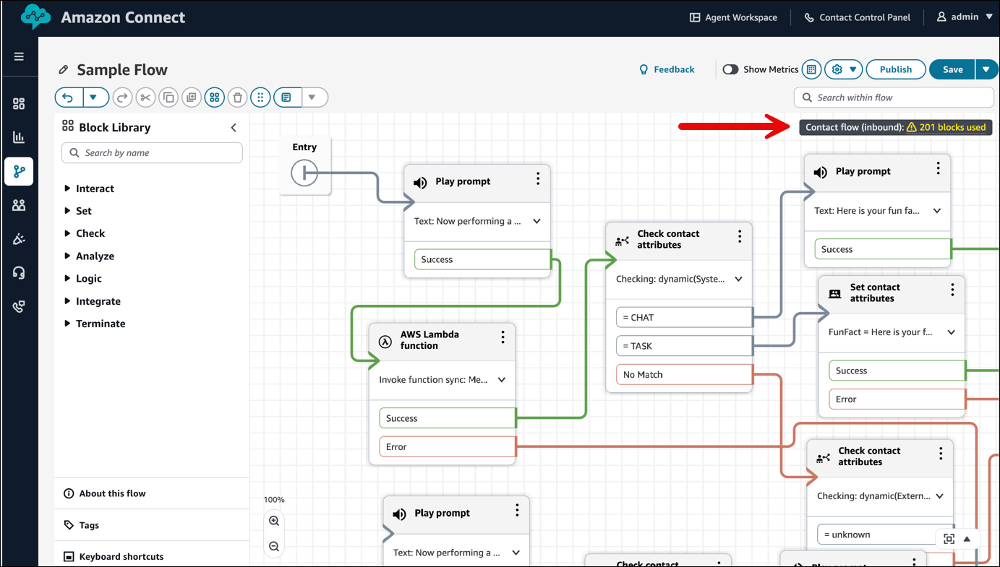

# Import and export flows between flow designers

in Amazon Connect

Use the procedures described in this topic to import/export a flows from the previous flow
designer to the new one, from one instance to another, or from one Region to another as you
expand your customer service organization.

###### Important

**Deprecation of Legacy Flow Import Support**

Support for importing legacy flows into the flow designer will end on **03/31/2026**. To ensure continued functionality of importing
offline flow configuration into flow designer, follow these update steps:

- Legacy flows must be manually imported using the updated flow designer to
  convert them into the new flow language format. It's important to note that copy
  and paste functionality in the updated flow designer only works with flows that
  use the new flow language.
- This update process is relevant for users who maintain and store flow
  configurations in offline JSON such as for configuration control. To continue
  using any portion of these stored flows in the updated flow designer, you must
  first import them to convert them to the new flow language. After they are
  converted, you can freely copy and paste flow components within the updated flow
  designer.
- If you rely on an offline data store for your flow configuration as your
  source of truth, please ensure you update your flows configuration to the new
  format before the **03/31/2026** deadline.
  To migrate tens or hundreds of flows, use the APIs described in [Migrate flows to an instance, Region, or environment
  in Amazon Connect](migrate-contact-flows.md "migrate-contact-flows.md").

The flow import/export feature is currently in Beta status. Updates and improvements that
we make could result in issues in future releases importing flows that are exported during
the beta phase.

## Export limitations

You can export flows that meet the following requirements:

- The flow has fewer than 200 blocks.
- The total size of the flow is less than 1MB.

We recommend dividing large flows in to smaller ones to meet these
requirements.

## Block counter

Use the block counter to track how many blocks are in a flow. The block counter also
helps you meet the limit of 200 blocks for import and export operations.

The following image shows an example flow with the block counter. It displays a
warning that 201 blocks are used.

## Flows are exported to JSON files

A flow is exported to a JSON file. It has the following characteristics:

- The JSON includes a section for each block in the flow.
- The name used for a specific block, parameter, or other element of the flow
  may be different than the label used for it in the flow designer.

By default, flow export files are created without a file name extension, and saved to
the default location set for your browser. We suggest saving your exported flows to
folder that contains only exported flows.

## How to import/export flows

###### To export a flow

1. Log in to your Amazon Connect instance using an account that is assigned a security
   profile that includes view permissions for flows.
2. Choose **Routing**, **Contact
   flows**.
3. Open the flow to export.
4. Choose **Save**, **Export flow**.
5. Provide a name for the exported file, and choose
   **Export**.

###### To import a flow

1. Log in to your Amazon Connect instance. The account must be assigned a security profile
   that includes edit permissions for flows.
2. On the navigation menu, choose **Routing**, **Contact
   flows**.
3. Do one of the following:
   - To replace an existing flow with the one you are importing, open the
     flow to replace.
   - Create a new flow of the same type as the one you are
     importing.

4. Choose **Save**, **Import flow**.
5. Select the file to import, and choose **Import**. When the
   flow is imported into an existing flow, the name of the existing flow is
   updated, too.
6. Review and update any resolved or unresolved references as necessary.
7. To save the imported flow, choose **Save**. To publish,
   choose **Save and Publish**.

## Resolve resources in imported

flows

When you create a flow, the resources you include in the flow, such as queues and
voice prompts, are referenced within the flow using the name of the resource and the
Amazon Resource Name (ARN). The ARN is a unique identifier for a resource that is
specific to the service and Region in which the resource is created. When you export a
flow, the name and ARN for each resource referenced in the flow is included in the
exported flow.

When you import a flow, Amazon Connect attempts to resolve the references to the Amazon Connect
resources used in the flow, such as queues, by using the ARN for the resource.

- When you import a flow into the same Amazon Connect instance that you exported it from,
  the resources used in the flow will resolve to the existing resources in that
  instance.
- If you delete a resource, or change the permissions for a resource, Amazon Connect may
  not be able to resolve the resource when you import the flow.
- When a resource cannot be found using the ARN, Amazon Connect attempts to resolve the
  resource by finding a resource with the same name as the one used in the flow.
  If no resource with the same name is found, a warning is displayed on the block
  that contains a reference to the unresolved resource.
- If you import a flow into a different Amazon Connect instance than the one it was
  exported from, the ARNs for the resources used are different.
- If you create resources in the instance with the same name as the resource in
  the instance where the flow was exported from, the resources can be resolved by
  name.

You can also open the blocks that contain unresolved resources, or resources
that were resolved by name, and change the resource to another one in the Amazon Connect
instance.

You can save a flow with unresolved or missing resources. You can publish a flow with
unresolved or missing resources only for optional parameters. If any required parameter
has an unresolved resource, you cannot publish the flow until the resources are
resolved.
