# Flow modules for reusable functions in Amazon Connect

Flow modules are reusable sections of a flow. You can create them to extract repeatable
logic across your flows, and create common functions. For example:

1. You can create a module that sends SMS text messages to customers.
2. You can invoke the module in flows that handle situations where customers want to
   reset their passwords, check their bank balances, or receive a one-time
   password.
   Following are the benefits of using modules:

- Simplify managing common functionality across flows. For example, an SMS module
  could validate the format of phone number, confirm SMS opt-in preferences, and
  integrate with an SMS service, such as Amazon Pinpoint.
- Makes it more efficient to maintain flows. For example, you can quickly propagate
  changes across all flows that invoke a flow module.
- Helps separate flow designer responsibilities. For example, you can have both
  technical module designers and non-technical flow designers.
- Support for more reusable and dynamic experiences with flow modules. For example, you can define a module with custom input/output objects and branches to be reused across different contact flow use cases.
- Easier flow module management. You can create multiple immutable versions of your modules to track and test changes effectively. Additionally, you can create aliases that point to specific versions, allowing you to update aliases as needed to implement changes across all contact flows that reference them.

## Where you can use modules

You can use modules in any flow that is [type](create-contact-flow.md#contact-flow-types "create-contact-flow.md#contact-flow-types")
**Inbound flow**.

The following types of flows do not support modules: **Customer
queue**, **Customer hold**, **Customer
whisper**, **Outbound whisper**, **Agent
hold**, **Agent whisper**, **Transfer to
agent**, **Transfer to queue**.

## Limitations

- Modules do not allow overriding flow local data of the invoking flow. This
  means you can't use the following with modules:
  - External attributes
  - Amazon Lex attributes
  - Customer Profiles attributes
  - Connect AI agents attributes
  - Queue metrics
  - Stored customer input

- Modules do not allow invoking another module.

To pass any data to a module, or to get any data from a module, you
need to pass and retrieve attributes.

For example, you want data that is written from Lambda (an External attribute) and pass it to the module so you can make
a decision. Your Lambda identifies whether the customer
is a VIP member. You need that information inside the module because if they are a VIP
member, you want to play a prompt thanking them for their membership. Since default Lambda is not available inside a module, you use attributes to pass and
retrieve data.

## Security profile permissions for modules

Before you can add modules to Inbound flows, you must have permissions in your
security profile. By default, the **Admin** and
**CallCenterManager** security profiles have these
permissions.

## Create basic module

For information about the number of modules that you can create for each Amazon Connect
instance, see [Amazon Connect service quotas](amazon-connect-service-limits.md "amazon-connect-service-limits.md").

1. Log in to the Amazon Connect console with an account assigned to a security profile
   that has permissions to create modules.
2. On the navigation menu, choose **Routing**, **Contact
   flows**.
3. Choose **Modules**, **Create flow module**.
4. (optional) In the **Details** tab, you can enter description and add up 50 tags for the module.
5. In the **Designer** tab, add the blocks that you want to your module. When finished, choose
   **Publish**. This makes the module available to use in
   other modules and flows.

## Add a module to a flow

1. Log in to the Amazon Connect console with an account assigned to a security profile
   that has permissions to create flows. You don't need permissions to create
   modules.
2. On the navigation menu, choose **Routing**, **Contact
   flows**.
3. Choose **Create flow** and select any flow type.
4. To add a module, go to the **Integrate** section, and choose
   **Invoke flow module**.
5. When you're finished creating your flow, choose **Publish**.

## Example module

This module shows how to get a random fun fact by invoking a Lambda function. The
module uses a contact attribute (`$.Attributes.FunFact`) to retrieve the fun
fact. Flows that invoke this module can play a FunFact to customers, depending on their
incoming contact type.

The inbound flows in your instance can invoke this common module and get the fun
fact.

Following is an image of the FunFact module:

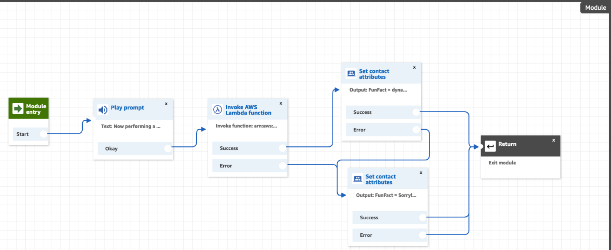

Following is an image of the FunFactSampleFlow that invokes the module:

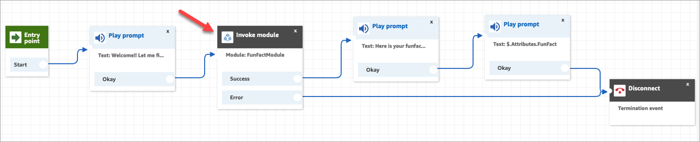

## Module versioning and aliasing

To improve maintenance efficiency and reduce deployment risks, versioning and aliasing are supported for modules. Module versions are Immutable snapshots to ensure each module version remains unchanged, providing consistency and reliability. Module aliases allows you to assign descriptive names to versions for easier identification and management. Latest revision tracking automatically updates to the newest version when you invoke a module and select $.LATEST as the alias.

### Create version for modules

You can create versions of your modules to track changes and maintain different iterations.

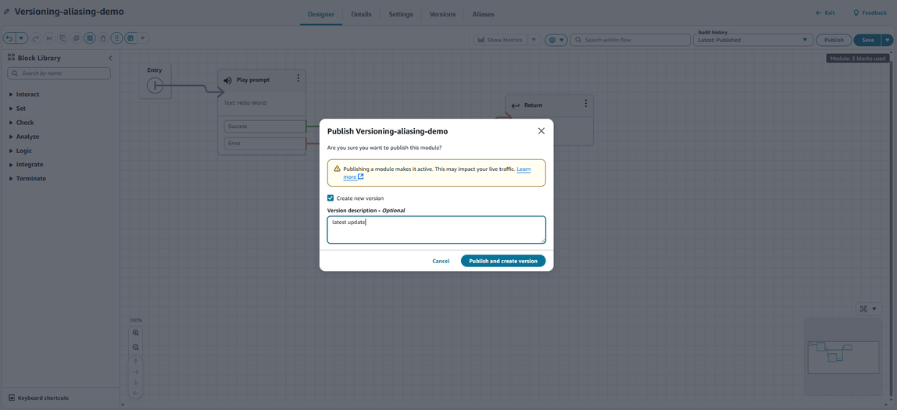

### Create alias for modules

You can create aliases that point to specific module versions for easier management.

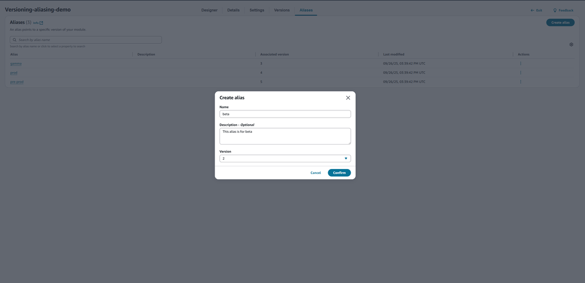

### View specific version or alias of modules

You can view specific versions or aliases of your modules in read-only mode.

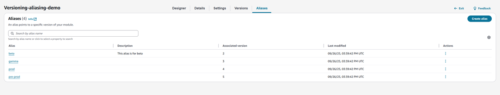

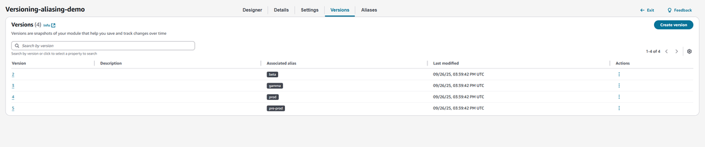

Click on the specific version or alias to view the modules in read-only mode:

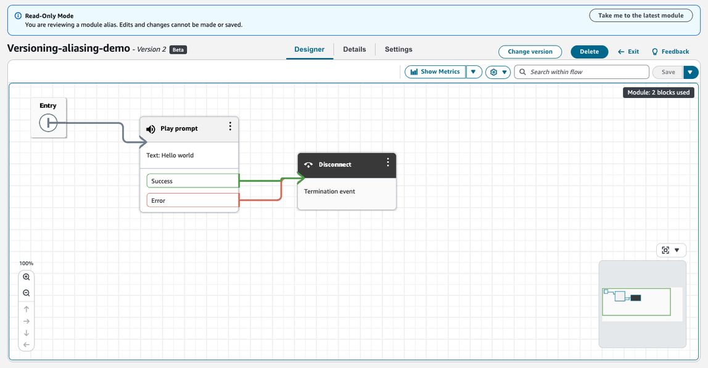

### Use module versions and alias in flows

You can reference specific module versions or aliases when invoking modules in your flows.

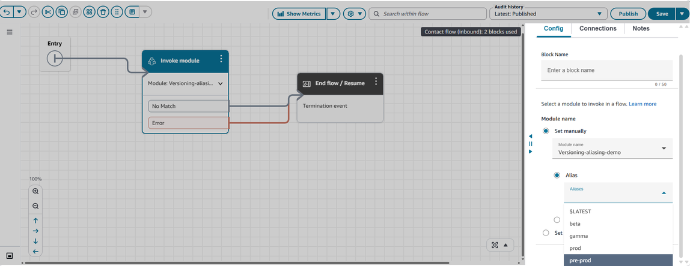

## Create custom block module

You can begin creating a custom block module by navigating to the Settings tab of your new or existing flow module. Here, you can configure input and output data types for your module. While the input/output schemas default to Object type, you have flexibility to define other data types for properties within the root input and output schemas, the following data types are supported: String, Number, Integer, Boolean, Object, Array, and Null.

### Configure custom block module

You can start creating custom block module by navigating the **Settings** tab of your new or existing flow module, you can configure any data type of input and output for your module, however, the input/output schema are Object type by default. For properties under the root input and output schema, data types supported are String, Number, Integer, Boolean, Object, Array, and Null.

You can use **Designer** mode to create input and output model structure or you can use **JSON schema** to define them.

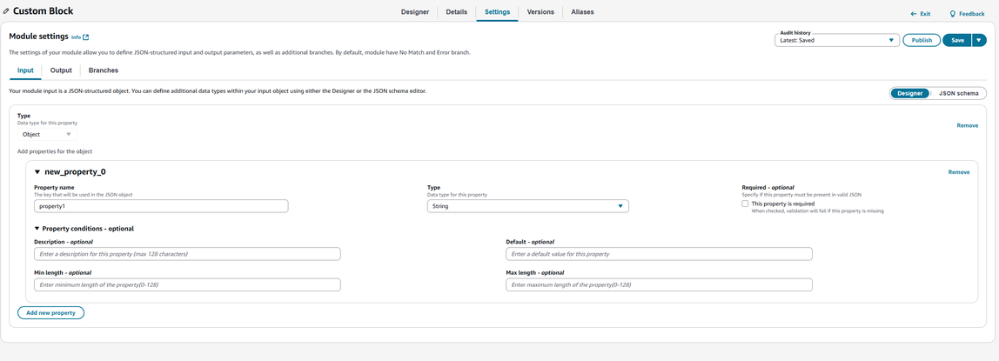

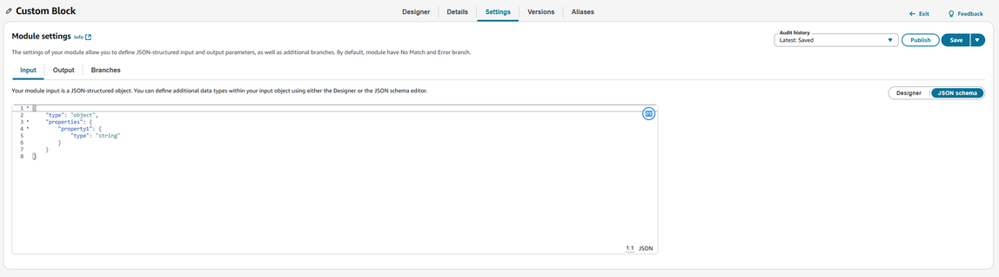

You can define up to 8 custom branches for your module.

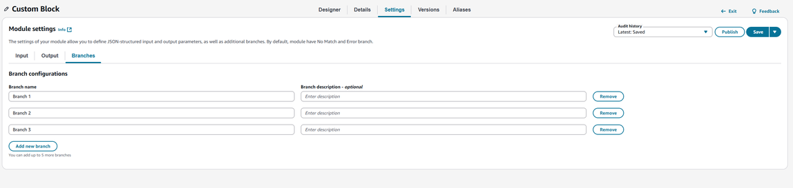

### Accessing module related attributes

As part of custom blocks module enhancement, a new namespace Module is introduced for you to access module inputs within a module, output and results from flows or modules that were calling the module. You can store these attributes using [Flow block in Amazon Connect: Set contact
attributes](set-contact-attributes.md "set-contact-attributes.md") block or directly use these attributes via JSONPath reference. See [List of available contact attributes in Amazon Connect and their
JSONPath references](connect-attrib-list.md "connect-attrib-list.md") documentation on details of module attributes.

### Example custom block module

This module shows how to get customers authenticated based on their provided phone number and PIN by invoking Lambda functions. The module takes an input as phone number and outputs the customerId, customerName, and customerEmail. The module also supports 2 custom branch which are authenticated and unauthenticated. Flows that invoke this module can simply pass in a phone number to authenticate customers and get basic customer information for further actions.

Following is an image of the Authentication module with settings:

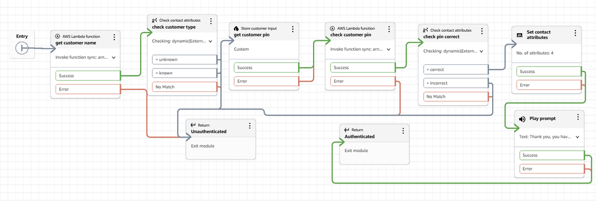

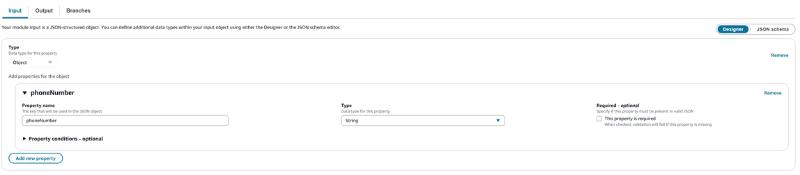

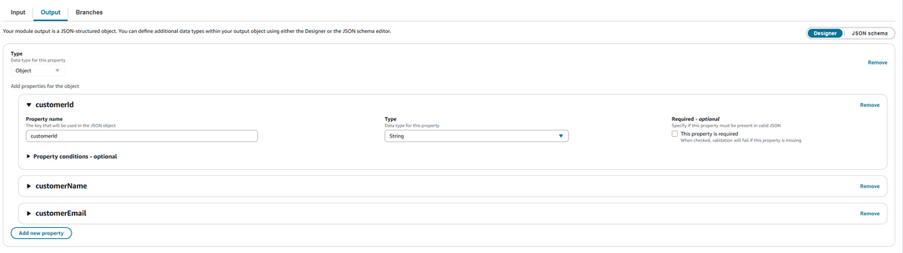

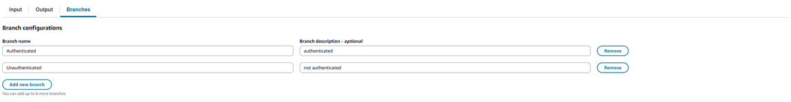

Following is an image of a sample customer support flow that invokes the module to authenticate the customer using a phone number:

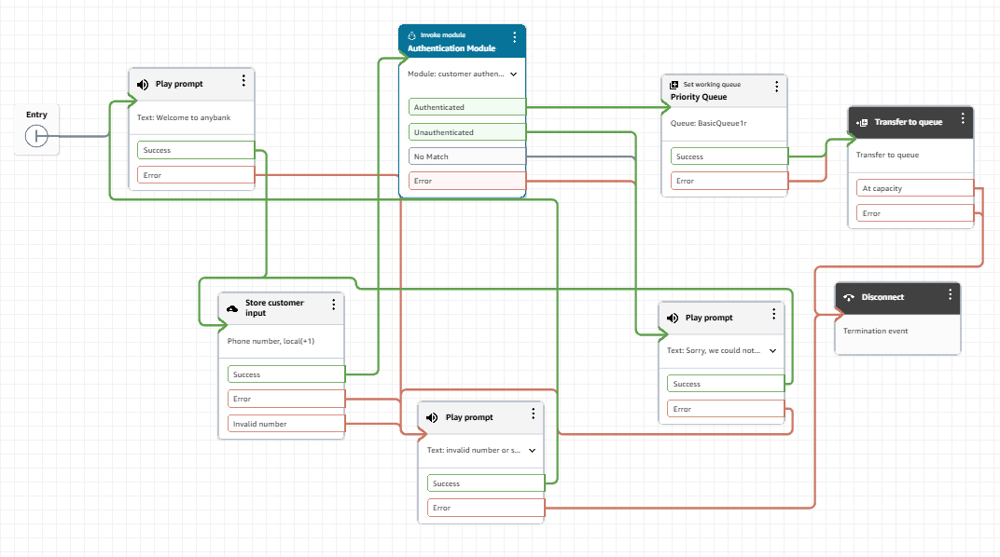

## Create module as tools

To enable Flow Modules to be invoked outside of a Flow by various systems as independent execution units, expanding their utility and supporting powerful use cases with established automation tools such as Q in Connect, where AI Agents can use modules as tools to fulfill actions identified during customer service interactions, such as executing payment workflows and automated task workflows. This approach allows you to define business logic once as modules and execute it across multiple channels and contexts, ensuring consistency while reducing development overhead.

### Create new module as tool

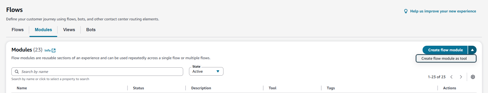

### Create module as tool from existing module

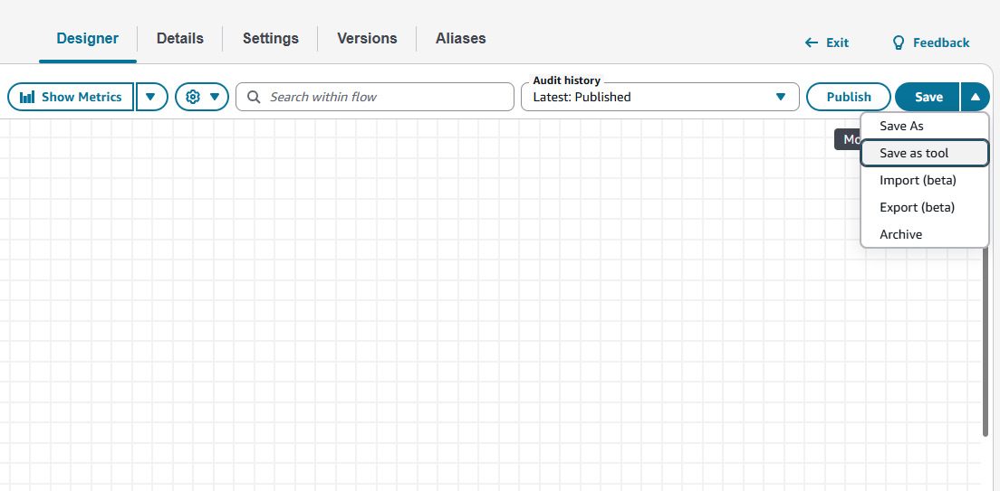

### Module as tool supported blocks

When you are creating a new tool module, you will only see supported list of blocks from the block library to build your module. For converting your existing module as tool, you will see which are your existing blocks that are not supported in a tool module. The following list of blocks are supported for module as tool.

| Blocks                             |
| ---------------------------------- |
| Cases                              |
| ChangeRoutingPriority              |
| CheckCallProgress                  |
| CheckContactAttributes             |
| CheckHoursOfOperation              |
| CheckQueueStatus                   |
| CheckStaffing                      |
| CheckVoiceId                       |
| CreatePersistentContactAssociation |
| CreateTask                         |
| CustomerProfiles                   |
| DataTable                          |
| DistributeByPercentage             |
| GetQueueMetrics                    |
| InvokeFlowModule                   |
| InvokeLambdaFunction               |
| InvokeThirdPartyAction             |
| Loop                               |
| Resume                             |
| ResumeContact                      |
| Return                             |
| SendMessage                        |
| SetAttributes                      |
| SetCallbackNumber                  |
| SetCustomerQueueFlow               |
| SetDisconnectFlow                  |
| SetEventHook                       |
| SetHoldFlow                        |
| SetLoggingBehavior                 |
| SetQueue                           |
| SetRecordingAndAnalyticsBehavior   |
| SetRoutingCriteria                 |
| SetRoutingProficiency              |
| SetVoice                           |
| SetVoiceId                         |
| SetWhisperFlow                     |
| SetWisdomAssistant                 |
| TagContact                         |
