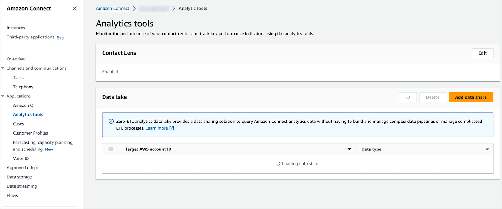
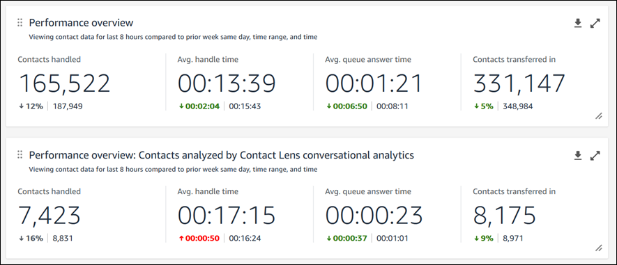
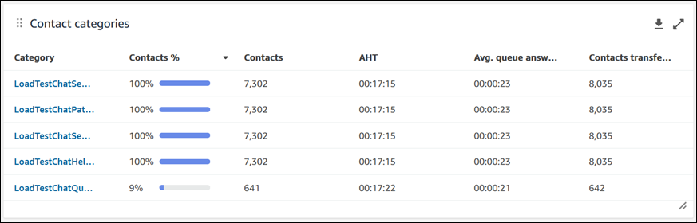
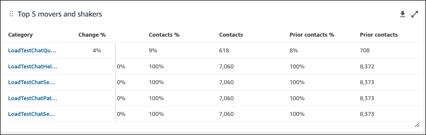
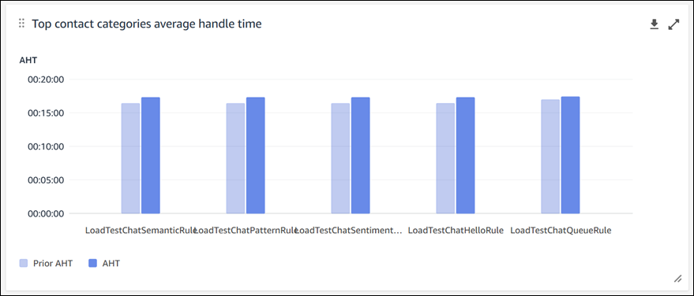
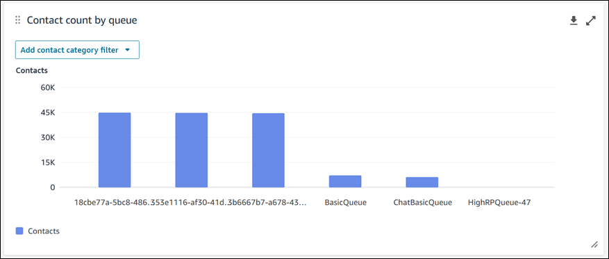
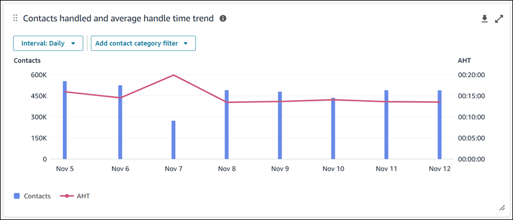

# Amazon Connect Contact Lens conversational analytics dashboard

When Contact Lens conversational analytics is [enabled](enable-analytics.md "enable-analytics.md") on your contacts, you can analyze conversations between customers
and agents by using speech and chat transcriptions, natural language processing, and
intelligent search capabilities. Contact Lens conversational analytics performs
sentiment analysis, detects issues, and enables you to automatically categorize
contacts.

The Contact Lens conversational analytics dashboard helps you
understand:

- Why customers are contacting your contact center
- The trends of contact drivers over time
- The performance of each of those call drivers (for example, average handle
  time for call driver "Where’s my stuff?")
  You can view key metrics for categories such as contacts handled and average handle
  time compared to a custom-defined benchmark time-range with color indicators (for
  example, green = good, red = bad) for quick insights within seconds (for example, "Am I
  performing better or worse than last week and by how much?") using the summary widgets
  at the top.

Data visualizations such as **Movers and shakers** display the
largest changes compared to a custom-defined benchmark time period in the past (that is,
week over week). While **Contacts handled and average handle time
trend** shows you the number of contacts handled alongside the average
handle time over a period of intervals in time in a time series chart.

###### Contents

- [Enable access to the
  dashboard](#enable-contact-lens-conversational-dashboards "#enable-contact-lens-conversational-dashboards")
- [Performance overview charts](#contact-lens-conversational-dashboard-performance-overview "#contact-lens-conversational-dashboard-performance-overview")
- [Contact
  categories](#contact-lens-conversational-dashboard-contact-categories "#contact-lens-conversational-dashboard-contact-categories")
- [Movers and
  shakers](#contact-lens-conversational-dashboard-movers-shakers "#contact-lens-conversational-dashboard-movers-shakers")
- [Top
  contact categories average handle time](#contact-lens-conversational-dashboard-top-contact-categories "#contact-lens-conversational-dashboard-top-contact-categories")
- [Contact count
  by queue](#contact-lens-conversational-dashboard-contact-count "#contact-lens-conversational-dashboard-contact-count")
- [Contacts
  handled and average handle time trend](#contact-lens-conversational-dashboard-contacts-handled "#contact-lens-conversational-dashboard-contacts-handled")
- [Dashboard functionality limitations](#contact-lens-conversational-dashboard-functionality-limitations "#contact-lens-conversational-dashboard-functionality-limitations")

## Enable access to the

dashboard

1. Ensure users are assigned the appropriate security profile
   permissions:
   - **Access metrics - Access permission** or the
     **Dashboard - Access permission**. For
     information about the difference in behavior, see [Assign permissions to view dashboards
     and reports in Amazon Connect](dashboard-required-permissions.md "dashboard-required-permissions.md").
   - **Contact Lens - conversational
     analytics**: This permission enables users to view data
     in the Contact Lens dashboard.

2. In the AWS console, ensure that **Analytics tools**,
   **Enable Contact Lens** is selected, as shown in
   the following image.

 3. In your flow, enable Contact Lens conversational analytics so it
analyzes your contacts. For instructions, see [Enable call recording and
speech analytics](enable-analytics.md#enable-callrecording-speechanalytics "enable-analytics.md#enable-callrecording-speechanalytics").

## Performance overview charts

There are two performance overview charts that provide aggregated metrics based on
your filters. The second chart is further filtered only by contacts analyzed by
Contact Lens conversational analytics. Each metric within the charts is
compared to your "compare to" benchmark time range filter.

This chart shows the following information:

- Contacts handled during your time range selection was 165,522, which is
  down ˜12% compared to your benchmark number of contacts handled,
  187,949 contacts.
- The percentages are rounded up or down.
- The colors that appear for the metrics indicate positive (green) or
  negative (red) compared to your benchmark.
- There are no colors for contacts handled.

## Contact

categories

The contact categories chart shows you Contact Category information. To see all
data, click on the pop-out icon in the top right of the chart. To deep dive further
into the contacts, click on the Contact Category and it will take you to Contact
Search pre-filtered for that category along with the dashboard filters.

1. Contacts %: the count of contacts analyzed by Contact Lens
   conversational analytics that have a given category divided by the total
   number of contacts analyzed by Contact Lens conversational
   analytics.
2. Contacts: count of contacts analyzed by Contact Lens conversational
   analytics that have a given category.
3. AHT: the average handle time for the contacts that have a given
   category.
4. Avg. queue answer time: the average queue answer time for the contacts
   that have a given category.
5. Contacts transferred in: the count of contacts transferred in for the
   contacts that have a given category.

## Movers and

shakers

The movers and shakers chart shows you the categories with the highest percent
change in distribution compared to your benchmark time range. In other words, it
shows you the count of categories that were generated more or less frequently
compared to the total number of contacts analyzed by Contact Lens
conversational analytics.

For example:

- If 20 out of 100 contacts analyzed by conversational analytics have
  Category A, your contacts % for Category A was 20%.
- If during the comparison benchmark time period 10 out of 100 contacts
  analyzed by Contact Lens conversational analytics had Category A,
  your Prior contacts % for Category A was 10%.
- The % Change would be (20% - 10%)/(10%) = 100%.

To see all data, choose the pop-out icon in the top right of the chart. To deep
dive further into the contacts, choose the Contact Category and it will take you to
Contact Search pre-filtered for that category along with the dashboard
filters.

1. Change %: (Contacts % – Prior contacts %) / (Prior contacts %). This
   number is rounded. The chart is sorted by highest absolute Change %.
2. Contacts %: the count of contacts analyzed by Contact Lens
   conversational analytics in the time range specified in your dashboard
   filter that have a given category divided by the total number of contacts
   analyzed by Contact Lens conversational analytics.
3. Contacts: the count of contacts analyzed by Contact Lens
   conversational analytics in the time range specified in your dashboard
   filter.
4. Prior contacts %: the count of contacts analyzed by Contact Lens
   conversational analytics in the "compare to" benchmark time range specified
   in your dashboard filter that have a given category divided by the total
   number of contacts analyzed by Contact Lens conversational
   analytics.
5. Prior contacts: the count of contacts analyzed by Contact Lens
   conversational analytics in the "compare to" benchmark time range specified
   in your dashboard filter.

## Top

contact categories average handle time

The top contact categories average handle time displays the prior AHT (using the
"compare to" benchmark time range) to the current time range AHT for each of your
top 10 categories (sorted by count of contacts with a category from left to right).
To see all data, click on the pop-out icon in the top right of the chart.

## Contact count

by queue

###### Note

This section of the dashboard displays data even when Contact Lens
conversational analytics is not enabled on any contacts.

The contact count by queue chart displays the count of contacts for each queue,
sorted by the highest number of contacts from left to right. You can configure this
widget further by filtering for contact categories directly from this chart. This
filter overrides the page-level contact category filter at the top of the
dashboard.

## Contacts

handled and average handle time trend

###### Note

This section of the dashboard displays data even when Contact Lens
conversational analytics is not enabled on any contacts.

The Contacts handled and average handle time trend is a time-series chart that
displays the count of contacts handled (blue bars) and the average handle time (red
line) over a given time period broken down by intervals (15min, daily, weekly,
monthly). You can configure different time range intervals by using the "Interval"
button directly in the widget. The intervals that you may select depend on the
page-level time range filter.

For example:

- If you have a "Today" time range filter at the top of your dashboard, you
  can only see an interval of 15min for the last 24 hours.
- If you have a "Day" time range filter at the top of your dashboard, you
  can see a trailing 8 day interval trend, or a 15min interval trend for the
  trailing 24 hours.

## Dashboard functionality limitations

The following limitations apply to the Contact Lens conversational
analytics dashboard:

- Tag-based access controls are not supported on the dashboard.
- If you have a routing profile or agent hierarchy filter selected, the
  hyperlinks on contact categories leading to contact search will be disabled
  within the Contact categories and Movers and Shakers charts.
