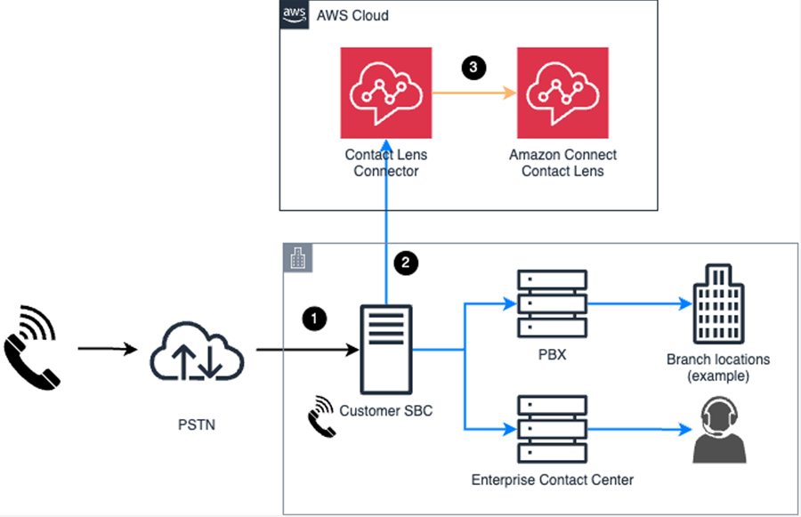

# Integrate Connect Customer conversational analytics with external voice systems

Migrating a contact center from an external system to the cloud can be complicated. It
requires moving many different components such as telephony, IVR, ACD, call recording, call
analytics, and more. By integrating your external system with conversational analytics for
analytics, however, you can accelerate your migration to Connect Customer. Here's how this first step
can benefit your business:

- Conversational analytics integration enhances your existing external contact center
  recording and analytics capabilities.
- It provides an opportunity to train your contact center administrators, managers,
  and agents on Connect Customer.
- Conversational analytics helps uncover key trends, issues, and themes from customer
  interactions happening across multiple voice systems such as external contact
  centers or customer facing voice solutions (for example, phone consults, financial
  advisors, or banking relationship managers).
  The following diagram shows how the voice call audio flows between your external voice
  system and conversational analytics. You use the conversational analytics Connector to send a replica
  of your contact center audio to conversational analytics. The external call flow continues to
  operate as normal for your agents, while conversational analytics provides real-time and
  post-call analytics using the replicated call audio.

1. A call sent through PSTN lands on your external voice system.
2. A read-only copy of the call audio is forked into Connect Customer.
3. A flow is started for the call. The conversational analytics connector routes the call
   to Connect Customer conversational analytics.

## Requirements

Before you start setting up conversational analytics integration, check that your Connect Customer and
external systems meet the following requirements:

- Verify your Connect Customer instance is created in a [supported AWS Region](regions.md#contactlens_region "regions.md#contactlens_region"). Make sure your external voice system can
  connect to the Region.
- Make sure the external device that initiates the SIPREC session and the voice
  system that is used for the call are supported. For a list of supported systems,
  see `ContactCenterSystemTypes` and
  `SessionBorderControllerTypes` in the [PutVoiceConnectorExternalSystemsConfiguration](../../../chime-sdk/latest/APIReference/API_voice-chime_PutVoiceConnectorExternalSystemsConfiguration.md "../../../chime-sdk/latest/APIReference/API_voice-chime_PutVoiceConnectorExternalSystemsConfiguration.md") in the Amazon Chime API.
  Usually the SIPREC session is a Session Border Controller (SBC) and the voice
  system is your contact center.
- Verify you have SIPREC support or the ability to add SIPREC to the source
  system that will send the SIPREC replica call audio to conversational analytics.

## Set up steps

Following is a summary of the steps you'll take to set up conversational analytics
integration with your external voice system. The linked topics provide more
detail.

- [Create a Connect Customer instance](amazon-connect-instances.md "amazon-connect-instances.md") if
  you don't already have one.

  - You don't need to claim a phone number to Connect Customer to integrate
    with conversational analytics.
  - [Add agents](user-management.md "user-management.md") and [set up agent hierarchies](agent-hierarchy.md "agent-hierarchy.md"). This will
    help you to attribute the analytics generated by conversational analytics to
    specific agents.

  ###### Note

  If no agent is identified for a call, the replica call in
  conversational analytics terminates. No recording and conversation
  analytics are produced. For more information, see [Provide call metadata for conversational analytics integration](callmetadata-contactlens-integration.md "callmetadata-contactlens-integration.md").

- [Request
  service quota increases](../../../servicequotas/latest/userguide/request-quota-increase.md "../../../servicequotas/latest/userguide/request-quota-increase.md") for the following quotas in your Connect Customer
  account:

  - **conversational analytics connectors per account**
  - **Maximum active recording sessions from external voice
    systems per instance**

###### Important

After your service quotas are requested and approved, conversational analytics
integration will be visible in the Connect Customer console and the Connect Customer admin website.

- [Create a conversational analytics
  connector](create-contact-lens-connector.md "create-contact-lens-connector.md") in the Connect Customer console.
- [Configure your SBC](configure-external-voice-system.md "configure-external-voice-system.md") to
  send SIPREC audio to that connector host along with call metadata.
- [Enable the conversational analytics
  connector on the Connect Customer admin website](enable-contactlens-integration.md "enable-contactlens-integration.md"). You do this by assigning the following
  security profiles permissions to Admins and other users who need to access the
  conversational analytics connectors:

  - **Analytics and Optimization - conversational analytics connectors
  * View** and **Edit**. The
    **View** permission allows you see the list of
    available conversational analytics connectors. The **Edit**
    permission allows you to associate flows with a conversational analytics
    connector.
  - **Channels and Flows - Flows - View**: This
    permission enables you to see the available flows you can associate with
    a conversational analytics connector.
    Only users who have these permissions will be able to access the
    conversational analytics connector on the Connect Customer admin website.

- Create a flow to specify how to process the call audio including recording,
  live or post call analytics, and [associate the flow with the
  conversational analytics connector](associate-contactlens-integration.md "associate-contactlens-integration.md").
- Optionally, create a Lambda that can be invoked when the Connect Customer flow is
  triggered. Use the Lambda to parse the SIPREC request and additional call meta
  data, and take actions. For more information, see [Call metadata for
  conversational analytics integrations](callmetadata-contactlens-integration.md "callmetadata-contactlens-integration.md").
