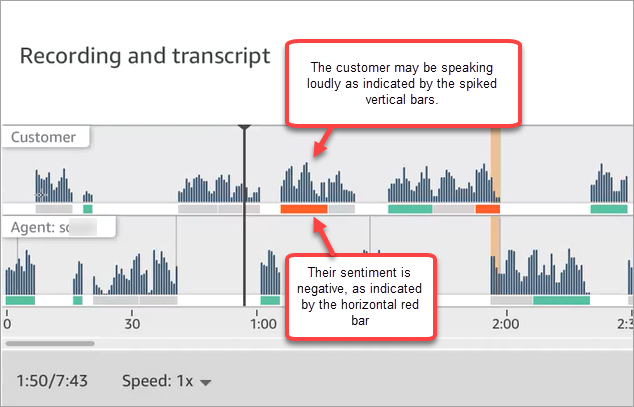

# Investigate the loudness of agents and

customers in calls using Contact Lens

A loudness score measures how loudly the customer or agent are speaking during a
call. Contact Lens displays an analysis of the conversation that lets you
identify where the customer or agent may be talking loudly and have a negative
sentiment.

## How to use loudness scores

We recommend using loudness scores together with sentiments. Look for areas of
the conversation where the loudness score is high and the sentiment is low. Then
read that portion of the transcript or listen to that section of the call.

For example, the following is an image of a recording and transcript analysis.
Spiked vertical bars indicate where the customer is talking loudly. The
horizontal red bars indicate their sentiment is negative.

