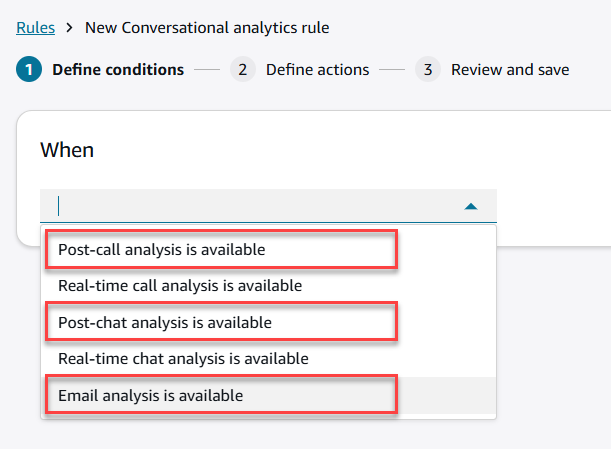
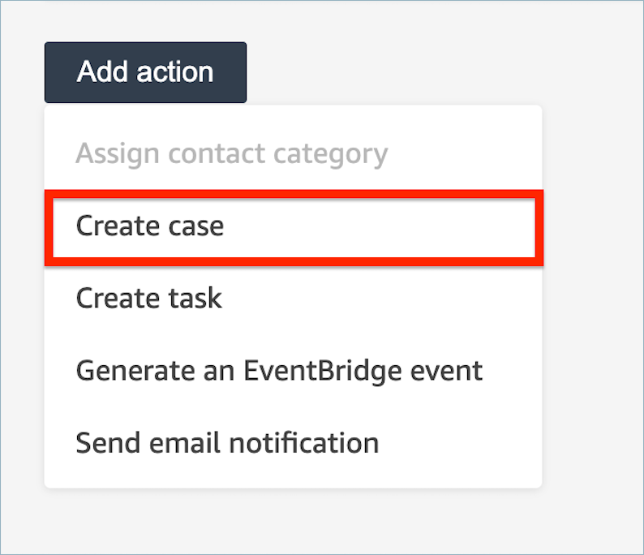
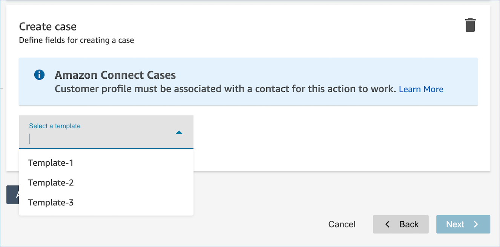
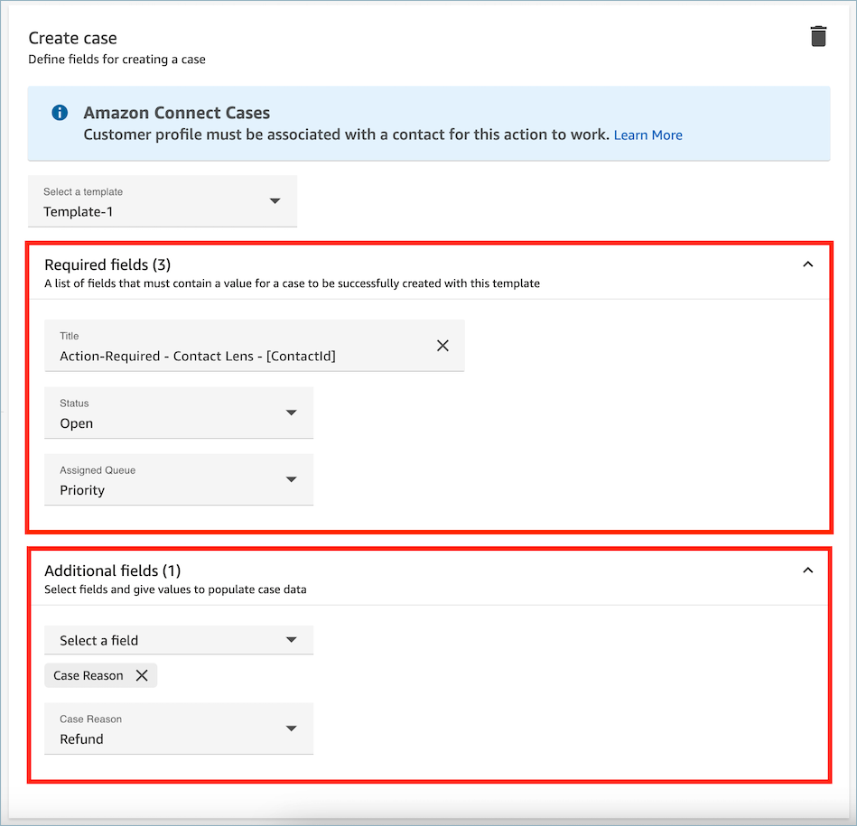

# Create a rule in

Contact Lens that creates a case

###### To create a rule that creates a case

1. When you create your rule, choose either **A
   Contact Lens post-call analysis is available**
   or **A Contact Lens post-chat analysis is
   available** as the event source.

 2. Choose **Next** 3. On the actions page, choose **Create case** for the
action.

 4. In the **Create case** card, select a **Case
template**.

 5. Fill out the **required fields** and add
**optional case fields** to populate case
data.

###### Note

A customer profile must be associated with a contact for this
action to work. For more information, see [Enable Cases](enable-cases.md "enable-cases.md").

 6. Choose **Next**. Review and then choose
**Save**. 7. After you add rules, they are applied to new contacts that occur after the rule was added. Rules are applied when Amazon Connect conversational analytics analyzes conversations.

You cannot apply rules to past, stored conversations.
