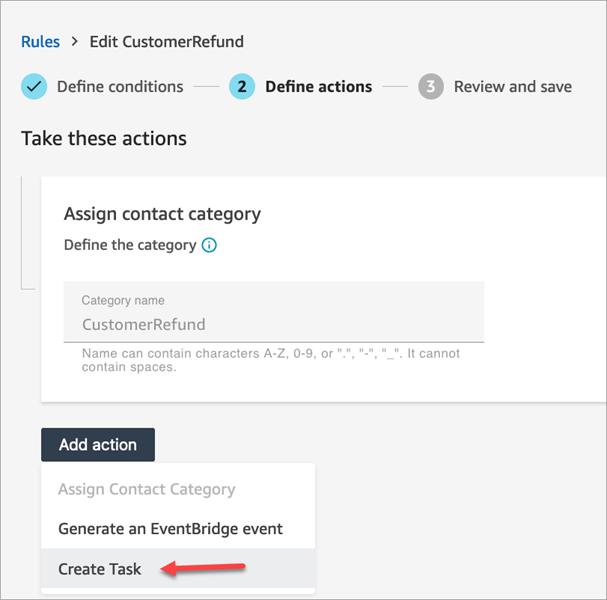
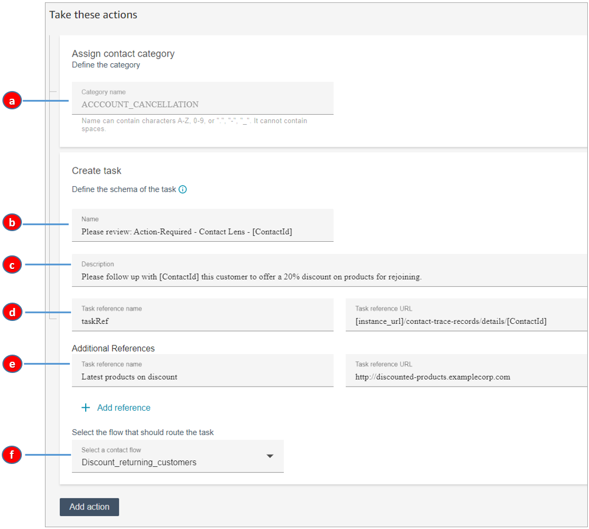
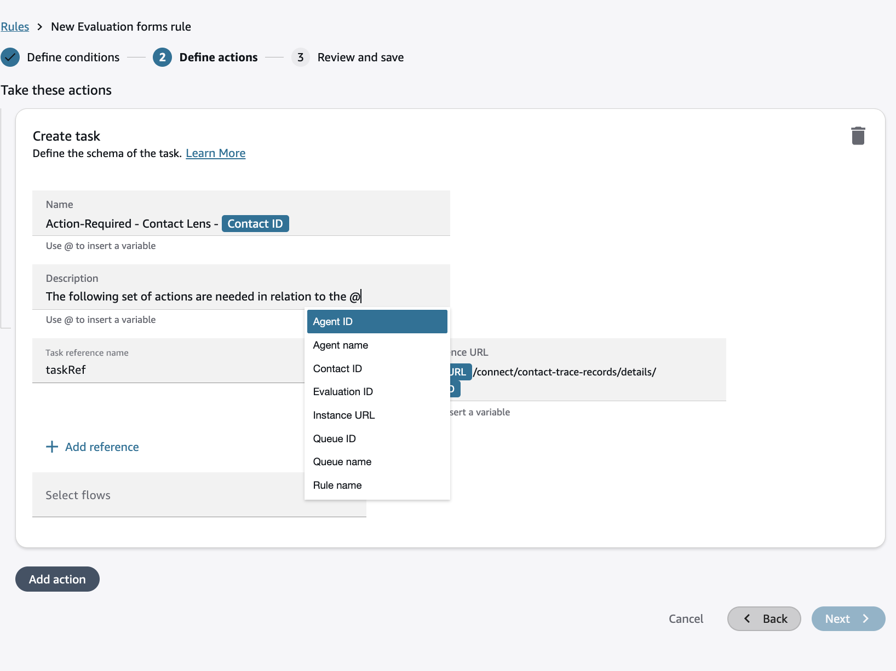
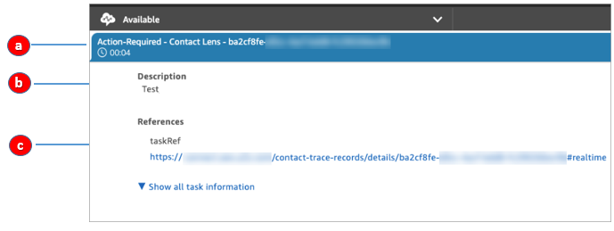

# Create a rule that generates a task

Amazon Connect rules enables you to generate tasks. This helps you create traceable actions with owners and provides you visibility on task completion and productivity out the box.

Following are some examples:

- Review a contact when the customer is fraudulent. For example, you can create a follow-up task when a customer utters words or phrases that makes them appear potentially fraudulent.
- Follow up when the customer mentions specific topics that you want to later on upsell or provide additional support by reaching out.
- Evaluate agent performance in specific scenarios, e.g. customer sentiment was very low during the conversation and the customer expressed frustration.
- Take operational actions, such as assigning additional agents to queues on which avg. queue answer time in the last hour has exceeded acceptable thresholds.

###### To create a rule that creates a task

1. When you create your rule, choose **Create Task** for
   the action.

 2. Complete the task fields as follows:

    1. **Category name**: The category name appears
     in the contact record. Max length: 200 characters.
    2. **Name**: The name appears in the agent's
     Contact Control Panel (CCP). Max length: 512 characters.
    3. **Description**: The description appears in
     the agent's Contact Control Panel (CCP). Max length: 4096
     characters.

    ###### Note

     In Name and Description, use **@ to add dynamic variables** that are populated during execution of the rule.
     For conversational analytics rules and evaluation forms rules, you can add **rule name, instance URL, contact, agent** and **queue** information for the contact that matched the rule.
     Evaluation forms rules additionally enable you to insert the **evaluation ID**.

    
    Other rule types support different variables::

    	* Real-time metrics rules enable you to enter **rule name, instance URL and list of agents, queues, flows or routing profile**
    	 that breached the threshold to trigger the alert.
    	* Rules for cases allow you to insert **rule name, instance URL** and **case ID**.
    4. **Task reference name**: This is a default
     reference that automatically appears in the agent's CCP.

    	* For real-time rules, the task reference links to the
    	 Real-time details page.
    	* For post-call/chat rules, the task reference links to
    	 the **Contact details** page.
    5. **Additional Reference name**: Max length:
     4096 characters. You can add up to 25 references.
    6. **Select a flow**: Choose the flow that is
     designed to route the task to the appropriate owner of the task.
     The flow must be saved and published for it to appear in your
     list of options in the dropdown.

3. The following image shows an example of how this information appears
   in the agent's CCP.

In this example, the agent sees the following values for
**Name**, **Description**, and
**Task reference name**:

    1. **Name** =
     **Action-Required-Contact Lens-
     ba2cf8fe....**
    2. **Description** =
     **Test**
    3. **Task reference name** = taskRef and the URL
     to the Real-time details page

4. Choose **Next**. Review and then choose
   **Save** the task.
5. After you add rules, they are applied to new contacts that occur after the rule was added. Rules are applied when Amazon Connect conversational analytics analyzes conversations.

You cannot apply rules to past, stored conversations.

## Voice and task contact records are

linked

When a rule creates a task, a contact record is automatically generated
for the task. It's linked to the contact record of the voice call or chat
that met the criteria for the rule to create the task.

For example, a call comes into your contact center and generates
CTR1:

The Rules engine generates a task. In the contact record for the task, the
voice contact record appears as the **Previous contact
ID**. In addition, the task contact record inherits contact
attributes from the voice contact record, as illustrated in the following
image:

## About dynamic values for ContactId,

AgentId, QueueId, RuleName

The dynamic values in brackets [ ] are called [contact attributes](what-is-a-contact-attribute.md "what-is-a-contact-attribute.md"). Contact
attributes enable you to store temporary information about the contact so
you can use it in a flow.

When you add contact attributes in brackets [ ] — such as ContactId,
AgentId, QueueId, or RuleName — the value is passed from one contact
record to another. You can use contact attributes in your flow to branch and
route the contact accordingly.

For more information, see [Use contact attributes](connect-contact-attributes.md "connect-contact-attributes.md").
