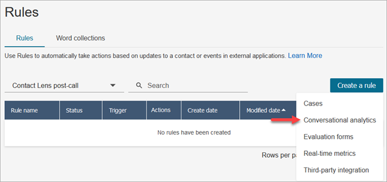
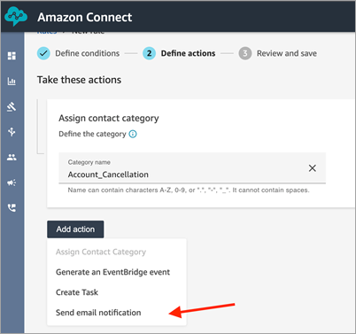
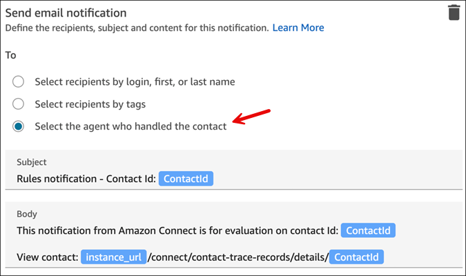
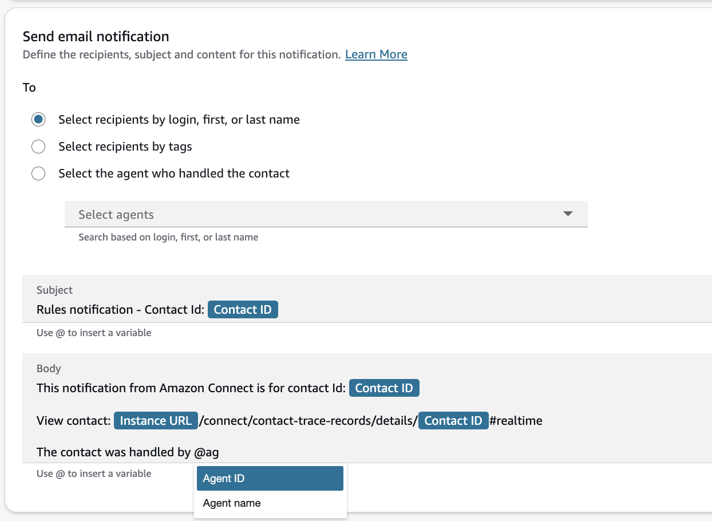

# Create rules that send email notifications

You can create rules that send email notifications to
people in your organization. This helps you to respond more expediently to
potential issues in your contact center. For example, you can create a rule to
notify:

- A team supervisor when there is an account escalation or
  cancellation.
- A group of people in your contact center as a result of certain words
  being mentioned during a conversation.
- A designated person in your contact center when a disagreement occurs
  during the call.
- An agent who had handled the contact that was analyzed or evaluated
  with Amazon Connect conversational analytics.

###### Important

- All emails are sent from `no-reply@amazonconnect.com`.
- SAML users don't have primary email addresses, they have username logins. A username login
  is typically an email address but it doesn't have to be. For these users the field label
  **Email address** is empty inside Amazon Connect. When email notifications are sent for SAML users, they must have
  a secondary email configured in order to get it. If a secondary email is not configured, the user won't receive the email.

###### To create a rule that sends an email notification

1. Log in to Amazon Connect with a user account that has the [required permissions](permissions-for-rules.md "permissions-for-rules.md") to
   create rules.
2. Navigate to **Analytics and optimization**,
   **Rules**.
3. On the **Rules** page, choose **Create a
   rule**, and then from the dropdown list, choose
   **Conversational analytics** or
   **Evaluation forms**.

 4. On the **New rule** page, define the conditions for
the rule. For more information, see:

    * [Define rule conditions for
     conversational analytics](build-rules-for-contact-lens.md#rule-conditions "build-rules-for-contact-lens.md#rule-conditions")
    * [Define rule conditions
     for evaluation forms](create-evaluation-rules.md#rule-conditions-eval "create-evaluation-rules.md#rule-conditions-eval").

5. When you define actions for the rule, choose **Send email
   notification** for the action.

 6. In the **Send email notification** section, choose
who is going to receive the email by using one of these options:

    * **Select recipients by login**: Routes the
     email to the specified user.

    ###### Important

    SAML users must have
    a secondary email configured in order to get it. If a secondary email is not configured, the user won't receive the email.
    * **Select recipients by tags**. Routes the
     email dynamically based on the agent's tag values.
    * **Select the agent who handled the contact**.
     Routes the email to the agent who handled the contact.

In the following image, the rule sends a notification email to the
agent who handled the contact.

 7. In **Subject**, add the email subject. In
**Body**, add the contents of the email
notification.

Use **@ to add dynamic variables** that are populated during execution of the rule.
For conversational analytics rules and evaluation forms rules, you can add **rule name, instance URL, contact, agent** and **queue** information for the contact that matched the rule.
Evaluation forms rules additionally enable you to insert the **evaluation ID**.

###### Note

Other rule types support different variables:

    * Real-time metrics rules enable you to enter **rule name, instance URL** and list of **agents, queues, flows or routing profile** that breached the threshold to trigger the alert.
    * Rules for cases allow you to insert **rule name, instance URL** and **case ID**.

8. Choose **Next**. Review your selections, and then
   choose **Save**.
9. After you add rules, they are applied to new contacts that occur after the rule was added. Rules are applied when Amazon Connect conversational analytics analyzes conversations.

You cannot apply rules to past, stored conversations.

## Email limits

- Amazon Connect has a default limit of 500 emails a day. When that limit is
  exceeded, the Amazon Connect instance is blocked for 24 hours from sending
  more email. This is because the emails are subject to bounce and
  complaint limits. For more information, see the **Bounce** and **Complaint** sections in [Understanding email deliverability in Amazon SES](../../../ses/latest/dg/send-email-concepts-deliverability.md "../../../ses/latest/dg/send-email-concepts-deliverability.md").
- All emails are sent from `no-reply@amazonconnect.com`,
  which you cannot customize.
- SAML users don't have primary email addresses, they have username logins. A username login
  is typically an email address but it doesn't have to be. For these users the field label
  **Email address** is empty inside Amazon Connect. When email notifications are sent for SAML users, they must have
  a secondary email configured in order to get it. If a secondary email is not configured, the user won't receive the email.

If the default option for sending emails does not meeting your
requirements, please contact your Technical Account Manager or Support to
discuss with the Amazon Connect service team.
