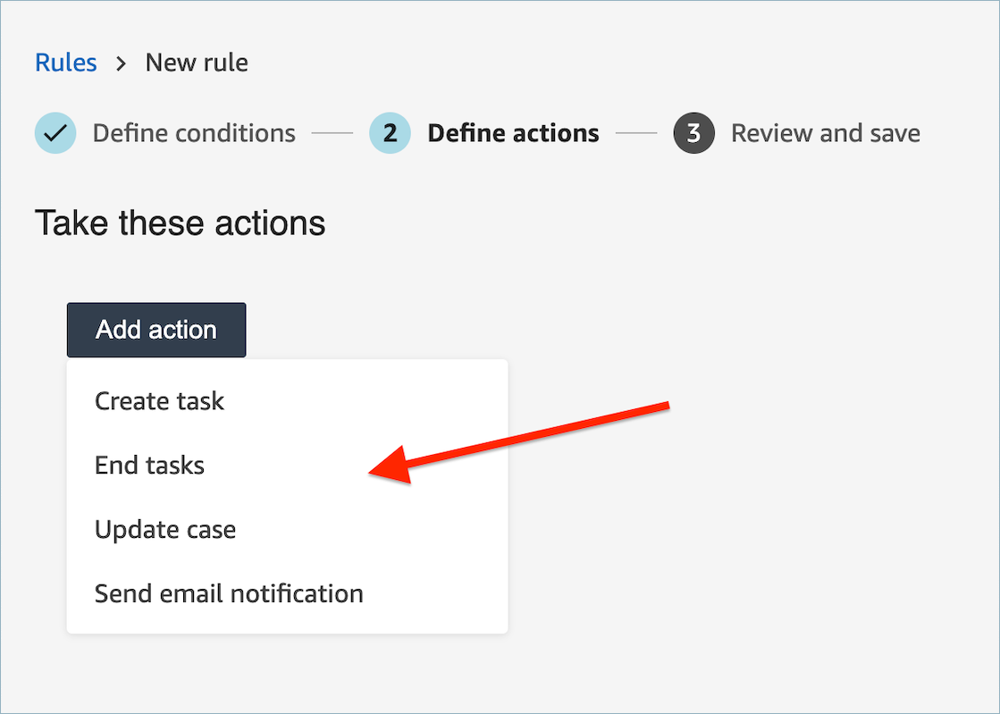
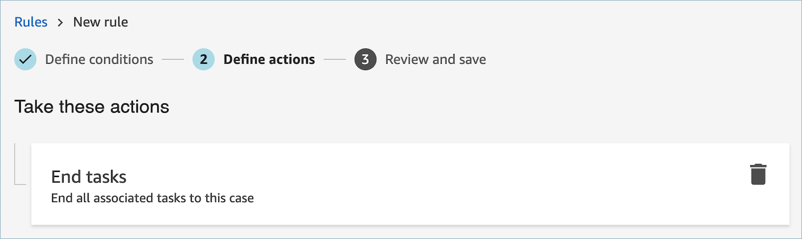

# Create a rule in

Contact Lens that ends associated tasks from a case

###### To create a rule that ends associated tasks

1. When you create your rule, choose **A new case is
   updated** as the event source.

 2. When you create your rule, choose **End tasks** for
the action.

 3. Choose **Next**. Review and then choose
**Save**. 4. After you add rules, they are applied to new contacts that occur after the rule was added. Rules are applied when Contact Lens analyzes conversations.

You cannot apply rules to past, stored conversations.
