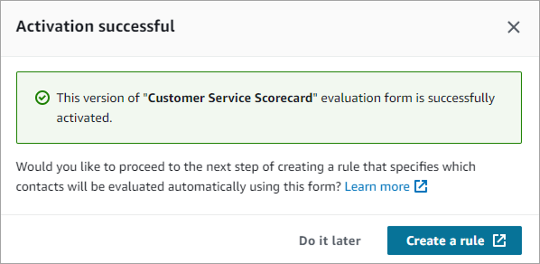
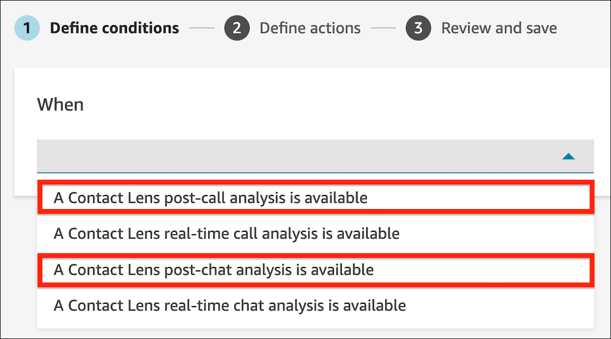
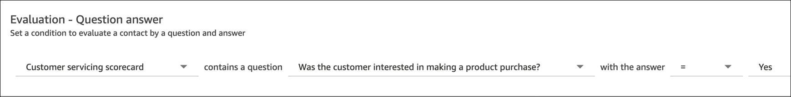
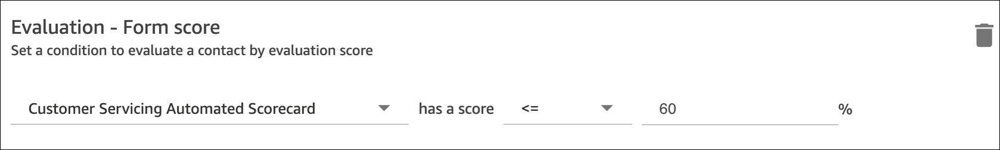

# Create a rule

in Contact Lens that submits an automated evaluation

Contact Lens enables you to automatically fill and submit evaluations
by using insights and metrics from conversational analytics.

## Step 1: Configure automation on the

evaluation form

Before you can create a rule that submits an automated evaluation, you
need to configure automation on the evaluation form. For detailed
instructions, see [Step 6: Enable automated evaluations](create-evaluation-forms.md#step-automate "create-evaluation-forms.md#step-automate") in [Create an evaluation
form](create-evaluation-forms.md "create-evaluation-forms.md").

Following is an overview of the steps:

1. Setup automation on every question in an evaluation form.
2. Turn on **Enable automated submission of
   evaluations** before activating the evaluation
   form.
3. When you activate the evaluation form with automation configured,
   a prompt is displayed for you to create a rule, as shown in the
   following image.

 4. Choose **Create a rule**. 5. On the **Rules** page, define a rule that
specifies which contacts are automatically evaluated using the
selected evaluation form. The following procedure provides
instructions.

## Step 2: Define a rule that specifies

which contacts are automatically evaluated

You can trigger automated evaluations with two types of rules:

- A **Conversational analytics** rule
  that automatically evaluates the contact after Contact Lens
  completes its analysis.
- An **Evaluation forms** rule that can be
  used to trigger a situation-specific evaluation form as an outcome
  of a generic evaluation form. For example, if the answer to the
  evaluation question _Was the customer interested in
  purchasing a product_ is _Yes_,
  then you can trigger another evaluation form measuring
  _Agent sales performance_.

### Trigger automated evaluations with a conversational analytics

rule

This is the default rule type that is selected when you create a rule
to submit an automated evaluation during form activation. You can also
create such a rule by selecting **Create a rule**,
**Conversational analytics** on the
**Rules** page.

1. Choose **A Contact Lens post-call analysis is
   available** or **A Contact Lens
   post-chat analysis is available** as the event
   source. These two options are highlighted in the following
   image.

 2. Define conditions to identity contacts to be automatically evaluated, and then choose **Next**.

Example conditions that you can use to identify the specific set of agents or contacts on which the evaluation form is applicable are:

    * Agents
    * Agent hierarchy
    * AI agent
    * Queues
    * Initiation method

In addition, you can exclude contacts that may have ended prematurely due to connectivity or other issues using conditions such as:

    * Interaction duration (for example, over 30 seconds)
    * Talk time (for example, the customer speaks for over 10 seconds)
    * Potential disconnect issue when the issue does not exist or there is no known connectivity or device issue during the conversation

3. On the **Define actions** page provide a category name to identify the rule.
4. Choose **Add action**, select
   **Submit automated evaluation**, and select
   the form that you want to use for automatically submitting an
   evaluation. (This action is already selected on the page if you
   created the rule when you activate the form.)
5. Choose **Next**. Review and then choose
   **Save and Publish**.

After you add rules, they are applied to new contacts that occur after
the rule was added. Rules are applied when Contact Lens analyzes
conversations.

###### Important

You cannot apply rules to past, stored conversations.

### Trigger automated evaluations with an evaluation forms

rule

1. Go to the **Rules** page. Select
   **Create a rule**, **Evaluation
   forms**.
2. Under **When**, select the event source as
   **A Contact Lens evaluation result is
   available**.
3. Choose **Add condition** to trigger a situation-specific
   evaluation. For example:
   - A specific answer on another evaluation, shown in the following image.

   
   - The score of another evaluation form, shown in the following image.

   

4. Choose **Add action**, select
   **Submit automated evaluation**, and select
   the form that you want to use for automatically submitting an
   evaluation.
5. Choose **Next**. Review and then choose
   **Save and Publish**.

## Frequently Asked Questions (FAQ)

1. **Can an automated evaluation override an
   evaluation that has been manually submitted?**

No, an automated evaluation cannot override a manually submitted
evaluation. If an evaluation already exists, then the automated
evaluation will fail for that contact and account administrators can
see such failure notifications within CloudWatch. 2. **How do I identify automated
evaluations?**

If an evaluation is automatically submitted, it is marked as
"submitted by Contact Lens automation" on the
**Contact details** page. If an automated
evaluation is edited and re-submitted by an evaluator, the
"submitted by" contains the name of the evaluator. 3. **Can I automatically evaluate a contact using
multiple evaluation forms?**

Yes, you can automatically submit evaluations on a contact using
multiple evaluation forms. You need to create multiple rules to
submit automated evaluations using the different evaluation
forms.
