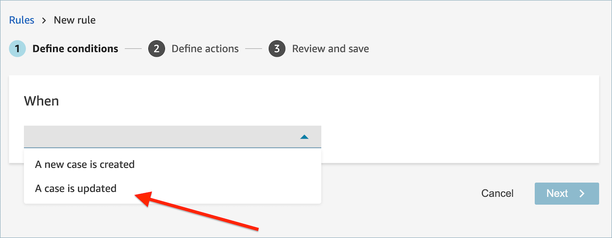
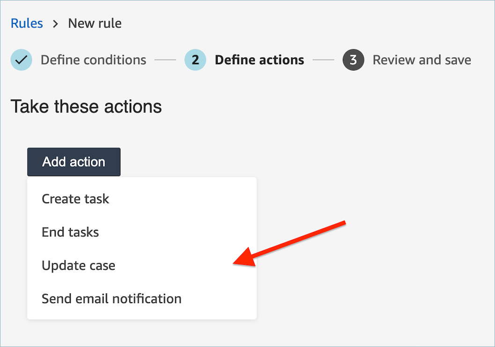
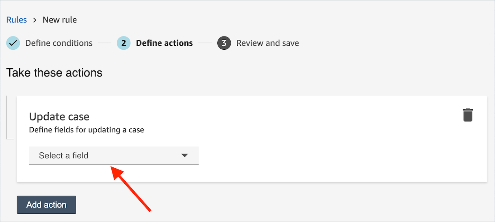
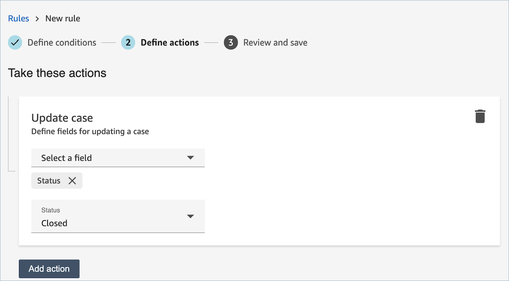

# Create a rule in

Contact Lens that updates a case

###### To create a rule that updates a case

1. When you create your rule, choose **A case is
   updated** as the event source and choose
   **Next**.

 2. When you create your rule, choose **Update case** for
the action.

 3. Select any case field that you want to update from the dropdown and
define its new value.

 4. Choose **Next**. Review and then choose
**Save**. 5. After you add rules, they are applied to new contacts that occur after the rule was added. Rules are applied when Amazon Connect conversational analytics analyzes conversations.

You cannot apply rules to past, stored conversations.
