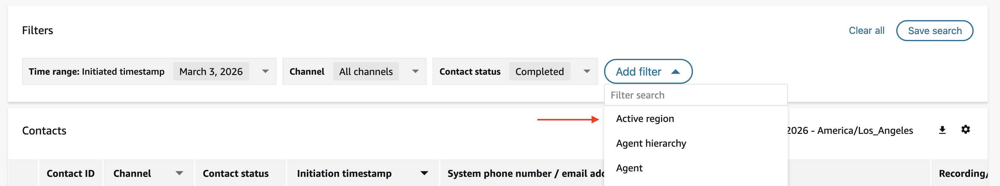
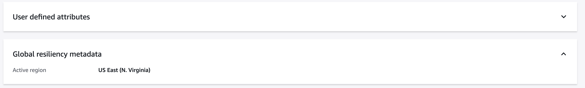

# Contact search and contact details

###### Important

To enable consolidated contact search for your ACGR
instance, please reach out to [AWS Support](https://console.aws.amazon.com/support/home "https://console.aws.amazon.com/support/home").

###### Note

Supported Regions: US East (N. Virginia), US West (Oregon), Europe (Frankfurt), and Europe (London).

###### Important

When you onboard to this feature, your Connect Customer alias will be updated to a new
sub-domain with the format
``region`.`sourcealias`.my.connect.aws`.
For example, if your ACGR instance is deployed in US East (N.
Virginia) and US West (Oregon) with source alias configured as
`source.my.connect.aws` and replica alias as
`replica.my.connect.aws`, after onboarding your Connect Customer instances to this feature, the new sub-domains will be
`us-east-1.source.my.connect.aws` and `us-west-2.source.my.connect.aws`.

Additionally, supervisors and admins must be authenticated using the [global sign-in endpoint](integrate-idp.md "integrate-idp.md") instead of regional endpoints.

When you access the Contact Search page, you see contacts from your paired Connect Customer
Global Resiliency (ACGR) instances by default, giving you a complete view of customer
interactions across your organization. This provides a seamless search experience
regardless of which Region contacts originate from or which Region you are currently
logged into.

- **Active region**: The AWS Region where a
  contact is being processed or was completed.

## Contact search experience

### Active Region Filter

You'll see a new 'Active region' filter in the filters
dropdown. With the Active region filter, you can narrow your search specific to a region when
needed.

To use the Active region filter:

1. On the **contact search page** , choose **Add
   filter**.
2. Select **Active region** from the
   dropdown.
3. Choose one or more Regions.

### Region-Specific Resource Filters

When you use the following filters, the dropdown options display only
resources that were created in your logged in Region:

- Custom contact attributes
- Contact categories
- Evaluation filters
- Email address
- Custom contact segment attributes

###### Important

When you manually type filter values instead of selecting from
dropdowns, and those resource names are identical across ACGR instances,
your results will include contacts from both Regions.

- Custom contact attributes
- Email address

**Evaluation filters** only return contacts from your current Region, as they
search using unique evaluation form IDs that are Region-specific.

### Saved Searches

Your saved searches display contacts from both ACGR
instances. Any previously saved Region filters continue to work as
expected.

## Contact details experience

### Viewing contact information

When you open a contact details page, you see comprehensive information
regardless of which Region the contact originated from, including:

- Overview, connection details, and queue information
- Contact tags and attributes
- Conversational analytics data (voice transcripts,
  chat transcripts)
- Screen and audio recordings
- Chat transcripts and IVR interactions
- Email attachments and transcripts

The contact's active Region is displayed on the contact details page under
**Global resiliency metadata**.

###### Note

If the contact's active Region is impaired, some information might be
unavailable, including screen and audio recordings, chat transcripts, IVR
interactions, email attachments and transcripts, and conversational analytics
data.

### Conversational analytics data access

You have full access to conversational analytics data across Regions,
including:

- In-progress contacts:
  Conversational analytics, voice transcripts (redacted and
  unredacted), and chat transcripts.
- Completed contacts: All
  conversational analytics, voice transcripts (redacted and
  unredacted), and chat transcripts.
- Recordings: Screen and audio
  recordings are accessible regardless of the contact's active
  Region.
- Transcripts: Chat, IVR, and email
  transcripts are available across Regions.

### Contact actions

You can perform contact actions such as Transfer, Reschedule, or End
contact regardless of the contact's active Region. These actions route to the
contact's active Region.

### Contact evaluations

Contact evaluations are only available for contacts that are active in your logged in Region. You cannot view
or perform evaluations for replicated contacts from other regions.

### SearchContacts API

If you use the SearchContacts API programmatically, the response includes
additional information:

- GlobalResiliencyMetadata object: Contains the
  `ActiveRegion`, `OriginRegion`, and `TrafficDistributionGroupId` fields for all contacts, showing the
  specific Region where the contact is active.

For more information about the SearchContacts API, see the [Connect Customer API
Reference](../APIReference/API_SearchContacts.md "../APIReference/API_SearchContacts.md").
